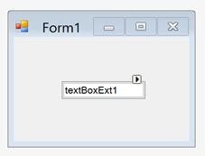

# Add Syncfusion Controls 

The Syncfusion Windows Forms controls can be added in a Visual Studio projects by using either of the following ways,

* Through Designer
* Through Code-Behind
* Through Project Template
* Through Item Template

## Through Designer

Syncfusion UI for Windows Forms are added automatically to the Visual Studio Toolbox during installation. The following steps helps to add required Essential Windows Forms control through drag and drop from Toolbox. For example: **TextBoxExt**

1.Create a Windows Forms project in Visual Studio.

2.Find **TextBoxExt** by typing the name of the “TextBoxExt” in the search box.

3.Drag **TextBoxExt** and drop it in the designer.

## Through Code-Behind

Syncfusion UI for Windows Forms can added at runtime using C# / VB. The following steps helps to add required Essential Windows Forms control through code. For example: **TextBoxExt**.

1.Create a Windows Forms project in Visual Studio and refer to the following assemblies.

* Syncfusion.Tools.Base.dll
* Syncfusion.Tools.Windows.dll
* Syncfusion.Shared.Base.dll
* Syncfusion.Shared.Windows.dll

2.Create an instance of **TextBoxExt** using it namespace





Syncfusion.Windows.Forms.Tools.TextBoxExt textBoxExt1 = new Syncfusion.Windows.Forms.Tools.TextBoxExt();





Dim textBoxExt1 As New Syncfusion.Windows.Forms.Tools.TextBoxExt()





3.Set Location and Size of the control with require value. Here, set its location as (100,100) and Size as (200,25) through its `Location` and ‘Size’ property respectively.





this.textBoxExt1.Location = new System.Drawing.Point(100, 100);

this.textBoxExt1.Size = new System.Drawing.Size(200, 25);





Me.textBoxExt1.Location = New System.Drawing.Point(100, 100)

Me.textBoxExt1.Size = New System.Drawing.Size(200, 25)





4.Add the created instance to the parent form (or the needed layout panels) through its child collection property that named as `Controls`.




//here this denotes parent main form

this.Controls.Add(this.textBoxExt1);





'here this denotes parent main form

Me.Controls.Add(Me.textBoxExt1) 





## Through Project Template

Syncfusion provides the Visual Studio Project Templates for the Syncfusion Windows Forms platform to create Syncfusion Windows Forms Application. 

I> The Syncfusion Windows Forms templates are available from v14.3.0.49. 

### Create Syncfusion Windows Forms Project 

The following steps direct you to create the Syncfusion Windows Forms project through the Visual Studio Project Template. 

1. To create a Syncfusion Windows Forms project, choose New Project-> Syncfusion->Windows->Syncfusion Windows Forms Application from Visual Studio

   

2. Name the Project, choose the destination location when required and set the Framework of the project, then click OK.  

   N> Minimum target Framework is 3.5 for Syncfusion Windows Forms project templates. 

3. Choose the options to configure the Syncfusion Windows Forms Application by using the following Project Configuration Wizard.  
  
   
                                                     
   ### Project configurations: 

   **Language:** Select the language, either C# or VB. 

   

   **Assemblies From:** Choose the assembly location from where it is going to be added to the project. 

   

   **Select Control:** Choose the control based on your need. 

   
      
4. Once the Project Configuration Wizard is done, the Syncfusion Windows Forms project is created with required references and forms. 

   

   

5. Then, Syncfusion licensing registration required message box will be shown as follow, if you are installed the trial setup or NuGet packages since Syncfusion introduced the licensing system from 2018 Volume 2 (v16.2.0.41) Essential Studio release. Please navigate to the [help topic](https://help.syncfusion.com/common/essential-studio/licensing/license-key#how-to-generate-syncfusion-license-key) which is shown in the licensing message box to generate and register the Syncfusion license key to your project. Refer to this [blog](https://blog.syncfusion.com/post/Whats-New-in-2018-Volume-2-Licensing-Changes-in-the-1620x-Version-of-Essential-Studio.aspx) post for understanding the licensing changes introduced in Essential Studio.

      

## Through Item Template

The Syncfusion Item Templates Add new item feature provides support to Windows Forms platform. To add the Syncfusion item files in Visual Studio, install Syncfusion Essential Studio for Windows Forms platform.The item template available from Syncfusion Essential Studio v13.1.0.21.

### Using Syncfusion Item Template Gallery

Follow the given steps to add the Syncfusion item in Visual Studio.

1. Open a new or existing Windows Forms application.

2. Right-click on the Windows Forms Project from the Solution Explorer. Select the Add Syncfusion Item  New Item... option. Refer to the following screenshot
   for more information.

   

3. Now the Syncfusion Item Template Gallery window will open.

   
   
4. Select the required version and themes or Form from the Syncfusion Item Template Gallery. 

   
   
   

#### Platform

This is a combo box where you can choose the application’s platform. For now it contains Windows Forms Platform alone.

#### Version

Syncfusion’s Installed Build Versions are listed for Syncfusion Essential Studio v13.1.0.21 and later, for the installed Windows Forms platform. 

#### Template Gallery

This part contains a set of Syncfusion Item Templates, and you can choose the Item Templates based on your need.

When Add button is clicked, then the selected item template is added to the project.

### Using Visual Studio Add new Item

Syncfusion Project Template can be also add from the Visual Studio Item Template. Right-click on the Windows Forms Project Add ->New Item. You can refer to the following screenshot for more information.

1. The Syncfusion Item Templates are available under the Syncfusion tab. It is available for both C# Items and VB Items. 

   

2. Now the selected template is added to the project along with Syncfusion references.

   

   
