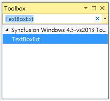

# Add Syncfusion Controls 

The Syncfusion Windows Forms controls can be added in a Visual Studio projects by using either of the following ways,

* Through Designer
* Through Code-Behind

## Through Designer

Syncfusion UI for Windows Forms are added automatically to the Visual Studio Toolbox during installation. The following steps helps to add required Essential Windows Forms control through drag and drop from Toolbox. For example: **TextBoxExt**

1.Create a Windows Forms project in Visual Studio.

2.Find **TextBoxExt** by typing the name of the “TextBoxExt” in the search box.

3.Drag **TextBoxExt** and drop it in the designer.

## Through Code-Behind

Syncfusion UI for Windows Forms can added at runtime using C# / VB. The following steps helps to add required Essential Windows Forms control through code. For example: **TextBoxExt**.

1.Create a Windows Forms project in Visual Studio and refer to the following assemblies.

* Syncfusion.Tools.Base.dll
* Syncfusion.Tools.Windows.dll
* Syncfusion.Shared.Base.dll
* Syncfusion.Shared.Windows.dll

2.Create an instance of **TextBoxExt** using it namespace





Syncfusion.Windows.Forms.Tools.TextBoxExt textBoxExt1 = new Syncfusion.Windows.Forms.Tools.TextBoxExt();





Dim textBoxExt1 As New Syncfusion.Windows.Forms.Tools.TextBoxExt()





3.Set Location and Size of the control with require value. Here, set its location as (100,100) and Size as (200,25) through its `Location` and ‘Size’ property respectively.





this.textBoxExt1.Location = new System.Drawing.Point(100, 100);

this.textBoxExt1.Size = new System.Drawing.Size(200, 25);





Me.textBoxExt1.Location = New System.Drawing.Point(100, 100)

Me.textBoxExt1.Size = New System.Drawing.Size(200, 25)





4.Add the created instance to the parent form (or the needed layout panels) through its child collection property that named as `Controls`.




//here this denotes parent main form

this.Controls.Add(this.textBoxExt1);





'here this denotes parent main form

Me.Controls.Add(Me.textBoxExt1) 





