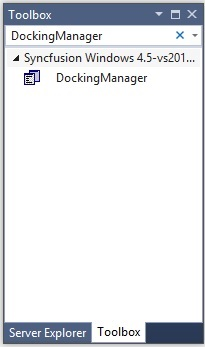

# Add Syncfusion Controls 

## Through Drag and Drop

The following steps helps to add required Essential Windows Forms control. for example: DockingManager.

1) Create a Windows Forms project in Visual Studio.  
2) Find DockingManager control by typing the name of the DockingManager in the search box.  

3) Drag DockingManager and drop it in the designer.  

## Through C# / VB

The following steps helps to add required Essential Windows Forms control. For example: DockingManager.

1) Create a Windows Forms project in Visual Studio and refer to the following assemblies.

 * Syncfusion.Tools.Base
 * Syncfusion.Tools.Windows
 * Syncfusion.Shared.Base
 * Syncfusion.Shared.Windows
 * Syncfusion.Grid.Base
 * Syncfusion.Grid.Windows

2) Add the following namespace.





using Syncfusion.Windows.Forms.Tools;
using Syncfusion.Windows.Forms;





Imports Syncfusion.Windows.Forms.Tools
Imports Syncfusion.Windows.Forms





3) Create an instance of Docking Manager.





private Syncfusion.Windows.Forms.Tools.DockingManager DockingManager = new Syncfusion.Windows.Forms.Tools.DockingManager(this.components);





private Syncfusion.Windows.Forms.Tools.DockingManager DockingManager = New Syncfusion.Windows.Forms.Tools.DockingManager(Me.components)




