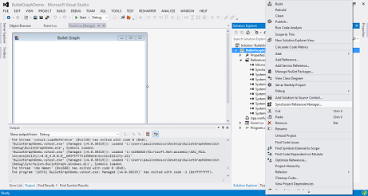
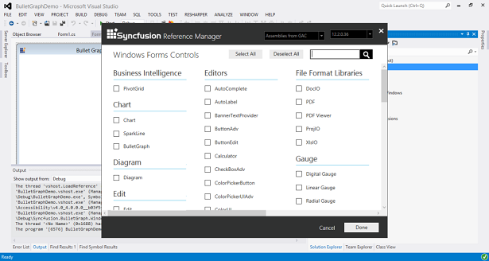
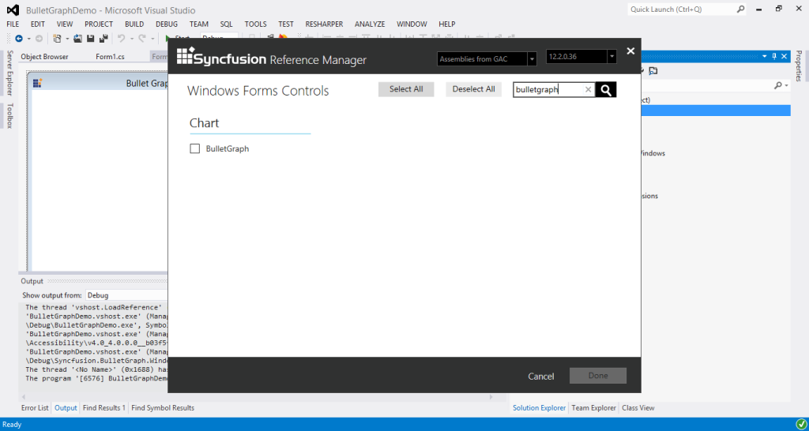
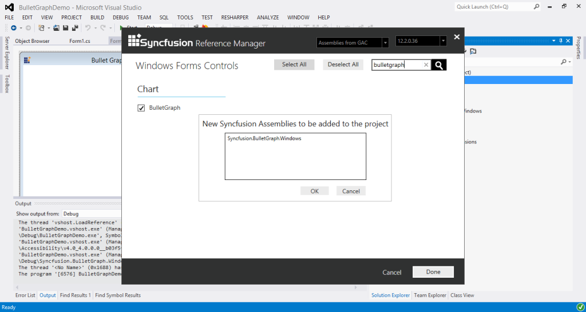

# Getting Started with Windows Forms Bullet Graph

The Bullet Graph is composed of quantitative scale, qualitative ranges, featured measure and Comparative Measure. The main purpose of the Bullet Graph is described by making use of the Caption. The quantitative scale of the Bullet Graph includes ticks and labels. The view of the Bullet Graph is changed by setting the Orientation property.

## Assembly deployment

Refer [control dependencies](https://help.syncfusion.com/windowsforms/control-dependencies#bulletgraph) section to get the list of assemblies or NuGet package needs to be added as reference to use the control in any application.

Please find more details regarding how to install the nuget packages in windows form application in the below link:

[How to install nuget packages](https://help.syncfusion.com/windowsforms/installation/install-nuget-packages)

## Create the Bullet Graph Programmatically

* Assembly Information

Bullet Graph is available in the following assembly.

Assembly: Syncfusion.BulletGraph.Windows

* NameSpace

Bullet Graph is available in the following namespace.

Namespace: Syncfusion.Windows.Forms.BulletGraph

### Steps to create a simple Bullet Graph control:

1. Create a new Windows Forms application project in Visual Studio.

   
   
2. Add references to Syncfusion.BulletGraph.Windows.
3. Add the Bullet Graph control in code behind as follows.

   ~~~ cs

		BulletGraph bullet = new BulletGraph();

            bullet.Dock = DockStyle.Fill;

            bullet.FlowDirection = BulletGraphFlowDirection.Forward;

            bullet.Orientation = Orientation.Horizontal;

            bullet.FeaturedMeasure = 4.5;

            bullet.ComparativeMeasure = 7;

            bullet.LabelFontSize = 10;

            bullet.LabelStroke = Color.Black;

            bullet.MajorTickStroke = Color.Black;

            bullet.Minimum = 0;

            bullet.Maximum = 10;

            bullet.Interval = 2;

            bullet.MinorTicksPerInterval = 3;

            bullet.QualitativeRanges.Add(new QualitativeRange() { RangeEnd = 4, RangeCaption = "Bad", RangeStroke = Color.Red });

            bullet.QualitativeRanges.Add(new QualitativeRange() { RangeEnd = 7, RangeCaption = "Satisfactory", RangeStroke = Color.Yellow });

            bullet.QualitativeRanges.Add(new QualitativeRange() { RangeEnd = 10, RangeCaption = "Good", RangeStroke = Color.Green });            

            this.Controls.Add(bullet);

   ~~~
   {:.prettyprint }

4. Run the application to view the Bullet Graph.

   

## Create the Bullet Graph using Syncfusion Reference Manager

 Syncfusion Reference Manager is used to add Syncfusion Tools.

 To add a Bullet Graph Control, refer the following steps:

1. Create a simple Windows Forms application using Visual Studio.

   

2. Right-Click on the Project and select SyncfusionReferenceManager.

   

3. The Syncfusion Reference Manager Wizard is opened as shown in the following screenshot.

   

4. Search for Bullet Graph using SearchBox and select Bullet Graph Control.  Click on Done to add selected Bullet Graph Control.

   

5. The Bullet Graph assemblies are automatically added to the Project after Clicking OK

   

6. Add the following code example in code behind to create a simple Bullet Graph control.

   ~~~ cs

        BulletGraph bullet = new BulletGraph();

            bullet.Dock = DockStyle.Fill;

            bullet.FlowDirection = BulletGraphFlowDirection.Forward;

            bullet.Orientation = Orientation.Horizontal;

            bullet.FeaturedMeasure = 4.5;

            bullet.ComparativeMeasure = 7;

            bullet.LabelFontSize = 10;

            bullet.LabelStroke = Color.Black;

            bullet.MajorTickStroke = Color.Black;

            bullet.Minimum = 0;

            bullet.Maximum = 10;

            bullet.Interval = 2;

            bullet.MinorTicksPerInterval = 3;

            bullet.QualitativeRanges.Add(new QualitativeRange() { RangeEnd = 4, RangeCaption = "Bad", RangeStroke = Color.Red });

            bullet.QualitativeRanges.Add(new QualitativeRange() { RangeEnd = 7, RangeCaption = "Satisfactory", RangeStroke = Color.Yellow });

            bullet.QualitativeRanges.Add(new QualitativeRange() { RangeEnd = 10, RangeCaption = "Good", RangeStroke = Color.Green }); 

            this.Controls.Add(bullet);   

   ~~~
   {:.prettyprint }  

7. The simple Bullet Graph control is created as shown in the following screenshot.

   

   N> 1.   The Syncfusion Reference Manager is available in versions 11.3.0.30 and later. It supports referencing assemblies from version 10.4.0.71 version to the current version.
   N>
   N> 2.   The Syncfusion Reference Manager is used only in Visual Studio 2015 or higher.