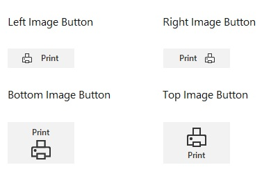

# Button Types

This section describes various types of button supported by the SfButton.

## Text and Image Button

The text and image can be displayed inside the SfButton by initializing the [Text](https://help.syncfusion.com/cr/windowsforms/Syncfusion.WinForms.Controls.SfButton.html#Syncfusion_WinForms_Controls_SfButton_Text) and [Image](https://help.syncfusion.com/cr/windowsforms/Syncfusion.WinForms.Controls.SfButton.html#Syncfusion_WinForms_Controls_SfButton_Image) properties.



//Adding the text value.
this.sfButton1.Text = Print;

//Adding the image value to SfButton
this.sfButton1.Image = Image.FromFile(@"..\..\Data\Image1.png");




### Positioning Text and Image

The text and image positions can be adjusted by using the [TextImageRelation](https://help.syncfusion.com/cr/windowsforms/Syncfusion.WinForms.Controls.SfButton.html#Syncfusion_WinForms_Controls_SfButton_TextImageRelation) property.



//Initializing the text and image positions.
sfButton1.TextImageRelation = TextImageRelation.ImageBeforeText;




### Spacing between Text and Image

The space between the text and image can be adjusted by using the [TextMargin](https://help.syncfusion.com/cr/windowsforms/Syncfusion.WinForms.Controls.SfButton.html#Syncfusion_WinForms_Controls_SfButton_TextMargin) and [ImageMargin](https://help.syncfusion.com/cr/windowsforms/Syncfusion.WinForms.Controls.SfButton.html#Syncfusion_WinForms_Controls_SfButton_ImageMargin) properties.



//Adjust the text margin of the SfButton
sfButton1.TextMargin = new Padding(3, 3, 3, 3);

//Adjust the image margin of the SfButton
sfButton1.ImageMargin = new Padding(3, 3, 3, 3);




## Image Button

The SfButton can be displayed only with the image by setting the empty string value to the [Text](https://help.syncfusion.com/cr/windowsforms/Syncfusion.WinForms.Controls.SfButton.html#Syncfusion_WinForms_Controls_SfButton_Text) property and initialize the image value to the [Image](https://help.syncfusion.com/cr/windowsforms/Syncfusion.WinForms.Controls.SfButton.html#Syncfusion_WinForms_Controls_SfButton_Image) property. The size of the image can be changed by using the ImageSize property.

## Icon Button

The SfButton can be displayed only with an icon by setting the empty string value to the Text property and initialize the icon value to [Image](https://help.syncfusion.com/cr/windowsforms/Syncfusion.WinForms.Controls.SfButton.html#Syncfusion_WinForms_Controls_SfButton_Image) property. You can show the icon button alone by setting the borders to null, and setting the back color of the button same as the background area.



//To show the icon button, initialize the background color same as the screen or background area color.
this.IconButton2.Style.BackColor = System.Drawing.Color.White;
this.IconButton2.Style.DisabledBackColor = System.Drawing.Color.White;
this.IconButton2.Style.FocusedBackColor = System.Drawing.Color.White;
this.IconButton2.Style.HoverBackColor = System.Drawing.Color.White;
this.IconButton2.Style.HoverBackColor = System.Drawing.Color.White;

//Sets the border to null for all button states.
IconButton2.Style.Border = null;
IconButton2.Style.HoverBorder = null;
IconButton2.Style.FocusedBorder = null;
IconButton2.Style.PressedBorder = null;




