# Chart Appearance

The following topics under this section discusses about various properties that are used to customize the appearance of the chart:

## Background Colors

EssentialChart lets you customize the background colors of different portions of the chart.

### Outside the Chart Area

Use the BackInterior property of the chart to customize the background of the chart that is outside the chart area. This is usually where the legend and the chart title get rendered. By default it is set to White color.



this.chartControl1.BackInterior = new Syncfusion.Drawing.BrushInfo(System.Drawing.Color.LightBlue);





Me.chartControl1.BackInterior = New Syncfusion.Drawing.BrushInfo(System.Drawing.Color.LightBlue)



### Inside the Plot Area

Use the ChartArea.BackInterior to customize the background of the rectangular region where the points are plotted.



this.chartControl1.ChartArea.BackInterior = new Syncfusion.Drawing.BrushInfo(System.Drawing.Color.SkyBlue);





Me.chartControl1.ChartArea.BackInterior = New Syncfusion.Drawing.BrushInfo(System.Drawing.Color.SkyBlue)



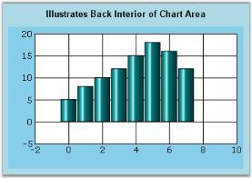

### Inside the Chart Area

Use the ChartInterior property of the chart to customize the background of the chart area. By default it is set to White color.



this.chartControl1.ChartInterior = new Syncfusion.Drawing.BrushInfo(Syncfusion.Drawing.GradientStyle.Horizontal, System.Drawing.Color.PaleTurquoise, System.Drawing.Color.LightBlue);





this.chartControl1.ChartInterior = New Syncfusion.Drawing.BrushInfo(Syncfusion.Drawing.GradientStyle.Horizontal, System.Drawing.Color.PaleTurquoise, System.Drawing.Color.LightBlue)



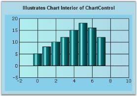

## Background Image

### Chart Settings

In Windows Forms, use the BackgroundImage property to specify a custom image as the background of the chart. The image layout can also be specified using the property below.

<table>
<tr>
<th>
Chart control Property</th><th>
Description</th></tr>
<tr>
<td>
BackgroundImage</td><td>
Indicates the background image used for the control.</td></tr>
<tr>
<td>
BackgroundImageLayout</td><td>
Indicates the background image layout used for the component. Possible values are:Tile (default setting)CenterStretchZoom</td></tr>
</table>



this.chartControl1.BackgroundImage = ((System.Drawing.Image)(resources.GetObject("chartControl1.BackgroundImage")));

this.chartControl1.BackgroundImageLayout = System.Windows.Forms.ImageLayout.Stretch;





Me.ChartControl1.BackgroundImage = CType((Resources.GetObject("chartControl1.BackgroundImage")), System.Drawing.Image)

Me.ChartControl1.BackgroundImageLayout = System.Windows.Forms.ImageLayout.Stretch



### ChartArea Background Image

The chart area can also be rendered with a custom background image and this can be set using the ChartAreaBackImage property. 

_ChartAreaBackImage_

<table>
<tr>
<th>
Chart control Property</th><th>
Description</th></tr>
<tr>
<td>
ChartAreaBackImage</td><td>
Specifies the image to be used as the background in the chart area.</td></tr>
</table>



this.chartControl1.ChartAreaBackImage = myCustomImage;





Me.ChartControl1.ChartAreaBackImage = myCustomImage



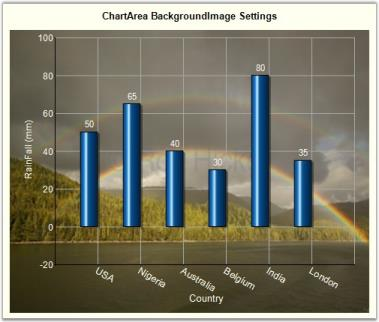

### Chart Interior Background Image

Chart Interior can be rendered with a custom background image using the ChartInteriorBackImage property.



this.chartControl1.ChartInteriorBackImage = myCustomImage;





Me.ChartControl1.ChartInteriorBackImage = myCustomImage



## Border and Margins

### Chart Area Border

Borders of the chart area can be customized using the below border properties.

_Chart Area Border Properties_

<table>
<tr>
<th>
ChartArea Property</th><th>
Description</th></tr>
<tr>
<td>
BorderColor</td><td>
Indicates the border color of the chart area.</td></tr>
<tr>
<td>
BorderStyle</td><td>
Indicates the border style.</td></tr>
<tr>
<td>
BorderWidth</td><td>
Specifies the width of the border.</td></tr>
</table>

_BorderAppearance_

<table>
<tr>
<th>
Property</th><th>
Description </th></tr>
<tr>
<td>
BaseColor</td><td>
Gets or sets the color of the base.</td></tr>
<tr>
<td>
FrameThickness</td><td>
Gets or sets the frame thickness. This property setting will be effective, when SkinStyle is Frame.</td></tr>
<tr>
<td>
Interior</td><td>
Sets the interior color of the border. This property settings will be effective when SkinStyle is Sunken, Etched and Raised.</td></tr>
<tr>
<td>
SkinStyle</td><td>
Specifies the border skin style.</td></tr>
</table>



this.chartControl1.ChartArea.BorderColor = System.Drawing.Color.Goldenrod;

this.chartControl1.ChartArea.BorderStyle = System.Windows.Forms.BorderStyle.FixedSingle;

this.chartControl1.ChartArea.BorderWidth = 1;

this.chartControl1.BorderAppearance.BaseColor = System.Drawing.Color.DarkGray;

//This property setting will be effective, when SkinStyle is 'Frame'.

this.chartControl1.BorderAppearance.FrameThickness = new Syncfusion.Windows.Forms.Chart.ChartThickness(15F, 30F, 15F, 18F);

//This interior property settings will be effective when SkinStyle is Sunken, Etched and Raised.

this.chartControl1.BorderAppearance.Interior.ForeColor = System.Drawing.Color.Maroon;

this.chartControl1.BorderAppearance.SkinStyle = Syncfusion.Windows.Forms.Chart.ChartBorderSkinStyle.Raised;





Me.ChartControl1.ChartArea.BorderColor = System.Drawing.Color.Goldenrod

Me.ChartControl1.ChartArea.BorderStyle = System.Windows.Forms.BorderStyle.FixedSingle

Me.ChartControl1.ChartArea.BorderWidth = 1

Me.chartControl1.BorderAppearance.BaseColor = System.Drawing.Color.DarkGray 

'This property setting will be effective, when SkinStyle is 'Frame'. 

Me.chartControl1.BorderAppearance.FrameThickness = New Syncfusion.Windows.Forms.Chart.ChartThickness(15F, 30F, 15F, 18F) 

'This interior property settings will be effective when SkinStyle is Sunken, Etched and Raised. 

Me.chartControl1.BorderAppearance.Interior.ForeColor = System.Drawing.Color.Maroon 

Me.chartControl1.BorderAppearance.SkinStyle = Syncfusion.Windows.Forms.Chart.ChartBorderSkinStyle.Raised 



### Chart Area Shadow

The chart area can also be rendered with a shadow. Turn this feature on, by enabling the ChartAreaShadow property. 

_Properties_

<table>
<tr>
<th>
Chart control Property</th><th>
Description</th></tr>
<tr>
<td>
ChartAreaShadow</td><td>
Indicates whether chart area has a shadow.</td></tr>
<tr>
<td>
ShadowColor</td><td>
Specifies the color of the shadow.</td></tr>
<tr>
<td>
ShadowWidth</td><td>
Specifies the width of the shadow.</td></tr>
</table>



this.chartControl1.ChartAreaShadow = true;

this.chartControl1.ShadowColor = new Syncfusion.Drawing.BrushInfo(Syncfusion.Drawing.GradientStyle.ForwardDiagonal, System.Drawing.Color.AntiqueWhite, System.Drawing.Color.Goldenrod);

this.chartControl1.ShadowWidth = 7;





Me.ChartControl1.ChartAreaShadow = True

Me.ChartControl1.ShadowColor = New Syncfusion.Drawing.BrushInfo(Syncfusion.Drawing.GradientStyle.ForwardDiagonal, System.Drawing.Color.AntiqueWhite, System.Drawing.Color.Goldenrod)

Me.chartControl1.ShadowWidth = 7



### Chart Area Margins

Margin for the chart area can be controlled using ChartAreaMargins property. It indicates the margin that will be deduced from Chart Area's representation rectangle.

<table>
<tr>
<th>
Chart control Property</th><th>
Description</th></tr>
<tr>
<td>
ChartAreaMargins</td><td>
Specifies the amount of pixels between the chart area border and the chart plot area. Default is {10, 10, 10, 10}.</td></tr>
</table>



this.chartControl1.ChartAreaMargins = new Syncfusion.Windows.Forms.Chart.ChartMargins(10, 10, 10, 20);





Me.ChartControl1.ChartAreaMargins = New Syncfusion.Windows.Forms.Chart.ChartMargins(10, 10, 10, 20)



### ChartPlot Area Margins

The margins for ChartPlotArea is specified in ChartPlotAreaMargins property. 

<table>
<tr>
<th>
ChartControl Property</th><th>
Description</th></tr>
<tr>
<td>
ChartPlotAreaMargins</td><td>
Indicates the margin of the axis labels. This  margin is supported for left, Top, Right and Bottom side of the chart. This property works only if EdgeLabelsDrawingMode property is set to Shift.Default is {10, 10, 10, 10}.</td></tr>
<tr>
<td>
AdjustPlotAreaMargins</td><td>
Gets / sets the mode of drawing the edge labels. Default is AutoSet.</td></tr>
<tr>
<td>
EdgeLabelsDrawingMode</td><td>
Gets or sets the edge labels drawing mode.</td></tr>
</table>



this.chartControl1.PrimaryYAxis.EdgeLabelsDrawingMode = Syncfusion.Windows.Forms.Chart.ChartAxisEdgeLabelsDrawingMode.Shift;

this.chartControl1.ChartArea.AdjustPlotAreaMargins = Syncfusion.Windows.Forms.Chart.ChartSetMode.UserSet;

this.chartControl1.ChartArea.ChartPlotAreaMargins.Left = 200;





Me.chartControl1.PrimaryYAxis.EdgeLabelsDrawingMode = Syncfusion.Windows.Forms.Chart.ChartAxisEdgeLabelsDrawingMode.Shift

Me.chartControl1.ChartArea.AdjustPlotAreaMargins = Syncfusion.Windows.Forms.Chart.ChartSetMode.UserSet

Me.chartControl1.ChartArea.ChartPlotAreaMargins.Left = 200



### Spacing between elements

The spacing between elements in the chart is specified using the ElementsSpacing property. For example, the space between the chart right border and legend right border if LegendPosition is set to Right.

 _Properties_

<table>
<tr>
<th>
Chart control Property</th><th>
Description</th></tr>
<tr>
<td>
ElementsSpacing</td><td>
Specifies the spacing between the elements in the chart. Default is 20.</td></tr>
</table>

## Foreground Settings

### Chart Title

The ChartControl provides properties to customize and align the text within the control. Below are the text properties.

Using the ChartControl.Text property, users can provide the title that appears at the top of the chart. TextPosition and TextAlignment further lets you control the relative positioning of this title.

Here are some properties that affect the title text in the chart.

<table>
<tr>
<th>
Chart control Property</th><th>
Description</th></tr>
<tr>
<td>
Text</td><td>
Specifies the title for the chart.</td></tr>
<tr>
<td>
TextPosition</td><td>
Specifies the position of the chart. Possible values are,* Top (default setting)* Bottom* Left* Right</td></tr>
<tr>
<td>
 TextAlignment</td><td>
Specifies the alignment of the title with respect to the chart borders. Possible values:* Near* Center (default setting)* Far</td></tr>
<tr>
<td>
 Font</td><td>
Indicates the font style of the title.</td></tr>
<tr>
<td>
ForeColor</td><td>
Indicates the foreground color of the title.</td></tr>
</table>



this.chartControl1.Text = "Illustrates Foreground Settings";

this.chartControl1.Font = new System.Drawing.Font("Arial", 11.25F, System.Drawing.FontStyle.Bold);

this.chartControl1.ForeColor = System.Drawing.Color.Bisque;

this.chartControl1.TextPosition = ChartTextPosition.Top;





Me.ChartControl1.Text = "Illustrates Foreground Settings"

Me.chartControl1.Font = New System.Drawing.Font("Arial", 11.25F, System.Drawing.FontStyle.Bold)

Me.chartControl1.ForeColor = System.Drawing.Color.Bisque

Me.chartControl1.TextPosition = ChartTextPosition.Top



General Text Related settings

The following text related properties affect all the text rendered in the chart.

_Properties_

<table>
<tr>
<th>
Chart control Property</th><th>
Description</th></tr>
<tr>
<td>
TextRenderingHint</td><td>
Specifies the way the text is drawn. Possible values: * AntiAlias - each character is drawn using its anti-aliased glyph bitmap without hinting.* AntiAliasGridFit - each character is drawn using its anti-aliased glyph bitmap with hinting.* ClearTypeGridFit - each character is drawn using its glyph clear type bitmap with hinting.* SingleBitPerPixel - each character is drawn using its glyph bitmap.* SingleBitPerPixelGridFit - each character is drawn using its glyph bitmap.* SystemDefault - each character is drawn using its glyph bitmap with the system default rendering hint. The text will be drawn using whatever the font-smoothing settings the user had selected for the system. (default setting)</td></tr>
<tr>
<td>
 SmoothingMode</td><td>
Specifies how chart elements should be rendered. Possible values:* AntiAlias * HighQuality* HighSpeed* Invalid* None* Default(default setting)</td></tr>
</table>

 

[Axis Label Text Formatting, Appearance and Positioning](/windowsforms/chart/chart-axes#axis-labels) (for info on changing axis label text settings)

[Customizing Label Text](/windowsforms/chart/chart-axes#customizing-label-text), [Intersecting Labels](/windowsforms/chart/chart-axes#intersecting-labels), [Grouping Labels](/windowsforms/chart/chart-axes#grouping-labels), (for info on changing axis label text settings)

[Series Customization/Font](/windowsforms/chart/chart-series#series-customization), (for info on changing series text settings)

[Chart Legend](/windowsforms/chart/chart-legend-and-legend-items#chartlegend) (for info on changing legend text settings)

 

## Multiple Chart Titles

### Default Title

EssentialChart'sTitle property lets you edit the default title for a chart as follows. We can set font style for the title using Title.Font property. The default value is Verdana, 14, Regular.



//Default title

chartControl1.Title.Text = "Essential Chart";

this.chartControl1.Title.Font = new System.Drawing.Font("Candara", 9F, System.Drawing.FontStyle.Bold);





'Default title

chartControl1.Title.Text = "Essential Chart"

chartControl1.Title.Font = New System.Drawing.Font("Candara", 9F, System.Drawing.FontStyle.Bold)



The above default chart title is simply the first in the list of titles that can be specified for the Chart.

### Multiple Titles

* Multiple custom Chart Titles can be added to Chart.Titles Collection.
* Supports numerous docking styles (Floating, Left, Right, Bottom or Top) for each title.
* Each of the custom Titles can be aligned to any position as required.

### Titles Positioning

Below listed properties will help you to modify the positioning of the Chart Title.

_Titles Positioning_

<table>
<tr>
<th>
ChartTitle Property</th><th>
Description</th></tr>
<tr>
<td>
Position</td><td>
Specifies the position relative to the chart at which to render the chart title panel.<ul><li> Top - above the chart(Default setting)</li><li> Left - left of the chart* Right - right of the chart</li><li>Bottom - below the chart</li><li>Floating - will not be docked to any specific location. Can be docked manually by dragging the title panel.</ul></li></td></tr>
<tr>
<td>
 Alignment</td><td>
When docked to a side, this property specifies how the title panel should be aligned with respect to the chart boundaries.<ul><li> Center - will be aligned to center. Defaultsetting.</li><li> Far - will be aligned Far.</li><li> Near - will be aligned Near.</ul></li></td></tr>
<tr>
<td>
 Behavior</td><td>
Specifies the docking behavior of the title.* Docking - It is dockable on all four sides.<ul><li> Movable - It is movable.</li><li> All - It is movable and dockable.</li><li>None - It is neither movable nor dockable.</ul></li></td></tr>
</table>

### Title Look and Feel

There are several appearance options that can be applied on the ChartTitle instance as illustrated in this ChartTitle Collection Editor.

In code, you can add more titles to this list as follows.



//Default title (the first entry in the Titles list)

chartControl1.Title.Text = "Essential Chart";

// Add the title to the Chart control's Titles collection.                

ChartTitle title = new Syncfusion.Windows.Forms.Chart.ChartTitle();

title.Text = "Custom Chart Title";

this.chartControl1.Titles.Add(title);





'Default title (the first entry in the Titles list)

chartControl1.Title.Text = "Essential Chart"

' Add the title to the Chart control's Titles collection.                

Dim title As New Syncfusion.Windows.Forms.Chart.ChartTitle

title.Text = "Custom Chart Title"

Me.ChartControl1.Titles.Add(title)



### Multiline Chart Title

You can now wrap the Chart titles and display them as multiline text. Set multiline title text in ChartTitle.Text property through designer as follows. Press ENTER key to begin a new line. Press CTRL+ENTER to set the text entered.

## Custom Drawing

Essential Chart lets you render any data on the chart area. If the built-in features and functionality are not sufficient you can simply draw whatever you want on the chart surface.

You can do so by listening to the ChartAreaPaint event. This event is raised both when a chart is painted as well as when the chart is exported to other image formats, SVG, etc. Remember to do your custom drawing in this event instead of in the Paint event (which will not be called during chart export).



private void chartControl1_ChartAreaPaint(object sender, PaintEventArgs e)

{

    // Get the right end of the X axis

    Point ptX = this.chartControl1.ChartArea.GetPointByValue(new ChartPoint(this.chartControl1.PrimaryXAxis.Range.Max, this.chartControl1.PrimaryYAxis.Range.Min));

    PointF ptX1 = new PointF(ptX.X - 7, ptX.Y - 4);

    PointF ptX2 = new PointF(ptX.X, ptX.Y);

    PointF ptX3 = new PointF(ptX.X - 7, ptX.Y + 4);

    // Draws an arrow at the end of the X axis

    e.Graphics.FillPolygon(Brushes.Black, new PointF[] { ptX1, ptX2, ptX3 });

    // Get the top end of the Y axis

    Point ptY = this.chartControl1.ChartArea.GetPointByValue(new ChartPoint(this.chartControl1.PrimaryXAxis.Range.Min, this.chartControl1.PrimaryYAxis.Range.Max));

    PointF ptY1 = new PointF(ptY.X - 4, ptY.Y + 7);

    PointF ptY2 = new PointF(ptY.X, ptY.Y);

    PointF ptY3 = new PointF(ptY.X + 4, ptY.Y + 7);

    // Draws an arrow at the top of the Y Axis.

    e.Graphics.FillPolygon(Brushes.Black, new PointF[] { ptY1, ptY2, ptY3 });

    // Draws a line through the center of the chart.

    e.Graphics.DrawLine(Pens.Gray, ptY.X, ptX.Y, ptX.X, ptY.Y);

}





Private Sub chartControl1_ChartAreaPaint(ByVal sender As Object, ByVal e As PaintEventArgs)

    ' Get the right end of the X axis 

    Dim ptX As Point = Me.chartControl1.ChartArea.GetPointByValue(New ChartPoint(Me.chartControl1.PrimaryXAxis.Range.Max, Me.chartControl1.PrimaryYAxis.Range.Min))

    Dim ptX1 As New PointF(ptX.X - 7, ptX.Y - 4)

    Dim ptX2 As New PointF(ptX.X, ptX.Y)

    Dim ptX3 As New PointF(ptX.X - 7, ptX.Y + 4)

    ' Draws an arrow at the end of the X axis 

    e.Graphics.FillPolygon(Brushes.Black, New PointF() {ptX1, ptX2, ptX3})

    ' Get the top end of the Y axis 

    Dim ptY As Point = Me.chartControl1.ChartArea.GetPointByValue(New ChartPoint(Me.chartControl1.PrimaryXAxis.Range.Min, Me.chartControl1.PrimaryYAxis.Range.Max))

    Dim ptY1 As New PointF(ptY.X - 4, ptY.Y + 7)

    Dim ptY2 As New PointF(ptY.X, ptY.Y)

    Dim ptY3 As New PointF(ptY.X + 4, ptY.Y + 7)

    ' Draws an arrow at the top of the Y Axis. 

    e.Graphics.FillPolygon(Brushes.Black, New PointF() {ptY1, ptY2, ptY3})

    ' Draws a line through the center of the chart. 

    e.Graphics.DrawLine(Pens.Gray, ptY.X, ptX.Y, ptX.X, ptY.Y)

End Sub





 [Chart Area Bounds](/windowsforms/chart/hit-testing#chart-area-bounds)
 
 

## Watermark Support

EssentialChart supports watermark feature using which we can show text, image, or both as watermark inside the chart area. 

Below are the WaterMark properties with descriptions.

_Watermark Properties_

<table>
<tr>
<th>
ChartAxis Property</th><th>
Description</th></tr>
<tr>
<td>
Text</td><td>
Sets the watermark text.</td></tr>
<tr>
<td>
Image</td><td>
Used to display image as the watermark.</td></tr>
<tr>
<td>
Opacity</td><td>
Sets the opacity of the watermark.</td></tr>
<tr>
<td>
HorizontalAlign</td><td>
Sets watermark horizontally in the chart area.</td></tr>
<tr>
<td>
VerticalAlign</td><td>
Sets watermark vertically in the chart area.</td></tr>
<tr>
<td>
Zorder</td><td>
Used to specify whether watermark should be shown on top of the chart.</td></tr>
</table>



this.chartControl1.ChartArea.WaterMark.Text="Syncfusion Chart";

this.chartControl1.ChartArea.Watermark.Image = System.Drawing.Image.FromFile("Logo.bmp"); 

this.chartControl1.ChartArea.Watermark.Opacity=60;

this.chartControl1.ChartArea.Watermark.HorizontalAlignment=ChartAlignment.Near
this.chartControl1.ChartArea.Watermark.VerticalAlignment=ChartAlignment.Near;

this.chartControl1.ChartArea.Watermark.ZOrder=ChartWaterMarkOrder.Behind;





Me.chartControl1.ChartArea.WaterMark.Text="Syncfusion Chart"

Me.chartControl1.ChartArea.Watermark.Image = System.Drawing.Image.FromFile("Logo.bmp")

Me.chartControl1.ChartArea.Watermark.Opacity=60

Me.chartControl1.ChartArea.Watermark.HorizontalAlignment=ChartAlignment.Near
Me.chartControl1.ChartArea.Watermark.VerticalAlignment=ChartAlignment.Near

Me.chartControl1.ChartArea.Watermark.ZOrder=ChartWaterMarkOrder.Behind;



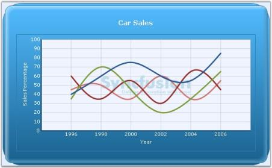

## Interlaced Grid Background

Chart supports interlaced grid which draws alternative grid background in x-axis and y-axis. The color is also customizable.



this.chartControl1.PrimaryXAxis.InterlacedGrid = true;
this.chartControl1.PrimaryXAxis.InterlacedGridInterior = new Syncfusion.Drawing.BrushInfo(System.Drawing.Color.FromArgb(166, 184, 200);

this.chartControl1.PrimaryYAxis.InterlacedGrid = True;
this.chartControl1.PrimaryYAxis.InterlacedGridInterior = new Syncfusion.Drawing.BrushInfo(System.Drawing.Color.FromArgb(124, 144, 179));





Me.chartControl1.PrimaryXAxis.InterlacedGrid = True
Me.chartControl1.PrimaryXAxis.InterlacedGridInterior = new Syncfusion.Drawing.BrushInfo(System.Drawing.Color.FromArgb(166, 184, 200)

Me.chartControl1.PrimaryYAxis.InterlacedGrid = True
Me.chartControl1.PrimaryYAxis.InterlacedGridInterior = new Syncfusion.Drawing.BrushInfo(System.Drawing.Color.FromArgb(124, 144, 179))



The preceding image illustrates interlaced grid background for the chart.

A sample which illustrates the Interlaced Grid for the Chart is available in the below sample installation location.

&lt;Sample location&gt;\Syncfusion\EssentialStudio\Version Number\Windows\Chart.Windows\Samples\2.0\Chart Appearance\Interlaced Grid

## Minor Grid Lines

Chart comes with minor lines support which will draw lines along the intervals provided. The appearance of these line is also customizable similar to the major grid lines. 



this.chartControl1.PrimaryXAxis.DrawMinorGrid = true;

this.chartControl1.PrimaryXAxis.MinorGridLineType.DashStyle = DashStyle.DashDotDot;

this.chartControl1.PrimaryXAxis.MinorGridLineType.Width = 2;

this.chartControl1.PrimaryXAxis.MinorGridLineType.ForeColor = Color.Red;

chartControl1.PrimaryXAxis.SmallTicksPerInterval = 1;





Me.chartControl1.PrimaryXAxis.DrawMinorGrid = True

Me.chartControl1.PrimaryXAxis.MinorGridLineType.DashStyle = DashStyle.DashDotDot

Me.chartControl1.PrimaryXAxis.MinorGridLineType.Width = 2

Me.chartControl1.PrimaryXAxis.MinorGridLineType.ForeColor = Color.Red

chartControl1.PrimaryXAxis.SmallTicksPerInterval = 1



## Chart Skins 

Chart Control has some pre-defined skins, which can be controlled through a single property setting. EssentialChart control allows the user to customize its appearance by applying pre-defined Interiors. 

Some of the available skins are:

* Office2007Black
* Office2007Blue
* Office2007Silver
* Almond
* Blend
* Blueberry
* Marble
* Midnight
* Monochrome
* Olive
* Sandune
* Turquoise
* Vista
* VS2010



this.chartControl1.Skins = Skins.Office2007Blue;





Me.chartControl1.Skins = Skins.Office2007Blue



The following output is displayed when the Skins value is set to Office2007 Black.

The following output is displayed when the Skins value is set to Office2007 Blue.

The following output is displayed when the Skins value is set to Office2007 Silver.

The following output is displayed when the Skins value is set to Almond.

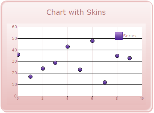

The following output is displayed when the Skins value is set to Blend.

The following output is displayed when the Skins value is set to Blueberry.

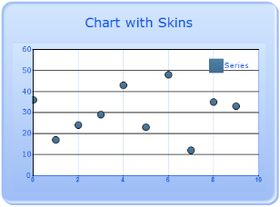

The following output is displayed when the Skins value is set to Marble.

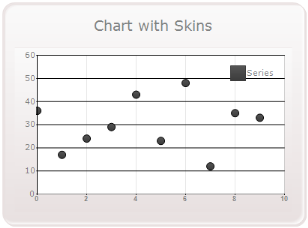

The following output is displayed when the Skins value is set to Midnight.

The following output is displayed when the Skins value is set to Monochrome.

The following output is displayed when the Skins value is set to Olive.

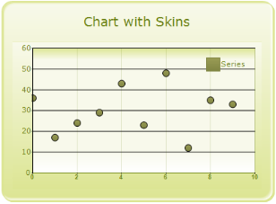

The following output is displayed when the Skins value is set to Sandune.

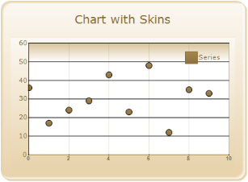

The following output is displayed when the Skins value is set to Turquoise.

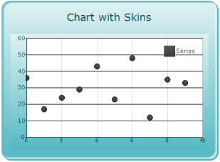

The following output is displayed when the Skins value is set to Vista.

The following output is displayed when the Skins value is set to VS2010.

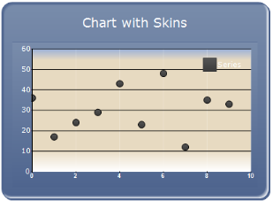



ChartSeries ser1 = new ChartSeries("Series 1");

ser1.Type = ChartSeriesType.StackingColumn;

// specifing group name .

ser1.StackingGroup = "FirstGroup";

ChartSeries ser2 = new ChartSeries("Series 2");

ser2.Type = ChartSeriesType.StackingColumn;

// specifing group name .

ser2.StackingGroup = "SecondGroup";

ChartSeries ser3 = new ChartSeries("Series 3");

ser3.Type = ChartSeriesType.StackingColumn;

// specifing group name .

ser3.StackingGroup = "FirstGroup";





Dim ser1 As New ChartSeries("Series 1")

ser1.Type = ChartSeriesType.StackingColumn

' specifing group name .

ser1.StackingGroup = "FirstGroup"

Dim ser2 As New ChartSeries("Series 2")

ser2.Type = ChartSeriesType.StackingColumn

' specifing group name .

ser2.StackingGroup = "SecondGroup"

Dim ser3 As New ChartSeries("Series 3")

ser3.Type = ChartSeriesType.StackingColumn

' specifing group name .

ser3.StackingGroup = "FirstGroup"

