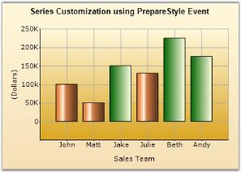

# Chart control events

The following events are discussed in this section:

## Chart Region Events

The Chart handles the following mouse related events when the user interacts with the Chart using mouse, on certain specific regions in the Chart - Axis Labels, Chart Points or a custom region.

* ChartRegionClick Event
* ChartRegionMouseEnter Event
* ChartRegionMouseHover Event
* ChartRegionMouseMove Event
* ChartRegionMouseLeave Event
* ChartRegionMouseUp Event
* ChartRegionMouseDown Event
* ChartRegionDoubleClick Event

The above events are raised with a ChartRegionMouseEventArgs that contain the following properties.

_Table_ _184_: _Properties_

<table>
<tr>
<th>
ChartRegionMouseEventArgs Property</th><th>
Description</th></tr>
<tr>
<td>
Point</td><td>
Represents the client point where the event occurred.</td></tr>
<tr>
<td>
Region (Expanded below)</td><td>
Returns the region associated with this event.</td></tr>
<tr>
<td>
Button</td><td>
Returns the right mouse button actions.</td></tr>
</table>

The Region property above includes several useful information about the kind of region the user is currently interacting with:

_Table_ _185_: _Properties_

<table>
<tr>
<th>
ChartRegion Property</th><th>
Description</th></tr>
<tr>
<td>
Description</td><td>
A text description of this region.</td></tr>
<tr>
<td>
Type</td><td>
Specifies the type of region. Possible values:* SeriesPoint - interacted on a data point.* HorAxisLabel - interacted on a horizontal axis* VerAxisLabel - interacted on a vertical axis* ChartCustom - interacted with a region that is none of the above.</td></tr>
<tr>
<td>
 IsChartPoint</td><td>
Indicates whether the region is a Chart Point in the ChartSeries. This simply checks if the above mentioned Type is SeriesPoint.</td></tr>
<tr>
<td>
SeriesIndex</td><td>
The index into the Series array of the Chart in which this point occurs. If the Type is SeriesPoint.</td></tr>
<tr>
<td>
PointIndex</td><td>
The index into the Points array of the ChartSeries in which this point occurs. If the Type is SeriesPoint.</td></tr>
<tr>
<td>
Region</td><td>
The client region that represents this logical region.</td></tr>
<tr>
<td>
ToolTip</td><td>
Specifies the tooltip for this region.</td></tr>
</table>

ChartRegionDoubleClick and ChartRegionMouseDown Events

## [C#]



//ChartRegionDoubleClick Event

this.chartControl1.ChartRegionDoubleClick += new Syncfusion.Windows.Forms.Chart.ChartRegionMouseEventHandler(this.chartControl1_ChartRegionDoubleClick);

private void chartControl1_ChartRegionDoubleClick(object sender, ChartRegionMouseEventArgs e)

{

    if (this.chkRegionDoubleClick.Checked)

    {

        if (e.Region.SeriesIndex == 0)

        {

            OutputText(String.Format("Double Click over Series 1 Column {0} Point : {1}", e.Region.PointIndex,e.Point));

            ShowChartRegion("ChartSeries");

        }

        else

        {

            OutputText(String.Format("Double Click over {0}", e.Region.Description.ToString()));

            ShowChartRegion(e.Region.Description.ToString());

        }

    }

}

//Usage of Button property in ChartRegionMouseDown Event

void chartControl1_ChartRegionMouseDown(object sender, ChartRegionMouseEventArgs e)

{

  if(e.Button==MouseButtons.Right)

     Console.WriteLine("Chart Region Mouse Down:="+e.Point.ToString());

}





'ChartRegionDoubleClick Event

AddHandler Me.chartControl1.ChartRegionDoubleClick, AddressOf Me.chartControl1_ChartRegionDoubleClick

Private Sub chartControl1_ChartRegionDoubleClick(ByVal sender As Object, ByVal e As ChartRegionMouseEventArgs)

    If Me.chkRegionDoubleClick.Checked Then

        If e.Region.SeriesIndex = 0 Then

            OutputText([String].Format("Double Click over Series 1 Column {0} Point : {1}", e.Region.PointIndex, e.Point))

            ShowChartRegion("ChartSeries")

        Else

            OutputText([String].Format("Double Click over {0}", e.Region.Description.ToString()))

            ShowChartRegion(e.Region.Description.ToString())

        End If

    End If

End Sub

'Usage of Button property in ChartRegionMouseDown Event

Private Sub chartControl1_ChartRegionMouseDown(ByVal sender As Object, ByVal e As ChartRegionMouseEventArgs)

      If e.Button = MouseButtons.Right Then

        Console.WriteLine("Chart Region Mouse Down:="+e.Point.ToString())

    End If

End Sub



## VisibleRangeChanged Event 

ChartControl provides various zooming options for the user while interacting with the Chart. The VisibleRangeChanged event will be raised when the visible range changes during the zooming operation.



private static void chartControl1_VisibleRangeChanged(object sender, EventArgs e)

{

Console.WriteLine("Visible Range Changed event is raised");

}





Private Sub chartControl1_VisibleRangeChanged(ByVal sender As Object, ByVal e As EventArgs)

Console.WriteLine("Visible Range Changed event is raised")

End Sub



## ChartFormatAxisLabel Event

This event is discussed in detail in this topic: Customizing Label Text.

## PrepareStyle Event

When a series point is about to be rendered by the chart, it will raise this event and allow event subscribers to change the style used. 



//Listen to the prepare style event for the series.

series.PrepareStyle += new ChartPrepareStyleInfoHandler(series_PrepareStyle);

private void series_PrepareStyle(object sender, ChartPrepareStyleInfoEventArgs args)

{

    ChartSeries series = sender as ChartSeries ;

    if(series != null)    

{

    //Condition to select members (data points) who made 100 % quota in sales

    if(((series.Points[args.Index].YValues[0] / 150) * 100) >= 100)

        {

          args.Style.Interior = new Syncfusion.Drawing.BrushInfo(Syncfusion.Drawing.GradientStyle.Horizontal, System.Drawing.                       Color.DarkGreen, System.Drawing.Color.LightYellow);                                    

         }

}

}





'Listen to the prepare style event for the series.

AddHandler series.PrepareStyle, AddressOf Me.ChartControlSeries_PrepareStyle

Private Sub series_PrepareStyle(ByVal sender As Object, ByVal args As ChartPrepareStyleInfoEventArgs)

Dim series As ChartSeries = TryCast(sender, ChartSeries)

  If series IsNot Nothing Then

     'Condition to select members (data points) who made 100 % quota in sales

     If ((series.Points(args.Index).YValues(0) / 150) * 100) >= 100 Then

        args.Style.Interior = New Syncfusion.Drawing.BrushInfo(Syncfusion.Drawing.GradientStyle.Horizontal,                                       System.Drawing.Color.DarkGreen, System.Drawing.Color.LightYellow)

     End If

  End If

End Sub



_Figure_ _370_: _Green columns indicate employees who met 100 percent of their Quota_

## SeriesInCompatible Event

When the Chart has completed updating the series and finds out that series are incompatible, this event will be raised.



private static void chartControl1_SeriesInCompatible(object sender, EventArgs e)

{

Console.WriteLine("SeriesInCompatible event is raised");

}





Private Sub chartControl1_SeriesInCompatible(ByVal sender As Object, ByVal e As EventArgs)

Console.WriteLine("SeriesInCompatible event is raised")

End Sub



## LayoutCompleted Event

This event is handled every time, a resizing of chart is caused and when the chart re-renders itself. Listening to this event helps in cases where you render custom images over the chart or position custom controls over the chart.



private static void chartControl1_LayoutCompleted(object sender, EventArgs e)

{

Console.WriteLine("Layout Completed event is raised");

}





Private Sub chartControl1_LayoutCompleted(ByVal sender As Object, ByVal e As EventArgs)

Console.WriteLine("Layout Completed event is raised")

End Sub



## ChartAreaPaint Event

ChartAreaPaint event is discussed in Custom Drawing.

### See Also

Chart Area Bounds

## ChartLegendFilterItems Event

This event is discussed in detail in this topic: Chart Legend.

## PreChartAreaPaint Event

PreChartAreaPaint event is raised before the chart area is painted.



this.chartControl1.PreChartAreaPaint += new System.Windows.Forms.PaintEventHandler(this.chartControl1_PreChartAreaPaint);

private void chartControl1_PreChartAreaPaint(object sender, PaintEventArgs e)

{

       this.chartControl1.BackColor = Color.Yellow;       

}

