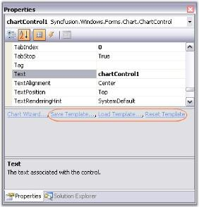
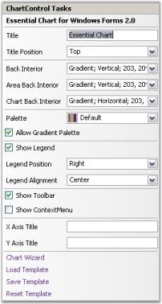

# Design time Features

The design time features are discussed in the below topics:

## Chart Templates

EssentialChart is provides support to save the series and point properties as XML file. This enables you to save the series and point properties into chart template and load the chart templates into the Chart control when needed. 

### Use Case Scenarios

When you want to create charts with consistent look and feel, you can utilize this feature. You can load the saved chart source to achieve this. 

### Working with Chart Template

Essential Chart is now associated with the creation and loading of chart templates into the ChartControl. It provides easy methods to save and load the templates. This section will walk you through the saving, loading and resetting of the chart templates and the various benefits of using it.

### Benefits

* Aesthetic items like appearance, positioning etc., of a chart can be saved in the template.
* Appearance settings saved in a Chart Template is reusable.
* Also stores any static data, if available in the chart.
* The user can save the existing structure of the chart control to an .xml file format.
* All the charts in your applications can be created with consistent look and feel.

### Save Template

The appearance settings for various components of a Chart like ChartSeries, ChartArea, Series properties and Point properties can be stored in a template, which can be loaded into new Chart control when needed.

A chart template can contain the properties of more than one data series. When such templates are loaded into a destination ChartControl, the appearance settings of the data series will be applied in a sequential order, i.e., the first set of appearance settings of a data series will be applied to the destination Chart's first series and the second set of appearance properties of the data series will be applied to the destination Chart's second series and so on. 

If the destination collection's length is larger than the source collection, then the settings will repeat itself for these additional entries in the destination collection.

These Charts can be saved as templates in the below two ways.

* Selecting the Save Template option from the context menu as shown above.
* By clicking the Save Template designer verb in the Visual Studio property browser as shown above.
* ChartTemplate has a static method to save the data programmatically. We need to pass ChartControl instance and a file name(it can accept stream file also.), through this save method.

  

ChartTemplate.Save(this.chartControl1, "TemplateName.xml");





ChartTemplate.Save(Me.chartControl1, "TemplateName.xml")




### Load Template

EssentialChart provides support to load the saved Chart template into a new chart control. This loads the series properties and the point properties, which was saved in a XML file and applies these properties into the new chart control.

* At the design time, by selecting the Load Template from the context menu.
* By clicking the Load Template designer verb, in the Visual Studio property browser. 

ChartTemplate has static method, to load the template data programmatically. We need to pass the ChartControl, which will be applied with the loaded template data.

### Reset Template

The ChartControl, which when loaded with a template will be applied with the appearance and other settings that were stored in the template. These settings can be reset and the Chart can be reverted back to its original appearance by using the below two methods.

* At the design time, by selecting the "Reset Template.." from the context menu.
* By clicking the "Reset Template" link in the Visual Studio property browser.

ChartTemplate can be reset using the following simple statements,

  

ChartTemplate ct = new ChartTemplate();

ct.Reset(this.chartControl1);





ChartTemplate ct = New ChartTemplate()

ct.Reset(Me.chartControl1)




### Sample Link

To view a sample:

1. Open the Syncfusion Dashboard.
2. Select User Interface > Windows Forms.
3. Click Run Samples.
4. Navigate to Chart samples > User Interaction > ChartSerialization. 

## Tasks Window

The tasks window has sufficient properties exposed in the right manner for users to be able to get started intuitively.

### Tasks

#### Title

Used to add title to the Chart directly from the Tasks Window.

##### Title Position

Specifies the position relative to the chart at which to render the chart title panel.

<table>
<tr>
<th>
ChartTitle.Position Property</th><th>
Description</th></tr>
<tr>
<td>
Top</td><td>
Above the chart; default setting.</td></tr>
<tr>
<td>
Left</td><td>
Left of the chart.</td></tr>
<tr>
<td>
Right</td><td>
Left of the chart.</td></tr>
<tr>
<td>
Bottom</td><td>
Left of the chart.</td></tr>
<tr>
<td>
Floating</td><td>
Will not be docked to any specific location. Can be docked manually by dragging the title panel.</td></tr>
</table>

### Back Interior

Specifies background brush of the control.

#### Area Back Interior

Specifies background brush of Chart Area of the control.

#### Chart Back Interior

Specifies background brush of ChartInterior.

### Palette

The Palette that is to be used to provide default colors for the chart series and other chart elements. Allow Gradient Palette property is used to enable or disable the gradient values of the palettes.

### ShowLegend

Specifies if the legend is to be displayed or not.

#### Legend Position

Configuration information of the Legend object.

<table>
<tr>
<th>
ChartLegend.Position Property</th><th>
Description</th></tr>
<tr>
<td>
Top</td><td>
Positions the legend panel to the Top of Chart.</td></tr>
<tr>
<td>
Left</td><td>
Positions the legend panel to the Left of Chart.</td></tr>
<tr>
<td>
Right</td><td>
Positions the legend panel to the Right of Chart.</td></tr>
<tr>
<td>
Bottom</td><td>
Positions the legend panel to the Bottom of Chart.</td></tr>
<tr>
<td>
Floating</td><td>
Will not be docked to any specific location. Can be docked manually by dragging the Legend panel.</td></tr>
</table>

#### Legend Alignment

Gets or sets the legend alignment. 

<table>
<tr>
<th>
ChartLegend.Alignment Property</th><th>
Description</th></tr>
<tr>
<td>
Center</td><td>
Aligns to center of chart.</td></tr>
<tr>
<td>
Far</td><td>
Aligns to Far of chart.</td></tr>
<tr>
<td>
Near</td><td>
Aligns to Near of chart.</td></tr>
</table>

### Show ToolBar

Specifies if the ToolBar is to be displayed or not.

### Show ContextMenu

Specifies if the ToolBar context menu is to be displayed or not.

### X Axis Title

Specifies the Title of Primary x axis.

### Y Axis Title

Specifies the Title of Primary y axis.

### Spacing Between Points

Specifies the spacing between the series points.