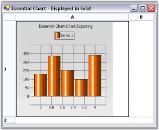
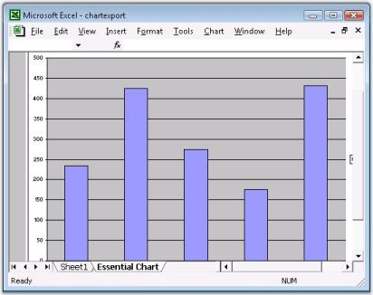
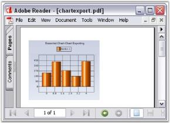

# Exporting

EssentialChart has built-in support for exporting the chart control into various image formats. Also, using our complementary products like Essential XlsIO, DocIO and PDF you can also export the chart image into Excel, Word Doc and PDF documents.

More on this here:

## Exporting as an Image

The chart image can easily be exported as an image file in several different formats.

Programmatically

[C#]

private string fileName;

fileName = Application.StartupPath + "\\chartexport";

fileName = fileName + ".gif";

this.chartControl1.SaveImage(fileName);

// Launches the file. 

System.Diagnostics.Process.Start(exportFileName);

[VB.NET]

Private fileName As String

fileName = Application.StartupPath + "\chartexport"

fileName = fileName + ".gif"

Me.chartControl1.SaveImage(fileName)

' Launches the file. 

System.Diagnostics.Process.Start(exportFileName)

Based on the filename extension the chart has built-in support to save the image in the following formats.

_Table_ _179__: Properties_

<table>
<tr>
<td>
File Extension</td><td>
File Type</td></tr>
<tr>
<td>
.bmp</td><td>
BMP</td></tr>
<tr>
<td>
.jpg</td><td>
JPEG</td></tr>
<tr>
<td>
.jpeg</td><td>
JPEG</td></tr>
<tr>
<td>
.gif</td><td>
GIF</td></tr>
<tr>
<td>
.tiff</td><td>
TIFF</td></tr>
<tr>
<td>
.Wmf</td><td>
WMF</td></tr>
<tr>
<td>
.emf</td><td>
EMF</td></tr>
<tr>
<td>
.svg</td><td>
SVG (Scalable Vector Graphics)</td></tr>
<tr>
<td>
.eps</td><td>
Post Script</td></tr>
</table>

If the specified extension is none of the above, then the chart is exported as a bitmap.

During runtime, the Chart control can be saved as a file using the Chart Toolbar save option.

Editable Text Support for EPS Images

The Chart control can export an EPS image with editable text by setting the EditableText property to true. 

[C#]

 ToPostScript toPostScript = new ToPostScript();

toPostScript.EditableText = true;

using(Graphics g = toPostScript.GetRealGraphics(this.chartControl1.Size))

            {

                this.chartControl1.Draw(g, this.chartControl1.Size);

                g.Dispose();

                toPostScript.Save("EditableTextChart.eps");

          }

[VB]

Dim toPostScript As New ToPostScript()

toPostScript.EditableText = True

Using g As Graphics = toPostScript.GetRealGraphics(Me.chartControl1.Size)

         Me.chartControl1.Draw(g, Me.chartControl1.Size)

         g.Dispose();

         toPostScript.Save("EditableTextChart.eps")

End Using

The figure below shows the chart EPS image text editing in Adobe Illustrator.

{{ '' | markdownify }}
{:.image }

_Figure_ _354__: EPS Chart with Editable Text_

{{ '' | markdownify }}
{:.image }
_Note: Chart wrapping and formatting will not be possible in the EPS image by enabling this property._

## Exporting to Word Doc

The chart control can be exported to a Word doc file as an image using EssentialDocIO. The chart control provides APIs to convert it to an image, while DocIO lets you insert this image into a Word Document file programmatically.

{{ '' | markdownify }}
{:.image }

_Figure_ _355__: Exporting Chart to DocIO_

Given below are the steps that will guide you through this process.

1. Add the Syncfusion.DocIO.Base and Syncfusion.DocIO.Windows assemblies.
2. Add the namespace Syncfusion.DocIO and Syncfusion.DocIO.DLS in your form.

[C#]

using Syncfusion.DocIO;

using Syncfusion.DocIO.DLS;

[VB.NET]

Imports Syncfusion.DocIO

Imports Syncfusion.DocIO.DLS

3. Add the code snippet that is given below in your form.

[C#]

string fileName=Application.StartupPath+"\\chartexport";

string exportFileName = fileName + ".doc";

string file = fileName + ".gif";

this.chartControl1.SaveImage(file);

 // Create a new document.

WordDocument document = new WordDocument();

  // Adding a new section to the document.

IWSection section = document.AddSection();

// Adding a paragraph to the section.

IWParagraph paragraph = section.AddParagraph();                                                

 // Writing text.

paragraph.AppendText( "Essential Chart" );

 // Adding a new paragraph.                

paragraph = section.AddParagraph();

paragraph.ParagraphFormat.HorizontalAlignment = Syncfusion.DLS.HorizontalAlignment.Center;

 // Inserting chart.

paragraph.AppendPicture( Image.FromFile(file));

 // Save the Document to disk.

document.Save(exportFileName , Syncfusion.DocIO.FormatType.Doc );

  // Launches the file.                         

System.Diagnostics.Process.Start(exportFileName);

[VB.NET]

Dim fileName As String =Application.StartupPath & "\chartexport"

Dim exportFileName As String = fileName & ".doc"

Dim file As String = fileName & ".gif"

Me.chartControl1.SaveImage(file)

 ' Create a new document.

Dim document As WordDocument = New WordDocument()

 ' Adding a new section to the document.

Dim section As IWSection = document.AddSection()

 ' Adding a paragraph to the section.

Dim paragraph As IWParagraph = section.AddParagraph()

' Writing text.

paragraph.AppendText("Essential Chart")

 ' Adding a new paragraph.                

paragraph = section.AddParagraph()

paragraph.ParagraphFormat.HorizontalAlignment = Syncfusion.DLS.HorizontalAlignment.Center

 ' Inserting chart.

paragraph.AppendPicture(Image.FromFile(file))

' Save the Document to disk.

document.Save(exportFileName, Syncfusion.DocIO.FormatType.Doc)

' Launches the file.                         

System.Diagnostics.Process.Start(exportFileName)

A sample demonstrating the above is available in our installation at the following location:

"My Documents\Syncfusion\EssentialStudio\Version Number\Windows\Chart.Windows\Samples\2.0\Export\Chart Export Data"

## Exporting to Grid

The chart control can be exported into a grid cell (in Essential Grid) as an image using EssentialGrid. The chart control provides APIs to convert it to an image, while the Grid will let you insert this image into any specific cell.

{{ '' | markdownify }}
{:.image }

_Figure_ _356__: Exporting Chart to Grid_

The steps that are given below will guide you through the process.

1. Add the Syncfusion.Grid.Base and Syncfusion.Grid.Windows assemblies
2. Add a form (Form2) to hold the Grid control in which the chart is to be exported.
3. Drag a grid control onto the Form2.
4. Add the namespace Syncfusion.Windows.forms.Grid in Form2.

[C#]

using Syncfusion.Windows.Forms.Grid;

[VB.NET]

Imports Syncfusion.Windows.Forms.Grid

5. Add the code snippet that is given below in Form2 to get the chart data into the grid.

[C#]

// Creates a new instance of the Imagelist class.

ImageList img = new ImageList();

// Adds the image to the Image collection of the Imagelist.

img.Images.Add(Image.FromFile(this.Name));

// Specify the size of the image.

img.ImageSize = new Size(256, 256);

// Set the imagelist of the cell.

this.gridControl1[1,1].ImageList = img;

// Specify the index for the image to be displayed.

this.gridControl1[1, 1].ImageIndex = 0;

// Specify the row and column height of the cell.

this.gridControl1.RowHeights[1] = 300;

this.gridControl1.ColWidths[1] = 300;

// Specify the image size mode.

this.gridControl1[1, 1].ImageSizeMode = GridImageSizeMode.CenterImage;

[VB.NET]

' Creates a new instance of the Imagelist class.

Dim img As ImageList = New ImageList()

' Adds the image to the Image collection of the Imagelist.

img.Images.Add(Image.FromFile(Me.Name))

' Specify the size of the image.

img.ImageSize = New Size(256, 256)

' Set the imagelist of the cell.

Me.gridControl1(1,1).ImageList = img

' Specify the index for the image to be displayed.

Me.gridControl1(1, 1).ImageIndex = 0

' Specify the row and column height of the cell.

Me.gridControl1.RowHeights(1) = 300

Me.gridControl1.ColWidths(1) = 300

' Specify the image size mode.

Me.gridControl1(1, 1).ImageSizeMode = GridImageSizeMode.CenterImage

6. Add the code that is given below in the form with the chart control to be exported.

[C#]

private Form2 gridForm;

this.gridForm= new Form2();

string fileName=Application.StartupPath+"\\chartexport";

string file = fileName + ".gif";

if(!System.IO.File.Exists(file))

this.chartControl1.SaveImage(file);

// Specify the filename as the name of the form.

gridForm.Name = file;

// Shows the form with grid control with the chart exported.

gridForm.ShowDialog();

[VB.NET]

Private gridForm As Form2

Me.gridForm= New Form2()

Dim fileName As String =Application.StartupPath & "\chartexport"

Dim file As String = fileName & ".gif"

If (Not System.IO.File.Exists(file)) Then

    Me.chartControl1.SaveImage(file)

End If

' Specify the filename as the name of the form.

gridForm.Name = file

' Shows the form with grid control with the chart exported.

gridForm.ShowDialog()

A sample demonstrating the above is available in our installation at the following location:

"My Documents\Syncfusion\EssentialStudio\Version Number\Windows\Chart.Windows\Samples\2.0\Export\Chart Export Data"

## Exporting to Excel

EssentialChart data can be exported into an Excel document and an Excel chart can be created to use the above data using Essential XlsIO. Though there is no built-in support for this, this can be easily implemented with a very intuitive XlsIO API.

{{ '' | markdownify }}
{:.image }

_Figure_ _357__: Essential Chart translated into an Excel Chart by using Essential XlsIO_

Given below are the steps that will guide you through this process.

1. Add the Syncfusion.XLsIO.Base and Syncfusion.XLsIO.Windows assemblies.
2. Add the namespace Syncfusion.XLsIO in your form.

[C#]

using Syncfusion.XlsIO;

[VB.NET]

Imports Syncfusion.XlsIO

3. Add the code snippet that is given below in your form.

[C#]

string exportFileName = Application.StartupPath+"\\chartexport" + ".xls";                                    

// A new workbook with a worksheet should be created.

IWorkbook chartBook = ExcelUtils.CreateWorkbook(1);

IWorksheet sheet = chartBook.Worksheets[0];

   // Fill the worksheet with chart data.

for(int i=1;i<=5;i++)

{

sheet.Range[i,1].Number = this.chartControl1.Series[0].Points[i-1].X;

sheet.Range[i,2].Number = this.chartControl1.Series[0].Points[i-1].YValues[0];

}

  // Create a chart worksheet.

IChart chart = chartBook.Charts.Add("Essential Chart");

   // Specify the title of the Chart.

chart.ChartTitle = "Essential Chart";

// Initialize a new series instance and add it to the series collection of the chart.

IChartSerie series = chart.Series.Add();

 // Specify the chart type of the series.

series.SerieType = ExcelChartType.Column_Clustered;

// Specify the name of the series. This will be displayed as the text of the legend.

series.Name = "Sample Series";

 // Specify the value ranges for the series.

series.Values = sheet.Range["B1:B5"];

 // Specify the Category labels for the series.

series.CategoryLabels = sheet.Range["A1:A5"];

 // Make the chart as active sheet.

chart.Activate();

  // Save the Chart book.

chartBook.SaveAs(exportFileName);

chartBook.Close();

ExcelUtils.Close();

 // Launches the file.

System.Diagnostics.Process.Start(exportFileName);

[VB.NET]

Dim exportFileName As String = Application.StartupPath & "\chartexport" & ".xls"

  ' A new workbook with a worksheet should be created.

Dim chartBook As IWorkbook = ExcelUtils.CreateWorkbook(1)

Dim sheet As IWorksheet = chartBook.Worksheets(0)

 ' Fill the worksheet with chart data.

For i As Integer = 1 To 5

sheet.Range(i,1).Number = Me.chartControl1.Series(0).Points(i-1).X

sheet.Range(i,2).Number = Me.chartControl1.Series(0).Points(i-1).YValues(0)

Next i

' Create a chart worksheet.

Dim chart As IChart = chartBook.Charts.Add("Essential Chart")

' Specify the title of the Chart.

chart.ChartTitle = "Essential Chart"

 ' Initialize a new series instance and add it to the series collection of the chart.

Dim series As IChartSerie = chart.Series.Add()

    ' Specify the chart type of the series.

series.SerieType = ExcelChartType.Column_Clustered

 ' Specify the name of the series. This will be displayed as the text of the legend.

series.Name = "Sample Series"

                        ' Specify the value ranges for the series.

series.Values = sheet.Range("B1:B5")

' Specify the Category labels for the series.

series.CategoryLabels = sheet.Range("A1:A5")

' Make the chart as active sheet.

chart.Activate()

 ' Save the Chart book.

chartBook.SaveAs(exportFileName)

chartBook.Close()

ExcelUtils.Close()

 ' Launches the file. 

System.Diagnostics.Process.Start(exportFileName)

Sample

A sample demonstrating the above functionality is available in our installation at the following location:

"My Documents\Syncfusion\EssentialStudio\Version Number\Windows\Chart.Windows\Samples\2.0\Export\Chart Export Data"

## Exporting to PDF

The chart control can be exported into a PDF file as an image using EssentialPDF. The chart control provides APIs to convert it to an image, while Essential PDF lets you insert this image into a Word Document file programmatically.

{{ '' | markdownify }}
{:.image }

_Figure_ _358__: Exporting Chart to PDF_

1.  Add the Syncfusion.Pdf.Base and Syncfusion.Pdf.Windows assemblies.
2.  Add the namespace Syncfusion.Pdf in your form.

[C#]

using Syncfusion.Pdf;

using Syncfusion.Pdf.Graphics;

[VB.NET]

Imports Syncfusion.Pdf

Imports Syncfusion.Pdf.Graphics

3. Add the code snippet that is given below in your form.

[C#]

string fileName=Application.StartupPath+"\\chartexport";

string exportFileName = fileName + ".pdf";

string file = fileName + ".gif";

this.chartControl1.SaveImage(file);

//Create a PDF document

PdfDocument pdfDoc = new PdfDocument();

//Add a page to the empty PDF document

pdfDoc.Pages.Add();                   

//Draw chart image in the first page

pdfDoc.Pages[0].Graphics.DrawImage(PdfImage.FromFile(file), new PointF(10, 30));

//Save the PDF Document to disk.

pdfDoc.Save(exportFileName);

  // Launches the file.                         

System.Diagnostics.Process.Start(exportFileName);

[VB.NET]

Dim fileName As String = Application.StartupPath & "\chartexport"

Dim exportFileName As String = fileName & ".pdf"

Dim file As String = fileName & ".gif"

Me.chartControl1.SaveImage(file)

'Create a PDF document

Dim pdfDoc As PdfDocument = New PdfDocument()

'Add a page to the empty PDF document

pdfDoc.Pages.Add()

'Draw chart image in the first page

pdfDoc.Pages(0).Graphics.DrawImage(PdfImage.FromFile(file), New PointF(10, 30))

'Save the PDF Document to disk.

pdfDoc.Save(exportFileName)

' Launches the file.                         

System.Diagnostics.Process.Start(exportFileName)

A sample demonstrating the above is available in our installation at the following location:

"My Documents\Syncfusion\EssentialStudio\Version Number\Windows\Chart.Windows\Samples\2.0\Export\Chart Export Data"

