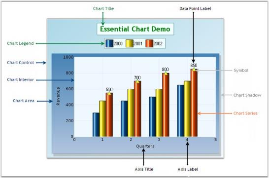
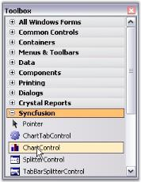
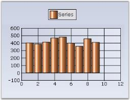

# Getting Started

This section provides the details that you will need to know about getting started with our Chart control. 

Here are the sub-topics covered under this section:

## Control Structure

This section gives you an idea of the different sections of a Chart control. Below is the image that illustrates various sections of the control and their description in detail below.

### Chart Title

The Chart title is the area at the top of the Chart control that displays the text of the ChartControl.

### Chart Legend 

The Chart legend is the portion of the display showing an entry for each of the data series added to the ChartControl. The Chart legend is positioned in line within the ChartControl (but outside the ChartArea) by default. However, if the chart legend is set to floating mode, the Chart legend can be positioned any where inside the Chart control.

The legend can also contain custom items with custom image and text.

### Chart Area 

This is the section that holds the plots / graphs that are defined in the Chart. The Chart Area also includes the Chart axes that are defined. A primary X axis and primary Y axis are defined by default.

### Chart control

The ChartControl is the complete visible display for the Control. All other sections will be inside the ChartControl. 

### Chart Series

Chart Series are the elements present inside the chart area.

### Series Symbol

Symbol that can be placed on the series points.

### Chart Shadow

Chart Area Shadow indicates the shadow of the chart area.

### Chart Interior

This section is the interior part of the chart control, within the chart area, which contains the data points plotted against X-axis and Y-axis.

### Chart Label

Represents the label texts on the axes data points in a Chart.

### Axis Title

Indicates the title for individual axis.



[Text](http://help.syncfusion.com/windowsforms/chart/chart-appearance#foreground-settings), [Chart Legend](http://help.syncfusion.com/windowsforms/chart/chart-legend-and-legend-items), [Chart Series](http://help.syncfusion.com/windowsforms/chart/chart-series), [Chart Area](http://help.syncfusion.com/windowsforms/chart/chart-area), [Axis Label Text Formatting](http://help.syncfusion.com/windowsforms/chart/chart-axes#axis-label-text-formatting), [Appearance and Positioning](http://help.syncfusion.com/windowsforms/chart/chart-axes#axis-label-text-formatting), [Customizing Label Text](http://help.syncfusion.com/windowsforms/chart/chart-axes#customizing-label-text), [Intersecting Labels](http://help.syncfusion.com/windowsforms/chart/chart-axes#intersecting-labels), [Grouping Labels](http://help.syncfusion.com/windowsforms/chart/chart-axes#grouping-labels)



## Creating a simple Chart

To create a simple chart control and populate it with simple data, follow the steps that are given below.

1. Open your form in the designer. Add the Syncfusion controls to yourVS.NET toolbox if you haven't done so already (the install would have automatically done this unless you selected not to complete toolbox integration during installation). 

   

2. Drag a Chart control onto the form.
3. Appearance and behavior-related aspects of the Chart can be controlled by setting the appropriate properties through the properties grid. For example, change the position of the legend for the control to be top aligned by changing the LegendPosition property. 

    

4. The data for the Chart can be added through code. Switch to code view in VS.NET and add the method shown below.

   ~~~ cs

		using Syncfusion.Windows;

		using Syncfusion.Windows.Forms.Chart;

		// Create a new ChartSeries. The string specified is the name of the series.

		ChartSeries series = new ChartSeries ("Series");

		// Set the Text property of the series. This will be used by the legend to display a descriptive name.

		series.Text = series.Name;

		// Add points to the series.

		// format (x, y)

		series.Points.Add(1, 400);

		series.Points.Add(2, 385);

		series.Points.Add(3, 412);

		series.Points.Add(4, 467);

		series.Points.Add(5, 478);

		series.Points.Add(6, 397);

		series.Points.Add(7, 355);

		series.Points.Add(8, 456);

		series.Points.Add(9, 409);

		// Set the type of Chart.

		series.Type = ChartSeriesType.Column;    

		// Add the series to the Chart.

		this.chartControl1.Series.Add(series);

   ~~~
   {:.prettyprint }
         

   ~~~ vbnet

		Imports Syncfusion.Windows

		Imports Syncfusion.Windows.Forms.Chart

		' Create a new ChartSeries. The string specified is the name of the series.

		Dim series As New ChartSeries("Series")

		' Set the Text property of the series. This will be used by the legend.

		series.Text = series.Name

		' Add points to the series.

		series.Points.Add(1, 400)

		series.Points.Add(2, 385)

		series.Points.Add(3, 412)

		series.Points.Add(4, 467)

		series.Points.Add(5, 478)

		series.Points.Add(6, 397)

		series.Points.Add(7, 355)

		series.Points.Add(8, 456)

		series.Points.Add(9, 409)

		' Set the type of Chart.

		series.Type = ChartSeriesType.Column

		' Add the series to the Chart.

		Me.chartControl1.Series.Add(series)

   ~~~
   {:.prettyprint }
   
5. Now try running the project by selecting the Debug  Start Debugging. The chart will appear as shown below.

   
   
   


[Binding a DataSet to a Chart](http://help.syncfusion.com/windowsforms/chart/chart-data#binding-a-dataset-to-the-chart), [Tasks Window](http://help.syncfusion.com/windowsforms/chart/design-time-features#tasks-window)


