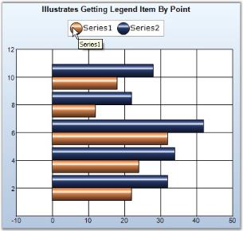
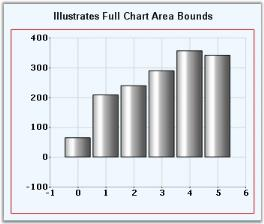
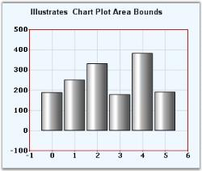

# Hit Testing

The section covers the below topics:

## Chart Coordinates by Point

### Chart Coordinates by point

#### GetValueByPoint()

Using the GetValueByPoint method, the mouse position in chart client-coordinates can be converted into a corresponding Chart Coordinate in terms of x, y values.

The below figure shows a chart where the tooltip text for each point shows the corresponding x, y value at that position. 

Code snippet for the above sample



// Chartcontrol mouse move event.

private void chartControl_MouseMove(object sender,System.Windows.Forms.MouseEventArgs e)  

{

       ChartPoint chpt = this.chartControl.ChartArea.GetValueByPoint( new Point( e.X, e.Y ) );

       string text = "Result of method GetValueByPoint - {" + chpt.X.ToString() + "," + chpt.YValues[0].ToString() + "}" ;

       toolTip.SetToolTip( chartControl, text );

}





' ChartControl mouse move event.

Private Sub chartControl_MouseMove(ByVal sender As Object, ByVal e As System.Windows.Forms.MouseEventArgs)

    Dim chpt As ChartPoint = Me.chartControl.ChartArea.GetValueByPoint(New Point(e.X, e.Y))

    Dim [text] As String = "Result of method GetValueByPoint - {" + chpt.X.ToString() + "," + chpt.YValues(0).ToString() + "}" 

    toolTip.SetToolTip(chartControl, text)

End Sub



#### GetPointByValue()

The GetPointByValue method does the opposite of the above - given a chart coordinate it returns the client co-ordinate corresponding to that chart point.

## LegendItem By Point

### Get LegendItem By Point

The Legend.GetItemBy method will let you get the reference to a legend item at a specific point. Implementing the below code sample, will display a tooltip with legend item name, on which the user mouse hover. 



private ToolTip toolTip2;

this.chartControl1.Legend.MouseHover += new MouseEventHandler(lgnd_MouseHover);

void lgnd_MouseHover(object sender, EventArgs e)

{

    Point p1 = this.chartControl1.Legend.PointToClient(new Point(Control.MousePosition.X, Control.MousePosition.Y));

    ChartLegendItem item = chartControl1.Legend.GetItemBy(p1);

    if (item != null)

        this.toolTip2.Show(item.Text, this.chartControl1.Legend, p1.X + 10, p1.Y + 20, 3000);

}





private toolTip2 As ToolTip

AddHandler Me.chartControl1.Legend.MouseHover, AddressOf lgnd_MouseHover

Private Sub lgnd_MouseHover(ByVal sender As Object, ByVal e As EventArgs)

    ' Get the item at the specified location..

    Dim p1 As Point = Me.chartControl1.Legend.PointToClient(New Point(Control.MousePosition.X, Control.MousePosition.Y))

Dim item As ChartLegendItem = chartControl1.Legend.GetItemBy(p1)    

If item IsNot Nothing Then

        Me.toolTip2.Show(item.Text, this.chartControl1.Legend, p1.X + 10, p1.Y + 20, 3000)

    End If

End Sub



## Chart Area Bounds

### Full Chart Area Bounds

Use the Bounds property to get the rectangular area comprising the chart area that includes the axis, axis titles and other sections.



this.chartControl1.ChartAreaPaint += new System.Windows.Forms.PaintEventHandler(chartControl1_ChartAreaPaint);

void chartControl1_ChartAreaPaint(object sender, System.Windows.Forms.PaintEventArgs e)

{

    Rectangle axisBounds = this.chartControl1.ChartArea.Bounds;

   // Render a rectangle around this bounds

    e.Graphics.DrawRectangle(Pens.Red, axisBounds);

}





AddHandler Me.chartControl1.ChartAreaPaint, AddressOf chartControl1_ChartAreaPaint

Private Sub chartControl1_ChartAreaPaint(ByVal sender As Object, ByVal e As System.Windows.Forms.PaintEventArgs)

    Dim axisBounds As Rectangle = Me.chartControl1.ChartArea.Bounds

    ' Render a rectangle around this bounds

    e.Graphics.DrawRectangle(Pens.Red, axisBounds)

End Sub



### Chart Plot Area Bounds

Use the RenderBounds property to get the rectangular area comprising just the plot-area, bound by the axes.



this.chartControl1.ChartAreaPaint += new System.Windows.Forms.PaintEventHandler(chartControl1_ChartAreaPaint);

void chartControl1_ChartAreaPaint(object sender, System.Windows.Forms.PaintEventArgs e)

{

    Rectangle axisBounds = this.chartControl1.ChartArea.RenderBounds;

    // Render a rectangle around this bounds

    e.Graphics.DrawRectangle(Pens.Red, axisBounds);

}





AddHandler Me.chartControl1.ChartAreaPaint, AddressOf chartControl1_ChartAreaPaint

Private Sub chartControl1_ChartAreaPaint(ByVal sender As Object, ByVal e As System.Windows.Forms.PaintEventArgs)

    Dim axisBounds As Rectangle = Me.chartControl1.ChartArea.RenderBounds

    ' Render a rectangle around this bounds

    e.Graphics.DrawRectangle(Pens.Red, axisBounds)

End Sub



