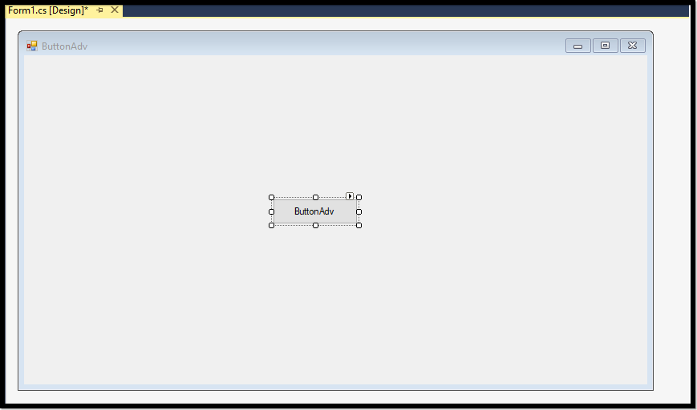
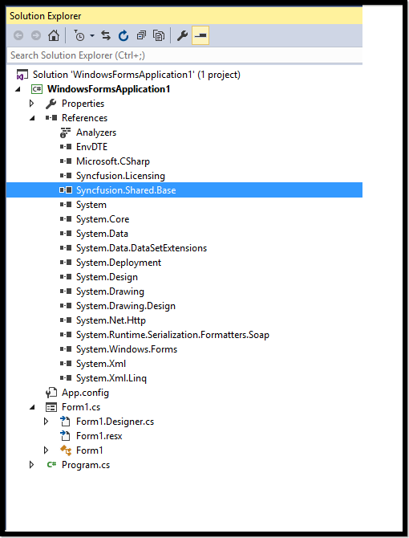
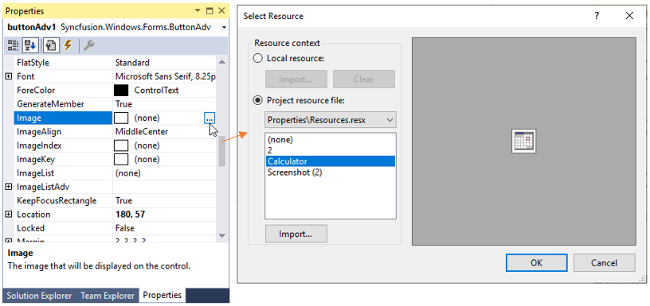
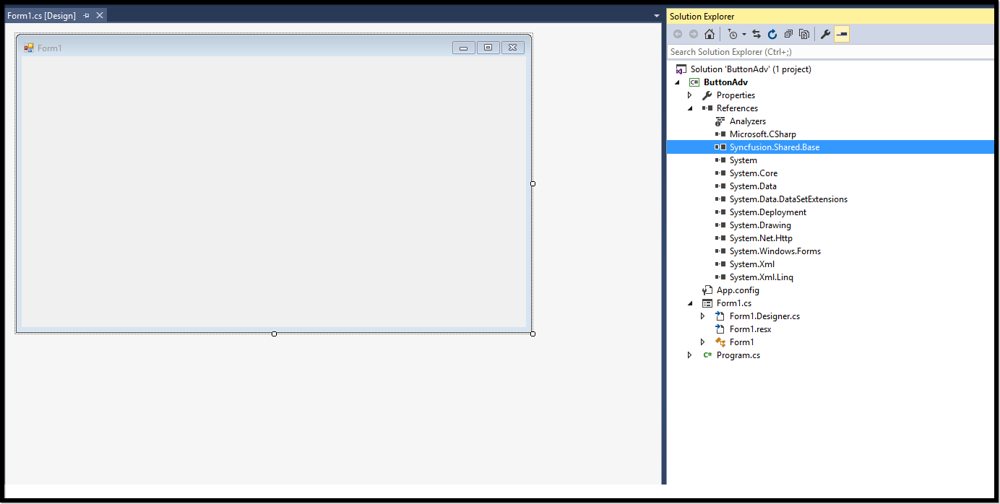
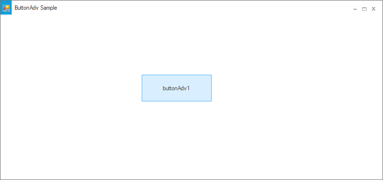

# Getting Started in WinForms ButtonAdv

This section explains how to create a new Windows Forms project in Visual Studio and add **ButtonAdv"** with it's basic functionalities.

## Assembly deployment

Refer to the [control dependencies](https://help.syncfusion.com/windowsforms/control-dependencies#buttonadv) section to get the list of assemblies or NuGet package details which needs to be added as reference to use the control in any application.

[Click here](https://help.syncfusion.com/windowsforms/nuget-packages) to find more details about on how to install nuget packages in Windows Forms application. 

## Adding a ButtonAdv control through designer

**Step 1**: Create a new Windows Forms application in Visual Studio. Drag and drop the ButtonAdv from toolbox into form design view. The following dependent assemblies will be added automatically.

* Syncfusion.Shared.Base

**Step 2**: Set the desired properties for **"ButtonAdv"** control through the **"Properties"** dialog window. Here we have illustrated an example of how to add image and customize its properties. 

**Step 3**: Run the application and the following output will be shown:

## Adding a ButtonAdv control through code

**Step 1**: Create a new Windows Forms application in Visual Studio. Add the following required assembly references and namespace to the project. 

* Syncfusion.Shared.Base





using Syncfusion.Windows.Forms.Tools;





Imports Syncfusion.Windows.Forms.Tools





 
**Step 2**: In Form1.cs, create an instance of **"ButtonAdv"** control and add in to the form. Also you can customize the ButtonAdv properties using the following code.





 public Form1()
 {
            
            InitializeComponent();
            ButtonAdv button = new ButtonAdv();
            button.UseVisualStyle = true;
            button.Location = new System.Drawing.Point(296, 179);
            button.Name = "buttonAdv1";
            button.Size = new System.Drawing.Size(165, 82);
            button.Text = "ButtonAdv";
            button.ThemeName = "Office2019Colorful";
            this.Controls.Add(button);
}





Public Sub New()

    InitializeComponent()
    Dim button As ButtonAdv = New ButtonAdv()
    button.UseVisualStyle = True
    button.Location = New System.Drawing.Point(296, 179)
    button.Name = "buttonAdv1"
    button.Size = New System.Drawing.Size(165, 82)
    button.Text = "ButtonAdv"
    button.ThemeName = "Office2019Colorful"
    Me.Controls.Add(button)

End Sub





**Step 3**: Run the application and the following output will be shown.

## Adding an image and relation location for the image with ButtonAdv's Text

In ButtonAdv control, we can embed image using the **Image** property. Meanwhile in-order to set the image along with custom text, we can use the **Text** property and define relation between image and text using **TextImageRelation** property.





 public Form1()
 {
            
            InitializeComponent();
            ButtonAdv button = new ButtonAdv();
            //Adding the image to ButtonAdv control
            button.Image = global::WindowsFormsApplication1.Properties.Resources.Calculatorimage;
            button.Location = new System.Drawing.Point(296, 179);
            button.Name = "buttonAdv1";
            button.Size = new System.Drawing.Size(165, 82);
            button.Text = "ButtonAdv";
            //Setting the TextImageRelation property to the button
            button.TextImageRelation = TextImageRelation.ImageBeforeText;
            button.ThemeName = "Office2019Colorful";
            this.Controls.Add(button);
}





Public Sub New()

    InitializeComponent()
    Dim button As ButtonAdv = New ButtonAdv()
    'Adding the image to ButtonAdv control
    button.Image = [global].WindowsFormsApplication1.Properties.Resources.Calculatorimage
    button.Location = New System.Drawing.Point(296, 179)
    button.Name = "buttonAdv1"
    button.Size = New System.Drawing.Size(165, 82)
    button.Text = "ButtonAdv"
    'Setting the TextImageRelation property to the button
    button.TextImageRelation = TextImageRelation.ImageBeforeText
    button.ThemeName = "Office2019Colorful"
    Me.Controls.Add(button)

End Sub





