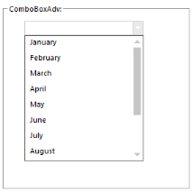

# Getting Started with Windows Forms ComboBoxAdv(Classic)

This section briefly describes how to design a ComboBoxAdv Control in a Windows Forms Application.

* Adding a ComboBoxAdv Control 
* Configuring the ComboBoxAdv Control

## Adding ComboBoxAdv Control

* Create a new Windows Forms Application Project in VS IDE through New Project Wizard.
* Drag and drop the ComboBoxAdv control in the Form from Toolbox.

 

## Configuring ComboBoxAdv Control

The most commonly used settings of the ComboBoxAdv control can be configured either through Designer using the Smart tag or through the Properties window or through code.

 

To add ComboBoxAdv Control to a Windows Forms Application through code behind, follow the given steps.

1. Include the namespaces “Syncfusion.Windows.Forms” and “Syncfusion.Windows.Forms.Tools”.

​




//Namespaces.
using Syncfusion.Windows.Forms.Tools;
using Syncfusion.Windows.Forms;





'Namespaces.
Imports Syncfusion.Windows.Forms
Imports Syncfusion.Windows.Forms.Tools





{{ codesnippet1 | OrderList_Indent_Level_1 }}

2. Create an instance of the ComboBoxAdv control and add it to the Form.

​



  
//Creates ComboBoxAdv instance.
private Syncfusion.Windows.Forms.Tools.ComboBoxAdv comboBoxAdv1;
this.comboBoxAdv1 = new ComboBoxAdv();





'Creates ComboBoxAdv instance.
Private comboBoxAdv1 As Syncfusion.Windows.Forms.Tools.ComboBoxAdv
Me.comboBoxAdv1 = New ComboBoxAdv()





{{ codesnippet2 | OrderList_Indent_Level_1 }}

3. Items can be added to ComboBoxAdv through String Collection Editor as it was done in Windows ComboBox control.

​




//Adding items to ComboBoxAdv
this.comboBoxAdv1.Items.Add(100);
this.comboBoxAdv1.Items.Add(200);
this.comboBoxAdv1.Items.Add(300);





'Adding items to ComboBoxAdv
Me.comboBoxAdv1.Items.Add(100)
Me.comboBoxAdv1.Items.Add(200)
Me.comboBoxAdv1.Items.Add(300)





{{ codesnippet3 | OrderList_Indent_Level_1 }}

4. Finally add ComboBoxAdv to the form.

​




//Adding ComboBoxAdv to form

this.Controls.Add(this.comboBoxAdv1);





'Adding ComboBoxAdv to form

Me.Controls.Add(Me.comboBoxAdv1)





{{ codesnippet4 | OrderList_Indent_Level_1 }}

