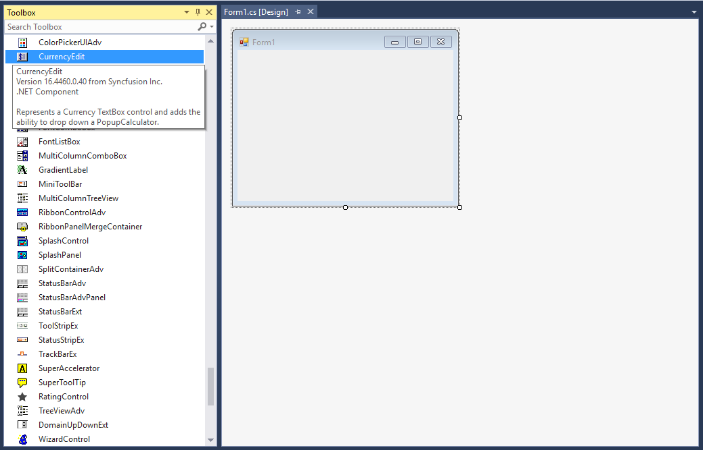

# Getting Started

## Assembly deployment

Refer to the [Control dependencies](https://help.syncfusion.com/windowsforms/control-dependencies#currencyedit) section to get the list of assemblies or details of NuGet package that needs to be added as a reference to use the control in any application.

Click [NuGet Packages](https://help.syncfusion.com/windowsforms/visual-studio-integration/nuget-packages) to learn how to install nuget packages in a Windows Forms application.

## Adding the CurrencyEdit control via designer

1) Create a new Windows Forms project in Visual Studio.

2) The [CurrencyEdit](https://help.syncfusion.com/cr/windowsforms/Syncfusion.Windows.Forms.Tools.CurrencyEdit.html) control can be added to an application by dragging it from the toolbox to a designer view. The following dependent assemblies will be added automatically:

* Syncfusion.Tools.Base
* Syncfusion.Tools.Windows
* Syncfusion.Grid.Base
* Syncfusion.Grid.Windows
* Syncfusion.Shared.Base
* Syncfusion.Shared.Windows

 

## Adding CurrencyEdit control via code

To add the control manually in C#, follow the given steps:

1) Create a C# or VB application using Visual Studio.

2) Add the following assembly references to the project:

* Syncfusion.Tools.Base
* Syncfusion.Tools.Windows
* Syncfusion.Grid.Base
* Syncfusion.Grid.Windows
* Syncfusion.Shared.Base
* Syncfusion.Shared.Windows

3) Include the required namespace.




using Syncfusion.Windows.Forms.Tools;




Imports Syncfusion.Windows.Forms.Tools




4) Create an instance of the [CurrencyEdit](https://help.syncfusion.com/cr/windowsforms/Syncfusion.Windows.Forms.Tools.CurrencyEdit.html) control, and add it to form.




CurrencyEdit currencyEdit1 = new CurrencyEdit();
this.Controls.Add(currencyEdit1);




Dim currencyEdit1 As New CurrencyEdit()
Me.Controls.Add(currencyEdit1)




 

5) Set the currency value using the [Text](https://help.syncfusion.com/cr/windowsforms/Syncfusion.Windows.Forms.Tools.CurrencyEdit.html#Syncfusion_Windows_Forms_Tools_CurrencyEdit_Text) property, and change the culture using the `Culture` property of currency symbol.




// Set currency value.
currencyEdit1.TextBox.Text = "$2.00";

// To change the culture.
currencyEdit1.TextBox.Culture = new System.Globalization.CultureInfo("ksh-DE");




' Set currency value.
currencyEdit1.TextBox.Text = "$2.00"

' To change the culture.
currencyEdit1.TextBox.Culture = New System.Globalization.CultureInfo("ksh-DE")




## Show or hide the drop-down calculator

You can show or hide the calculator button in the CurrencyEdit control by setting the [ShowCalculator](https://help.syncfusion.com/cr/windowsforms/Syncfusion.Windows.Forms.Tools.CurrencyEdit.html#Syncfusion_Windows_Forms_Tools_CurrencyEdit_ShowCalculator) property.




// Hide the calculator button.
currencyEdit1.ShowCalculator = false;




' Hide the calculator button.
currencyEdit1.ShowCalculator = False




