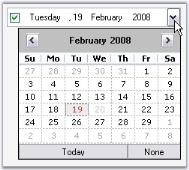
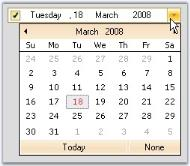

# Themes and Styles in Windows Forms DateTimePickerAdv(Classic)

## Themes

We can apply themes for the DateTimePickerAdv and also the child controls using the below properties.

* [ThemesEnabled](https://help.syncfusion.com/cr/windowsforms/Syncfusion.Windows.Forms.Tools.GradientPanel.html#Syncfusion_Windows_Forms_Tools_GradientPanel_ThemesEnabled)
* [ThemedChildControls](https://help.syncfusion.com/cr/windowsforms/Syncfusion.Windows.Forms.Tools.DateTimePickerAdv.html#Syncfusion_Windows_Forms_Tools_DateTimePickerAdv_ThemedChildControls)





this.dateTimePickerAdv1.ThemesEnabled = true;
this.dateTimePickerAdv1.ThemedChildControls = true;





Me.dateTimePickerAdv1.ThemesEnabled = True
Me.dateTimePickerAdv1.ThemedChildControls = True
' Setting backcolor for the control when it is ReadOnly
Me.dateTimePickerAdv1.ReadOnly = True
Me.dateTimePickerAdv1.IgnoreThemeBackground = True





 

## Styles

Visual Styles for the DateTimePickerAdv and its child controls can be applied using the [Style](https://help.syncfusion.com/cr/windowsforms/Syncfusion.Windows.Forms.Tools.DateTimePickerAdv.html#Syncfusion_Windows_Forms_Tools_DateTimePickerAdv_Style) property. 





// Sample for setting Office2007 style for the control
this.dateTimePickerAdv1.Style = Syncfusion.Windows.Forms.VisualStyle.Office2007;





' Sample for setting Office2007 style for the control
Me.dateTimePickerAdv1.Style = Syncfusion.Windows.Forms.VisualStyle.Office2007





 





//Sets the Color scheme as Blue when the style is Office2007
this.dateTimePickerAdv1.Office2007Theme = Syncfusion.Windows.Forms.Office2007Theme.Blue;





'Sets the Color scheme as Blue when the style is Office2007
Me.dateTimePickerAdv1.Office2007Theme = Syncfusion.Windows.Forms.Office2007Theme.Blue





 

### Custom Colors

We can also apply custom colors to the DateTimePickerAdv control by setting Office2007Theme to "Managed" and specifying the custom color through the [ApplyManagedColors](https://help.syncfusion.com/cr/windowsforms/Syncfusion.Windows.Forms.Office2007Colors.html#Syncfusion_Windows_Forms_Office2007Colors_ApplyManagedColors_System_Windows_Forms_Form_System_Drawing_Color_) method as follows.





this.dateTimePickerAdv1.Office2007Theme = Syncfusion.Windows.Forms.Office2007Theme.Managed;
Office2007Colors.ApplyManagedColors(this, Color.Orange);





Me.dateTimePickerAdv1.Office2007Theme = Syncfusion.Windows.Forms.Office2007Theme.Managed;
Office2007Colors.ApplyManagedColors(Me, Color.Orange)





 

