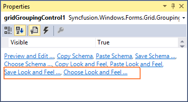

# Serialization
Serialization is the process of saving the state of an object into a stream of bytes for further use. The reverse of this process called Deserialization. This section will explain about the different types of serialization techniques available for the GridGroupingControl. 

## XML Serialization 
The grid schema information can be saved into the XML file by using the XML serialization. This can be achieved by using the following methods provided by the GridGroupingControl,

* [WriteXmlSchema](http://help.syncfusion.com/cr/cref_files/windowsforms/Syncfusion.Grid.Grouping.Windows~Syncfusion.Windows.Forms.Grid.Grouping.GridGroupingControl~WriteXmlSchema.html) - It writes the engine settings into an XML stream (Serialization).
* [ApplyXmlSchema](http://help.syncfusion.com/cr/cref_files/windowsforms/Syncfusion.Grid.Grouping.Windows~Syncfusion.Windows.Forms.Grid.Grouping.GridGroupingControl~ApplyXmlSchema.html) - It loads the engine settings from an XML stream (Deserialization).

By using this methods all the elements of the grid can be serialized. Not only the data, but also the look and feel of the grid can be serialized/deserialized. 



FileDialog dlg = new SaveFileDialog();
dlg.AddExtension = true;
dlg.Filter = "xml files (*.xml)|*.xml|All files (*.*)|*.*";

if (dlg.ShowDialog() == DialogResult.OK)
{

    // Create xml writer for adding the info to the xml file.
    XmlTextWriter xmlWriter = new XmlTextWriter(dlg.FileName, System.Text.Encoding.UTF8);
    xmlWriter.Formatting = System.Xml.Formatting.Indented;

    // Write Grid schema to the xml file.
    this.gridGroupingControl1.WriteXmlSchema(xmlWriter);
    xmlWriter.Close();
}


Dim dlg As FileDialog = New SaveFileDialog()
dlg.AddExtension = True
dlg.Filter = "xml files (*.xml)|*.xml|All files (*.*)|*.*"

If dlg.ShowDialog() = DialogResult.OK Then

	' Create xml writer for adding the info to the xml file.
	Dim xmlWriter As New XmlTextWriter(dlg.FileName, System.Text.Encoding.UTF8)
	xmlWriter.Formatting = System.Xml.Formatting.Indented

	' Write Grid schema to the xml file.
	Me.gridGroupingControl1.WriteXmlSchema(xmlWriter)
	xmlWriter.Close()
End If



### Deserialization 
The saved schema of the grid can be regenerated by using the `ApplyXmlSchema` method. The following code snippet is used to achieve this.



FileDialog dlg = new OpenFileDialog();
dlg.Filter = "xml files (*.xml)|*.xml|All files (*.*)|*.*";

if (dlg.ShowDialog() == DialogResult.OK)
{

    // Create the xml reader for reading the schema of the Grid.
    XmlReader xmlReader = new XmlTextReader(dlg.FileName);

    // Apply the schema to the GridGroupingControl.
    this.gridGroupingControl1.ApplyXmlSchema(xmlReader);
    xmlReader.Close();
}


Dim dlg As FileDialog = New OpenFileDialog()
dlg.Filter = "xml files (*.xml)|*.xml|All files (*.*)|*.*"

If dlg.ShowDialog() = DialogResult.OK Then

	' Create the xml reader for reading the schema of the Grid.
	Dim xmlReader As XmlReader = New XmlTextReader(dlg.FileName)

	' Apply the schema to the GridGroupingControl.
	Me.gridGroupingControl1.ApplyXmlSchema(xmlReader)
	xmlReader.Close()
End If



## Saving and Restoring Look and Feel 
The look and feel of the grid can be stored in XML format. This is used to design a basic look and feel of the GridGroupingControl, it can be easily applied to the new grids at design-time or runtime.

### Through Verbs
The verbs `Save Look and Feel` and `Choose Look and Feel` that are found at the bottom of the property-grid of GridGroupingControl. Using this verbs the look and feel of the grid can be saved.

### Through Code 
To save the look and feel of the grid, use the following code snippet,



System.Xml.XmlReader xmlReader = new System.Xml.XmlReader("BaseLandF.xml");
this.gridGroupingControl1.ApplyXmlLookAndFeel(xmlReader);


Dim xmlReader As New System.Xml.XmlReader("BaseLandF.xml")
Me.gridGroupingControl1.ApplyXmlLookAndFeel(xmlReader)



## GridExcelFilter Serialization
[GridExcelFilter](https://help.syncfusion.com/cr/cref_files/windowsforms/Syncfusion.GridHelperClasses.Windows~Syncfusion.GridHelperClasses.GridExcelFilter.html) settings and the filter collections can be serialized into an XML file and deserialized from an XML file to the `GridExcelFilter`. 

### Serialization
The settings of the `GridExcelFilter` and its filter collection can be saved into an XML file by using [WriteXml](https://help.syncfusion.com/cr/cref_files/windowsforms/Syncfusion.GridHelperClasses.Windows~Syncfusion.GridHelperClasses.GridExcelFilter~WriteXml.html) method. 


GridExcelFilter excelFilter = new GridExcelFilter();
excelFilter.AllowResize = true;
excelFilter.EnableDateFilter = true;
excelFilter.AllowSearch = false;
excelFilter.EnableNumberFilter = true;
excelFilter.WireGrid(gridGroupingControl1);
XmlTextWriter xmlExcelFilter = new XmlTextWriter("GridExcelFilter.xml", System.Text.Encoding.UTF8);
this.excelFilter.WriteXml(xmlExcelFilter);
xmlExcelFilter.Close();


Dim excelFilter As New GridExcelFilter()
excelFilter.AllowResize = True
excelFilter.EnableDateFilter = True
excelFilter.AllowSearch = False
excelFilter.EnableNumberFilter = True
excelFilter.WireGrid(gridGroupingControl1)
Dim xmlExcelFilter As New XmlTextWriter("GridExcelFilter.xml", System.Text.Encoding.UTF8)
Me.excelFilter.WriteXml(xmlExcelFilter)
xmlExcelFilter.Close()



### Deserialization
The saved settings of the `GridExcelFilter` from an XML file can be deserialized to `GridExcelFilter` settings by using the [ApplyXml](https://help.syncfusion.com/cr/cref_files/windowsforms/Syncfusion.GridHelperClasses.Windows~Syncfusion.GridHelperClasses.GridExcelFilter~ApplyXml.html) method.

 
GridExcelFilter excelFilter = new GridExcelFilter();
excelFilter.AllowResize = true;
excelFilter.EnableDateFilter = true;
excelFilter.AllowSearch = false;
excelFilter.EnableNumberFilter = true;
excelFilter.WireGrid(gridGroupingControl1);
XmlReader xmlReader = new XmlTextReader("GridExcelFilter.xml");
this.excelFilter.ApplyXml(xmlReader);
xmlReader.Close();


Dim excelFilter As New GridExcelFilter()
excelFilter.AllowResize = True
excelFilter.EnableDateFilter = True
excelFilter.AllowSearch = False
excelFilter.EnableNumberFilter = True
excelFilter.WireGrid(gridGroupingControl1)
Dim xmlReader As XmlReader = New XmlTextReader("GridExcelFilter.xml")
Me.excelFilter.ApplyXml(xmlReader)
xmlReader.Close()



**Sample Location**
&lt;Installed_Location&gt;\Syncfusion\EssentialStudio[Version_Number]\Windows\Grid.Grouping.Windows\Samples\Serialization\XML Serialization Demo
