# Calendar appearance

This section comprises the appearance settings under the following topics:

## Border styles

The wide variety of border options are available for [DateTimePickerAdv](https://help.syncfusion.com/cr/windowsforms/Syncfusion.Tools.Windows~Syncfusion.Windows.Forms.Tools.DateTimePickerAdv.html) control when they are in 2D or in 3D mode. The properties in the below table illustrates the border settings.

* [BorderStyle](https://help.syncfusion.com/cr/windowsforms/Syncfusion.Shared.Base~Syncfusion.Windows.Forms.Tools.GradientPanel~BorderStyle.html)
* [Border3DStyle](https://help.syncfusion.com/cr/windowsforms/Syncfusion.Shared.Base~Syncfusion.Windows.Forms.Tools.GradientPanel~Border3DStyle.html)
* [BorderSingle](https://help.syncfusion.com/cr/windowsforms/Syncfusion.Shared.Base~Syncfusion.Windows.Forms.Tools.GradientPanel~BorderSingle.html)
* [BorderSides](https://help.syncfusion.com/cr/windowsforms/Syncfusion.Shared.Base~Syncfusion.Windows.Forms.Tools.GradientPanel~BorderSides.html)
* [BorderColor](https://help.syncfusion.com/cr/windowsforms/Syncfusion.Tools.Windows~Syncfusion.Windows.Forms.Tools.DateTimePickerAdv~BorderColor.html)





//Sets 2D border

this.dateTimePickerAdv1.BorderStyle = System.Windows.Forms.BorderStyle.FixedSingle;

//Sets 2D border style

this.dateTimePickerAdv1.BorderSingle = System.Windows.Forms.ButtonBorderStyle.Dashed;

//Sets border for all the side of the control

this.dateTimePickerAdv1.BorderSides = System.Windows.Forms.Border3DSide.All;

//Sets color for the 2D border

this.dateTimePickerAdv1.BorderColor = System.Drawing.Color.SteelBlue;

//Sets 3D border

this.dateTimePickerAdv1.BorderStyle = System.Windows.Forms.BorderStyle.Fixed3D;

//Sets SunkenInner 3D border style

this.dateTimePickerAdv1.Border3DStyle = System.Windows.Forms.Border3DStyle.SunkenInner;





'Sets 2D border 

Me.dateTimePickerAdv1.BorderStyle = System.Windows.Forms.BorderStyle.FixedSingle 

'Sets 2D border style 

Me.dateTimePickerAdv1.BorderSingle = System.Windows.Forms.ButtonBorderStyle.Dashed 

'Sets border for all the side of the control 

Me.dateTimePickerAdv1.BorderSides = System.Windows.Forms.Border3DSide.All 

'Sets color for the 2D border 

Me.dateTimePickerAdv1.BorderColor = System.Drawing.Color.SteelBlue 

'Sets 3D border 

Me.dateTimePickerAdv1.BorderStyle = System.Windows.Forms.BorderStyle.Fixed3D 

'Sets SunkenInner 3D border style 

Me.dateTimePickerAdv1.Border3DStyle = System.Windows.Forms.Border3DStyle.SunkenInner 





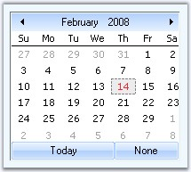 

## Background settings

Background image for the MonthCalendarAdv is specified in [BackgroundImage](https://help.syncfusion.com/cr/windowsforms/Syncfusion.Tools.Windows~Syncfusion.Windows.Forms.Tools.MonthCalendarAdv~BackgroundImage.html) property.





this.monthCalendarAdv1.BackgroundImage = ((System.Drawing.Image)(resources.GetObject("monthCalendarAdv1.BackgroundImage")));

this.monthCalendarAdv1.BackgroundImageLayout = System.Windows.Forms.ImageLayout.Stretch;





Me.monthCalendarAdv1.BackgroundImage = DirectCast((resources.GetObject("monthCalendarAdv1.BackgroundImage")), System.Drawing.Image) 

Me.monthCalendarAdv1.BackgroundImageLayout = System.Windows.Forms.ImageLayout.Stretch 





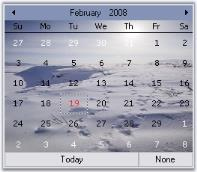

## Visual settings

### Themes for MonthCalendarAdv

Some sections of the MonthCalendarAdv control are themed by default. The below table list the properties which controls the themed behavior border, grid and scroll buttons.

[ThemedBorder](https://help.syncfusion.com/cr/windowsforms/Syncfusion.Tools.Windows~Syncfusion.Windows.Forms.Tools.MonthCalendarAdv~ThemedBorder.html)
[ThemedEnabledGrid](https://help.syncfusion.com/cr/windowsforms/Syncfusion.Tools.Windows~Syncfusion.Windows.Forms.Tools.MonthCalendarAdv~ThemedEnabledGrid.html)
[ThemedEnabledScrollButtons](https://help.syncfusion.com/cr/windowsforms/Syncfusion.Tools.Windows~Syncfusion.Windows.Forms.Tools.MonthCalendarAdv~ThemedEnabledScrollButtons.html)





this.monthCalendarAdv1.ThemedBorder = true;

this.monthCalendarAdv1.ThemedEnabledGrid = true;

this.monthCalendarAdv1.ThemedEnabledScrollButtons = true;





Me.monthCalendarAdv1.ThemedBorder = True

Me.monthCalendarAdv1.ThemedEnabledGrid = True

Me.monthCalendarAdv1.ThemedEnabledScrollButtons = True





### Styles

The MonthCalenderAdv control for Windows Forms Supports for below listed Visual Styles. You can easily modify the look using the [Style](https://help.syncfusion.com/cr/windowsforms/Syncfusion.Tools.Windows~Syncfusion.Windows.Forms.Tools.MonthCalendarAdv~Style.html) property.

The styles are built in for MonthCalenderAdv.

•	Default

•	Office2007

•	Office2007Outlook

•	Office2010

•	Metro

•	Office2016Colorful

•	Office2016DarkGray

•	Office2016Black

•	Office2016White

**Default**

This option helps to set the Default theme.





//Default

this.monthCalendarAdv1.Style = Syncfusion.Windows.Forms.VisualStyle.Default;





'Default

Me.monthCalendarAdv1.VisualStyle = Syncfusion.Windows.Forms.VisualStyle.Default





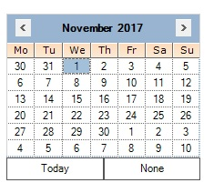 

**Office2007**

This option helps to set the Office2007 theme.





// Office2007

this.monthCalendarAdv1.Style = Syncfusion.Windows.Forms.VisualStyle.Office2007;





'Office2007

Me.monthCalendarAdv1.VisualStyle = Syncfusion.Windows.Forms.VisualStyle.Office2007





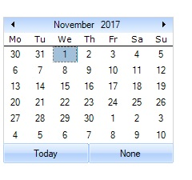 

It also specifies the color schemes for Office 2007 visual styles. They can be Blue, Silver, Black, and Managed.

•	Blue

•	Black

•	Silver

•	Managed

**Blue**

This option helps to set the Office2007 Blue theme.





// Office2007Blue

this.monthCalendarAdv1.Style = Syncfusion.Windows.Forms.VisualStyle.Office2007;
this. monthCalendarAdv1.Office2007Theme = Office2007Theme.Blue;





'Office2007Blue

Me.monthCalendarAdv1.VisualStyle = Syncfusion.Windows.Forms.VisualStyle.Office2007
Me. monthCalendarAdv1.Office2007Theme = Office2007Theme.Blue





 

**Black**

This option helps to set the Office2007 Black theme.





// Office2007Black

this.monthCalendarAdv1.Style = Syncfusion.Windows.Forms.VisualStyle.Office2007;
this. monthCalendarAdv1.Office2007Theme = Office2007Theme.Black;





'Office2007Black

Me.monthCalendarAdv1.VisualStyle = Syncfusion.Windows.Forms.VisualStyle.Office2007
Me. monthCalendarAdv1.Office2007Theme = Office2007Theme.Black





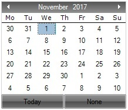 

**Silver**

This option helps to set the Office2007 Silver theme.





// Office2007Silver

this.monthCalendarAdv1.Style = Syncfusion.Windows.Forms.VisualStyle.Office2007;
this. monthCalendarAdv1.Office2007Theme = Office2007Theme.Silver;





'Office2007Silver

Me.monthCalendarAdv1.VisualStyle = Syncfusion.Windows.Forms.VisualStyle.Office2007
Me. monthCalendarAdv1.Office2007Theme = Office2007Theme.Silver





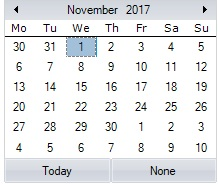 

**Managed**

This option helps to apply the custom colors to the MonthCalendarAdv by setting Office2007Theme to 'Managed' and specifying the custom color through the ApplyManagedColors method as follows.





//Managed

this.monthCalendarAdv2.Style = Syncfusion.Windows.Forms.VisualStyle.Office2007;
this.monthCalendarAdv2.Office2007Theme = Syncfusion.Windows.Forms.Office2007Theme.Managed;
Syncfusion.Windows.Forms.Office2007Colors.ApplyManagedColors(this, Color.Red);





'Managed
Me.monthCalendarAdv2.Style = Syncfusion.Windows.Forms.VisualStyle.Office2010
Me.monthCalendarAdv2.Office2007Theme = Syncfusion.Windows.Forms.Office2007Theme.Managed
Syncfusion.Windows.Forms.Office2007Colors.ApplyManagedColors(Me, Color.Red)





 

**Office2007Outlook**

This option helps to set the Office2007Outlook theme.





// Office2007Outlook

this.monthCalendarAdv2.Style =  Syncfusion.Windows.Forms.VisualStyle.Office2007Outlook;





'Office2007Outlook

Me.monthCalendarAdv1.VisualStyle = Syncfusion.Windows.Forms.VisualStyle.Office2007Outlook





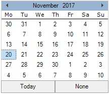 

**Office2010**

This option helps to set the Office2010 theme.





// Office2010

this.monthCalendarAdv1.Style = Syncfusion.Windows.Forms.VisualStyle.Office2010;





'Office2010

Me.monthCalendarAdv1.VisualStyle = Syncfusion.Windows.Forms.VisualStyle.Office2010





 

It also allows to specify the color schemes for Office 2010 visual styles. They can be blue, silver, black and managed.

•	Blue

•	Black

•	Silver

•	Managed

**Blue**

This option helps to set the Office2010 Blue theme.





// Office2010Blue

this.monthCalendarAdv1.Style = Syncfusion.Windows.Forms.VisualStyle.Office2010;
this. monthCalendarAdv1.Office2010Theme = Office2010Theme.Blue;





'Office2010Blue

Me.monthCalendarAdv1.VisualStyle = Syncfusion.Windows.Forms.VisualStyle.Office2010
Me. monthCalendarAdv1.Office2010Theme = Office2010Theme.Blue





 

**Black**

This option helps to set the Office2010 Black theme.





// Office2010Black

this.monthCalendarAdv1.Style = Syncfusion.Windows.Forms.VisualStyle.Office2010;
this. monthCalendarAdv1.Office2010Theme = Syncfusion.Windows.Forms.Office2010Theme.Black;





'Office2007Black

Me.monthCalendarAdv1.VisualStyle = Syncfusion.Windows.Forms.VisualStyle.Office2010
Me.monthCalendarAdv1.Office2010Theme = Syncfusion.Windows.Forms.Office2010Theme.Black





 

**Silver**

This option helps to set the Office2010 Silver theme.





// Office2007Silver
this.monthCalendarAdv1.Style = Syncfusion.Windows.Forms.VisualStyle.Office2010;
this.monthCalendarAdv1.Office2010Theme = Syncfusion.Windows.Forms.Office2010Theme.Silver;





'Office2007Silver
Me.monthCalendarAdv1.VisualStyle = Syncfusion.Windows.Forms.VisualStyle.Office2010
Me.monthCalendarAdv1.Office2010Theme = Syncfusion.Windows.Forms.Office2010Theme.Silver





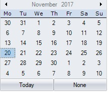 

**Managed**

This option helps to apply the custom colors to the MonthCalendarAdv by setting Office2010Theme to “Managed” and specifying the custom color through the ApplyManagedColors method as follows.





//Managed

this.monthCalendarAdv2.Style = Syncfusion.Windows.Forms.VisualStyle.Office2010;
this.monthCalendarAdv2.Office2010Theme = Syncfusion.Windows.Forms.Office2010Theme.Managed;
Syncfusion.Windows.Forms.Office2010Colors.ApplyManagedColors(this, Color.Red);





'Managed
Me.monthCalendarAdv2.Style = Syncfusion.Windows.Forms.VisualStyle.Office2010
Me.monthCalendarAdv2.Office2010Theme = Syncfusion.Windows.Forms.Office2010Theme.Managed
Syncfusion.Windows.Forms.Office2010Colors.ApplyManagedColors(Me, Color.Red)





**Metro**

This option helps to set the Metro theme.
 




// Metro
this.monthCalendarAdv1.Style = Syncfusion.Windows.Forms.VisualStyle.Metro;





'Metro
Me.monthCalendarAdv1.VisualStyle = Syncfusion.Windows.Forms.VisualStyle.Metro





**Office2016Colorful**

This option helps to set the Office2016Colorful theme.





// office2016Colorful

this.monthCalendarAdv1.Style = Syncfusion.Windows.Forms.VisualStyle.Office2016Colorful;





'office2016Colorful

Me.monthCalendarAdv1.VisualStyle = Syncfusion.Windows.Forms.VisualStyle.Office2016Colorful





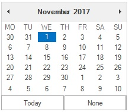

**Office2016DarkGray**

This option helps to set the Office2016DarkGray theme. theme.





//Office2016DarkGray

this.monthCalendarAdv1.Style = Syncfusion.Windows.Forms.VisualStyle.Office2016DarkGray;





'Office2016DarkGray

Me.monthCalendarAdv1.VisualStyle = Syncfusion.Windows.Forms.VisualStyle.Office2016DarkGray





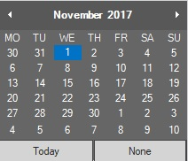

**Office2016Black**

This option helps to set the Office2016Black theme.





// office2016Black

this.monthCalendarAdv1.Style = Syncfusion.Windows.Forms.VisualStyle.Office2016Black;





' office2016Black

Me. monthCalendarAdv1.VisualStyle = Syncfusion.Windows.Forms.VisualStyle.Office2016Black





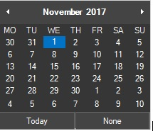

**Office2016White**

This option helps to set the Office2016White theme.





// office2016White

this.monthCalendarAdv1.Style = Syncfusion.Windows.Forms.VisualStyle.Office2016White;





' office2016White

Me. monthCalendarAdv1.VisualStyle = Syncfusion.Windows.Forms.VisualStyle.Office2016White





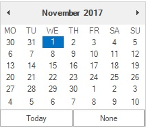

N> Visual styles of the Today and None button can be overridden by [MonthCalendarAdv.TodayButton](https://help.syncfusion.com/cr/windowsforms/Syncfusion.Tools.Windows~Syncfusion.Windows.Forms.Tools.MonthCalendarAdv~TodayButton.html) and [MonthCalendarAdv.NoneButton](https://help.syncfusion.com/cr/windowsforms/Syncfusion.Tools.Windows~Syncfusion.Windows.Forms.Tools.MonthCalendarAdv~NoneButton.html) respectively. See [Scroll Buttons](/windowsforms/monthcalendaradv/customizing-sections-of-calendar#scroll-buttons).

