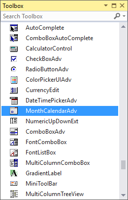
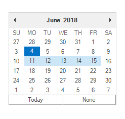
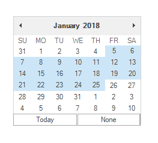

# Getting Started in Windows Forms MonthCalendarAdv(Classic)

This section describes how to add a `MonthCalendarAdv` control in a Windows Forms application and overview of its basic functionalities.

## Assembly deployment

Refer [control dependencies](https://help.syncfusion.com/windowsforms/control-dependencies#monthcalendaradv) section to get the list of assemblies or NuGet package needs to be added as reference to use the control in any application.
 
Please find more details regarding how to install the nuget packages in windows form application in the below link:
 
[How to install nuget packages](https://help.syncfusion.com/windowsforms/installation/install-nuget-packages)

## Creating simple application with MonthCalendarAdv

You can create the Windows Forms application with MonthCalendarAdv control as follows:

1. [Creating project](#creating-the-project)
2. [Adding control via designer](#adding-control-via-designer)
3. [Adding control manually using code](#adding-control-manually-using-code) 
4. [Configure to allow multiple selection](#configure-to-allow-multiple-selection)
5. [Selection Date Range](#selection-date-range)

### Creating the project

Create a new Windows Forms project in the Visual Studio to display the MonthCalendarAdv with basic information.

## Adding control via designer

MonthCalendarAdv control can be added to the application by dragging it from the toolbox and dropping it in a designer view. The following required assembly references will be added automatically:

* Syncfusion.Grid.Base.dll
* Syncfusion.Grid.Windows.dll
* Syncfusion.Shared.Base.dll
* Syncfusion.Shared.Windows.dll
* Syncfusion.Tools.Base.dll
* Syncfusion.Tools.Windows.dll

 

 

## Adding control manually using code

To add control manually in C#, follow the given steps:

Step 1. Add the following required assembly references to the project:

        * Syncfusion.Tools.Base.dll
        * Syncfusion.Tools.Windows.dll
        * Syncfusion.Shared.Base.dll
        * Syncfusion.Shared.Windows.dll
        * Syncfusion.Grid.Base.dll
        * Syncfusion.Grid.Windows.dll

Step 2. Include the namespaces **Syncfusion.Windows.Forms.Tools**.






using Syncfusion.Windows.Forms.Tools;





Imports Syncfusion.Windows.Forms.Tools





{{ codesnippet1 | OrderList_Indent_Level_1 }}

Step 3. Create `MonthCalendarAdv` control instance and add it to the form.






MonthCalendarAdv monthCalendarAdv1 = new MonthCalendarAdv();

this.monthCalendarAdv1.Style = VisualStyle.Office2016Colorful;

this.Controls.Add(monthCalendarAdv1);





Dim monthCalendarAdv1 As MonthCalendarAdv = New MonthCalendarAdv

Me.monthCalendarAdv1.Style = VisualStyle.Office2016Colorful

Me.Controls.Add(monthCalendarAdv1)





{{ codesnippet2 | OrderList_Indent_Level_1 }}

 

## Configure to allow multiple selection

MonthCalendarAdv control allows you to select multiple dates by setting the AllowMultipleSelection property to true.





this.monthCalendarAdv1.AllowMultipleSelection = true;





Me.monthCalendarAdv1.AllowMultipleSelection = True





 

## Date range

 MonthCalenderAdv prevents users from selecting dates within a specified minimum and maximum range. To specify the range, set the start date and end date to `MinValue` and `MaxValue` properties respectively.





this.monthCalendarAdv1.AllowMultipleSelection = true;

this.monthCalendarAdv1.MinValue = new DateTime(2018, 1, 05);

this.monthCalendarAdv1.MaxValue= new DateTime(2018, 1, 25);





Me.monthCalendarAdv1.AllowMultipleSelection = True

Me.monthCalendarAdv1.MinValue = New DateTime(2018, 1, 05)

Me.monthCalendarAdv1.MaxValue= New DateTime(2018, 1, 25)





