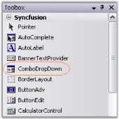
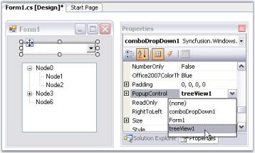

# Getting Started with Windows Forms ComboBox DropDown (ComboDropDown)

In this section, ComboDropDown is used to host TreeView control and this can be achieved in the following ways.

## Through Designer

This section will guide you to create a ComboDropDown control through designer and associate a TreeView control as its popup.

The below steps will guide you with this.

1. Create a new Visual C# application or VB.NET application in Visual Studio .NET. 

    

2. Drag and drop a ComboDropDown control, TreeView control from the toolbox onto the form.

    

3. Add nodes to the TreeView control and set HideSelection property to false. The HideSelection property specifies whether the selected tree node remains highlighted even when the tree view has lost the focus.

    

4. Now set the ComboDropDown's PopupControl property to be the above TreeView instance. 

    

N> We can also include code to set up the interaction between the combo and the treeview control. Refer_ Setting Interaction between ComboDropDown and TreeView.

## Through Code

Drag and drop the TreeView control which will be used in the drop-down portion of ComboDropDown control. 

1. Include the required namespace.





using Syncfusion.Windows.Forms.Tools;





Imports Syncfusion.Windows.Forms.Tools




{{ codesnippet1 | OrderList_Indent_Level_1 }}

2. Create an instance of the ComboDropDown control class.





private Syncfusion.Windows.Forms.Tools.ComboDropDown comboDropDown1;
this.comboDropDown1=new Syncfusion.Windows.Forms.Tools.ComboDropDown();





Private comboDropDown1 As Syncfusion.Windows.Forms.Tools.ComboDropDown
Me.comboDropDown1 = New Syncfusion.Windows.Forms.Tools.ComboDropDown()




{{ codesnippet2 | OrderList_Indent_Level_2 }}

3. Add TreeView in the drop-down portion of ComboDropDown. Finally add ComboDropDown to the Form.





this.comboDropDown1.PopupControl=this.treeView1;
this.Controls.Add(this.comboDropDown1);





Me.comboDropDown1.PopupControl=Me.treeView1
Me.Controls.Add(Me.comboDropDown1)




{{ codesnippet3 | OrderList_Indent_Level_3 }}

N> Refer Setting Interaction between ComboDropDown and TreeView to set the interaction between the ComboDropDown and Treeview.

