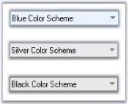

# Themes and Styles in Windows Forms ComboBox DropDown (ComboDropDown)

The below given properties enhances the look and feel of the ComboDropDown.

<table>
<tr>
<th>
ComboDropDown Properties</th><th>
Description</th></tr>
<tr>
<td>
IgnoreThemeBackground</td><td>
Specifies whether the control will ignore the theme's background color and draw the back color instead.</td></tr>
<tr>
<td>
Style</td><td>
Specifies advanced appearance and behavior of the ComboDropDown. The default value is 'Default'. The options are,<ul><li>{{ 'Office2016Colorful,' | markdownify }}</li><li>{{ 'Office2016White,' | markdownify }}</li><li>{{ 'Office2016DarkGray,' | markdownify }}</li><li>{{ 'Office2016Black,' | markdownify }}</li><li>{{ 'Metro,' | markdownify }}</li><li>{{ 'Office2010,' | markdownify }}</li><li>{{ 'Office2007.' | markdownify }}</li><li>{{ 'OfficeXP,' | markdownify }}</li><li>{{ 'Office2003,' | markdownify }}</li><li>{{ 'VS2005 and' | markdownify }}</li><li>{{ 'Default,' | markdownify }}</li></ul></td></tr>
</table>




this.comboDropDown1.IgnoreThemeBackground = true;

//To set Office2016Colorful Visual Style
this.comboDropDown1.Style = Syncfusion.Windows.Forms.VisualStyle.Office2016Colorful;





Me.comboDropDown1.IgnoreThemeBackground = True

'To set Office2016Colorful Visual Style
Me.comboDropDown1.Style = Syncfusion.Windows.Forms.VisualStyle.Office2016Colorful




 

## Office Color Schemes

The ComboDropDown control supports blue, silver and black office colors scheme. It is set using Office2007ColorTheme property. Style property should be set to Office2007.




//To set Blue Color scheme
this.comboDropDown1.Office2007ColorTheme = Syncfusion.Windows.Forms.Office2007Theme.Blue;

//To set Silver Color scheme
this.comboDropDown1.Office2007ColorTheme = Syncfusion.Windows.Forms.Office2007Theme.Silver;

//To set Black Color scheme
this.comboDropDown1.Office2007ColorTheme = Syncfusion.Windows.Forms.Office2007Theme.Black;                





'To set Blue Color scheme
Me.comboDropDown1.Office2007ColorTheme = Syncfusion.Windows.Forms.Office2007Theme.Blue

'To set Silver Color scheme
Me.comboDropDown1.Office2007ColorTheme = Syncfusion.Windows.Forms.Office2007Theme.Silver

'To set Black Color scheme
Me.comboDropDown1.Office2007ColorTheme = Syncfusion.Windows.Forms.Office2007Theme.Black




 

## Custom Colors

We can also apply custom colors to the ComboDropDown control by setting Office2007ColorTheme to "Managed" and specifying the custom color through the ApplyManagedColors method as follows.




this.comboDropDown1.Office2007ColorTheme = Syncfusion.Windows.Forms.Office2007Theme.Managed;
Office2007Colors.ApplyManagedColors(this, Color.Orchid);





Me.comboDropDown1.Office2007ColorTheme = Syncfusion.Windows.Forms.Office2007Theme.Managed;
Office2007Colors.ApplyManagedColors(Me, Color.Orchid)




 