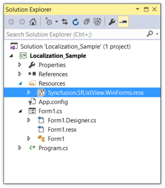
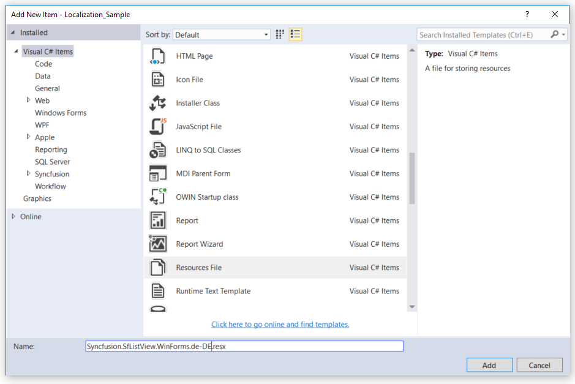
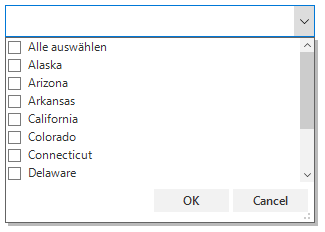
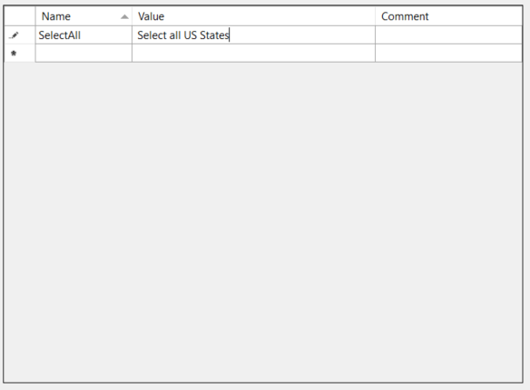
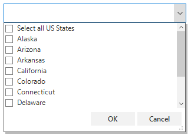
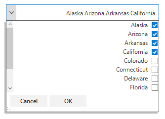

# Localization in Windows Forms ComboBox (SfComboBox)

Localization is a process of translating the application resources into different languages for some specific cultures. The SfComboBox can be localized by adding the `resource` file. Application culture can be changed by setting the `CurrentUICulture` before `InitializeComponent` method.

## Localize at sample level

To localize the SfComboBox based on the `CurrentUICulture` by using the resource files, follow the steps:

1. Create a new folder and name it as Resources in your application.
2. Add the default resource file of the SfListView into Resources folder. You can download the `Syncfusion.SfListView.WinForms.resx` [here](http://www.syncfusion.com/downloads/support/directtrac/general/ze/ResourceFile1283641291).

3. Right click on the Resources folder, select Add then NewItem.
4. In the Add New Item wizard, select the Resource file option and name the filename as Syncfusion.SfListView.WinForms.<culture name>.resx. For example, give name as Syncfusion.SfListView.WinForms.de-DE.resx for German culture.
    

5. The culture name that indicates the name of the language and country.
6. Now, select Add option to add the resource file in Resources folder.

7. Add the Name or Value pair in the Resource Designer of Syncfusion.SfListView.WinForms.de-DE.resx file and change its corresponding value to the corresponding culture.

8. Now, set the `CurrentCulture` of the Application before the `InitializeComponent` method and run the sample.



public Form1()
{
  System.Threading.Thread.CurrentThread.CurrentCulture = new System.Globalization.CultureInfo("de-DE");
  System.Threading.Thread.CurrentThread.CurrentUICulture = new System.Globalization.CultureInfo("de-DE");
  InitializeComponent();
}


Public Sub New()
  System.Threading.Thread.CurrentThread.CurrentCulture = New System.Globalization.CultureInfo("de-DE")
  System.Threading.Thread.CurrentThread.CurrentUICulture = New System.Globalization.CultureInfo("de-DE")
  InitializeComponent()
End Sub



## Editing default resource file

The default resource file can be edited by adding it to the Resources folder of the application where SfComboBox reads the static texts here. The default resource file can be downloaded [here](http://www.syncfusion.com/downloads/support/directtrac/general/ze/ResourceFile1283641291).

Now, change the Name or Value pair in the Resource Designer of `Syncfusion.SfListView.WinForms.resx` file.

Run the sample.

## Localize resource file with different assembly or namespace

By default, the `SfListView` tries to read the resource file from executing assembly and its default namespace by using the Assembly.GetExecuteAssembly method. When the resource file is located at different assembly or namespace, it can be set to the `SfListView` by using the SR.SetResources method.



public Form1()
{
    System.Threading.Thread.CurrentThread.CurrentCulture = new System.Globalization.CultureInfo("de-DE");
    System.Threading.Thread.CurrentThread.CurrentUICulture = new System.Globalization.CultureInfo("de-DE");

    // Set the Custom assembly and namespace for the localization.
    SR.SetResources(typeof(CustomSfListView).Assembly, "SfListViewExt");
    InitializeComponent();
}


Public Sub New()
	System.Threading.Thread.CurrentThread.CurrentCulture = New System.Globalization.CultureInfo("de-DE")
	System.Threading.Thread.CurrentThread.CurrentUICulture = New System.Globalization.CultureInfo("de-DE")

	' Set the Custom assembly and namespace for the localization.
	SR.SetResources(GetType(CustomSfListView).Assembly, "SfListViewExt")
	InitializeComponent()
End Sub



## Right to left 

The SfComboBox control elements can be aligned in right-to-left layout. The control can be laid out from right to left when the `RightToLeft` property is set to `Yes`.



sfComboBox1.RightToLeft = RightToLeft.Yes;


sfComboBox1.RightToLeft = RightToLeft.Yes



