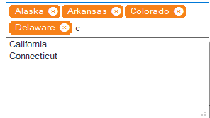

# Token in Windows Forms ComboBox (SfComboBox)

Token represents the selected item(s) in combobox. The selected items are displayed in rounded-polygon shape with close icon. This option also helps to select multiple items without using check box and remove the token at run time. 

The [EnableToken](https://help.syncfusion.com/cr/windowsforms/Syncfusion.WinForms.ListView.SfComboBox.html#Syncfusion_WinForms_ListView_SfComboBox_EnableToken) property determines whether the selected item(s) in the combobox should be displayed as token. And, the [SelectedItems](https://help.syncfusion.com/cr/windowsforms/Syncfusion.WinForms.ListView.SfComboBox.html#Syncfusion_WinForms_ListView_SfComboBox_SelectedItems) property holds the tokens collection.



sfComboBox1.EnableToken = true;


sfComboBox1.EnableToken = True



The important characteristics of the token support are as follows.

{{'**Searching**'| markdownify }}- Items can be searched from the combobox by entering appropriate characters in the text area.

{{'**Adding**'| markdownify }}- When an item is selected from the combobox, the item will be added as token in text area and removed from the drop-down area. 

{{'**Removing**'| markdownify }}- By clicking the remove icon, the appropriate item will be removed from the text area, and it will be added automatically back to the drop-down area.

{{'**AutoSizing**'| markdownify }}- Text area height will be increased automatically based on the placement of the selected items.

## Token appearance

The appearance of token can be customized using the [TokenStyle](https://help.syncfusion.com/cr/windowsforms/Syncfusion.WinForms.ListView.Styles.ComboBoxVisualStyle.html#Syncfusion_WinForms_ListView_Styles_ComboBoxVisualStyle_TokenStyle) property. It includes the background color, border color, foreground color, close button color, and font.



sfComboBox1.Style.TokenStyle.BackColor = Color.Aqua;
sfComboBox1.Style.TokenStyle.BorderColor = Color.Red;
sfComboBox1.Style.TokenStyle.ForeColor = Color.Black;
sfComboBox1.Style.TokenStyle.CloseButtonBackColor = Color.Black;
sfComboBox1.Style.TokenStyle.Font = new Font(“Arial”, 10F, FontStyle.Bold);


sfComboBox1.Style.TokenStyle.BackColor = Color.Aqua
sfComboBox1.Style.TokenStyle.BorderColor = Color.Red
sfComboBox1.Style.TokenStyle.ForeColor = Color.Black
sfComboBox1.Style.TokenStyle.CloseButtonBackColor = Color.Black
sfComboBox1.Style.TokenStyle.Font = New Font(“Arial”, 10F, FontStyle.Bold)



## Keyboard access

* Using the <kbd>Down Arrow</kbd>, <kbd>Up Arrow</kbd>, and <kbd>Enter</kbd> keys, item can be selected from the combobox.
* Using the <kbd>Backspace</kbd> key, the last positioned token will be removed from the text area.
* When the <kbd>Esc</kbd> key is pressed, the drop-down area will be closed if it has been opened already. 
