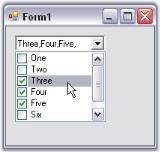

# Event Handling

## Selection Events

The ComboBoxBase fires different events for the different user interaction scenarios. The occurrence and order of the events are tabulated below.

<table>
<tr>
<th>
Scenarios</th><th>
SelectionChangedCommitted</th><th>
SelectedValueChanged</th><th>
SelectedIndexChanged</th><th>
Validating/Validated</th></tr>
<tr>
<td>
TextArea-Change Selection by Keys</td><td>
Yes:1</td><td>
Yes:2</td><td>
Yes:3</td><td>
No</td></tr>
<tr>
<td>
TextArea-On AutoComplete</td><td>
No</td><td>
No</td><td>
No</td><td>
No</td></tr>
<tr>
<td>
Drop-Down List-Change Selection by Keys</td><td>
No</td><td>
Yes:1</td><td>
Yes:2</td><td>
No</td></tr>
<tr>
<td>
Drop-Down List-Change Selection by Mouse Move</td><td>
No</td><td>
No</td><td>
No</td><td>
No</td></tr>
<tr>
<td>
Drop-Down Close by Enter Key</td><td>
Yes:1</td><td>
No</td><td>
No</td><td>
No</td></tr>
<tr>
<td>
Drop-Down Close by Escape Key</td><td>
No</td><td>
No</td><td>
No</td><td>
No</td></tr>
<tr>
<td>
Drop-Down Close by Click</td><td>
Yes:1</td><td>
Yes:2</td><td>
Yes:3</td><td>
No</td></tr>
<tr>
<td>
Losing Focus</td><td>
Yes:2 (in DropDownStyle.DropDown (editable) mode only)</td><td>
No</td><td>
No</td><td>
Yes:1</td></tr>
<tr>
<td>
Changing Text Property in Code</td><td>
Yes:1</td><td>
No</td><td>
No</td><td>
No</td></tr>
</table>

## DropDownCloseOnClick Event

This section deals with associating a CheckedListBox and handling the events. After the dropdown had closed, the checked items will be displayed on the dropdown text area. The steps are as follows.

1. Create a CheckedListBox and populate it.

    

2. Associate it with the ComboBoxBase control.

    

3. To avoid the closing of dropdown when we are in checking the items, handle the DropDownCloseOnClick event and set args.Cancel=true.




// Avoids the closing of dropdown.
private void comboBoxBase1_DropDownCloseOnClick(object sender, Syncfusion.Windows.Forms.Tools.MouseClickCancelEventArgs args) 
{
	args.Cancel=true;
}





' Avoids the closing of dropdown.
Private  Sub comboBoxBase1_DropDownCloseOnClick(ByVal sender As Object, ByVal args As Syncfusion.Windows.Forms.Tools.MouseClickCancelEventArgs)
	args.Cancel=True
End Sub




4. Handle SelectedIndexChanged event of the CheckedListBox and add the following code.




// Sets the corresponding selected text in the ComboBoxBase TextBox.
private void checkedListBox1_SelectedIndexChanged(object sender, System.EventArgs e) 
{
	comboBoxBase1.TextBox.Text="";
	foreach(object s in checkedListBox1.CheckedItems ) 
	comboBoxBase1.TextBox.Text  += s.ToString();
}




        
' Sets the corresponding selected text in the ComboBoxBase TextBox.
Private  Sub checkedListBox1_SelectedIndexChanged(ByVal sender As Object, ByVal e As System.EventArgs)
comboBoxBase1.TextBox.Text=""
Dim s As Object
For Each s In checkedListBox1.CheckedItems
comboBoxBase1.TextBox.Text  += s.ToString()
Next
End Sub




 

## DropDown Event

In order to place ComboBoxBase within a PopupControlContainer, derive from our PopupControlContainer, override the OnPopup method and set the focus to the derived control. This ensures that the derived PopupControlContainer does not lose focus and close prematurely.




// Derive from PopupControlContainer.
public class CustomPopupControlContainer : Syncfusion.Windows.Forms.PopupControlContainer
{
    public CustomPopupControlContainer()
    {
    }
    public CustomPopupControlContainer(IContainer container):this()
    {
        container.Add(this);
    }
    protected override void OnPopup(EventArgs args)
    {

 // Sets focus to the derived control.
    base.OnPopup(args);
    this.Focus();
    }
}





' Derive from PopupControlContainer.
Public Class CustomPopupControlContainer Inherits Syncfusion.Windows.Forms.PopupControlContainer
Public Sub New()
End Sub
Public Sub New(ByVal container As IContainer) : Me()
container.Add(Me)
End Sub

' Sets focus to the derived control.
Protected Overrides Sub OnPopup(ByVal args As EventArgs)
MyBase.OnPopup(args)
Me.Focus()
End Sub
End Class




Here the specification of the parent-child relationship between the ComboBoxBase's popup and the PopupControlContainer is explained with the help of coding.



private void comboBoxBase1_DropDown(object sender, System.EventArgs e)
{
    /* Setup the relationship between the ComboBoxBase's dropdown and it's parent PopupControlContainer, so that the popup will not close when the ComboBoxBase’s dropdown is shown */
    this.comboBoxBase1.PopupContainer.PopupParent = this.popupControlContainer1;
    this.popupControlContainer1.CurrentPopupChild = this.comboBoxBase1.PopupContainer;
}




Private Sub comboBoxBase1_DropDown(ByVal sender As Object, ByVal e As System.EventArgs)

'Setup the relationship between the ComboBoxBase's dropdown and it's parent PopupControlContainer, so that the popup will not close when the ComboBoxBase’s  dropdown is shown
Me.comboBoxBase1.PopupContainer.PopupParent = Me.popupControlContainer1
Me.popupControlContainer1.CurrentPopupChild = Me.comboBoxBase1.PopupContainer
End Sub



