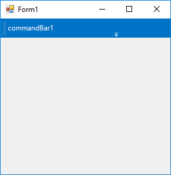
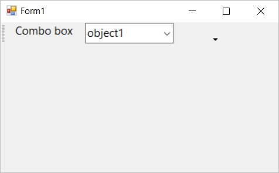

# Getting started

This section provides a quick overview to work with the command bar control in WinForms.

>**Important**
Starting with v16.2.0.x, if you refer to Syncfusion assemblies from trial setup or from the NuGet feed, include a license key in your projects. Refer to this [link](https://help.syncfusion.com/common/essential-studio/licensing/license-key) to learn about registering Syncfusion license key in your Windows Forms application to use our components.

This section describes how to add [CommandBar](https://help.syncfusion.com/cr/cref_files/windowsforms/Syncfusion.Tools.Windows~Syncfusion.Windows.Forms.Tools.CommandBar.html) control in a Windows Forms application and overview of its basic functionalities.

## Assembly deployment

Refer [control dependencies](https://help.syncfusion.com/windowsforms/control-dependencies#commandbarcontroller) section to get the list of assemblies or NuGet package needs to be added as reference to use the control in any application. Please find more details regarding [installation of nuget packages](https://help.syncfusion.com/windowsforms/nuget-packages) in windows form application.

## Creating application with command bar

You can create the Windows Forms application with CommandBar control as follows:

1. [Adding command bar via designer](#adding-command-bar-via-designer)
2. [Adding command bar via code](#adding-command-bar-via-code)

### Adding control via designer

The [CommandBarController](https://help.syncfusion.com/cr/cref_files/windowsforms/Syncfusion.Tools.Windows~Syncfusion.Windows.Forms.Tools.CommandBarController.html) can be added to the application by dragging it from the toolbox and dropping it to the designer view. The following required assembly references will be added automatically.

* Syncfusion.Grid.Base.dll
* Syncfusion.Grid.Windows.dll
* Syncfusion.Shared.Base.dll
* Syncfusion.Shared.Windows.dll
* Syncfusion.Tools.Base.dll
* Syncfusion.Tools.Windows.dll
* Syncfusion.Licensing.dll
* Syncfusion.SpellChecked.Base.dll

#### **Adding command bar**

Command bar can be added to the command bar controller by selecting the `Add CommandBar` from the smart tag option.

### Adding control via code

To add command bar in C#, follow the given steps:

**Step 1** - Add the following required assembly references to the project:

* Syncfusion.Grid.Base.dll
* Syncfusion.Grid.Windows.dll
* Syncfusion.Shared.Base.dll
* Syncfusion.Shared.Windows.dll
* Syncfusion.Tools.Base.dll
* Syncfusion.Tools.Windows.dll
* Syncfusion.Licensing.dll
* Syncfusion.SpellChecked.Base.dll

**Step 2** - Include the namespace **Syncfusion.Windows.Forms.Tools**





using Syncfusion.Windows.Forms.Tools;





Imports Syncfusion.Windows.Forms.Tools





**Step 3** - Create a [CommandBarController](https://help.syncfusion.com/cr/cref_files/windowsforms/Syncfusion.Tools.Windows~Syncfusion.Windows.Forms.Tools.CommandBarController.html) instance and set the [HostForm](https://help.syncfusion.com/cr/cref_files/windowsforms/Syncfusion.Tools.Windows~Syncfusion.Windows.Forms.Tools.CommandBarController~HostForm.html) property to be the current form.





CommandBarController commandBarController1 = new CommandBarController();

this.commandBarController1.Style = VisualStyle.Office2016Colorful;

this.commandBarController1.HostForm = this;





Dim commandBarController1 As CommandBarController = New CommandBarController()

Me.commandBarController1.Style = VisualStyle.Office2016Colorful

Me.commandBarController1.HostForm = Me;





#### **Adding command bar**

Create an instance of [CommandBar](https://help.syncfusion.com/cr/cref_files/windowsforms/Syncfusion.Tools.Windows~Syncfusion.Windows.Forms.Tools.CommandBar.html) and add it to the [CommandBars](https://help.syncfusion.com/cr/cref_files/windowsforms/Syncfusion.Tools.Windows~Syncfusion.Windows.Forms.Tools.CommandBarController~CommandBars.html) collection property of commandbar controller instance. The below code shows a command bar is being added to the commandbar controller.





CommandBar commandBar1 = new CommandBar();

this.commandBar1.Text = "commandBar1";

this.commandBarController1.CommandBars.Add(this.commandBar1);





Dim commandBar1 As CommandBar = New CommandBar()

this.commandBar1.Text = "commandBar1";

this.commandBarController1.CommandBars.Add(this.commandBar1);





N> You can find the detailed description of various themes applicable to command bar in [this topic](https://help.syncfusion.com/windowsforms/commandbar/theming)

## Child controls

Command bar acts as a container control to host the required control in the tool bar. In this topic the child controls hosted via command bar is discussed.

## Adding single control

The controls with single-line visual structure like combo box, text box and button can be added directtly to the command bar instance. This can be done via adding the required control vai the `Controls` property of the command bar. In the below code snippet a text box control with key properties defined is being added to the command bar.





this.commandBar1.Controls.Add(this.textBox1);





Me.commandBar1.Controls.Add(Me.textBox1)





## Adding multiple controls

Im order to host more than one control with better alignment and avoid overlapping, a continer control like `Panel` can be used. In the below code snippet, a combo box is added along with a label control.





Panel panel1 = new Panel();
panel1.Dock = DockStyle.Fill;

Label lable1 = new Label();
lable1.Text = "Combo box text";
lable1.TextAlign = ContentAlignment.MiddleCenter;

ComboBox combobox1 = new ComboBox();
combobox1.Location = new Point(lable1.Width + 5, lable1.Location.Y);
combobox1.Items.AddRange(new string[] { "object1", "object2", "object3", "object4", "object5", });
combobox1.SelectedIndex = 0;
panel1.Controls.Add(lable1);
panel1.Controls.Add(combobox1);

this.commandBar1.Controls.Add(panel1);





Dim panel1 As New Panel()
panel1.Dock = DockStyle.Fill

Dim lable1 As New Label()
lable1.Text = "Combo box text"
lable1.TextAlign = ContentAlignment.MiddleCenter

Dim combobox1 As New ComboBox()
combobox1.Location = New Point(lable1.Width + 5, lable1.Location.Y)
combobox1.Items.AddRange(New String() { "object1", "object2", "object3", "object4", "object5" })
combobox1.SelectedIndex = 0
panel1.Controls.Add(lable1)
panel1.Controls.Add(combobox1)

Me.commandBar1.Controls.Add(panel1)





## Adding menu items

Menu items could be added to the command bar only via the [`XpToolBar`](https://help.syncfusion.com/cr/cref_files/windowsforms/Syncfusion.Tools.Windows~Syncfusion.Windows.Forms.Tools.XPMenus.XPToolBar.html) control. Refer [this topic](https://help.syncfusion.com/windowsforms/hosting-controls#integrating-xp-toolbar)