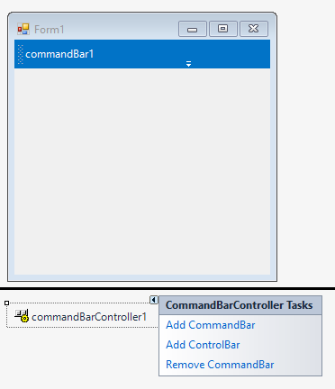

# Getting started

This section describes how to add [CommandBars](https://help.syncfusion.com/cr/cref_files/windowsforms/tools/Syncfusion.Tools.Windows~Syncfusion.Windows.Forms.Tools.CommandBar.html) control in a Windows Forms application and overview of its basic functionalities.

## Assembly deployment

The following list of assemblies should be added as reference to use the [CommandBars](https://help.syncfusion.com/cr/cref_files/windowsforms/tools/Syncfusion.Tools.Windows~Syncfusion.Windows.Forms.Tools.CommandBar.html) in any application:

<table>
<tr>
<td>
{{'**Required assemblies**'| markdownify }}
</td>
<td>
{{'**Description**'| markdownify }}
</td>
</tr>
<tr>
<td>
Syncfusion.Grid.Base.dll
</td>
<td>
Syncfusion.Grid.Base contains classes that contains fundamentals and base classes of GridControl.
</td>
</tr>
<tr>
<td>
Syncfusion.Grid.Windows.dll
</td>
<td>
Syncfusion.Grid.Windows contains classes that handles all UI operations, fundamentals and base classes of GridControl which are used in the CommandBars control.
</td>
</tr>
<tr>
<td>
Syncfusion.Shared.Base.dll
</td>
<td>
Syncfusion.Shared.Base contains style related properties of CommandBars and various editor controls.
</td>
</tr>
<tr>
<td>
Syncfusion.Shared.Windows.dll
</td>
<td>
Syncfusion.Shared.Windows contains style related properties of CommandBars and various editor controls.
</td>
</tr>
<tr>
<td>
Syncfusion.Tools.Base.dll
</td>
<td>
Syncfusion.Tools.Base contains base class which used for CommandBars control.
</td>
</tr>
<tr>
<td>
Syncfusion.Tools.Windows.dll
</td>
<td>
Syncfusion.Tools.Windows contains the class that handles all UI operations and contains helper class of CommandBars control.
</td>
</tr>
</table>

## Installing NuGet Packages

To use [CommandBars](https://help.syncfusion.com/cr/cref_files/windowsforms/tools/Syncfusion.Tools.Windows~Syncfusion.Windows.Forms.Tools.CommandBar.html) control in Windows Forms application via nuget, the following packages should be installed.
 
<table>
<tr>
<td>{{'**S.No**'| markdownify }}
</td>
<td>{{'**Framework version**'| markdownify }}
</td>
<td>{{'**NuGet Packages**'| markdownify }}
</td>
</tr>
<tr>
<td> 1
</td>
<td> 2.0
</td>
<td> Syncfusion.Tools.Windows20
</td>
</tr>
<tr>
<td> 2
</td>
<td> 3.5
</td>
<td> Syncfusion.Tools.Windows35
</td>
</tr>
<tr>
<td> 3
</td>
<td> 4.0
</td>
<td> Syncfusion.Tools.Windows40
</td>
</tr>
<tr>
<td> 4
</td>
<td> 4.5
</td>
<td> Syncfusion.Tools.Windows45
</td>
</tr>
<tr>
<td> 5
</td>
<td> 4.5.1
</td>
<td>Syncfusion.Tools.Windows451
</td>
</tr>
<tr>
<td> 6
</td>
<td> 4.6
</td>
<td>Syncfusion.Tools.Windows46
</td>
</tr>
</table>
 
Please find more details regarding how to install the nuget packages in windows form application in the below link:
 
[How to install nuget packages](https://help.syncfusion.com/windowsforms/nuget-packages)

# Creating simple application with CommandBars

You can create the Windows Forms application with [CommandBars](https://help.syncfusion.com/cr/cref_files/windowsforms/tools/Syncfusion.Tools.Windows~Syncfusion.Windows.Forms.Tools.CommandBar.html) control as follows:

1. [Creating project](#creating-the-project)
2. [Adding control via Form Designer](#adding-control-via-Form-designer)
3. [Adding control manually using code](#adding-control-manually-using-code)

### Creating the project

Create a new Windows Forms project in the Visual Studio to display the CommandBars with functionalities.

## Adding control via Form designer

The [CommandBarController](https://help.syncfusion.com/cr/cref_files/windowsforms/tools/Syncfusion.Tools.Windows~Syncfusion.Windows.Forms.Tools.CommandBarController.html) can be added to the application by dragging it from the toolbox and dropping it in a designer view. The following required assembly references will be added automatically:

* Syncfusion.Grid.Base.dll
* Syncfusion.Grid.Windows.dll
* Syncfusion.Shared.Base.dll
* Syncfusion.Shared.Windows.dll
* Syncfusion.Tools.Base.dll
* Syncfusion.Tools.Windows.dll

**Adding CommandBars into CommandBarController**

[CommandBars](https://help.syncfusion.com/cr/cref_files/windowsforms/tools/Syncfusion.Tools.Windows~Syncfusion.Windows.Forms.Tools.CommandBar.html) can be added to [CommandBarController](https://help.syncfusion.com/cr/cref_files/windowsforms/tools/Syncfusion.Tools.Windows~Syncfusion.Windows.Forms.Tools.CommandBarController.html) by clicking on `Add CommandBars` from Smart Tags.

**Adding XPToolbar into CommandBar** 

The [XPToolbar](https://help.syncfusion.com/cr/cref_files/windowsforms/tools/Syncfusion.Tools.Windows~Syncfusion.Windows.Forms.Tools.XPMenus.XPToolBar.html) can be added to the application by dragging it from the toolbox and dropping into CommandBar. XPToolBar items can be added it through [Items](https://help.syncfusion.com/cr/cref_files/windowsforms/tools/Syncfusion.Tools.Windows~Syncfusion.Windows.Forms.Tools.XPMenus.XPToolBar~Items.html) collection form SmartTags.

## Adding control manually using code

To add control manually in C#, follow the given steps:

**Step 1** - Add the following required assembly references to the project:

* Syncfusion.Grid.Base.dll
* Syncfusion.Grid.Windows.dll
* Syncfusion.Shared.Base.dll
* Syncfusion.Shared.Windows.dll
* Syncfusion.Tools.Base.dll
* Syncfusion.Tools.Windows.dll

**Step 2** - Include the namespaces **Syncfusion.Tools.Windows**.





using Syncfusion.Tools.Windows;





Imports Syncfusion.Tools.Windows



 

**Step 3** - Create `CommandBarController` control instance and set the [HostForm](https://help.syncfusion.com/cr/cref_files/windowsforms/tools/Syncfusion.Tools.Windows~Syncfusion.Windows.Forms.Tools.CommandBarController~HostForm.html) property to be current Form.





CommandBarController commandBarController1 = new CommandBarController();

this.commandBarController1.Style = VisualStyle.Office2016Colorful;

this.commandBarController1.HostForm = this;





Dim commandBarController1 As CommandBarController = New CommandBarController()

Me.commandBarController1.Style = VisualStyle.Office2016Colorful

Me.commandBarController1.HostForm = Me;





**Adding CommandBar into CommandBarController**

Create an instance of [CommandBar](https://help.syncfusion.com/cr/cref_files/windowsforms/tools/Syncfusion.Tools.Windows~Syncfusion.Windows.Forms.Tools.CommandBar.html) .





CommandBar commandBar1 = new CommandBar();

this.commandBar1.Text = "commandBar1";

this.commandBarController1.CommandBars.Add(this.commandBar1);





Dim commandBar1 As CommandBar = New CommandBar()

this.commandBar1.Text = "commandBar1";

this.commandBarController1.CommandBars.Add(this.commandBar1);





**Adding XPToolbar into CommandBar** 

To add XPToolbar into CommandBar, Create an instance of [XPToolbar](https://help.syncfusion.com/cr/cref_files/windowsforms/tools/Syncfusion.Tools.Windows~Syncfusion.Windows.Forms.Tools.XPMenus.XPToolBar.html) and add it CommandBar.




// Create an instance of XPToolbar

XPToolBar xpToolBar1 = new XPToolBar();

// Create instance of XPToolbar items
ParentBarItem parentBarItem1 = new ParentBarItem();
StaticBarItem staticBarItem1 = new StaticBarItem();
TextBoxBarItem textBoxBarItem1 = new TextBoxBarItem();

this.xpToolBar1.Style = Syncfusion.Windows.Forms.VisualStyle.Office2016Colorful;

this.parentBarItem1.Text = "File";

this.staticBarItem1.Text = "Search";

// Add items to XPToolbar

 this.xpToolBar1.Bar.Items.AddRange(new Syncfusion.Windows.Forms.Tools.XPMenus.BarItem[] {
            this.parentBarItem1,
            this.staticBarItem1,
            this.textBoxBarItem1});

// Add XPToolBar into CommandBar
this.commandBar1.Controls.Add(this.xpToolBar1);





' Create an instance of XPToolbar

Dim xpToolBar1 As New XPToolBar()

' Create instance of XPToolbar items
Dim parentBarItem1 As New ParentBarItem()
Dim staticBarItem1 As New StaticBarItem()
Dim textBoxBarItem1 As New TextBoxBarItem()

Me.xpToolBar1.Style = Syncfusion.Windows.Forms.VisualStyle.Office2016Colorful

Me.parentBarItem1.Text = "File"

Me.staticBarItem1.Text = "Search"

' Add items to XPToolbar

 Me.xpToolBar1.Bar.Items.AddRange(New Syncfusion.Windows.Forms.Tools.XPMenus.BarItem() { Me.parentBarItem1, Me.staticBarItem1, Me.textBoxBarItem1})

' Add XPToolBar into CommandBar
Me.commandBar1.Controls.Add(Me.xpToolBar1)





