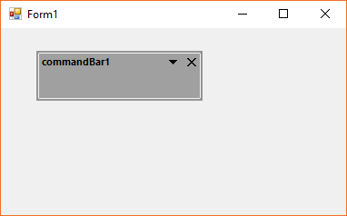
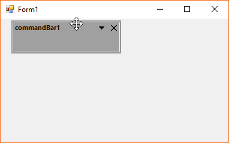
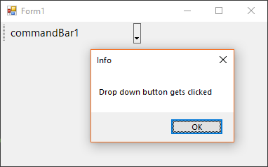

# Interactive features

In this section, the interactive features of the command bar is discussed.

## Floating command bar

The command bar can be made to float state dynamically. By default, the float mode is enabled and set to `true`. This can be disabled via the [`DisableFloating`](https://help.syncfusion.com/cr/cref_files/windowsforms/Syncfusion.Tools.Windows~Syncfusion.Windows.Forms.Tools.CommandBar~DisableFloating.html) property. The below code snippet shows the float mode is being disabled.





this.commandBar1.DisableFloating = true;





Me.commandBar1.DisableFloating = True





The float state of the command bar can be retrieved from the [Floating](https://help.syncfusion.com/cr/cref_files/windowsforms/Syncfusion.Tools.Windows~Syncfusion.Windows.Forms.Tools.CommandBar~Floating.html) property.

The contents of the float mode can be made to wrap via the [FloatModeWrapping](https://help.syncfusion.com/cr/cref_files/windowsforms/Syncfusion.Tools.Windows~Syncfusion.Windows.Forms.Tools.CommandBar~FloatModeWrapping.html) property. The below code snippet shows the wrapping is being enabled in float state command bar.





this.commandBar1.FloatModeWrapping = true;





Me.commandBar1.FloatModeWrapping = True





## Docking command bar

The command bar can be docked to any side of the form. In this the dock mode of the command bar is discussed.

### Enabling docking

By default, the docking is enabled vis the [`DisableDocking`](https://help.syncfusion.com/cr/cref_files/windowsforms/Syncfusion.Tools.Windows~Syncfusion.Windows.Forms.Tools.CommandBar~DisableDocking.html) property. The below code snippet shows the docking of the command bar is being disabled and it gets rendered to float mode automatically.





this.commandBar1.DisableDocking = true;





Me.commandBar1.DisableDocking = True





### Dock types

By default, the command bar is docked to `Top` of the form. The below listed are the applicable dock types in command bar.

* Top
* Right
* Bottom
* Left

The below code snippet shows the command bar is being docked to the bottom.





this.commandBar1.DockState = Syncfusion.Windows.Forms.Tools.CommandBarDockState.Bottom;





Me.commandBar1.DockState = Syncfusion.Windows.Forms.Tools.CommandBarDockState.Bottom





### Enabling docked borders

The dock state of the command bar can be restricted to any of the four sides of the form via the [`AllowedDockBorders`](https://help.syncfusion.com/cr/cref_files/windowsforms/Syncfusion.Tools.Windows~Syncfusion.Windows.Forms.Tools.CommandBar~AllowedDockBorders.html) property. The below code snippet shows the dock style is being restricted only to the left side, whereas to the other sides, the command bar appears as float state.





this.commandBar1.AllowedDockBorders = Syncfusion.Windows.Forms.Tools.CommandBarDockBorder.Left;





Me.commandBar1.AllowedDockBorders = Syncfusion.Windows.Forms.Tools.CommandBarDockBorder.Left





## Events

The following are the public events applicable in command bar that occurs for the specified action.

### Drop down clicked event

When the drop down button gets clicked, the [`CommandBarDropDownClicked`](https://help.syncfusion.com/cr/cref_files/windowsforms/Syncfusion.Tools.Windows~Syncfusion.Windows.Forms.Tools.CommandBar~CommandBarDropDownClicked_EV.html) event occurs. The below code snippet shows the subscription to the event and the event handler.





this.commandBar1.CommandBarDropDownClicked += CommandBar1_CommandBarDropDownClicked;

private void CommandBar1_CommandBarDropDownClicked(object sender, EventArgs e)
{
    MessageBox.Show("Drop down button gets clicked", "Info");
}





Private Me.commandBar1.CommandBarDropDownClicked += AddressOf CommandBar1_CommandBarDropDownClicked

Private Sub CommandBar1_CommandBarDropDownClicked(ByVal sender As Object, ByVal e As EventArgs)
    MessageBox.Show("Drop down button gets clicked", "Info")
End Sub





### Command bar state changing event

The [`CommandBarStateChanging`](https://help.syncfusion.com/cr/cref_files/windowsforms/Syncfusion.Tools.Windows~Syncfusion.Windows.Forms.Tools.CommandBar~CommandBarStateChanging_EV.html) event gets occur when toggling between the float / dock state of the command bar. The **CommandBarStateChangingEventArgs** returns the event data with the following properties.

* Cancel - Gets or sets a value indicating whether the event is being handled or not.
* NewDockState - Gets or sets the value of the new dock style.

The following code snippet shows the subscription of command bar state changing event handler.





this.commandBar1.CommandBarStateChanging += CommandBar1_CommandBarStateChanging;

private void CommandBar1_CommandBarStateChanging(object obj, Syncfusion.Windows.Forms.Tools.CommandBarStateChangingEventArgs arg)
{
    Console.WriteLine("The new dock state is " + arg.NewDockState);
}





Private Me.commandBar1.CommandBarStateChanging += AddressOf CommandBar1_CommandBarStateChanging

Private Sub CommandBar1_CommandBarStateChanging(ByVal obj As Object, ByVal arg As Syncfusion.Windows.Forms.Tools.CommandBarStateChangingEventArgs)
    Console.WriteLine("The new dock state is " & arg.NewDockState)
End Sub





### Command bar state changed event

The [CommandBarStateChanged](https://help.syncfusion.com/cr/cref_files/windowsforms/Syncfusion.Tools.Windows~Syncfusion.Windows.Forms.Tools.CommandBar~CommandBarStateChanged_EV.html) event occurs when the command bar state gets toggled successfully. The below code snippet shows the command bar state changed event subscription and the event handler.





this.commandBar1.CommandBarStateChanged += CommandBar1_CommandBarStateChanged;

private void CommandBar1_CommandBarStateChanged(object sender, EventArgs e)
{
    Console.WriteLine("The command bar state changed");
}





Private Me.commandBar1.CommandBarStateChanged += AddressOf CommandBar1_CommandBarStateChanged

Private Sub CommandBar1_CommandBarStateChanged(ByVal sender As Object, ByVal e As EventArgs)
    Console.WriteLine("The command bar state changed")
End Sub





## Command bar user closed event

The [`CommandBarUserClosed`](https://help.syncfusion.com/cr/cref_files/windowsforms/Syncfusion.Tools.Windows~Syncfusion.Windows.Forms.Tools.CommandBar~CommandBarUserClosed_EV.html) event occurs when the user clicked the close button of the command bar when it is float state. The below code snippet shows the event subscription and the event handler.





this.commandBar1.CommandBarUserClosed += CommandBar1_CommandBarUserClosed;

private void CommandBar1_CommandBarUserClosed(object sender, EventArgs e)
{
    Console.WriteLine("The command bar close button gets clicked");
}





Private Me.commandBar1.CommandBarUserClosed += AddressOf CommandBar1_CommandBarUserClosed

Private Sub CommandBar1_CommandBarUserClosed(ByVal sender As Object, ByVal e As EventArgs)
    Console.WriteLine("The command bar close button gets clicked")
End Sub





## Command bar wrapping event

The [`CommandBarWrapping`](https://help.syncfusion.com/cr/cref_files/windowsforms/Syncfusion.Tools.Windows~Syncfusion.Windows.Forms.Tools.CommandBar~CommandBarWrapping_EV.html) event occurs when the position of the command bar is being wrapped to new row of the docked borders. The **CommandBarWrappingEventArgs** returns the event data with the following properties.

* CommandBarResizeType - Gets or sets the new resize position of the command bar.
* ClientSize - Gets or sets the updated size of the resized command bar.





this.commandBar1.CommandBarWrapping += CommandBar1_CommandBarWrapping;

private void CommandBar1_CommandBarWrapping(object obj, Syncfusion.Windows.Forms.Tools.CommandBarWrappingEventArgs arg)
{
    Console.WriteLine("Command bar resize type = " + arg.CommandBarResizeType);
}





Private Me.commandBar1.CommandBarUserClosed += AddressOf CommandBar1_CommandBarUserClosed

Private Me.commandBar1.CommandBarWrapping += AddressOf CommandBar1_CommandBarWrapping

Private Sub CommandBar1_CommandBarWrapping(ByVal obj As Object, ByVal arg As Syncfusion.Windows.Forms.Tools.CommandBarWrappingEventArgs)
    Console.WriteLine("Command bar resize type = " & arg.CommandBarResizeType)
End Sub



