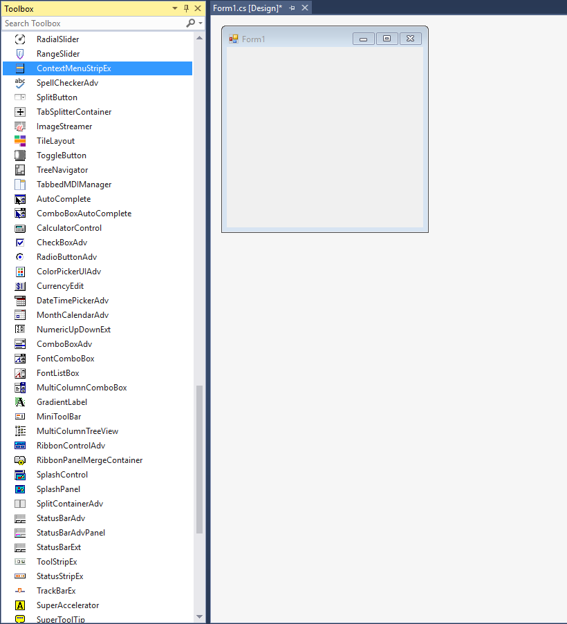
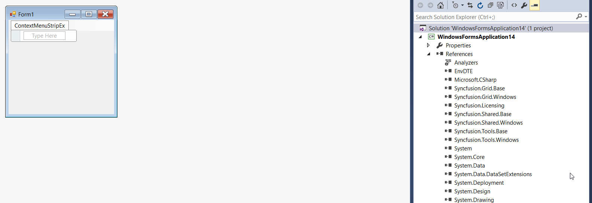
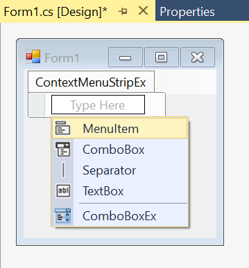
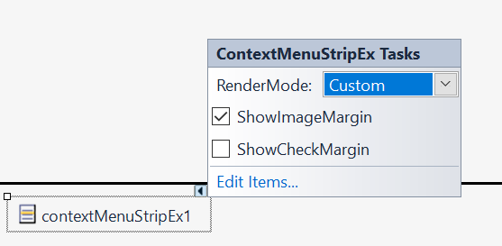
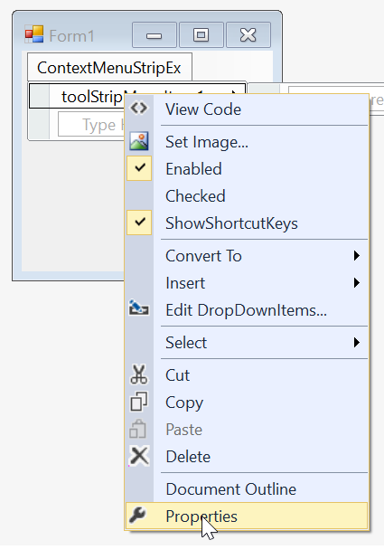
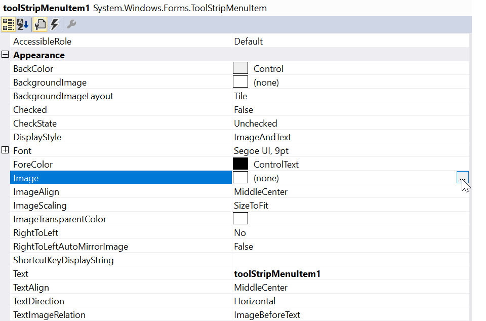
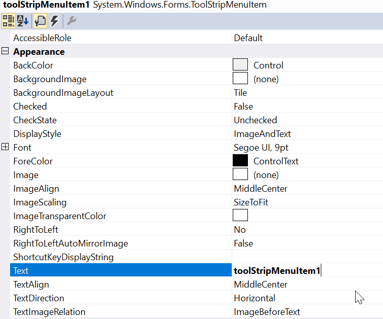
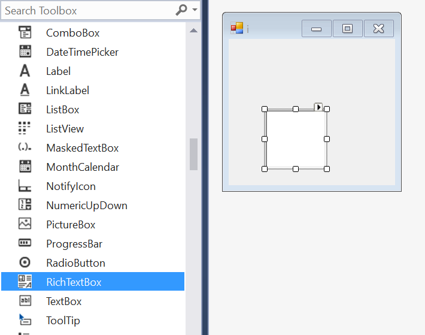
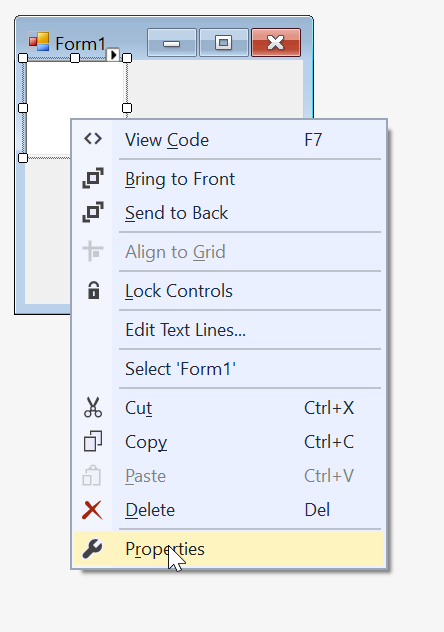

# Getting Started in Windows Forms ContextMenuStrip (ContextMenuStripEx)

>**Important**
Starting with v16.2.0.x, if you refer to Syncfusion assemblies from trial setup or from the NuGet feed, include a license key in your projects. Refer to this [link](https://help.syncfusion.com/common/essential-studio/licensing/license-key) to learn about registering Syncfusion license key in your Windows Forms application to use our components.

This section provides a quick overview for working with the **ContextMenuStripEx** control in a WinForms application.

## Dependent Assemblies

The following assemblies needs to be added as reference to use the control in any application.

* Syncfusion.Tools.Windows
* Syncfusion.Grid.Base
* Syncfusion.Grid.Windows
* Syncfusion.Shared.Base
* Syncfusion.Shared.Windows
* Syncfusion.Tools.Base

## Adding a context menu through designer

The ContextMenuStripEx control can be added through designer by following the below steps.

1. Drag and drop the ContextMenuStripEx control from the toolbox (under the section "Syncfusion Windows **Visual Studio Version** Toolbox **Essential Studio Version**") into the designer page.

   

2. Now the ContextMenuStripEx control will be successfully added into the application along with the required dependent assemblies.

   

3. Click **Type Here** for adding the items. On clicking, it will display different type of ToolStripItems, using this user can add the items as per their need.

   

4. Items can also be added by choosing **Edit Items** under **Property** option and then select the ToolStripItems from the **Items Collection Editor**.

   

   

5. Once item is added, we can set the image by right-clicking on the particular item in the designer and select **Properties**. Now, in the **Properties** panel, under **Appearance > Image** we need to browse the respective image.

   

   

6. Similarly, we can set the text for menu item in the **Properties** panel, under **Appearance > Text** section.

   

7. To associate the context menu to a control we need to drag and drop any control of your choice to the application. In this illustration, we have used "RichTextBox".

   >**NOTE**:
   To associate the ContextMenuStripEx control, you can choose any type of control like RichTextBox, Button, Label, TextBox, MaskedTextBox etc...

   

8. **Right-click** on the RichTextBox control in the designer and select **Properties**. Now, in the **Properties** panel, under **Behavior > ContextMenuStrip** we need to assign the respective context menu.

   

   

9. Finally, we have populated the ContextMenuStripEx control successfully.

            

## Adding a context menu through code

The ContextMenuStripEx control can be added through code by following the below steps.

1. Add the following dependency assembly references to the project.

   * Syncfusion.Tools.Windows.dll
   * Syncfusion.Grid.Base.dll
   * Syncfusion.Grid.Windows.dll
   * Syncfusion.Shared.Base.dll
   * Syncfusion.Shared.Windows.dll
   * Syncfusion.Tools.Base.dll
   * Syncfusion.Licensing.dll

   You can get these assemblies by browsing to the default assembly location.
{System Drive}: \Program Files (x86) \ Syncfusion\Essential Studio\ {Platform} \ {Build Version Number} \ precompiledassemblies \ {Framework Version Number}

2. The below code snippets adds a ContextMenuStripEx control to the application.




//Declaration
private Syncfusion.Windows.Forms.Tools.ContextMenuStripEx contextMenuStripEx;
private System.Windows.Forms.ToolStripMenuItem toolStripMenuItem1;
private System.Windows.Forms.ToolStripMenuItem toolStripMenuItem2;
private System.Windows.Forms.ToolStripMenuItem toolStripMenuItem3;
private System.Windows.Forms.RichTextBox richTextBox1;

//Initializing
this.contextMenuStripEx = new Syncfusion.Windows.Forms.Tools.ContextMenuStripEx();
this.toolStripMenuItem1 = new System.Windows.Forms.ToolStripMenuItem();
this.toolStripMenuItem2 = new System.Windows.Forms.ToolStripMenuItem();
this.toolStripMenuItem3 = new System.Windows.Forms.ToolStripMenuItem();
this.richTextBox1 = new System.Windows.Forms.RichTextBox();

//Associate the context menu
this.toolStripMenuItem1.Image = System.Drawing.Image.FromFile(@"..\..\..\new.png");
this.toolStripMenuItem2.Image = System.Drawing.Image.FromFile(@"..\..\..\copy.png");
this.toolStripMenuItem3.Image = System.Drawing.Image.FromFile(@"..\..\..\cut.png");
this.toolStripMenuItem1.Text = "New";
this.toolStripMenuItem2.Text = "Copy";
this.toolStripMenuItem3.Text = "Cut";
this.contextMenuStripEx.Items.AddRange(new System.Windows.Forms.ToolStripItem[] {this.toolStripMenuItem1,this.toolStripMenuItem2,this.toolStripMenuItem3,});
this.contextMenuStripEx.ResumeLayout(false);
this.richTextBox1.ContextMenuStrip = this.contextMenuStripEx;
this.Controls.Add(this.richTextBox1);





'Declaration
Private contextMenuStripEx As Syncfusion.Windows.Forms.Tools.ContextMenuStripEx
Private toolStripMenuItem1 As System.Windows.Forms.ToolStripMenuItem
Private toolStripMenuItem2 As System.Windows.Forms.ToolStripMenuItem
Private toolStripMenuItem3 As System.Windows.Forms.ToolStripMenuItem
Private richTextBox1 As System.Windows.Forms.RichTextBox

'Initializing
Me.contextMenuStripEx = New Syncfusion.Windows.Forms.Tools.ContextMenuStripEx()
Me.toolStripMenuItem1 = New System.Windows.Forms.ToolStripMenuItem()
Me.toolStripMenuItem2 = New System.Windows.Forms.ToolStripMenuItem()
Me.toolStripMenuItem3 = New System.Windows.Forms.ToolStripMenuItem()
Me.richTextBox1 = New System.Windows.Forms.RichTextBox()

'Associate the context menu
Me.toolStripMenuItem1.Image = System.Drawing.Image.FromFile("..\..\..\new.png")
Me.toolStripMenuItem2.Image = System.Drawing.Image.FromFile("..\..\..\copy.png")
Me.toolStripMenuItem3.Image = System.Drawing.Image.FromFile("..\..\..\cut.png")
Me.toolStripMenuItem1.Text = "New"
Me.toolStripMenuItem2.Text = "Copy"
Me.toolStripMenuItem3.Text = "Cut"
Me.contextMenuStripEx.Items.AddRange(New System.Windows.Forms.ToolStripItem() {Me.toolStripMenuItem1,Me.toolStripMenuItem2,Me.toolStripMenuItem3})
Me.contextMenuStripEx.ResumeLayout(False)
Me.richTextBox1.ContextMenuStrip = Me.contextMenuStripEx
Me.Controls.Add(Me.richTextBox1)




## Adding a context menu through NuGet package

Refer [control dependencies](https://help.syncfusion.com/windowsforms/control-dependencies#contextmenustripex) section to get the list of assemblies or NuGet package needs to be added as reference to use the control in any application.

Find more details regarding how to install the NuGet packages in WinForms application in the following link: [Steps to install NuGet packages](https://help.syncfusion.com/windowsforms/visual-studio-integration/nuget-packages).

