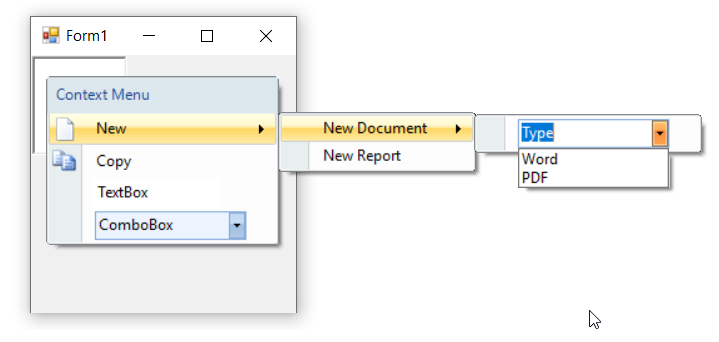

# Multi-level Menu Items in Windows Forms ContextMenuStrip

Multi-level menu items refers to adding submenu items or child items to the context menu. The [`DropDownItems`](https://docs.microsoft.com/en-us/dotnet/api/system.windows.forms.toolstripdropdownitem.dropdownitems?redirectedfrom=MSDN&view=netframework-4.7.2#System_Windows_Forms_ToolStripDropDownItem_DropDownItems) property of menu item is used to add child items.

The below code snippet shows how to add submenu items to the ContextMenuStripEx control.




//Declaration 
private Syncfusion.Windows.Forms.Tools.ContextMenuStripEx contextMenuStripEx1;
private System.Windows.Forms.ToolStripMenuItem toolStripMenuItem1;
private System.Windows.Forms.ToolStripMenuItem toolStripMenuItem2;
private System.Windows.Forms.RichTextBox richTextBox1;
private System.Windows.Forms.ToolStripTextBox toolStripTextBox1;
private System.Windows.Forms.ToolStripComboBox toolStripComboBox1;
private System.Windows.Forms.ToolStripMenuItem toolStripMenuItem3;
private System.Windows.Forms.ToolStripComboBox toolStripComboBox2;
private System.Windows.Forms.ToolStripMenuItem toolStripMenuItem4;

//Initializing
this.contextMenuStripEx1 = new Syncfusion.Windows.Forms.Tools.ContextMenuStripEx();
this.toolStripMenuItem1 = new System.Windows.Forms.ToolStripMenuItem();
this.toolStripMenuItem2 = new System.Windows.Forms.ToolStripMenuItem();
this.toolStripTextBox1 = new System.Windows.Forms.ToolStripTextBox();
this.toolStripComboBox1 = new System.Windows.Forms.ToolStripComboBox();
this.richTextBox1 = new System.Windows.Forms.RichTextBox();
this.toolStripMenuItem3 = new System.Windows.Forms.ToolStripMenuItem();
this.toolStripMenuItem4 = new System.Windows.Forms.ToolStripMenuItem();
this.toolStripComboBox2 = new System.Windows.Forms.ToolStripComboBox();

// toolStripMenuItem1
this.toolStripMenuItem1.DropDownItems.AddRange(new System.Windows.Forms.ToolStripItem[] { this.toolStripMenuItem3, this.toolStripMenuItem4});
this.toolStripMenuItem1.Image = ((System.Drawing.Image)(resources.GetObject("toolStripMenuItem1.Image")));
this.toolStripMenuItem1.Size = new System.Drawing.Size(185, 26);
this.toolStripMenuItem1.Text = "New";

// toolStripMenuItem2
this.toolStripMenuItem2.Image = ((System.Drawing.Image)(resources.GetObject("toolStripMenuItem2.Image")));
this.toolStripMenuItem2.Size = new System.Drawing.Size(185, 26);
this.toolStripMenuItem2.Text = "Copy";

// toolStripTextBox1
this.toolStripTextBox1.Size = new System.Drawing.Size(100, 27);
this.toolStripTextBox1.Text = "TextBox";

// toolStripComboBox1
this.toolStripComboBox1.Items.AddRange(new object[] { "Item1", "Item2", "Item3"});
this.toolStripComboBox1.Size = new System.Drawing.Size(121, 28);
this.toolStripComboBox1.Text = "ComboBox";

// toolStripMenuItem3
this.toolStripMenuItem3.DropDownItems.AddRange(new System.Windows.Forms.ToolStripItem[] { this.toolStripComboBox2 });            this.toolStripMenuItem3.Size = new System.Drawing.Size(187, 26);
this.toolStripMenuItem3.Text = "New Document";

// toolStripMenuItem4
this.toolStripMenuItem4.Size = new System.Drawing.Size(187, 26);
this.toolStripMenuItem4.Text = "New Report";

// toolStripComboBox2 
this.toolStripComboBox2.Items.AddRange(new object[] { "Word", "PDF"});
this.toolStripComboBox2.Size = new System.Drawing.Size(121, 28);
this.toolStripComboBox2.Text = "Type";

// richTextBox1
this.richTextBox1.ContextMenuStrip = this.contextMenuStripEx1;

// Form1
this.ClientSize = new System.Drawing.Size(282, 253);
this.Controls.Add(this.richTextBox1);
this.Text = "Form1";





'Declaration 
Private contextMenuStripEx1 As Syncfusion.Windows.Forms.Tools.ContextMenuStripEx
Private toolStripMenuItem1 As System.Windows.Forms.ToolStripMenuItem
Private toolStripMenuItem2 As System.Windows.Forms.ToolStripMenuItem
Private richTextBox1 As System.Windows.Forms.RichTextBox
Private toolStripTextBox1 As System.Windows.Forms.ToolStripTextBox
Private toolStripComboBox1 As System.Windows.Forms.ToolStripComboBox
Private toolStripMenuItem3 As System.Windows.Forms.ToolStripMenuItem
Private toolStripComboBox2 As System.Windows.Forms.ToolStripComboBox
Private toolStripMenuItem4 As System.Windows.Forms.ToolStripMenuItem

'Initializing
Me.contextMenuStripEx1 = New Syncfusion.Windows.Forms.Tools.ContextMenuStripEx()
Me.toolStripMenuItem1 = New System.Windows.Forms.ToolStripMenuItem()
Me.toolStripMenuItem2 = New System.Windows.Forms.ToolStripMenuItem()
Me.toolStripTextBox1 = New System.Windows.Forms.ToolStripTextBox()
Me.toolStripComboBox1 = New System.Windows.Forms.ToolStripComboBox()
Me.richTextBox1 = New System.Windows.Forms.RichTextBox()
Me.toolStripMenuItem3 = New System.Windows.Forms.ToolStripMenuItem()
Me.toolStripMenuItem4 = New System.Windows.Forms.ToolStripMenuItem()
Me.toolStripComboBox2 = New System.Windows.Forms.ToolStripComboBox()

' toolStripMenuItem1
Me.toolStripMenuItem1.DropDownItems.AddRange(New System.Windows.Forms.ToolStripItem() { Me.toolStripMenuItem3, Me.toolStripMenuItem4})
Me.toolStripMenuItem1.Image = (CType(resources.GetObject("toolStripMenuItem1.Image"), System.Drawing.Image))
Me.toolStripMenuItem1.Size = New System.Drawing.Size(185, 26)
Me.toolStripMenuItem1.Text = "New"

' toolStripMenuItem2
Me.toolStripMenuItem2.Image = (CType(resources.GetObject("toolStripMenuItem2.Image"), System.Drawing.Image))
Me.toolStripMenuItem2.Size = New System.Drawing.Size(185, 26)
Me.toolStripMenuItem2.Text = "Copy"

' toolStripTextBox1
Me.toolStripTextBox1.Size = New System.Drawing.Size(100, 27)
Me.toolStripTextBox1.Text = "TextBox"

' toolStripComboBox1
Me.toolStripComboBox1.Items.AddRange(New Object() { "Item1", "Item2", "Item3"})
Me.toolStripComboBox1.Size = New System.Drawing.Size(121, 28)
Me.toolStripComboBox1.Text = "ComboBox"

' toolStripMenuItem3
Me.toolStripMenuItem3.DropDownItems.AddRange(New System.Windows.Forms.ToolStripItem() { Me.toolStripComboBox2 })
Me.toolStripMenuItem3.Size = New System.Drawing.Size(187, 26)
Me.toolStripMenuItem3.Text = "New Document"

' toolStripMenuItem4
Me.toolStripMenuItem4.Size = New System.Drawing.Size(187, 26)
Me.toolStripMenuItem4.Text = "New Report"

' toolStripComboBox2 
Me.toolStripComboBox2.Items.AddRange(New Object() { "Word", "PDF"})
Me.toolStripComboBox2.Size = New System.Drawing.Size(121, 28)
Me.toolStripComboBox2.Text = "Type"

' richTextBox1
Me.richTextBox1.ContextMenuStrip = Me.contextMenuStripEx1

' Form1
Me.ClientSize = New System.Drawing.Size(282, 253)
Me.Controls.Add(Me.richTextBox1)
Me.Text = "Form1"




