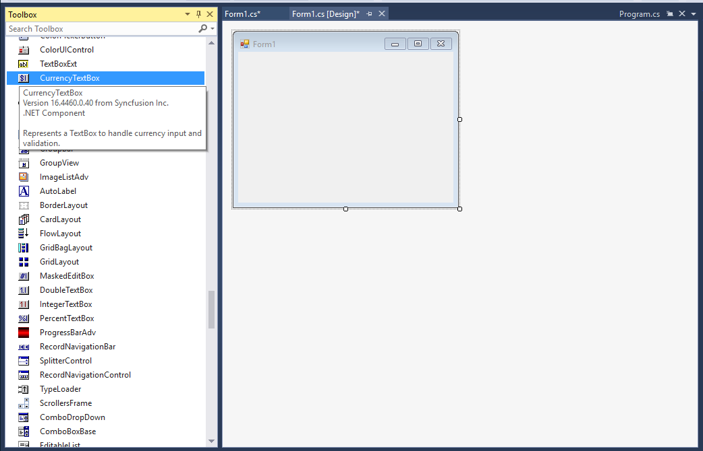

# Getting Started with Windows Forms Currency TextBox (CurrencyTextbox)

## Assembly deployment

Refer to the [control dependencies](https://help.syncfusion.com/windowsforms/control-dependencies#currencytextbox) section to get the list of assemblies or NuGet package that needs to be added as a reference to use the control in any application.

You can find more details about installing the NuGet packages in a Windows Forms application in the following link: 

[How to install nuget packages](https://help.syncfusion.com/windowsforms/nuget-packages)

### Create a simple application with CurrencyTextBox

You can create a Windows Forms application with [CurrencyTextBox](https://help.syncfusion.com/cr/windowsforms/Syncfusion.Windows.Forms.Tools.CurrencyTextBox.html) using the following steps:

### Create a project

Create a new Windows Forms project in Visual Studio to display the [CurrencyTextBox](https://help.syncfusion.com/cr/windowsforms/Syncfusion.Windows.Forms.Tools.CurrencyTextBox.html) control.

## Add control through designer

The [CurrencyTextBox](https://help.syncfusion.com/cr/windowsforms/Syncfusion.Windows.Forms.Tools.CurrencyTextBox.html) control can be added to an application by dragging it from the toolbox to a designer view. The **Syncfusion.Shared.Base** assembly reference will be added automatically:

 

## Add control manually in code

To add the control manually in C#, follow the given steps:

**1.** Add the **Syncfusion.Shared.Base** assembly reference to the project.

**2.**	Include the **Syncfusion.Windows.Forms.Tools** namespace.



using Syncfusion.Windows.Forms.Tools;


Imports Syncfusion.Windows.Forms.Tools



**3.**	Create a [CurrencyTextBox](https://help.syncfusion.com/cr/windowsforms/Syncfusion.Windows.Forms.Tools.CurrencyTextBox.html) instance, and add it to the window.



CurrencyEdit currencyEdit1 = new CurrencyEdit();
this.Controls.Add(currencyEdit1);


Dim currencyEdit1 As New CurrencyEdit()
Me.Controls.Add(currencyEdit1)



 

## Set the maximum and minimum values

You can set the maximum and minimum value of the currency by [MaxValue](https://help.syncfusion.com/cr/windowsforms/Syncfusion.Windows.Forms.Tools.CurrencyTextBox.html#Syncfusion_Windows_Forms_Tools_CurrencyTextBox_MaxValue) and [MinValue](https://help.syncfusion.com/cr/windowsforms/Syncfusion.Windows.Forms.Tools.CurrencyTextBox.html#Syncfusion_Windows_Forms_Tools_CurrencyTextBox_MinValue) properties of [CurrencyTextBox](https://help.syncfusion.com/cr/windowsforms/Syncfusion.Windows.Forms.Tools.CurrencyTextBox.html).



this.currencyTextBox1.MaxValue=10;
this.currencyTextBox1.MinValue=5;


Me.currencyTextBox1.MaxValue=10
Me.currencyTextBox1.MinValue=5



## Set currency symbol

You can define the custom currency symbol using the [CurrencySymbol](https://help.syncfusion.com/cr/windowsforms/Syncfusion.Windows.Forms.Tools.CurrencyTextBox.html#Syncfusion_Windows_Forms_Tools_CurrencyTextBox_CurrencySymbol) property of [CurrencyTextBox](https://help.syncfusion.com/cr/windowsforms/Syncfusion.Windows.Forms.Tools.CurrencyTextBox.html).



//Setting custom currency symbol 
this.currencyTextBox1.CurrencySymbol = "€";


'Setting custom currency symbol 
Me.currencyTextBox1.CurrencySymbol = "€"


        
 

## Number format

You can customize the number format using the [CurrencyDecimalDigits](https://help.syncfusion.com/cr/windowsforms/Syncfusion.Windows.Forms.Tools.CurrencyTextBox.html#Syncfusion_Windows_Forms_Tools_CurrencyTextBox_CurrencyDecimalDigits), [CurrencyDecimalSeparator](https://help.syncfusion.com/cr/windowsforms/Syncfusion.Windows.Forms.Tools.CurrencyTextBox.html#Syncfusion_Windows_Forms_Tools_CurrencyTextBox_CurrencyDecimalSeparator), [CurrencyGroupSeparator](https://help.syncfusion.com/cr/windowsforms/Syncfusion.Windows.Forms.Tools.CurrencyTextBox.html#Syncfusion_Windows_Forms_Tools_CurrencyTextBox_CurrencyGroupSeparator) and [CurrencyGroupSizes](https://help.syncfusion.com/cr/windowsforms/Syncfusion.Windows.Forms.Tools.CurrencyTextBox.html#Syncfusion_Windows_Forms_Tools_CurrencyTextBox_CurrencyGroupSizes) properties of CurrencyTextBox.



this.currencyTextBox1.DecimalValue = 2132423543;
this.currencyTextBox1.CurrencyDecimalDigits = 3;
this.currencyTextBox1.CurrencyDecimalSeparator = "/";
this.currencyTextBox1.CurrencyGroupSeparator = "*";
this.currencyTextBox1.CurrencyGroupSizes = new int[] { 3 };


Me.currencyTextBox1.DecimalValue = 2132423543
Me.currencyTextBox1.CurrencyDecimalDigits = 3
Me.currencyTextBox1.CurrencyDecimalSeparator = "."
Me.currencyTextBox1.CurrencyGroupSeparator = ","
Me.currencyTextBox1.CurrencyGroupSizes = New Integer() {3}



 
