# Export to Excel
SfDataGrid provides support to export data to excel. It also provides support for grouping, filtering, sorting, paging, unbound rows and stacked headers while exporting.
The following assemblies needs to be added for exporting to excel.

* [Syncfusion.SfDataGridConverter.WinForms](https://help.syncfusion.com/cr/cref_files/windowsforms/webtoc.html)
* [Syncfusion.XlsIO.Base](https://help.syncfusion.com/cr/cref_files/windowsforms/webtoc.html)

For NuGet package you have to install [Syncfusion.DataGridExport.WinForms](https://www.nuget.org/packages/Syncfusion.DataGridExport.WinForms/) packagae for more details refer this [UG link](https://help.syncfusion.com/windowsforms/control-dependencies#exporting-sfdatagrid-to-excel-pdf-and-csv)

The SfDataGrid can be exported to excel by using the [ExportToExcel](https://help.syncfusion.com/cr/cref_files/windowsforms/Syncfusion.SfDataGridConverter.WinForms~Syncfusion.WinForms.DataGridConverter.DataGridExcelExportExtension~ExportToExcel.html) extension method present in the `Syncfusion.WinForms.DataGridConverter` namespace.



using Syncfusion.WinForms.DataGridConverter;
var options = new ExcelExportingOptions();
var excelEngine = sfDataGrid.ExportToExcel(sfDataGrid.View, options);
var workBook = excelEngine.Excel.Workbooks[0];
workBook.SaveAs("Sample.xlsx");


Imports Syncfusion.WinForms.DataGridConverter

Dim options = New ExcelExportingOptions()
Dim excelEngine = sfDataGrid.ExportToExcel(sfDataGrid.View, options)
Dim workBook = excelEngine.Excel.Workbooks(0)
workBook.SaveAs("Sample.xlsx")



N> SfDataGrid exports data to excel by using `XlsIO`. You can refer[XlsIO documentation](http://help.syncfusion.com/file-formats/xlsio/working-with-excel-worksheet) for manipulating exported work sheets.

## Exporting Options
By default, actual value only will be exported to excel. This can be changed to export the display text by setting the [ExportMode](https://help.syncfusion.com/cr/cref_files/windowsforms/Syncfusion.SfDataGridConverter.WinForms~Syncfusion.WinForms.DataGridConverter.ExcelExportingOptions~ExportMode.html) property as `Text`.



var options = new ExcelExportingOptions();
options.ExportMode = ExportMode.Text;
var excelEngine = sfDataGrid.ExportToExcel(sfDataGrid.View, options);
var workBook = excelEngine.Excel.Workbooks[0];
workBook.SaveAs("Sample.xlsx");


Dim options = New ExcelExportingOptions()
options.ExportMode = ExportMode.Text
Dim excelEngine = sfDataGrid.ExportToExcel(sfDataGrid.View, options)
Dim workBook = excelEngine.Excel.Workbooks(0)
workBook.SaveAs("Sample.xlsx")



### Export Groups with Outlines
By default, all the groups in SfDataGrid will be exported in expanded state. The outlines can be enabled in excel based on groups by setting the [AllowOutlining](https://help.syncfusion.com/cr/cref_files/windowsforms/Syncfusion.SfDataGridConverter.WinForms~Syncfusion.WinForms.DataGridConverter.ExcelExportingOptions~AllowOutlining.html) property as `true` in [ExcelExportingOptions](https://help.syncfusion.com/cr/cref_files/windowsforms/Syncfusion.SfDataGridConverter.WinForms~Syncfusion.WinForms.DataGridConverter.ExcelExportingOptions.html).



var options = new ExcelExportingOptions();
options.AllowOutlining = true;
var excelEngine = sfDataGrid.ExportToExcel(sfDataGrid.View, options);
var workBook = excelEngine.Excel.Workbooks[0];
workBook.SaveAs("Sample.xlsx");


Dim options = New ExcelExportingOptions()
options.AllowOutlining = True
Dim excelEngine = sfDataGrid.ExportToExcel(sfDataGrid.View, options)
Dim workBook = excelEngine.Excel.Workbooks(0)
workBook.SaveAs("Sample.xlsx")



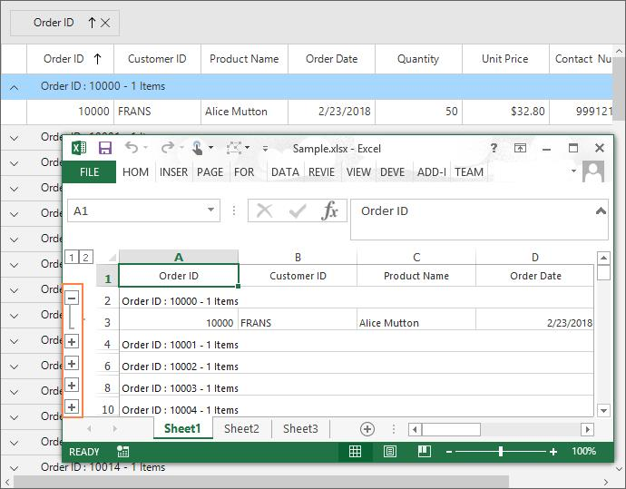

### Exclude Columns while Exporting
By default, all the columns (including hidden columns) in SfDataGrid will be exported to Excel. In order  to exclude some columns from exporting, use the [ExcludeColumns](https://help.syncfusion.com/cr/cref_files/windowsforms/Syncfusion.SfDataGridConverter.WinForms~Syncfusion.WinForms.DataGridConverter.ExcelExportingOptions~ExcludeColumns.html) field of the [ExcelExportingOptions](https://help.syncfusion.com/cr/cref_files/windowsforms/Syncfusion.SfDataGridConverter.WinForms~Syncfusion.WinForms.DataGridConverter.ExcelExportingOptions.html).



var options = new ExcelExportingOptions();
options.ExcludeColumns.Add("CustomerID");
options.ExcludeColumns.Add("ProductName");
var excelEngine = sfDataGrid.ExportToExcel(sfDataGrid.View, options);
var workBook = excelEngine.Excel.Workbooks[0];
workBook.SaveAs("Sample.xlsx");


Dim options = New ExcelExportingOptions()
options.ExcludeColumns.Add("CustomerID")
options.ExcludeColumns.Add("ProductName")
Dim excelEngine = sfDataGrid.ExportToExcel(sfDataGrid.View, options)
Dim workBook = excelEngine.Excel.Workbooks(0)
workBook.SaveAs("Sample.xlsx")



Here, the columns having `CustomerID` and `ProductName` as[MappingName](https://help.syncfusion.com/cr/cref_files/windowsforms/Syncfusion.SfDataGrid.WinForms~Syncfusion.WinForms.DataGrid.GridColumnBase~MappingName.html) are excluded while exporting.

### Excel Version
The excel version can be specified while exporting to Excel by using [ExcelVersion](https://help.syncfusion.com/cr/cref_files/windowsforms/Syncfusion.SfDataGridConverter.WinForms~Syncfusion.WinForms.DataGridConverter.ExcelExportingOptions~ExcelVersion.html) property.



var options = new ExcelExportingOptions();
options.ExcelVersion = ExcelVersion.Excel2013;
var excelEngine = sfDataGrid.ExportToExcel(sfDataGrid.View, options);
var workBook = excelEngine.Excel.Workbooks[0];
workBook.SaveAs("Sample.xlsx");


Dim options = New ExcelExportingOptions()
options.ExcelVersion = ExcelVersion.Excel2013
Dim excelEngine = sfDataGrid.ExportToExcel(sfDataGrid.View, options)
Dim workBook = excelEngine.Excel.Workbooks(0)
workBook.SaveAs("Sample.xlsx")



### Exporting Stacked Headers
The stacked headers can also be exported to excel by setting the [ExportStackedHeaders](https://help.syncfusion.com/cr/cref_files/windowsforms/Syncfusion.SfDataGridConverter.WinForms~Syncfusion.WinForms.DataGridConverter.ExcelExportingOptions~ExportStackedHeaders.html) property to `true`.



var options = new ExcelExportingOptions();
options.ExportStackedHeaders = true;
var excelEngine = sfDataGrid.ExportToExcel(sfDataGrid.View, options);
var workBook = excelEngine.Excel.Workbooks[0];
workBook.SaveAs("Sample.xlsx");


Dim options = New ExcelExportingOptions()
options.ExportStackedHeaders = True
Dim excelEngine = sfDataGrid.ExportToExcel(sfDataGrid.View, options)
Dim workBook = excelEngine.Excel.Workbooks(0)
workBook.SaveAs("Sample.xlsx")



### Exporting Unbound Rows 
The unbound rows can be exported to excel by setting the [ExportUnboundRows](https://help.syncfusion.com/cr/cref_files/windowsforms/Syncfusion.SfDataGridConverter.WinForms~Syncfusion.WinForms.DataGridConverter.ExcelExportingOptions~ExportUnboundRows.html) property as `true`.



var options = new ExcelExportingOptions();
options = true;
var excelEngine = sfDataGrid.ExportToExcel(sfDataGrid.View, options);
var workBook = excelEngine.Excel.Workbooks[0];
workBook.SaveAs("Sample.xlsx");


Dim options = New ExcelExportingOptions()
options = True
Dim excelEngine = sfDataGrid.ExportToExcel(sfDataGrid.View, options)
Dim workBook = excelEngine.Excel.Workbooks(0)
workBook.SaveAs("Sample.xlsx")



### Changing Start Row and Column Index while Exporting
The data can be exported to the specified row and column index in worksheet, by setting [StartRowIndex](https://help.syncfusion.com/cr/cref_files/windowsforms/Syncfusion.SfDataGridConverter.WinForms~Syncfusion.WinForms.DataGridConverter.ExcelExportingOptions~StartRowIndex.html) and [StartColumnIndex](https://help.syncfusion.com/cr/cref_files/windowsforms/Syncfusion.SfDataGridConverter.WinForms~Syncfusion.WinForms.DataGridConverter.ExcelExportingOptions~StartColumnIndex.html) properties.



var options = new ExcelExportingOptions();
options.StartRowIndex = 3;
options.StartColumnIndex = 3;
var excelEngine = sfDataGrid.ExportToExcel(sfDataGrid.View, options);
var workBook = excelEngine.Excel.Workbooks[0];
workBook.SaveAs("Sample.xlsx");


Dim options = New ExcelExportingOptions()
options.StartRowIndex = 3
options.StartColumnIndex = 3
Dim excelEngine = sfDataGrid.ExportToExcel(sfDataGrid.View, options)
Dim workBook = excelEngine.Excel.Workbooks(0)
workBook.SaveAs("Sample.xlsx")



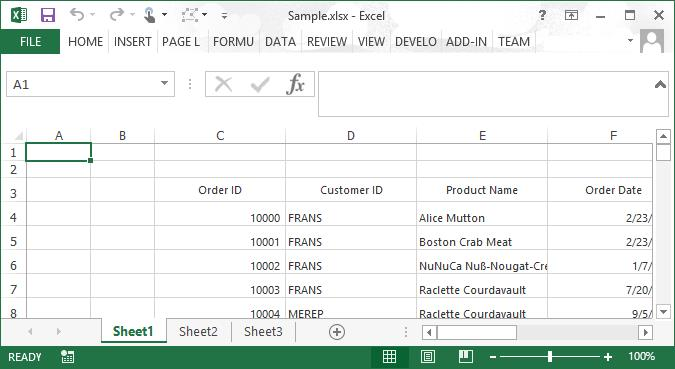

## Saving Options

### Save Directly to File

After exporting to excel the exported workbook can be saved directly to the file system by using [SaveAs](https://help.syncfusion.com/cr/cref_files/file-formats/Syncfusion.XlsIO.Base~Syncfusion.XlsIO.IWorkbook~SaveAs.html) method.



var options = new ExcelExportingOptions();
var excelEngine = sfDataGrid.ExportToExcel(sfDataGrid.View, options);
var workBook = excelEngine.Excel.Workbooks[0];
workBook.SaveAs("Sample.xlsx");


Dim options = New ExcelExportingOptions()
Dim excelEngine = sfDataGrid.ExportToExcel(sfDataGrid.View, options)
Dim workBook = excelEngine.Excel.Workbooks(0)
workBook.SaveAs("Sample.xlsx")



### Save as Stream
After exporting to excel the exported workbook can be saved to a stream by using [SaveAs](https://help.syncfusion.com/cr/cref_files/file-formats/Syncfusion.XlsIO.Base~Syncfusion.XlsIO.IWorkbook~SaveAs.html) method.



var options = new ExcelExportingOptions();
options.ExcelVersion = ExcelVersion.Excel2013;
var excelEngine = sfDataGrid.ExportToExcel(sfDataGrid.View, options);
var workBook = excelEngine.Excel.Workbooks[0];
FileStream fileStream = new FileStream("Output.xlsx", FileMode.Create);
//Save to the file stream
workBook.SaveAs(fileStream);


Dim options = New ExcelExportingOptions()
options.ExcelVersion = ExcelVersion.Excel2013
Dim excelEngine = sfDataGrid.ExportToExcel(sfDataGrid.View, options)
Dim workBook = excelEngine.Excel.Workbooks(0)
Dim fileStream As New FileStream("Output.xlsx", FileMode.Create)
'Save to the file stream
workBook.SaveAs(fileStream)



Refer to the [XlsIO documentation](https://help.syncfusion.com/file-formats/xlsio/faq) for further reference. 

### Save Using File Dialog
After exporting the SfDataGrid to excel, the exported workbook can be saved by opening the [FileDialog](https://msdn.microsoft.com/en-us/library/system.windows.forms.filedialog.aspx). 



var options = new ExcelExportingOptions();
options.ExcelVersion = ExcelVersion.Excel2013;
var excelEngine = sfDataGrid.ExportToExcel(sfDataGrid.View, options);
var workBook = excelEngine.Excel.Workbooks[0];

SaveFileDialog saveFilterDialog = new SaveFileDialog
{
    FilterIndex = 2,
    Filter = "Excel 97 to 2003 Files(*.xls)|*.xls|Excel 2007 to 2010 Files(*.xlsx)|*.xlsx|Excel 2013 File(*.xlsx)|*.xlsx"
};

if (saveFilterDialog.ShowDialog() == System.Windows.Forms.DialogResult.OK)
{
    using (Stream stream = saveFilterDialog.OpenFile())
    {
        if (saveFilterDialog.FilterIndex == 1)
            workBook.Version = ExcelVersion.Excel97to2003;
        else if (saveFilterDialog.FilterIndex == 2)
            workBook.Version = ExcelVersion.Excel2010;
        else
            workBook.Version = ExcelVersion.Excel2013;
        workBook.SaveAs(stream);
    }

    //Message box confirmation to view the created workbook.
    if (MessageBox.Show(this.sfDataGrid, "Do you want to view the workbook?", "Workbook has been created",
                        MessageBoxButtons.YesNo, MessageBoxIcon.Information) == DialogResult.Yes)
    {

        //Launching the Excel file using the default Application.[MS Excel Or Free ExcelViewer]
        System.Diagnostics.Process.Start(saveFilterDialog.FileName);
    }
}


Dim options = New ExcelExportingOptions()
options.ExcelVersion = ExcelVersion.Excel2013
Dim excelEngine = sfDataGrid.ExportToExcel(sfDataGrid.View, options)
Dim workBook = excelEngine.Excel.Workbooks(0)

Dim saveFilterDialog As SaveFileDialog = New SaveFileDialog With {.FilterIndex = 2, .Filter = "Excel 97 to 2003 Files(*.xls)|*.xls|Excel 2007 to 2010 Files(*.xlsx)|*.xlsx|Excel 2013 File(*.xlsx)|*.xlsx"}

If saveFilterDialog.ShowDialog() = System.Windows.Forms.DialogResult.OK Then
	Using stream As Stream = saveFilterDialog.OpenFile()

		If saveFilterDialog.FilterIndex = 1 Then
			workBook.Version = ExcelVersion.Excel97to2003

		ElseIf saveFilterDialog.FilterIndex = 2 Then
			workBook.Version = ExcelVersion.Excel2010

		Else
			workBook.Version = ExcelVersion.Excel2013
		End If
		workBook.SaveAs(stream)
	End Using

	'Message box confirmation to view the created workbook.
	If MessageBox.Show(Me.sfDataGrid, "Do you want to view the workbook?", "Workbook has been created", MessageBoxButtons.YesNo, MessageBoxIcon.Information) = DialogResult.Yes Then

		'Launching the Excel file using the default Application.[MS Excel Or Free ExcelViewer]
		System.Diagnostics.Process.Start(saveFilterDialog.FileName)
	End If
End If



## Export Selected Items to Excel
By default, entire grid will be exported to Excel. The selected items can only exported to excel by passing the [SelectedItems](https://help.syncfusion.com/cr/cref_files/windowsforms/Syncfusion.SfDataGrid.WinForms~Syncfusion.WinForms.DataGrid.SfDataGrid~SelectedItems.html) to the [ExportToExcel](https://help.syncfusion.com/cr/cref_files/windowsforms/Syncfusion.SfDataGridConverter.WinForms~Syncfusion.WinForms.DataGridConverter.DataGridExcelExportExtension~ExportToExcel(SfDataGrid,ObservableCollection%7BObject%7D,ExcelExportingOptions).html) method.



var options = new ExcelExportingOptions();
ExcelEngine excelEngine = new ExcelEngine();
IWorkbook workBook = excelEngine.Excel.Workbooks.Create();
workBook.Worksheets.Create();
sfDataGrid.ExportToExcel(sfDataGrid.SelectedItems, options, workBook.Worksheets[0]);
workBook.Version = ExcelVersion.Excel2013;
workBook.SaveAs("Sample.xlsx");


Dim options = New ExcelExportingOptions()
Dim excelEngine As New ExcelEngine()
Dim workBook As IWorkbook = excelEngine.Excel.Workbooks.Create()
workBook.Worksheets.Create()
sfDataGrid.ExportToExcel(sfDataGrid.SelectedItems, options, workBook.Worksheets(0))
workBook.Version = ExcelVersion.Excel2013
workBook.SaveAs("Sample.xlsx")



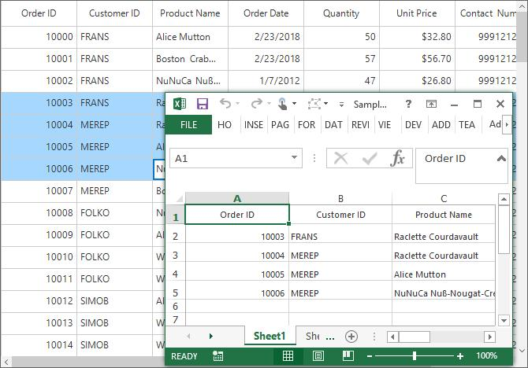

## Export to HTML
The exported workbook can be saved as HTML by using [SaveAsHtml](http://help.syncfusion.com/cr/cref_files/file-formats/Syncfusion.XlsIO.Base~Syncfusion.XlsIO.IWorkbook~SaveAsHtml.html) method.



var options = new ExcelExportingOptions();
options.ExcelVersion = ExcelVersion.Excel2013;
var excelEngine = sfDataGrid.ExportToExcel(sfDataGrid.View, options);
var workBook = excelEngine.Excel.Workbooks[0];
workBook.SaveAsHtml("Sample.html", HtmlSaveOptions.Default);


Dim options = New ExcelExportingOptions()
options.ExcelVersion = ExcelVersion.Excel2013
Dim excelEngine = sfDataGrid.ExportToExcel(sfDataGrid.View, options)
Dim workBook = excelEngine.Excel.Workbooks(0)
workBook.SaveAsHtml("Sample.html", HtmlSaveOptions.Default)



It is also possible to save worksheet as HTML by using [SaveAsHtml](http://help.syncfusion.com/cr/cref_files/file-formats/Syncfusion.XlsIO.Base~Syncfusion.XlsIO.IWorkbook~SaveAsHtml.html) method. Also refer the[XlsIO documentation](http://help.syncfusion.com/file-formats/xlsio/working-with-excel-worksheet#save-worksheet-as-html) for this.

## Export to Mail
The SfDataGrid can be exported to mail by converting it into Excel and save exported worksheet as HTML. Then exported HTML contents is embedded in mail body.



var options = new ExcelExportingOptions();
options.ExcelVersion = ExcelVersion.Excel2010;
var excelEngine = sfDataGrid.ExportToExcel(sfDataGrid.View, options);
var workBook = excelEngine.Excel.Workbooks[0];

workBook.Worksheets[0].UsedRange.BorderInside(ExcelLineStyle.Thick, ExcelKnownColors.Black);
workBook.Worksheets[0].UsedRange.BorderAround(ExcelLineStyle.Thick, ExcelKnownColors.Black);
workBook.Worksheets[0].SaveAsHtml("test.htm", Syncfusion.XlsIO.Implementation.HtmlSaveOptions.Default);

System.Net.Mail.MailMessage myMessage = new System.Net.Mail.MailMessage();

myMessage.To.Add("Support@syncfusion.com");
myMessage.From = new MailAddress("Support@syncfusion.com");
myMessage.Priority = MailPriority.High;
myMessage.Subject = "Order Details";
myMessage.IsBodyHtml = true;
myMessage.Body = new StreamReader("test.htm").ReadToEnd();

SmtpClient client = new SmtpClient("smtp.office365.com", 587);

client.EnableSsl = true;
client.UseDefaultCredentials = false;
client.Credentials = new NetworkCredential("Support@syncfusion.com", "test");

int count = 0;

while (count < 3)
{
    try
    {
        client.Send(myMessage);
        count = 3;
    }
    catch (Exception ex)
    {
        Console.WriteLine(ex.Message);
        Console.WriteLine(String.Format("Sending Mail Attempt - {0}", count.ToString()));
        Thread.Sleep(60000);
        count++;
    }
}
Console.WriteLine("Mail has been sent...");


Dim options = New ExcelExportingOptions()
options.ExcelVersion = ExcelVersion.Excel2010
Dim excelEngine = sfDataGrid.ExportToExcel(sfDataGrid.View, options)
Dim workBook = excelEngine.Excel.Workbooks(0)

workBook.Worksheets(0).UsedRange.BorderInside(ExcelLineStyle.Thick, ExcelKnownColors.Black)
workBook.Worksheets(0).UsedRange.BorderAround(ExcelLineStyle.Thick, ExcelKnownColors.Black)
workBook.Worksheets(0).SaveAsHtml("test.htm", Syncfusion.XlsIO.Implementation.HtmlSaveOptions.Default)

Dim myMessage As New System.Net.Mail.MailMessage()

myMessage.To.Add("Support@syncfusion.com")
myMessage.From = New MailAddress("Support@syncfusion.com")
myMessage.Priority = MailPriority.High
myMessage.Subject = "Order Details"
myMessage.IsBodyHtml = True
myMessage.Body = New StreamReader("test.htm").ReadToEnd()

Dim client As New SmtpClient("smtp.office365.com", 587)

client.EnableSsl = True
client.UseDefaultCredentials = False
client.Credentials = New NetworkCredential("Support@syncfusion.com", "test")

Dim count As Integer = 0

Do While count < 3

	Try
		client.Send(myMessage)
		count = 3

	Catch ex As Exception
		Console.WriteLine(ex.Message)
		Console.WriteLine(String.Format("Sending Mail Attempt - {0}", count.ToString()))
		Thread.Sleep(60000)
		count += 1
	End Try
Loop
Console.WriteLine("Mail has been sent...")




## Export to XML
The exported workbook can also be saved as the `xml` file by using [SaveAsXml](https://help.syncfusion.com/cr/cref_files/file-formats/Syncfusion.XlsIO.Base~Syncfusion.XlsIO.IWorkbook~SaveAsXml.html) method.



var options = new ExcelExportingOptions();
options.ExcelVersion = ExcelVersion.Excel2013;
var excelEngine = sfDataGrid.ExportToExcel(sfDataGrid.View, options);
var workBook = excelEngine.Excel.Workbooks[0];
workBook.SaveAsXml("Sample.xml", ExcelXmlSaveType.MSExcel);


Dim options = New ExcelExportingOptions()
options.ExcelVersion = ExcelVersion.Excel2013
Dim excelEngine = sfDataGrid.ExportToExcel(sfDataGrid.View, options)
Dim workBook = excelEngine.Excel.Workbooks(0)
workBook.SaveAsXml("Sample.xml", ExcelXmlSaveType.MSExcel)



## Export to CSV
The exported workbook can be saved as CSV file by using the `SaveAs` method.


var options = new ExcelExportingOptions();
options.ExcelVersion = ExcelVersion.Excel2013;
var excelEngine = sfDataGrid.ExportToExcel(sfDataGrid.View, options);
var workBook = excelEngine.Excel.Workbooks[0];
workBook.SaveAs("Sample.csv", ",");


Dim options = New ExcelExportingOptions()
options.ExcelVersion = ExcelVersion.Excel2013
Dim excelEngine = sfDataGrid.ExportToExcel(sfDataGrid.View, options)
Dim workBook = excelEngine.Excel.Workbooks(0)
workBook.SaveAs("Sample.csv", ",")



## Export to Image
It also possible to convert the exported excel file into Image without saving the excel file in system with the help of [ConvertToImage](https://help.syncfusion.com/cr/cref_files/windowsforms/Syncfusion.XlsIO.Base~Syncfusion.XlsIO.IWorksheet~ConvertToImage.html) method.


var excelExportingOptions = new ExcelExportingOptions();
ExcelEngine excelEngine = sfDataGrid.ExportToExcel(sfDataGrid.View, excelExportingOptions);
IWorkbook workbook = excelEngine.Excel.Workbooks[0];
IWorksheet sheet = workbook.Worksheets[0];
sheet.UsedRangeIncludesFormatting = false;
int lastRow = sheet.UsedRange.LastRow + 1;
int lastColumn = sheet.UsedRange.LastColumn;
System.Drawing.Image img = sheet.ConvertToImage(1, 1, lastRow, lastColumn, ImageType.Bitmap, null);
img.Save("Sample.png", ImageFormat.Png);
System.Diagnostics.Process.Start("Sample.png");


Dim excelExportingOptions = New ExcelExportingOptions()
Dim excelEngine As ExcelEngine = sfDataGrid.ExportToExcel(sfDataGrid.View, excelExportingOptions)
Dim workbook As IWorkbook = excelEngine.Excel.Workbooks(0)
Dim sheet As IWorksheet = workbook.Worksheets(0)
sheet.UsedRangeIncludesFormatting = False
Dim lastRow As Integer = sheet.UsedRange.LastRow + 1
Dim lastColumn As Integer = sheet.UsedRange.LastColumn
Dim img As System.Drawing.Image = sheet.ConvertToImage(1, 1, lastRow, lastColumn, ImageType.Bitmap, Nothing)
img.Save("Sample.png", ImageFormat.Png)
System.Diagnostics.Process.Start("Sample.png")



## Import form Excel to SfDataGrid
The DataSource of the SfDataGrid can be imported from the excel sheet by using the [IWorkSheet.ExportDataTable](https://help.syncfusion.com/cr/cref_files/windowsforms/Syncfusion.XlsIO.Base~Syncfusion.XlsIO.IWorksheet~ExportDataTable.html) method. This method will convert the excel data into the DataTable.


ExcelEngine excelEngine = new ExcelEngine();
IApplication application = excelEngine.Excel;
application.DefaultVersion = ExcelVersion.Excel2013;
IWorkbook workbook = application.Workbooks.Create(1);
IWorksheet worksheet = workbook.Worksheets[0];
//Import the data to worksheet.
List<OrderInfo> reports = new List<OrderInfo>();
reports.Add(new OrderInfo() { OrderID = 1000, CustomerID = "FOLKO", OrderDate = DateTime.Now, ProductName = "Alice Mutton", Quantity = 10 });
worksheet.ImportData(reports, 1, 1, true);

//Read data from the worksheet and Export to the DataTable.
DataTable customersTable = worksheet.ExportDataTable(1, 1, 15, 5, ExcelExportDataTableOptions.ColumnNames);
this.sfDataGrid.DataSource = customersTable;

workbook.Close();
excelEngine.Dispose();


Dim excelEngine As New ExcelEngine()
Dim application As IApplication = excelEngine.Excel
application.DefaultVersion = ExcelVersion.Excel2013
Dim workbook As IWorkbook = application.Workbooks.Create(1)
Dim worksheet As IWorksheet = workbook.Worksheets(0)
'Import the data to worksheet.
Dim reports As New List(Of OrderInfo)()
reports.Add(New OrderInfo() With {.OrderID = 1000, .CustomerID = "FOLKO", .OrderDate = DateTime.Now, .ProductName = "Alice Mutton", .Quantity = 10})
worksheet.ImportData(reports, 1, 1, True)

'Read data from the worksheet and Export to the DataTable.
Dim customersTable As DataTable = worksheet.ExportDataTable(1, 1, 15, 5, ExcelExportDataTableOptions.ColumnNames)
Me.sfDataGrid.DataSource = customersTable

workbook.Close()
excelEngine.Dispose()



## Row Height and Column Width Customization
After exporting data to excel, the row height and column width of the exported sheet can be set by using the [SetRowHeight](https://help.syncfusion.com/cr/cref_files/windowsforms/Syncfusion.XlsIO.Base~Syncfusion.XlsIO.IWorksheet~SetRowHeight.html) and [SetColumnWidth](https://help.syncfusion.com/cr/cref_files/windowsforms/Syncfusion.XlsIO.Base~Syncfusion.XlsIO.IWorksheet~SetColumnWidth.html) methods.



var options = new ExcelExportingOptions();
var excelEngine = sfDataGrid.ExportToExcel(sfDataGrid.View, options);
var workBook = excelEngine.Excel.Workbooks[0];
workBook.Worksheets[0].SetRowHeight(2, 50);
workBook.Worksheets[0].SetColumnWidth(2, 50);
workBook.SaveAs("Sample.xlsx");


Dim options = New ExcelExportingOptions()
Dim excelEngine = sfDataGrid.ExportToExcel(sfDataGrid.View, options)
Dim workBook = excelEngine.Excel.Workbooks(0)
workBook.Worksheets(0).SetRowHeight(2, 50)
workBook.Worksheets(0).SetColumnWidth(2, 50)
workBook.SaveAs("Sample.xlsx")



## Styling Cells based on CellType in Excel
The cell style of the exported excel sheet can be customized based on the `CellType` by using the Exporting event.


var options = new ExcelExportingOptions();
options.Exporting +=options_Exporting;
options.AllowOutlining = true;
var excelEngine = sfDataGrid.ExportToExcel(sfDataGrid.View, options);
var workBook = excelEngine.Excel.Workbooks[0];
workBook.SaveAs("Sample.xlsx");

void options_Exporting(object sender, Syncfusion.WinForms.DataGridConverter.Events.DataGridExcelExportingEventArgs e)
{
    if (e.CellType == ExportCellType.HeaderCell)
    {
        e.CellStyle.BackGroundColor = Color.LightPink;
        e.CellStyle.ForeGroundColor = Color.White;
        e.Handled = true;
    }
    else if (e.CellType == ExportCellType.RecordCell)
    {
        e.CellStyle.BackGroundColor = Color.LightSkyBlue;
        e.Handled = true;
    }
    else if (e.CellType == ExportCellType.GroupCaptionCell)
    {
        e.CellStyle.BackGroundColor =Color.Wheat;
        e.Handled = true;
    }
}        


Dim options = New ExcelExportingOptions()
options.Exporting += options_Exporting
options.AllowOutlining = True
Dim excelEngine = sfDataGrid.ExportToExcel(sfDataGrid.View, options)
Dim workBook = excelEngine.Excel.Workbooks(0)
workBook.SaveAs("Sample.xlsx")
Private Sub options_Exporting(ByVal sender As Object, ByVal e As Syncfusion.WinForms.DataGridConverter.Events.DataGridExcelExportingEventArgs)
If e.CellType Is ExportCellType.HeaderCell Then
e.CellStyle.BackGroundColor = Color.LightPink
e.CellStyle.ForeGroundColor = Color.White
e.Handled = True
ElseIf e.CellType Is ExportCellType.RecordCell Then
e.CellStyle.BackGroundColor = Color.LightSkyBlue
e.Handled = True
ElseIf e.CellType Is ExportCellType.GroupCaptionCell Then
e.CellStyle.BackGroundColor =Color.Wheat
e.Handled = True
End If
End Sub



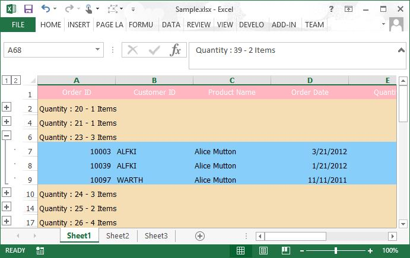

## Cell Customization in Excel while Exporting
The cells can be customized on exporting by using the [CellExporting](https://help.syncfusion.com/cr/cref_files/windowsforms/Syncfusion.SfDataGridConverter.WinForms~Syncfusion.WinForms.DataGridConverter.ExcelExportingOptions~CellExporting_EV.html) event of the `ExcelExportingOptions`.

### Customize Cell Value while Exporting
The cell value can be customized while exporting to excel by using the `CellExporting` event of the `ExcelExportingOption`.


var options = new ExcelExportingOptions();
options.CellExporting += CellExporting;
var excelEngine = sfDataGrid.ExportToExcel(sfDataGrid.View, options);
var workBook = excelEngine.Excel.Workbooks[0];
workBook.SaveAs("Sample.xlsx");

void CellExporting(object sender, Syncfusion.WinForms.DataGridConverter.Events.DataGridCellExcelExportingEventArgs e)
{
    // Based on the column mapping name and the cell type, we can change the cell values while exporting to excel.
    if (e.CellType == ExportCellType.RecordCell && e.ColumnName == "OrderID")
    {
        //if the cell value is Odd, "Y" will be displayed else "N" will be displayed.
        if ((int)e.CellValue % 2 == 0)
            e.Range.Cells[0].Value = "Y";
        else
            e.Range.Cells[0].Value = "N";
        e.Handled = true;
    }
}        


Dim options = New ExcelExportingOptions()
options.CellExporting += CellExporting
Dim excelEngine = sfDataGrid.ExportToExcel(sfDataGrid.View, options)
Dim workBook = excelEngine.Excel.Workbooks(0)
workBook.SaveAs("Sample.xlsx")

Private Sub CellExporting(ByVal sender As Object, ByVal e As Syncfusion.WinForms.DataGridConverter.Events.DataGridCellExcelExportingEventArgs)
	'Based on the column mapping name and the cell type, we can change the cell values while exporting to excel.
	If e.CellType Is ExportCellType.RecordCell AndAlso e.ColumnName = "OrderID" Then
		'if the cell value is Odd, "Y" will be displayed else "N" will be displayed.
		If CInt(Fix(e.CellValue)) Mod 2 = 0 Then
			e.Range.Cells(0).Value = "Y"
		Else
			e.Range.Cells(0).Value = "N"
		End If
		e.Handled = True
	End If
End Sub



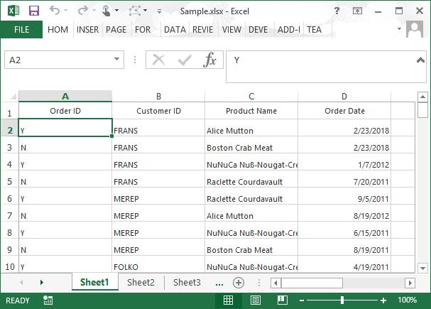

### Changing Row style in Excel based on Data
The rows of the exported excel sheet can be customized based on the record value by using the `CellExporting` event. 


var options = new ExcelExportingOptions();
options.CellExporting +=options_CellExporting; 
var excelEngine = sfDataGrid.ExportToExcel(sfDataGrid.View, options);
var workBook = excelEngine.Excel.Workbooks[0];
workBook.SaveAs("Sample.xlsx");

private void options_CellExporting(object sender, Syncfusion.WinForms.DataGridConverter.Events.DataGridCellExcelExportingEventArgs e)
{          
    if (!(e.NodeEntry is OrderInfo))
        return;
    var record = e.NodeEntry as OrderInfo;
    if (record.CustomerID == "FRANS")
    {
        e.Range.CellStyle.ColorIndex = ExcelKnownColors.Green;
        e.Range.CellStyle.Font.Color = ExcelKnownColors.White;
    }
}        


Private options = New ExcelExportingOptions()
Private options.CellExporting += AddressOf options_CellExporting
Private excelEngine = sfDataGrid.ExportToExcel(sfDataGrid.View, options)
Private workBook = excelEngine.Excel.Workbooks(0)
workBook.SaveAs("Sample.xlsx")

Private Sub options_CellExporting(ByVal sender As Object, ByVal e As Syncfusion.WinForms.DataGridConverter.Events.DataGridCellExcelExportingEventArgs)
	If Not(TypeOf e.NodeEntry Is OrderInfo) Then
		Return
	End If
	Dim record = TryCast(e.NodeEntry, OrderInfo)

	If record.CustomerID = "FRANS" Then
		e.Range.CellStyle.ColorIndex = ExcelKnownColors.Green
		e.Range.CellStyle.Font.Color = ExcelKnownColors.White
	End If
End Sub



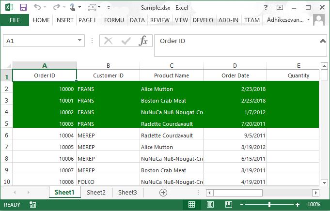

### Customize Cells based on Column Name
The exported cells can be customized based on the column names by using the `CellExporting` event.


var options = new ExcelExportingOptions();
options.CellExporting += Options_CellExporting;
var excelEngine = sfDataGrid.ExportToExcel(sfDataGrid.View, options);
var workBook = excelEngine.Excel.Workbooks[0];
workBook.SaveAs("Sample.xlsx");

private void Options_CellExporting(object sender, Syncfusion.WinForms.DataGridConverter.Events.DataGridCellExcelExportingEventArgs e)
{
    if (e.ColumnName != "OrderID")
        return;
        e.Range.CellStyle.Font.Size = 12;
        e.Range.CellStyle.Font.Color = ExcelKnownColors.Pink;
        e.Range.CellStyle.Font.FontName = "Segoe UI";
}


Private options = New ExcelExportingOptions()
Private options.CellExporting += AddressOf Options_CellExporting
Private excelEngine = sfDataGrid.ExportToExcel(sfDataGrid.View, options)
Private workBook = excelEngine.Excel.Workbooks(0)
workBook.SaveAs("Sample.xlsx")

Private Sub Options_CellExporting(ByVal sender As Object, ByVal e As Syncfusion.WinForms.DataGridConverter.Events.DataGridCellExcelExportingEventArgs)
	If e.ColumnName <> "OrderID" Then
		Return
	End If

	e.Range.CellStyle.Font.Size = 12
	e.Range.CellStyle.Font.Color = ExcelKnownColors.Pink
	e.Range.CellStyle.Font.FontName = "Segoe UI"
End Sub



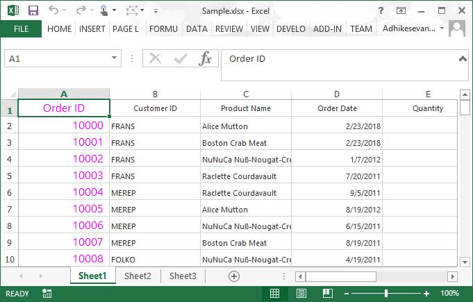

Here, `OrderID` column cells are customized while exporting.

### Changing the border color of cells in Excel document
The border color of the cell will be customized when exporting to Excel by using the [CellExporting](https://help.syncfusion.com/cr/cref_files/windowsforms/Syncfusion.SfDataGridConverter.WinForms~Syncfusion.WinForms.DataGridConverter.ExcelExportingOptions~CellExporting_EV.html) event of the [ExcelExportingOptions.](https://help.syncfusion.com/cr/cref_files/windowsforms/Syncfusion.SfDataGridConverter.WinForms~Syncfusion.WinForms.DataGridConverter.ExcelExportingOptions.html).


ExcelExportingOptions GridExcelExportingOptions = new ExcelExportingOptions();
GridExcelExportingOptions.CellExporting += OnCellExporting;

private void OnCellExporting(object sender, Syncfusion.WinForms.DataGridConverter.Events.DataGridCellExcelExportingEventArgs e)
{
    //Set the border color for the excel cell 
    e.Range.BorderAround(ExcelLineStyle.Medium, ExcelKnownColors.Yellow);
}  


Private GridExcelExportingOptions As New ExcelExportingOptions()
AddHandler CellExporting, AddressOf OnCellExporting

Private Sub OnCellExporting(ByVal sender As Object, ByVal e As Syncfusion.WinForms.DataGridConverter.Events.DataGridCellExcelExportingEventArgs)
	'Set the border color for the excel cell 
	e.Range.BorderAround(ExcelLineStyle.Medium, ExcelKnownColors.Yellow)
End Sub



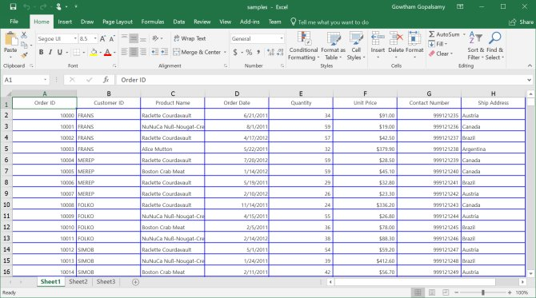

## Customize Exported Workbook and Worksheet
SfDataGrid exports to excel by using [XlsIO](http://help.syncfusion.com/file-formats/xlsio/overview). The [XlsIO documentation](http://help.syncfusion.com/file-formats/xlsio/working-with-excel-worksheet) can also referred for manipulating workbook and sheet after exporting.

### Workbook
SfDataGrid provides option to return ExcelEngine for getting the exported workbook. This allows to protect, encrypt and add worksheet before saving.



var options = new ExcelExportingOptions();
var excelEngine = sfDataGrid.ExportToExcel(sfDataGrid.View, options);
var workBook = excelEngine.Excel.Workbooks[0];
workBook.SaveAs("Sample.xlsx");


Dim options = New ExcelExportingOptions()
Dim excelEngine = sfDataGrid.ExportToExcel(sfDataGrid.View, options)
Dim workBook = excelEngine.Excel.Workbooks(0)
workBook.SaveAs("Sample.xlsx")



### Worksheet Customization
SfDataGrid provides support to export to already existing file or worksheet. In the below code snippet, worksheet is created and passed to `ExportToExcel` method. In the same way, it can open the already existing excel also using XlsIO.



var options = new ExcelExportingOptions();
ExcelEngine excelEngine = new ExcelEngine();
IWorkbook workBook = excelEngine.Excel.Workbooks.Create();
sfDataGrid.ExportToExcel(sfDataGrid.View, options, workBook.Worksheets[0]);
workBook.Version = ExcelVersion.Excel2013;
workBook.SaveAs("Sample.xlsx");


Dim options = New ExcelExportingOptions()
Dim excelEngine As New ExcelEngine()
Dim workBook As IWorkbook = excelEngine.Excel.Workbooks.Create()
sfDataGrid.ExportToExcel(sfDataGrid.View, options, workBook.Worksheets(0))
workBook.Version = ExcelVersion.Excel2013
workBook.SaveAs("Sample.xlsx")



Before saving workbook, set the specific excel version by using [IWorkbook.Version](https://help.syncfusion.com/cr/cref_files/file-formats/Syncfusion.XlsIO.Base~Syncfusion.XlsIO.IWorkbook~Version.html) property. Here, you can directly manipulate the data in the worksheet. Also, refer[here](http://help.syncfusion.com/file-formats/xlsio/worksheet-rows-and-columns-manipulation) for more information about the worksheet customization.

#### Setting Borders
The borders of the excel cells can be set by directly accessing worksheet after exporting data.


var options = new ExcelExportingOptions();
options.ExcelVersion = ExcelVersion.Excel2013;
var excelEngine = sfDataGrid.ExportToExcel(sfDataGrid.View, options);
var workBook = excelEngine.Excel.Workbooks[0];
workBook.Worksheets[0].UsedRange.BorderInside(ExcelLineStyle.Dash_dot, ExcelKnownColors.Black);
workBook.Worksheets[0].UsedRange.BorderAround(ExcelLineStyle.Dash_dot, ExcelKnownColors.Black);
workBook.SaveAs("Sample.xlsx");


var options = new ExcelExportingOptions();
options.ExcelVersion = ExcelVersion.Excel2013;
var excelEngine = sfDataGrid.ExportToExcel(sfDataGrid.View, options);
var workBook = excelEngine.Excel.Workbooks[0];
workBook.Worksheets[0].UsedRange.BorderInside(ExcelLineStyle.Dash_dot, ExcelKnownColors.Black);
workBook.Worksheets[0].UsedRange.BorderAround(ExcelLineStyle.Dash_dot, ExcelKnownColors.Black);
workBook.SaveAs("Sample.xlsx");



#### Enabling Filters
The filters can be shown in the exported worksheet by enabling the filter for the exported range of the worksheet.


var options = new ExcelExportingOptions();
options.ExcelVersion = ExcelVersion.Excel2013;
var excelEngine = sfDataGrid.ExportToExcel(sfDataGrid.View, options);
var workBook = excelEngine.Excel.Workbooks[0];
workBook.Worksheets[0].AutoFilters.FilterRange = workBook.Worksheets[0].UsedRange;
workBook.SaveAs("Sample.xlsx");


Dim options = New ExcelExportingOptions()
options.ExcelVersion = ExcelVersion.Excel2013
Dim excelEngine = sfDataGrid.ExportToExcel(sfDataGrid.View, options)
Dim workBook = excelEngine.Excel.Workbooks(0)
workBook.Worksheets(0).AutoFilters.FilterRange = workBook.Worksheets(0).UsedRange
workBook.SaveAs("Sample.xlsx")



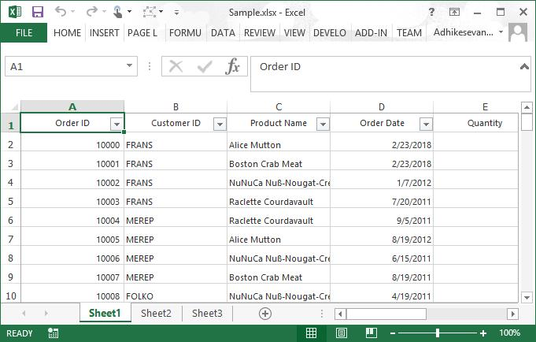

While using stacked headers, the range can be specified by based on stacked headers count.


var options = new ExcelExportingOptions();
options.ExcelVersion = ExcelVersion.Excel2013;
options.ExportStackedHeaders = true;
var excelEngine = sfDataGrid.ExportToExcel(sfDataGrid.View, options);
var workBook = excelEngine.Excel.Workbooks[0];
var range = "A" + (sfDataGrid.StackedHeaderRows.Count + 1).ToString() + ":" + workBook.Worksheets[0].UsedRange.End.AddressLocal;
excelEngine.Excel.Workbooks[0].Worksheets[0].AutoFilters.FilterRange = workBook.Worksheets[0].Range[range];
workBook.SaveAs("Sample.xlsx");


Dim options = New ExcelExportingOptions()
options.ExcelVersion = ExcelVersion.Excel2013
options.ExportStackedHeaders = True
Dim excelEngine = sfDataGrid.ExportToExcel(sfDataGrid.View, options)
Dim workBook = excelEngine.Excel.Workbooks(0)
Dim range = "A" & (sfDataGrid.StackedHeaderRows.Count + 1).ToString() & ":" & workBook.Worksheets(0).UsedRange.End.AddressLocal
excelEngine.Excel.Workbooks(0).Worksheets(0).AutoFilters.FilterRange = workBook.Worksheets(0).Range(range)
workBook.SaveAs("Sample.xlsx")



Also refer the [XlsIO document](https://help.syncfusion.com/file-formats/xlsio/worksheet-cells-manipulation#data-filtering) for more customization about the filtering.

## Customizing the Range of Cells
The range of cells of the exported worksheet can be customized by directly manipulating worksheet.


var options = new ExcelExportingOptions();
options.ExcelVersion = ExcelVersion.Excel2013;
var excelEngine = sfDataGrid.ExportToExcel(sfDataGrid.View, options);
var workBook = excelEngine.Excel.Workbooks[0];
workBook.Worksheets[0].Range["A2:A6"].CellStyle.Color = System.Drawing.Color.LightSlateGray;
workBook.Worksheets[0].Range["A2:A6"].CellStyle.Font.Color = ExcelKnownColors.White;
workBook.SaveAs("Sample.xlsx");


Dim options = New ExcelExportingOptions()
options.ExcelVersion = ExcelVersion.Excel2013
Dim excelEngine = sfDataGrid.ExportToExcel(sfDataGrid.View, options)
Dim workBook = excelEngine.Excel.Workbooks(0)
workBook.Worksheets(0).Range("A2:A6").CellStyle.Color = System.Drawing.Color.LightSlateGray
workBook.Worksheets(0).Range("A2:A6").CellStyle.Font.Color = ExcelKnownColors.White
workBook.SaveAs("Sample.xlsx")



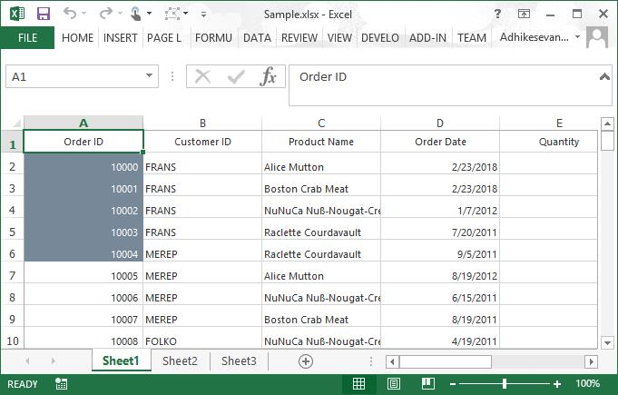

#### Exporting Multiple SfDataGrid to Single Excel Sheet
The multiple grids can also be exported to the same worksheet by using the `UsedRange.CopyTo` method.


var options = new ExcelExportingOptions();
options.ExcelVersion = ExcelVersion.Excel2010;
SfDataGrid sfDataGrid1 = new SfDataGrid();
sfDataGrid1.DataSource = new OrderInfoCollection().OrdersListDetails;
var excelEngine = sfDataGrid.ExportToExcel(sfDataGrid.View, options);
var workBook1 = excelEngine.Excel.Workbooks[0];
var worksheet1 = workBook1.Worksheets[0];
excelEngine = sfDataGrid1.ExportToExcel(sfDataGrid1.View, options);
var workBook2 = excelEngine.Excel.Workbooks[0];
var worksheet2 = workBook2.Worksheets[0];
var columnCount = sfDataGrid.Columns.Count;
//Merge the One SfDataGrid WorkSheet into the other SfDataGrid WorkSheet
worksheet2.UsedRange.CopyTo(worksheet1[1, columnCount + 1]);
workBook1.SaveAs("sample.xlsx");


Dim options = New ExcelExportingOptions()
options.ExcelVersion = ExcelVersion.Excel2010

Dim sfDataGrid1 As New SfDataGrid()
sfDataGrid1.DataSource = New OrderInfoCollection().OrdersListDetails

Dim excelEngine = sfDataGrid.ExportToExcel(sfDataGrid.View, options)
Dim workBook1 = excelEngine.Excel.Workbooks(0)
Dim worksheet1 = workBook1.Worksheets(0)

excelEngine = sfDataGrid1.ExportToExcel(sfDataGrid1.View, options)
Dim workBook2 = excelEngine.Excel.Workbooks(0)
Dim worksheet2 = workBook2.Worksheets(0)

Dim columnCount = sfDataGrid.Columns.Count
'Merge the One SfDataGrid WorkSheet into the other SfDataGrid WorkSheet
worksheet2.UsedRange.CopyTo(worksheet1(1, columnCount + 1))
workBook1.SaveAs("sample.xlsx")



## Performance
Using [ExcelExportingOptions.CellExporting](https://help.syncfusion.com/cr/cref_files/windowsforms/Syncfusion.SfDataGridConverter.WinForms~Syncfusion.WinForms.DataGridConverter.ExcelExportingOptions~CellExporting_EV.html) event and changing settings for each cell will consume more memory and time consumption. So, avoid using CellsExporting event and instead of that, do the required settings in the exported sheet.

### Formatting Columns without using Event
The cell level customization such as row-level styling, formatting particular column can be performed in the exported worksheet.
In the below code snippet, `NumberFormat` for Unit Price column is changed in the exported sheet after exporting without using `CellsExporting` event.


var options = new ExcelExportingOptions();
options.ExportMode = ExportMode.Value;
options.ExcelVersion = ExcelVersion.Excel2013;
var excelEngine = sfDataGrid.ExportToExcel(sfDataGrid.View, options);
IWorkbook workBook = excelEngine.Excel.Workbooks[0];
workBook.ActiveSheet.Columns[5].NumberFormat = "0.0";
workBook.SaveAs("Sample.xlsx");


Dim options = New ExcelExportingOptions()
options.ExportMode = ExportMode.Value
options.ExcelVersion = ExcelVersion.Excel2013
Dim excelEngine = sfDataGrid.ExportToExcel(sfDataGrid.View, options)
Dim workBook As IWorkbook = excelEngine.Excel.Workbooks(0)
workBook.ActiveSheet.Columns(5).NumberFormat = "0.0"
workBook.SaveAs("Sample.xlsx")



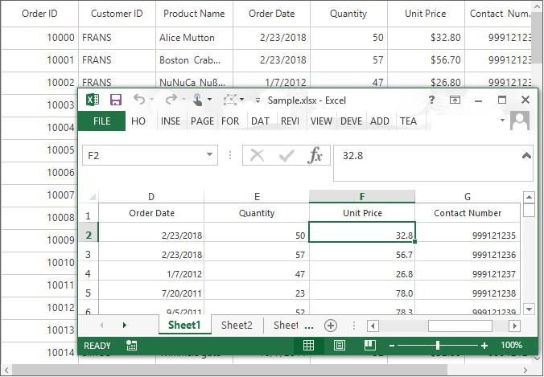

### Alternate Row Styling without using the Event
In the below code snippet, the background color of rows in excel is changed based on row index using conditional formatting for better performance.



var options = new ExcelExportingOptions();
options.ExportMode = ExportMode.Value;
options.ExcelVersion = ExcelVersion.Excel2013;
var excelEngine = sfDataGrid.ExportToExcel(sfDataGrid.View, options);
IWorkbook workBook = excelEngine.Excel.Workbooks[0];

IConditionalFormats condition = workBook.ActiveSheet.Range[2, 1, this.sfDataGrid.View.Records.Count + 1, this.sfDataGrid.Columns.Count].ConditionalFormats;
IConditionalFormat condition1 = condition.AddCondition();
condition1.FormatType = ExcelCFType.Formula;
condition1.FirstFormula = "MOD(ROW(),2)=0";
condition1.BackColorRGB = System.Drawing.Color.Pink;
IConditionalFormat condition2 = condition.AddCondition();
condition2.FormatType = ExcelCFType.Formula;
condition2.FirstFormula = "MOD(ROW(),2)=1";
condition2.BackColorRGB = System.Drawing.Color.LightGray;
workBook.SaveAs("Sample.xlsx");


Dim options = New ExcelExportingOptions()
options.ExportMode = ExportMode.Value
options.ExcelVersion = ExcelVersion.Excel2013
Dim excelEngine = sfDataGrid.ExportToExcel(sfDataGrid.View, options)
Dim workBook As IWorkbook = excelEngine.Excel.Workbooks(0)

Dim condition As IConditionalFormats = workBook.ActiveSheet.Range(2, 1, Me.sfDataGrid.View.Records.Count + 1, Me.sfDataGrid.Columns.Count).ConditionalFormats
Dim condition1 As IConditionalFormat = condition.AddCondition()
condition1.FormatType = ExcelCFType.Formula
condition1.FirstFormula = "MOD(ROW(),2)=0"
condition1.BackColorRGB = System.Drawing.Color.Pink
Dim condition2 As IConditionalFormat = condition.AddCondition()
condition2.FormatType = ExcelCFType.Formula
condition2.FirstFormula = "MOD(ROW(),2)=1"
condition2.BackColorRGB = System.Drawing.Color.LightGray
workBook.SaveAs("Sample.xlsx")



Refer the [XlsIO document](http://help.syncfusion.com/file-formats/xlsio/working-with-conditional-formatting) for the conditional customization.
