# Rows

## Row Header

Row Header is a special column which is placed as first cell of each row. Row header can be shown or hidden by setting [ShowRowHeader](https://help.syncfusion.com/cr/cref_files/windowsforms/Syncfusion.SfDataGrid.WinForms~Syncfusion.WinForms.DataGrid.SfDataGrid~ShowRowHeader.html) property.



this.sfDataGrid.ShowRowHeader = true;


Me.sfDataGrid.ShowRowHeader = True



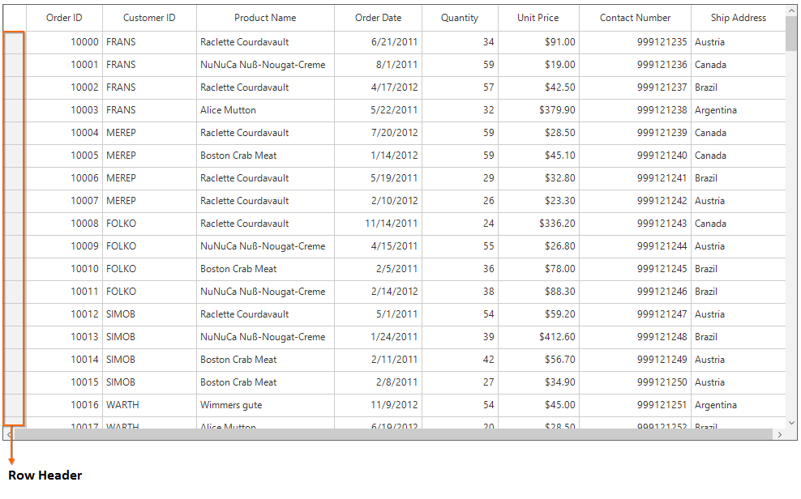

### Appearance

The appearance of row header can be customized by setting the [SfDataGrid.RowHeaderStyle](https://help.syncfusion.com/cr/cref_files/windowsforms/Syncfusion.SfDataGrid.WinForms~Syncfusion.WinForms.DataGrid.Styles.DataGridStyle~RowHeaderStyle.html) property. The `RowHeaderStyle` property contains all the settings that are needed for the row header appearance customization.



this.sfDataGrid1.Style.RowHeaderStyle.BackColor = Color.CadetBlue;


Me.sfDataGrid1.Style.RowHeaderStyle.BackColor = Color.CadetBlue



### Selection marker customization
The appearance of the selection marker can be customized using the selection marker properties in `RowHeaderStyle`.



this.sfDataGrid.Style.RowHeaderStyle.SelectionMarkerThickness = 4;
this.sfDataGrid.Style.RowHeaderStyle.SelectionMarkerColor = Color.Red;
this.sfDataGrid.Style.RowHeaderStyle.SelectionBackColor = Color.White;


Me.sfDataGrid.Style.RowHeaderStyle.SelectionMarkerThickness = 4
Me.sfDataGrid.Style.RowHeaderStyle.SelectionMarkerColor = Color.Red
Me.sfDataGrid.Style.RowHeaderStyle.SelectionBackColor = Color.White



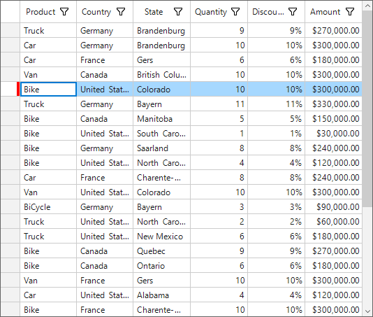

### Row Indicators and its Description

<table>
<tr>
<td>
{{'**Row Indicator **'| markdownify }}
</td>
<td>
{{'**Description**'| markdownify }}
</td>
</tr>
<tr>
<td>

</td>
<td>
Denotes row is AddNewRow.
</td>
</tr>
<tr>
<td>

</td>
<td>
Denotes that the current row which has errors.
</td>
</tr>
</table>

### Showing the Numbered Row Header

RowHeader cell can be customized by using [DrawCell](https://help.syncfusion.com/cr/cref_files/windowsforms/Syncfusion.SfDataGrid.WinForms~Syncfusion.WinForms.DataGrid.SfDataGrid~DrawCell_EV.html) event which is raised for each cell. The default column index of the row header cell is zero, the  style settings for a row header can be applied by using column index when it is enabled in SfDataGrid. 
By default, the row header does not have the cell values. The numbers or any text can be set in the row header by setting the [DisplayText](https://help.syncfusion.com/cr/cref_files/windowsforms/Syncfusion.SfDataGrid.WinForms~Syncfusion.WinForms.DataGrid.Events.DrawCellEventArgs~DisplayText.html) which is available in the [DrawCellEventArgs](https://help.syncfusion.com/cr/cref_files/windowsforms/Syncfusion.SfDataGrid.WinForms~Syncfusion.WinForms.DataGrid.Events.DrawCellEventArgs.html) of `DrawCell` event.



this.sfDataGrid1.DrawCell += SfDataGrid1_DrawCell;

private void SfDataGrid1_DrawCell(object sender, DrawCellEventArgs e)
{
    if (sfDataGrid1.ShowRowHeader && e.RowIndex != 0)
    {
        if (e.ColumnIndex == 0)
        {
            e.DisplayText = e.RowIndex.ToString();
        }

    }
}


AddHandler sfDataGrid1.DrawCell, AddressOf SfDataGrid1_DrawCell

Private Sub SfDataGrid1_DrawCell(ByVal sender As Object, ByVal e As DrawCellEventArgs)
	If sfDataGrid1.ShowRowHeader AndAlso e.RowIndex <> 0 Then
		If e.ColumnIndex = 0 Then
			e.DisplayText = e.RowIndex.ToString()
		End If

	End If
End Sub



### Showing the image in RowHeader

You can display an image in the [RowHeader](https://help.syncfusion.com/cr/windowsforms/Syncfusion.Grid.Windows~Syncfusion.Windows.Forms.Grid.GridBaseStylesMap~RowHeader.html) by using the [SfDataGrid.DrawCell](https://help.syncfusion.com/cr/cref_files/windowsforms/Syncfusion.SfDataGrid.WinForms~Syncfusion.WinForms.DataGrid.SfDataGrid~DrawCell_EV.html) event and by customizing the [GridRowHeaderCellRenderer](https://help.syncfusion.com/cr/windowsforms/Syncfusion.SfDataGrid.WinForms~Syncfusion.WinForms.DataGrid.Renderers.GridRowHeaderCellRenderer.html).

#### Using DrawCell event 

The [RowHeader](https://help.syncfusion.com/cr/windowsforms/Syncfusion.Grid.Windows~Syncfusion.Windows.Forms.Grid.GridBaseStylesMap~RowHeader.html) cell can be customized by using the [DrawCell](https://help.syncfusion.com/cr/cref_files/windowsforms/Syncfusion.SfDataGrid.WinForms~Syncfusion.WinForms.DataGrid.SfDataGrid~DrawCell_EV.html) event raised for each cell. The default column index of the row header cell is zero. The style settings for a row header can be applied using the column index when it is enabled in the SfDataGrid. The image can be drawn in the row header using `DrawImage`.          



sfDataGrid.DrawCell += OnSfDataGridDrawCell;

private void OnSfDataGridDrawCell(object sender, Syncfusion.WinForms.DataGrid.Events.DrawCellEventArgs e)
{
    if (sfDataGrid.ShowRowHeader && e.RowIndex != 0)
    {
        double value = (e.DataRow.RowData as OrderInfo).UnitPrice;
        if (e.ColumnIndex == 0)
        {
            e.Handled = true;
            Rectangle rect = new Rectangle(e.Bounds.X + 3, e.Bounds.Y + 5, e.Bounds.Width - 3, e.Bounds.Height - 5);
            e.Graphics.FillRectangle(new SolidBrush(sfDataGrid.Style.RowHeaderStyle.BackColor), new Rectangle(e.Bounds.X + 1, e.Bounds.Y + 1, e.Bounds.Width - 1, e.Bounds.Height - 1));
            //Draw the image on RowHeader
            if (value >= 0 && value < 50)
                e.Graphics.DrawImage(new Bitmap(Image.FromFile(@"..\..\Images\Yellow.png")), rect);
            else if (value > 51 && value < 100)
                e.Graphics.DrawImage(new Bitmap(Image.FromFile(@"..\..\Images\Green.png")), rect);
            else if (value > 101 && value < 600)
                e.Graphics.DrawImage(new Bitmap(Image.FromFile(@"..\..\Images\Red.png")), rect);
            e.Graphics.DrawLine(new Pen(ColorTranslator.FromHtml("#CCCCCC")), e.Bounds.Left, e.Bounds.Bottom, e.Bounds.Right, e.Bounds.Bottom);
        }
    }
}


AddHandler sfDataGrid.DrawCell, AddressOf OnSfDataGridDrawCell

Private Sub OnSfDataGridDrawCell(ByVal sender As Object, ByVal e As Syncfusion.WinForms.DataGrid.Events.DrawCellEventArgs)
	If sfDataGrid.ShowRowHeader AndAlso e.RowIndex <> 0 Then
		Dim value As Double = (TryCast(e.DataRow.RowData, OrderInfo)).UnitPrice
		If e.ColumnIndex = 0 Then
			e.Handled = True
			Dim rect As New Rectangle(e.Bounds.X + 3, e.Bounds.Y + 5, e.Bounds.Width - 3, e.Bounds.Height - 5)
			e.Graphics.FillRectangle(New SolidBrush(sfDataGrid.Style.RowHeaderStyle.BackColor), New Rectangle(e.Bounds.X + 1, e.Bounds.Y + 1, e.Bounds.Width - 1, e.Bounds.Height - 1))
			'Draw the image on RowHeader
			If value >= 0 AndAlso value < 50 Then
				e.Graphics.DrawImage(New Bitmap(Image.FromFile("..\..\Images\Yellow.png")), rect)
			ElseIf value > 51 AndAlso value < 100 Then
				e.Graphics.DrawImage(New Bitmap(Image.FromFile("..\..\Images\Green.png")), rect)
			ElseIf value > 101 AndAlso value < 600 Then
				e.Graphics.DrawImage(New Bitmap(Image.FromFile("..\..\Images\Red.png")), rect)
			End If
			e.Graphics.DrawLine(New Pen(ColorTranslator.FromHtml("#CCCCCC")), e.Bounds.Left, e.Bounds.Bottom, e.Bounds.Right, e.Bounds.Bottom)
		End If
	End If
End Sub



#### Using custom RowHeaderCellRenderer

The following code shows how to draw an image in the row header by overriding the [OnRender](https://help.syncfusion.com/cr/windowsforms/Syncfusion.SfDataGrid.WinForms~Syncfusion.WinForms.DataGrid.Renderers.GridRowHeaderCellRenderer~OnRender.html) method in [GridRowHeaderCellRenderer](https://help.syncfusion.com/cr/windowsforms/Syncfusion.SfDataGrid.WinForms~Syncfusion.WinForms.DataGrid.Renderers.GridRowHeaderCellRenderer.html).



this.sfDataGrid.CellRenderers["RowHeader"] = new CustomRowHeaderCellRenderer(sfDataGrid);

public class CustomRowHeaderCellRenderer : GridRowHeaderCellRenderer
{
    SfDataGrid DataGrid { get; set; }
    public CustomRowHeaderCellRenderer(SfDataGrid dataGrid)
    {
        DataGrid = dataGrid;
    }
    protected override void OnRender(Graphics paint, Rectangle cellRect, string cellValue, CellStyleInfo style, DataColumnBase column, RowColumnIndex rowColumnIndex)
    {
        var rowData = this.DataGrid.View.Records[rowColumnIndex.RowIndex];
        double value = (rowData.Data as OrderInfo).UnitPrice;
        //Draw the image on RowHeader
        if (rowColumnIndex.RowIndex > 0)
        {
            if (value > 0 && value < 50)
                paint.DrawImage(new Bitmap(Image.FromFile(@"..\..\Images\Yellow.png")), new Rectangle(cellRect.X + 3, cellRect.Y + 5, cellRect.Width - 3, cellRect.Height - 5));
            else if (value > 51 && value < 100)
                paint.DrawImage(new Bitmap(Image.FromFile(@"..\..\Images\Green.png")), new Rectangle(cellRect.X + 3, cellRect.Y + 5, cellRect.Width - 3, cellRect.Height - 5));
            else if (value > 101 && value < 600)
                paint.DrawImage(new Bitmap(Image.FromFile(@"..\..\Images\Red.png")), new Rectangle(cellRect.X + 3, cellRect.Y + 5, cellRect.Width - 3, cellRect.Height - 5));
        }
    }
}


Public Class CustomRowHeaderCellRenderer
	Inherits GridRowHeaderCellRenderer
	Private Property DataGrid() As SfDataGrid
	Public Sub New(ByVal dataGrid As SfDataGrid)
		Me.DataGrid = dataGrid
	End Sub
	Protected Overrides Sub OnRender(ByVal paint As Graphics, ByVal cellRect As Rectangle, ByVal cellValue As String, ByVal style As CellStyleInfo, ByVal column As DataColumnBase, ByVal rowColumnIndex As RowColumnIndex)
		Dim rowData = Me.DataGrid.View.Records(rowColumnIndex.RowIndex)
		Dim value As Double = (TryCast(rowData.Data, OrderInfo)).UnitPrice
		'Draw the image on RowHeader
		If rowColumnIndex.RowIndex > 0 Then
			If value > 0 AndAlso value < 50 Then
				paint.DrawImage(New Bitmap(Image.FromFile("..\..\Images\Yellow.png")), New Rectangle(cellRect.X + 3, cellRect.Y + 5, cellRect.Width - 3, cellRect.Height - 5))
			ElseIf value > 51 AndAlso value < 100 Then
				paint.DrawImage(New Bitmap(Image.FromFile("..\..\Images\Green.png")), New Rectangle(cellRect.X + 3, cellRect.Y + 5, cellRect.Width - 3, cellRect.Height - 5))
			ElseIf value > 101 AndAlso value < 600 Then
				paint.DrawImage(New Bitmap(Image.FromFile("..\..\Images\Red.png")), New Rectangle(cellRect.X + 3, cellRect.Y + 5, cellRect.Width - 3, cellRect.Height - 5))
			End If
		End If
	End Sub
End Class



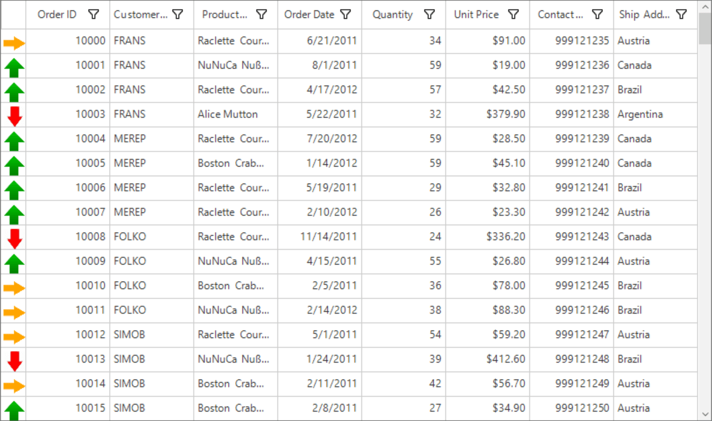

## Header Row

Header row is present in top of the SfDataGrid which has column headers in it. Column header describes the caption to identify the column content.

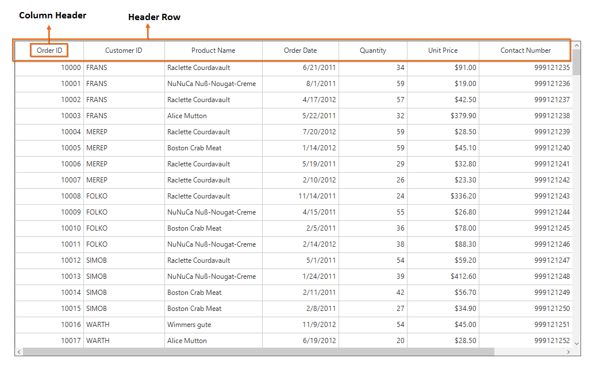

### Appearance

The Appearance of the header row can be customized by using [SfDataGrid.Style.HeaderStyle](https://help.syncfusion.com/cr/cref_files/windowsforms/Syncfusion.SfDataGrid.WinForms~Syncfusion.WinForms.DataGrid.Styles.DataGridStyle~HeaderStyle.html) property.



this.sfDataGrid1.Style.HeaderStyle.BackColor = Color.AliceBlue;
this.sfDataGrid1.Style.HeaderStyle.TextColor = Color.DarkSlateBlue;
this.sfDataGrid1.Style.HeaderStyle.Font.Bold = true;


Me.sfDataGrid1.Style.HeaderStyle.BackColor = Color.AliceBlue
Me.sfDataGrid1.Style.HeaderStyle.TextColor = Color.DarkSlateBlue
Me.sfDataGrid1.Style.HeaderStyle.Font.Bold = True



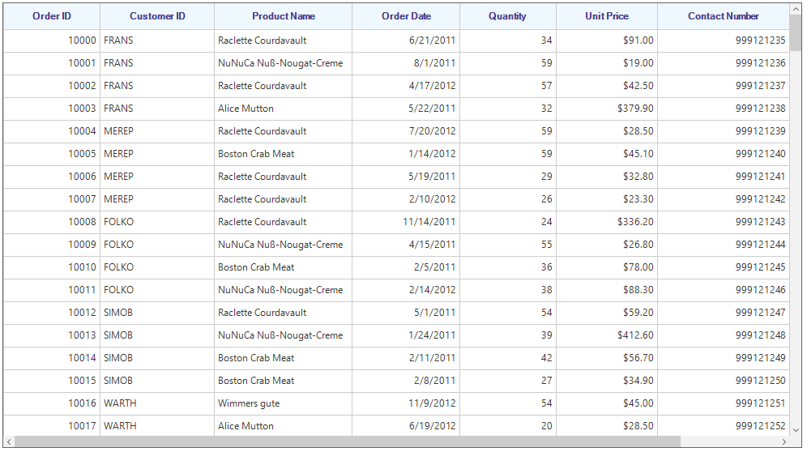

The appearance of any particular column header can be customized by using 
[GridColumnBase.HeaderStyle](https://help.syncfusion.com/cr/cref_files/windowsforms/Syncfusion.SfDataGrid.WinForms~Syncfusion.WinForms.DataGrid.GridColumnBase~HeaderStyle.html) property.



this.sfDataGrid1.Columns["OrderID"].HeaderStyle.BackColor = Color.LightCoral;
this.sfDataGrid1.Columns["OrderID"].HeaderStyle.TextColor = Color.DarkRed;
this.sfDataGrid1.Columns["OrderID"].HeaderStyle.Font.Bold = true;


this.sfDataGrid1.Columns["OrderID"].HeaderStyle.BackColor = Color.LightCoral;
this.sfDataGrid1.Columns["OrderID"].HeaderStyle.TextColor = Color.DarkRed;
this.sfDataGrid1.Columns["OrderID"].HeaderStyle.Font.Bold = true;



### Font orientation for Header Row

Font orientation of the header row can be set by using the [HeaderStyle.Font.Orientation](https://help.syncfusion.com/cr/cref_files/windowsforms/Syncfusion.SfDataGrid.WinForms~Syncfusion.WinForms.DataGrid.Styles.DataGridStyle~HeaderStyle.html) property.



this.sfDataGrid1.HeaderRowHeight = 80;
this.sfDataGrid1.Style.HeaderStyle.Font.Orientation = 45;


this.sfDataGrid1.HeaderRowHeight = 80;
this.sfDataGrid1.Style.HeaderStyle.Font.Orientation = 45;



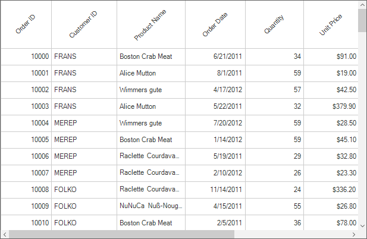

### Text alignment for Header Row

The text alignment of the header cells can be changed by using [HeaderStyle.HorizontalAlignment](https://help.syncfusion.com/cr/cref_files/windowsforms/Syncfusion.SfDataGrid.WinForms~Syncfusion.WinForms.DataGrid.Styles.CellStyleInfo~HorizontalAlignment.html) and [HeaderStyle.VerticalAlignment](https://help.syncfusion.com/cr/cref_files/windowsforms/Syncfusion.SfDataGrid.WinForms~Syncfusion.WinForms.DataGrid.Styles.CellStyleInfo~VerticalAlignment.html) properties respectively.



//Change alignment for the header cells.
this.sfDataGrid1.Style.HeaderStyle.HorizontalAlignment = HorizontalAlignment.Center;
this.sfDataGrid1.Style.HeaderStyle.VerticalAlignment = System.Windows.Forms.VisualStyles.VerticalAlignment.Top;



'Change alignment for the header cells.
Me.sfDataGrid.Style.HeaderStyle.HorizontalAlignment = HorizontalAlignment.Center
Me.sfDataGrid.Style.HeaderStyle.VerticalAlignment = System.Windows.Forms.VisualStyles.VerticalAlignment.Top




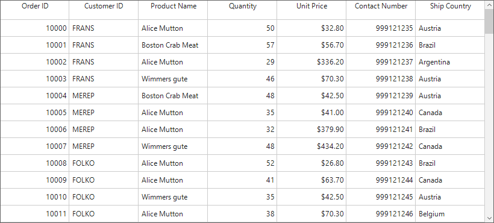

### Hiding Header Row

The header row can be hide by setting [SfDataGrid.HeaderRowHeight](https://help.syncfusion.com/cr/cref_files/windowsforms/Syncfusion.SfDataGrid.WinForms~Syncfusion.WinForms.DataGrid.SfDataGrid~HeaderRowHeight.html) property as `0` (zero).


this.sfDataGrid1.HeaderRowHeight = 0;


Me.sfDataGrid1.HeaderRowHeight = 0



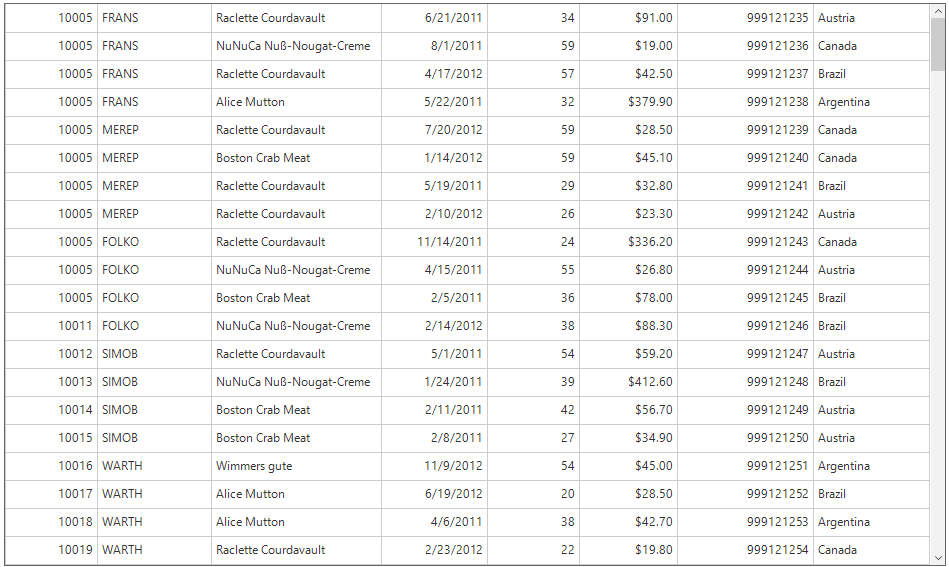

## Freeze Panes 
The rows and column can freeze in view like excel. The rows and columns can be freeze by setting following properties,

<table>
<tr>
<td>
Property Name
</td>
<td>
Description
</td>
</tr>
<tr>
<td>
{{'[FrozenRowCount](https://help.syncfusion.com/cr/cref_files/windowsforms/Syncfusion.SfDataGrid.WinForms~Syncfusion.WinForms.DataGrid.SfDataGrid~FrozenRowCount.html)'| markdownify }}
</td>
<td>
Set the frozen rows count at top of the SfDataGrid.
</td>
</tr>
<tr>
<td>
{{'[FooterRowCount](https://help.syncfusion.com/cr/cref_files/windowsforms/Syncfusion.SfDataGrid.WinForms~Syncfusion.WinForms.DataGrid.SfDataGrid~FooterRowCount.html)'| markdownify }}
</td>
<td>
Set the footer rows count at bottom of the SfDataGrid.
</td>
</tr>
<tr>
<td>
{{'[FrozenColumnCount](https://help.syncfusion.com/cr/cref_files/windowsforms/Syncfusion.SfDataGrid.WinForms~Syncfusion.WinForms.DataGrid.SfDataGrid~FrozenColumnCount.html)'| markdownify }}
</td>
<td>
Set the frozen columns count in left side of the SfDataGrid.
</td>
</tr>
<tr>
<td>
{{'[FooterColumnCount](https://help.syncfusion.com/cr/cref_files/windowsforms/Syncfusion.SfDataGrid.WinForms~Syncfusion.WinForms.DataGrid.SfDataGrid~FooterColumnCount.html)'| markdownify }}
</td>
<td>
Set the footer columns in right side of the SfDataGrid.
</td>
</tr>
</table>

### Freezing Rows
The rows can be freeze in view at top and bottom like Excel by setting the `FrozenRowCount` and `FooterRowCount` properties.



// Freeze rows at top
this.sfDataGrid.FrozenRowCount = 3;

// Freeze rows at bottom
this.sfDataGrid.FooterRowCount = 2;


' Freeze rows at top
Me.sfDataGrid.FrozenRowCount = 3

' Freeze rows at bottom
Me.sfDataGrid.FooterRowCount = 2



### Freezing Columns
The columns can be freeze in view at left and right like Excel by setting the `FrozenColumnCount` and `FooterColumnCount` properties.


// Freeze columns at left
this.sfDataGrid.FooterColumnCount = 2;

// Freeze columns at right
this.sfDataGrid.FrozenColumnCount = 2;


' Freeze columns at left
Me.sfDataGrid.FooterColumnCount = 2

' Freeze columns at right
Me.sfDataGrid.FrozenColumnCount = 2



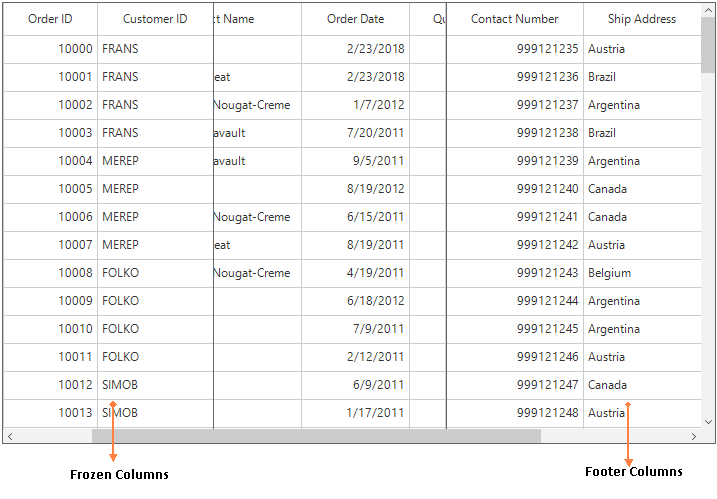

### Appearance

#### Freeze Line Appearance

The appearance of freeze pane line can be customized by setting the [FreezePaneLineStyle](https://help.syncfusion.com/cr/cref_files/windowsforms/Syncfusion.SfDataGrid.WinForms~Syncfusion.WinForms.DataGrid.Styles.DataGridStyle~FreezePaneLineStyle.html) property. The `FreezePaneLineStyle` property contains all the settings that are needed for the freeze pane line appearance customization.


this.sfDataGrid.Style.FreezePaneLineStyle.Color = System.Drawing.Color.BlueViolet;


Me.sfDataGrid.Style.FreezePaneLineStyle.Color = System.Drawing.Color.BlueViolet



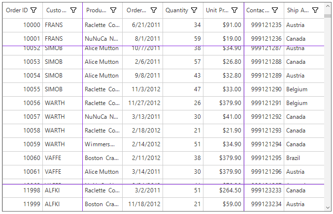

#### Freeze Line Weight
Freeze line weight or thickness can be changed by setting the [FreezePaneLineStyle.Weight](https://help.syncfusion.com/cr/cref_files/windowsforms/Syncfusion.SfDataGrid.WinForms~Syncfusion.WinForms.DataGrid.Styles.FreezePaneLineStyleInfo~Weight.html) property.


this.sfDataGrid.Style.FreezePaneLineStyle.Weight = 3;


Me.sfDataGrid.Style.FreezePaneLineStyle.Weight = 3



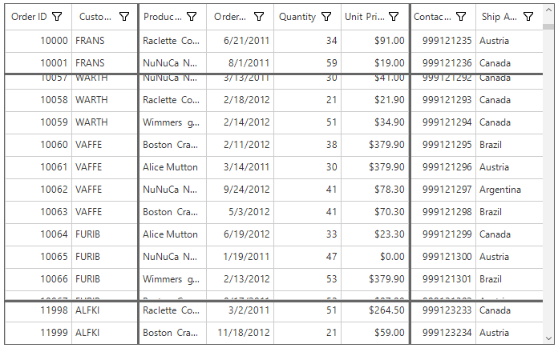

#### Changing the Freeze Line Style
An appearance of the freeze pane line can be customized by using [DrawFreezePaneLine](https://help.syncfusion.com/cr/cref_files/windowsforms/Syncfusion.SfDataGrid.WinForms~Syncfusion.WinForms.DataGrid.SfDataGrid~DrawFreezePaneLine_EV.html) event. The freeze pane line type can be check by using [LineType](https://help.syncfusion.com/cr/cref_files/windowsforms/Syncfusion.SfDataGrid.WinForms~Syncfusion.WinForms.DataGrid.Events.DrawFreezePaneLineArgs~LineType.html) property which indicates freeze pane line type such as `FrozenRow`, `FooterRow`, `FrozenColumn`, `FooterColumn. The `e.Handled` property which is available in the 
[Draw​Freeze​Pane​Line​Args ](https://help.syncfusion.com/cr/cref_files/windowsforms/Syncfusion.SfDataGrid.WinForms~Syncfusion.WinForms.DataGrid.Events.DrawFreezePaneLineArgs.html) should be enabled to draw the custom line.


this.sfDataGrid.DrawFreezePaneLine += SfDataGrid_DrawFreezePaneLine;

private void SfDataGrid_DrawFreezePaneLine(object sender, DrawFreezePaneLineArgs e)
{
    Pen pen=new Pen(Color.Red, 2);
    pen.DashStyle = DashStyle.Dash;
    if (e.LineType == LineType.FrozenRow || e.LineType == LineType.FooterRow || e.LineType == LineType.FooterColumn)
    {
        e.Graphics.DrawLine(pen, e.Point1, e.Point2);
        e.Handled = true;
    }
}


AddHandler sfDataGrid.DrawFreezePaneLine, AddressOf SfDataGrid_DrawFreezePaneLine

Private Sub SfDataGrid_DrawFreezePaneLine(ByVal sender As Object, ByVal e As DrawFreezePaneLineArgs)
	Dim pen As New Pen(Color.Red, 2)
	pen.DashStyle = DashStyle.Dash

	If e.LineType = LineType.FrozenRow OrElse e.LineType Is LineType.FooterRow OrElse e.LineType = LineType.FooterColumn Then
		e.Graphics.DrawLine(pen, e.Point1, e.Point2)
		e.Handled = True
	End If
End Sub



#### Changing the Back Color of Freeze Line based on Freeze Line LineType
By default, the back color of the freeze pane line cannot be changed based on the freeze pane line type. But it can be customized by drawing the line using the `DrawFreezePaneLine` event based on the freeze pane line type. The `e.Handled` property which is available in the `DrawFreezePane​Line​Args` should be enabled to draw the custom line.



this.sfDataGrid.DrawFreezePaneLine += SfDataGrid_DrawFreezePaneLine;

private void SfDataGrid_DrawFreezePaneLine(object sender, DrawFreezePaneLineArgs e)
{
    if (e.LineType == LineType.FrozenRow)
    {
        e.Graphics.DrawLine(new Pen(Color. DeepSkyBlue, 2), e.Point1, e.Point2);
        e.Handled = true;
    }
    if (e.LineType == LineType.FooterRow)
    {
        e.Graphics.DrawLine(new Pen(Color. BlueViolet, 2), e.Point1, e.Point2);
        e.Handled = true;
    }
    if (e.LineType == LineType.FrozenColumn)
    {
        e.Graphics.DrawLine(new Pen(Color.Magenta, 2), e.Point1, e.Point2);
        e.Handled = true;
    }
    if (e.LineType == LineType.FooterColumn)
    {
        e.Graphics.DrawLine(new Pen(Color.Red, 2), e.Point1, e.Point2);
        e.Handled = true;
    }
}


AddHandler sfDataGrid.DrawFreezePaneLine, AddressOf SfDataGrid_DrawFreezePaneLine

Private Sub SfDataGrid_DrawFreezePaneLine(ByVal sender As Object, ByVal e As DrawFreezePaneLineArgs)
	If e.LineType = LineType.FrozenRow Then
		e.Graphics.DrawLine(New Pen(Color.DeepSkyBlue, 2), e.Point1, e.Point2)
		e.Handled = True
	End If
	If e.LineType Is LineType.FooterRow Then
		e.Graphics.DrawLine(New Pen(Color.BlueViolet, 2), e.Point1, e.Point2)
		e.Handled = True
	End If
	If e.LineType = LineType.FrozenColumn Then
		e.Graphics.DrawLine(New Pen(Color.Magenta, 2), e.Point1, e.Point2)
		e.Handled = True
	End If
	If e.LineType = LineType.FooterColumn Then
		e.Graphics.DrawLine(New Pen(Color.Red, 2), e.Point1, e.Point2)
		e.Handled = True
	End If
End Sub



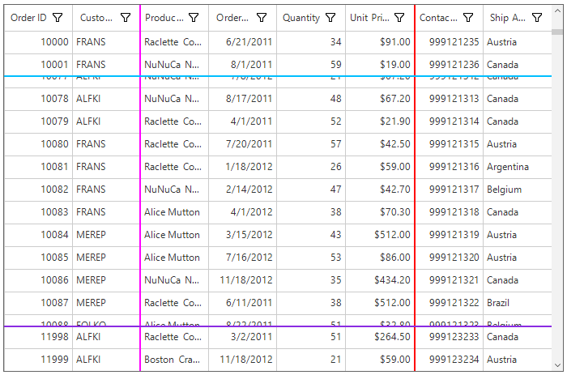

## Loop through Records

The records in a view can be looped using [SfDataGrid.View.Records](https://help.syncfusion.com/cr/cref_files/windowsforms/Syncfusion.Data.WinForms~Syncfusion.Data.CollectionViewAdv~Records.html) collection. 



foreach (var record in sfDataGrid.View.Records) 
{// Do your customizations here. }


For Each record In sfDataGrid.View.Records
 ' Do your customizations here. 
Next record 


