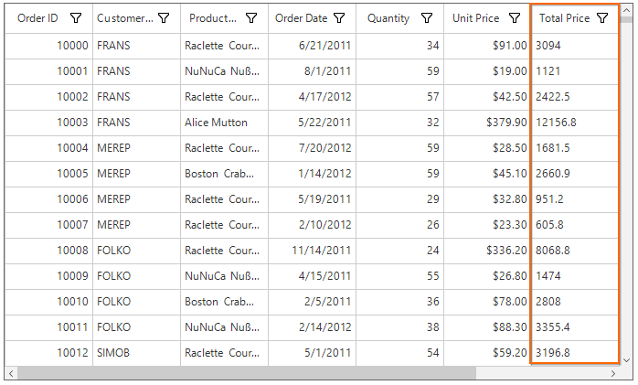
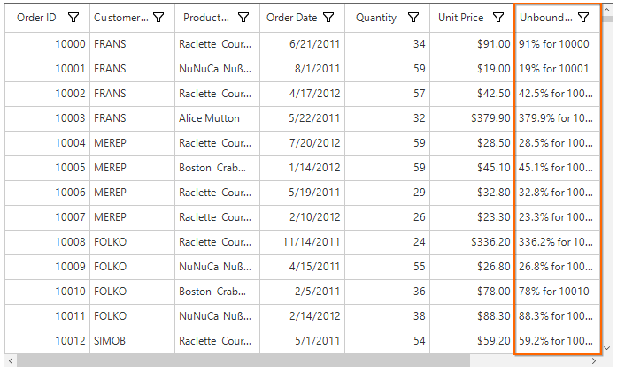
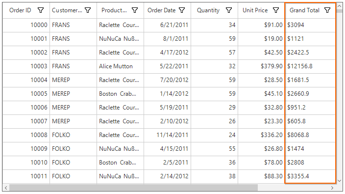

# Unbound Column
SfDataGrid allows to add additional columns which are **not bound with data object** from underlying data source. The unbound column can add to SfDataGrid by using [GridUnboundColumn](https://help.syncfusion.com/cr/cref_files/windowsforms/Syncfusion.SfDataGrid.WinForms~Syncfusion.WinForms.DataGrid.GridUnboundColumn.html) class. Unbound columns supports for sorting, filtering, grouping and exporting as normal columns.


this.sfDataGrid.Columns.Add(new GridUnboundColumn() { HeaderText = "Total Price", MappingName = "TotalPrice", Expression = "UnitPrice*Quantity" });



Me.sfDataGrid.Columns.Add(New GridUnboundColumn() With {.HeaderText = "Total Price", .MappingName = "TotalPrice", .Expression = "UnitPrice*Quantity"})




N> It is mandatory to specify the `GridColumn.MappingName` for `GridUnboundColumn` with some name to identify the column. It is not necessary to define name of field in the data object.

## Populating Data for Unbound Column
The data for unbound column can populate by setting [Expression](https://help.syncfusion.com/cr/cref_files/windowsforms/Syncfusion.SfDataGrid.WinForms~Syncfusion.WinForms.DataGrid.GridUnboundColumn~Expression.html) or [Format](https://help.syncfusion.com/cr/cref_files/windowsforms/Syncfusion.SfDataGrid.WinForms~Syncfusion.WinForms.DataGrid.GridColumnBase~Format.html) property or through [QueryUnboundColumnInfo](https://help.syncfusion.com/cr/cref_files/windowsforms/Syncfusion.SfDataGrid.WinForms~Syncfusion.WinForms.DataGrid.SfDataGrid~QueryUnboundColumnInfo_EV.html) event.

### Using Expression
The arithmetic or logic expression can specify using `Expression` property to compute the display value. By default `GridUnboundColumn` evaluates the expression with casing. The casing can disable while evaluate the expression by setting [CaseSensitive](https://help.syncfusion.com/cr/cref_files/windowsforms/Syncfusion.SfDataGrid.WinForms~Syncfusion.WinForms.DataGrid.GridUnboundColumn~CaseSensitive.html) property to false.
Below are the list of Arithmetic and logical operations supported,
<table>
<tr>
<td>
{{'**Arithmetic operations**'| markdownify }}
</td>
<td>
{{'**Operator**'| markdownify }}
</td>
</tr>
<tr>
<td>
Add
</td>
<td>
+
</td>
</tr>
<tr>
<td>
Subtract
</td>
<td>
-
</td>
</tr>
<tr>
<td>
Multiply
</td>
<td>
*
</td>
</tr>
<tr>
<td>
Divide
</td>
<td>
/
</td>
</tr>
<tr>
<td>
Power
</td>
<td>
^
</td>
</tr>
<tr>
<td>
Mod
</td>
<td>
%
</td>
</tr>
<tr>
<td>
Greater Than
</td>
<td>
>
</td>
</tr>
<tr>
<td>
Less Than
</td>
<td>
<
</td>
</tr>
<tr>
<td>
Equal
</td>
<td>
=
</td>
</tr>
<tr>
<td>
GreaterThanOrEqual
</td>
<td>
>=
</td>
</tr>
<tr>
<td>
LessThanOrEqual
</td>
<td>
<=
</td>
</tr>
<tr>
<td>
Add
</td>
<td>
+
</td>
</tr>
</table>
<table>
<tr>
<td>
{{'**Logical operations**'| markdownify }}
</td>
<td>
{{'**Operators**'| markdownify }}
</td>
</tr>
<tr>
<td>
AND
</td>
<td>
(char)135
</td>
</tr>
<tr>
<td>
OR
</td>
<td>
(char)136
</td>
</tr>
<tr>
<td>
NOT
</td>
<td>
(char)137
</td>
</tr>
</table>


GridUnboundColumn unboundColumn = new GridUnboundColumn();
unboundColumn.MappingName = "UnboundColumn";
unboundColumn.HeaderText = "Unbound Column";
unboundColumn.Expression = "UnitPrice * Quantity < 5000" + (char)135 + "UnitPrice < 100";

this.sfDataGrid.Columns.Add(unboundColumn);


Dim unboundColumn As New GridUnboundColumn()
unboundColumn.MappingName = "UnboundColumn"
unboundColumn.HeaderText = "Unbound Column"
unboundColumn.Expression = "UnitPrice * Quantity < 5000" & ChrW(135) & "UnitPrice < 100"

Me.sfDataGrid.Columns.Add(unboundColumn)



### Using Format
Format the values of other columns and display the formatted value in unbound column using `Format` property.


unboundColumn.Format = "{UnitPrice}% for {OrderID}";


unboundColumn.Format = "{UnitPrice}% for {OrderID}"



### Using QueryUnboundColumnInfo Event
The data for unbound column can populated by handling the [QueryUnboundColumnInfo](https://help.syncfusion.com/cr/cref_files/windowsforms/Syncfusion.SfDataGrid.WinForms~Syncfusion.WinForms.DataGrid.SfDataGrid~QueryUnboundColumnInfo_EV.html) event.[QueryUnboundColumnInfoArgs](https://help.syncfusion.com/cr/cref_files/windowsforms/Syncfusion.SfDataGrid.WinForms~Syncfusion.WinForms.DataGrid.Events.QueryUnboundColumnInfoArgs.html) of the `QueryUnboundColumnInfo` event provides the information about the cell triggered this event. 
The [QueryUnboundColumnInfoArgs.Value](https://help.syncfusion.com/cr/cref_files/windowsforms/Syncfusion.SfDataGrid.WinForms~Syncfusion.WinForms.DataGrid.Events.QueryUnboundColumnInfoArgs~Value.html) property can get or set based on the `UnboundAction`.

UnboundAction - `QueryData` denotes the event triggered to query value and cell information.  
UnboundAction – `CommitData` denotes the event triggered to save the edited value.


this.sfDataGrid.QueryUnboundColumnInfo += sfDataGrid_QueryUnboundColumnInfo;

void sfDataGrid_QueryUnboundColumnInfo(object sender, QueryUnboundColumnInfoArgs e)
{
    if (e.UnboundAction == UnboundActions.QueryData)
    {
        var unitPrice = Convert.ToDouble(e.Record.GetType().GetProperty("UnitPrice").GetValue(e.Record));
        var disCount = Convert.ToDouble(e.Record.GetType().GetProperty("Quantity").GetValue(e.Record));
        var save = unitPrice * disCount;
        e.Value =  "$" + save.ToString();
    }
}



AddHandler sfDataGrid.QueryUnboundColumnInfo, AddressOf sfDataGrid_QueryUnboundColumnInfo

Private Sub sfDataGrid_QueryUnboundColumnInfo(ByVal sender As Object, ByVal e As QueryUnboundColumnInfoArgs)
	If e.UnboundAction = UnboundActions.QueryData Then
		Dim unitPrice = Convert.ToDouble(e.Record.GetType().GetProperty("UnitPrice").GetValue(e.Record))
		Dim disCount = Convert.ToDouble(e.Record.GetType().GetProperty("Quantity").GetValue(e.Record))
		Dim save = unitPrice * disCount
		e.Value = "$" & save.ToString()
	End If
End Sub



## Editing Unbound Column

### Cancel the Editing for Unbound Column Cell
The editing of unbound column cell can canceled by handling the [SfDataGrid.CurrentCellBeginEdit](https://help.syncfusion.com/cr/cref_files/windowsforms/Syncfusion.SfDataGrid.WinForms~Syncfusion.WinForms.DataGrid.SfDataGrid~CurrentCellBeginEdit_EV.html) event.


sfDataGrid.CurrentCellBeginEdit += dataGrid_CurrentCellBeginEdit;

void dataGrid_CurrentCellBeginEdit(object sender, CurrentCellBeginEditEventArgs args)
{
    args.Cancel = args.DataColumn.GridColumn is GridUnboundColumn;
}


AddHandler sfDataGrid.CurrentCellBeginEdit, AddressOf dataGrid_CurrentCellBeginEdit

Private Sub dataGrid_CurrentCellBeginEdit(ByVal sender As Object, ByVal args As CurrentCellBeginEditEventArgs)
	args.Cancel = TypeOf args.DataColumn.GridColumn Is GridUnboundColumn
End Sub



### Saving Edited Value of Unbound Column using QueryUnboundColumnInfo Event
The edited value of unbound column can get from `QueryUnboundColumnInfoArgs.Value` property of `QueryUnboundColumnInfo` event when UnboundAction is `CommitData`.


this.sfDataGrid.QueryUnboundColumnInfo += sfDataGrid_QueryUnboundColumnInfo;

void sfDataGrid_QueryUnboundColumnInfo(object sender, QueryUnboundColumnInfoArgs e)
{
    if (e.UnboundAction == UnboundActions.CommitData)
    {
        var editedValue = e.Value;
    }
}


AddHandler sfDataGrid.QueryUnboundColumnInfo, AddressOf sfDataGrid_QueryUnboundColumnInfo

Private Sub sfDataGrid_QueryUnboundColumnInfo(ByVal sender As Object, ByVal e As QueryUnboundColumnInfoArgs)
	If e.UnboundAction = UnboundActions.CommitData Then
		Dim editedValue = e.Value
	End If
End Sub



### Read Unbound Column Values
The value of `GridUnboundColumn` can get by using [GetUnboundCellValue](https://help.syncfusion.com/cr/cref_files/windowsforms/Syncfusion.SfDataGrid.WinForms~Syncfusion.WinForms.DataGrid.SfDataGrid~GetUnboundCellValue.html) method.


var value = sfDataGrid.GetUnboundCellValue(sfDataGrid.Columns[8], data.OrdersListDetails[10]);



Dim value = sfDataGrid.GetUnboundCellValue(sfDataGrid.Columns(8), data.OrdersListDetails(10))




## Appearance
The appearance of the unbound columns cells can be customized by using the [CellStyle](https://help.syncfusion.com/cr/cref_files/windowsforms/Syncfusion.SfDataGrid.WinForms~Syncfusion.WinForms.DataGrid.GridColumnBase~CellStyle.html) property.


GridUnboundColumn unboundColumn = new GridUnboundColumn();
unboundColumn.MappingName = "UnboundColumn";
unboundColumn.HeaderText = "Grand Total";

unboundColumn.CellStyle = new CellStyleInfo() { BackColor = Color.DarkCyan, TextColor = Color.White, HorizontalAlignment = HorizontalAlignment.Right };

unboundColumn.Expression = "UnitPrice * Quantity";

this.sfDataGrid.Columns.Add(unboundColumn);


Dim unboundColumn As New GridUnboundColumn()
unboundColumn.MappingName = "UnboundColumn"
unboundColumn.HeaderText = "Grand Total"

unboundColumn.CellStyle = New CellStyleInfo() With {.BackColor = Color.DarkCyan, .TextColor = Color.White, .HorizontalAlignment = HorizontalAlignment.Right}

unboundColumn.Expression = "UnitPrice * Quantity"

Me.sfDataGrid.Columns.Add(unboundColumn)



## Customize the Unbound Column Behavior

### Overriding Existing CellType
The unbound row cell behavior can customized by overriding existing renderer and replace the default one in [SfDataGrid.CellRenderers](https://help.syncfusion.com/cr/cref_files/windowsforms/Syncfusion.SfDataGrid.WinForms~Syncfusion.WinForms.DataGrid.SfDataGrid~CellRenderers.html).
In the below code snippet, [GridUnboundCellRenderer](https://help.syncfusion.com/cr/cref_files/windowsforms/Syncfusion.SfDataGrid.WinForms~Syncfusion.WinForms.DataGrid.Renderers.GridUnboundCellRenderer.html) is customized to change the text color and replaced the default renderer with customized renderer in `SfDataGrid.CellRenderers` collection.


sfDataGrid.CellRenderers.Remove("Unbound");
sfDataGrid.CellRenderers.Add("Unbound", new CustomUnboundCellRenderer());

public class CustomUnboundCellRenderer : GridUnboundCellRenderer
{
    protected override void OnEditingComplete(DataColumnBase dataColumn, TextBox currentRendererElement)
    {
        base.OnEditingComplete(dataColumn, currentRendererElement);
    }
    protected override void OnInitializeEditElement(DataColumnBase column, RowColumnIndex rowColumnIndex, TextBox uiElement)
    {
        base.OnInitializeEditElement(column, rowColumnIndex, uiElement);
    }
    protected override void OnRender(Graphics paint, Rectangle cellRect, string cellValue, CellStyleInfo style, DataColumnBase column, RowColumnIndex rowColumnIndex)
    {
        style.TextColor = Color.DarkBlue;
        base.OnRender(paint, cellRect, cellValue, style, column, rowColumnIndex);
    }
}


sfDataGrid.CellRenderers.Remove("Unbound")
sfDataGrid.CellRenderers.Add("Unbound", New CustomUnboundCellRenderer())

public class CustomUnboundCellRenderer : GridUnboundCellRenderer
	protected override void OnEditingComplete(DataColumnBase dataColumn, TextBox currentRendererElement)
		MyBase.OnEditingComplete(dataColumn, currentRendererElement)

	protected override void OnInitializeEditElement(DataColumnBase column, RowColumnIndex rowColumnIndex, TextBox uiElement)
		MyBase.OnInitializeEditElement(column, rowColumnIndex, uiElement)

	protected override void OnRender(Graphics paint, Rectangle cellRect, String cellValue, CellStyleInfo style, DataColumnBase column, RowColumnIndex rowColumnIndex)
		style.TextColor = Color.DarkBlue
		MyBase.OnRender(paint, cellRect, cellValue, style, column, rowColumnIndex)



