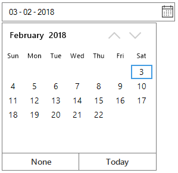

# DateRange in Windows Forms DateTimePicker (SfDateTimeEdit)

Prevents user from setting a date and time within a specified range can be achieved by using [MinDateTime](https://help.syncfusion.com/cr/windowsforms/Syncfusion.WinForms.Input.SfDateTimeEdit.html#Syncfusion_WinForms_Input_SfDateTimeEdit_MinDateTime) and [MaxDateTime](https://help.syncfusion.com/cr/windowsforms/Syncfusion.WinForms.Input.SfDateTimeEdit.html#Syncfusion_WinForms_Input_SfDateTimeEdit_MaxDateTime) properties of the SfDateTimeEdit.

## Change the value

The date and time of the SfDateTimeEdit can be changed by the [Value](https://help.syncfusion.com/cr/windowsforms/Syncfusion.WinForms.Input.SfDateTimeEdit.html#Syncfusion_WinForms_Input_SfDateTimeEdit_Value) property. The value can be set to null when the [AllowNull](https://help.syncfusion.com/cr/windowsforms/Syncfusion.WinForms.Input.SfDateTimeEdit.html#Syncfusion_WinForms_Input_SfDateTimeEdit_AllowNull) is true. The default mode of the DateTimeEditing only allows you to change the selected value to null; the mask mode will not allow you to change the value to null. The value can also be edited by selecting the `DateTimeField` and editing the value. This value will be validated when the control lost its focus or the enter key is pressed.

The [ValueChanged](https://help.syncfusion.com/cr/windowsforms/Syncfusion.WinForms.Input.SfDateTimeEdit.html) event will be invoked when the change is occurred in the `Value` property of the SfDateTimeEdit. If you need to do any custom actions while value changed, that can be done at the ValueChanged event.

### Change value by DateTimeText

The value of the SfDateTimeEdit can also be changed by the [DateTimeText](https://help.syncfusion.com/cr/windowsforms/Syncfusion.WinForms.Input.SfDateTimeEdit.html#Syncfusion_WinForms_Input_SfDateTimeEdit_DateTimeText). The DateTimeText should be provided in the same pattern as [DateTimePattern](https://help.syncfusion.com/cr/windowsforms/Syncfusion.WinForms.Input.SfDateTimeEdit.html#Syncfusion_WinForms_Input_SfDateTimeEdit_DateTimePattern).

## Minimum DateTime

The [MinDateTime](https://help.syncfusion.com/cr/windowsforms/Syncfusion.WinForms.Input.SfDateTimeEdit.html#Syncfusion_WinForms_Input_SfDateTimeEdit_MinDateTime) helps you to restrict the DateTime value which is lesser than the specific DateTime value. If the `Value` of SfDateTimeEdit is less than `MinDateTime`, then the value property will be reset to MinDateTime. The `MinDateTime` should be lesser than the `MaxDateTime` of the SfDateTimeEdit. When the MinDateTime is set, if the new `MinDateTime` value is greater than the `MaxDateTime`, then the MaxDateTime will be reset to the MinDateTime.

## Maximum DateTime

The [MaxDateTime](https://help.syncfusion.com/cr/windowsforms/Syncfusion.WinForms.Input.SfDateTimeEdit.html#Syncfusion_WinForms_Input_SfDateTimeEdit_MaxDateTime) helps you to restrict the DateTime value that is set greater than the specific DateTime value. If the `Value` of SfDateTimeEdit is greater than `MaxDateTime`, then the value property will be reset to MaxDateTime. The `MaxDateTime` should be greater than `MinDateTime` of the SfDateTimeEdit. When the MaxDateTime is set, if the `MinDateTime` property is greater than the new `MaxDateTime`, then the MinDateTime will be reset to the MaxDateTime.

Sometimes, the value should be restricted in between some particular date range. For example, consider a project for the hotel reservation system. The “In DateTime” has to be lesser than the “Out DateTime” and vice versa. So “In DateTime” has to be set as minimum DateTime and “Out DateTime” has to be set as maximum DateTime in the `SfDateTimeEdit` control.





Syncfusion.WinForms.Input.SfDateTimeEdit dateTimeEdit = new Syncfusion.WinForms.Input.SfDateTimeEdit();

this.Controls.Add(dateTimeEdit);

dateTimeEdit.Value = new DateTime(2018, 2, 1);

dateTimeEdit.MinDateTime = new DateTime(2018, 2, 3);

dateTimeEdit.MaxDateTime = new DateTime(2018, 2, 22);





Dim dateTimeEdit As Syncfusion.WinForms.Input.SfDateTimeEdit = New Syncfusion.WinForms.Input.SfDateTimeEdit

Me.Controls.Add(dateTimeEdit)

dateTimeEdit.Value = New DateTime(2018, 2, 1)

dateTimeEdit.MinDateTime = New DateTime(2018, 2, 3)

dateTimeEdit.MaxDateTime = New DateTime(2018, 2, 22)





## Detect the value change

The [Value](https://help.syncfusion.com/cr/windowsforms/Syncfusion.WinForms.Input.SfDateTimeEdit.html#Syncfusion_WinForms_Input_SfDateTimeEdit_Value) property is used to set the current selected DateTime of the `SfDateTimeEdit`. The value change can be detected by handling the [ValueChanged](https://help.syncfusion.com/cr/windowsforms/Syncfusion.WinForms.Input.SfDateTimeEdit.html) event.





private void DateTimeEdit_ValueChanged(object sender, EventArgs e)
{
     MessageBox.Show("SfDateTimeEdit value has been changed");
}





Private Sub DateTimeEdit_ValueChanged(ByVal sender As Object, ByVal e As EventArgs)

MessageBox.Show("SfDateTimeEdit value has been changed")

End Sub



 
