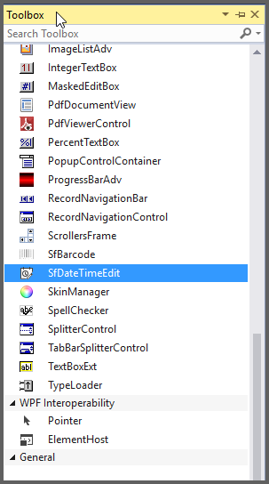
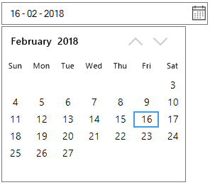

# Getting started

This section briefly describes how to create a new Windows Forms project in Visual Studio and add the **SfDateTimeEdit** control with its basic functionalities.

## Assembly deployment

Refer to the [Control Dependencies](https://help.syncfusion.com/windowsforms/control-dependencies#sfdatetimeedit) section to get the list of assemblies or details of NuGet package that needs to be added as reference to use the control in any application.

Refer to this [documentation](https://help.syncfusion.com/windowsforms/visual-studio-integration/nuget-packages) to find more details about installing NuGet packages in a Windows Forms application.

## Adding the SfDateTimeEdit control via designer

The following steps describe how to create an **SfDateTimeEdit** control via designer.

1) Create a new Windows Forms application in Visual Studio.

2) Add the [SfDateTimeEdit](https://help.syncfusion.com/cr/windowsforms/Syncfusion.WinForms.Input.SfDateTimeEdit.html) control to an application by dragging it from the toolbox to design view. The following dependent assemblies will be added automatically:

* Syncfusion.Core.WinForms
* Syncfusion.SfInput.WinForms
* Syncfusion.Shared.Base

## Adding SfDateTimeEdit control via code

The following steps describe how to create an **SfDateTimeEdit** control programmatically:

1) Create a C# or VB application via Visual Studio.

2) Add the following assembly references to the project:

* Syncfusion.Core.WinForms
* Syncfusion.SfInput.WinForms
* Syncfusion.Shared.Base

3) Include the required namespace.





using Syncfusion.WinForms.Input;





Imports Syncfusion.WinForms.Input



 

4) Create an instance of the [SfDateTimeEdit](https://help.syncfusion.com/cr/windowsforms/Syncfusion.WinForms.Input.SfDateTimeEdit.html) control, and then add it to the form.





SfDateTimeEdit sfDateTimeEdit = new SfDateTimeEdit();

this.Controls.Add(sfDateTimeEdit);





Dim SfDateTimeEdit As New SfDateTimeEdit()

Me.Controls.Add(sfDateTimeEdit)





## Date range

In a real-time appointment scenario, the appointment is open only for a limited number of days. You have to select a date and time within given range using the [MinDateTime](https://help.syncfusion.com/cr/windowsforms/Syncfusion.WinForms.Input.SfDateTimeEdit.html#Syncfusion_WinForms_Input_SfDateTimeEdit_MinDateTime) and [MaxDateTime](https://help.syncfusion.com/cr/windowsforms/Syncfusion.WinForms.Input.SfDateTimeEdit.html#Syncfusion_WinForms_Input_SfDateTimeEdit_MaxDateTime) properties, which enable specified date range in the SfDateTimeEdit control.





Syncfusion.WinForms.Input.SfDateTimeEdit dateTimeEdit = new Syncfusion.WinForms.Input.SfDateTimeEdit();

this.Controls.Add(dateTimeEdit);

dateTimeEdit.Value = new DateTime(2018, 2, 16);

dateTimeEdit.MinDateTime = new DateTime(2018, 2, 3);

dateTimeEdit.MaxDateTime = new DateTime(2018, 2, 27);





Dim dateTimeEdit As New Syncfusion.WinForms.Input.SfDateTimeEdit()

Me.Controls.Add(dateTimeEdit)

dateTimeEdit.Value = New DateTime(2018, 2, 16)

dateTimeEdit.MinDateTime = New DateTime(2018, 2, 3)

dateTimeEdit.MaxDateTime = New DateTime(2018, 2, 27)





## Editing mode

The date-time value in the DateTimeEdit can be edited by two ways as follows.

* Default Editing 
* Mask Editing

Editing modes can be changed using the [DateTimeEditingMode](https://help.syncfusion.com/cr/windowsforms/Syncfusion.WinForms.Input.SfDateTimeEdit.html#Syncfusion_WinForms_Input_SfDateTimeEdit_DateTimeEditingMode) property of SfDateTimEdit. The following code example demonstrates how to change the date-time editing mode.





dateTimeEdit.DateTimeEditingMode = DateTimeEditingMode.Mask;





dateTimeEdit.DateTimeEditingMode = DateTimeEditingMode.Mask



 

## Allow null value

The **SfDateTimEdit** allows you to set [Value](https://help.syncfusion.com/cr/windowsforms/Syncfusion.WinForms.Input.SfDateTimeEdit.html#Syncfusion_WinForms_Input_SfDateTimeEdit_Value) to null in the mask mode of DateTimeEditing when [AllowNull](https://help.syncfusion.com/cr/windowsforms/Syncfusion.WinForms.Input.SfDateTimeEdit.html#Syncfusion_WinForms_Input_SfDateTimeEdit_AllowNull) is set to true.





dateTimeEdit.DateTimeEditingMode = DateTimeEditingMode.Mask;

dateTimeEdit.AllowNull = true;

dateTimeEdit.Watermark = "Choose a date";





dateTimeEdit.DateTimeEditingMode = DateTimeEditingMode.Mask

dateTimeEdit.AllowNull = true

dateTimeEdit.Watermark = "Choose a date"





## Custom format

The custom pattern can be displayed in the **SfDateTimeEdit** control using the [Format](https://help.syncfusion.com/cr/windowsforms/Syncfusion.WinForms.Input.SfDateTimeEdit.html#Syncfusion_WinForms_Input_SfDateTimeEdit_Format) property when [DateTimePattern](https://help.syncfusion.com/cr/windowsforms/Syncfusion.WinForms.Input.SfDateTimeEdit.html#Syncfusion_WinForms_Input_SfDateTimeEdit_DateTimePattern) is set to custom.





dateTimeEdit.Value = new DateTime(2018, 2, 5);

dateTimeEdit.DateTimePattern = DateTimePattern.Custom;

//Setting Custom Pattern

dateTimeEdit.Format = "MM/dd/yy hh:mm:ss";





dateTimeEdit.Value = New DateTime(2018, 2, 5)

dateTimeEdit.DateTimePattern = DateTimePattern.Custom

'Setting Custom Pattern

dateTimeEdit.Format = "MM/dd/yy hh:mm:ss"





## Configure up-down

You can edit value of DateTimeEdit using the up-down button by setting the [ShowUpDown](https://help.syncfusion.com/cr/windowsforms/Syncfusion.WinForms.Input.SfDateTimeEdit.html#Syncfusion_WinForms_Input_SfDateTimeEdit_ShowUpDown) property to `true`. The up-down button appears only when [DateTimeEditingMode](https://help.syncfusion.com/cr/windowsforms/Syncfusion.WinForms.Input.SfDateTimeEdit.html#Syncfusion_WinForms_Input_SfDateTimeEdit_DateTimeEditingMode) is set to mask.





//Enable the UpDown Button

this.dateTimeEdit.ShowUpDown = true;





'Enable the UpDown Button

Me.dateTimeEdit.ShowUpDown = true



 

