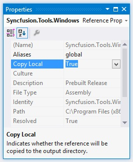

# Deployment

## Copy Local

Copying assembly in local folder is supported by the Syncfusion assembly reference in the Solutions Explorer. It can be achieved by setting its Copy Local property of the reference to `True`. So, that the Syncfusion assemblies are copied to the Release/Bin, Debug/Bin folders. This deployment consists of copying the EXE, assembly and XML files to the client machines similar to that of manual copy.

## GAC

Through Syncfusion installer, Syncfusion assemblies are installed in the GAC of the developer machines. Also Syncfusion's [AssemblyManager](https://help.syncfusion.com/common/essential-studio/utilities#assembly-manager) helps to add or remove the Syncfusion assemblies to or from GAC.

## Installed Location

The following table represents Assemblies/ Samples and its installed location

<table>
<tr>
<th>
Assemblies /  Samples</th><th>
Installed location</th></tr>
<tr>
<td>
GAC</td><td>
C:\Windows\Microsoft.NET\assembly\GAC_MSIL</td></tr>
<tr>
<td>
Assemblies</td><td>
C:\Program Files (x86)\Syncfusion\Essential Studio\Windows\{{ site.releaseversion }}\Assemblies</td></tr>
<tr>
<td>
Precompiled Assemblies</td><td>
C:\Program Files (x86)\Syncfusion\Essential Studio\Windows\{{ site.releaseversion }}\precompiledassemblies</td></tr>
<tr>
<td>
Samples</td><td>
C:\Users\Public\Documents\Syncfusion\Windows\{{ site.releaseversion }}</td></tr>
</table>

N> In above section, Latest Essential Studio version details has been provided. User can refer installed Essential Studio version instead of mentioned version.