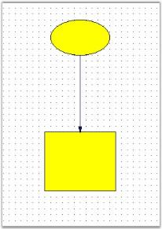

# Connecting Two Nodes with Line Connector

The following code example illustrates how to create links between two nodes.




protected void Page_Load(object sender, EventArgs e)
{
    Syncfusion.Windows.Forms.Diagram.Ellipse ellipse = new Syncfusion.Windows.Forms.Diagram.Ellipse(10, 10, 110, 70);
    Syncfusion.Windows.Forms.Diagram.Rectangle rectangle = new Syncfusion.Windows.Forms.Diagram.Rectangle(300, 50, 50, 80);
    Syncfusion.Windows.Forms.Diagram.LineConnector lineconnector = new Syncfusion.Windows.Forms.Diagram.LineConnector(new System.Drawing.PointF(10, 200), new System.Drawing.PointF(300, 250));
    this.DiagramWebControl1.Model.AppendChild(ellipse);
    this.DiagramWebControl1.Model.AppendChild(rectangle);
    ellipse.CentralPort.TryConnect(lineconnector.HeadEndPoint);
    rectangle.CentralPort.TryConnect(lineconnector.TailEndPoint);
    this.DiagramWebControl1.Model.AppendChild(lineconnector);
}





Protected Sub Page_Load(ByVal sender As Object, ByVal e As EventArgs)
    Dim ellipse As New Syncfusion.Windows.Forms.Diagram.Ellipse(10, 10, 110, 70)
    Dim rectangle As New Syncfusion.Windows.Forms.Diagram.Rectangle(300, 50, 50, 80)
    Dim lineconnector As New Syncfusion.Windows.Forms.Diagram.LineConnector(New System.Drawing.PointF(10, 200), New System.Drawing.PointF(300, 250))
    Me.DiagramWebControl1.Model.AppendChild(ellipse)
    Me.DiagramWebControl1.Model.AppendChild(rectangle)
    ellipse.CentralPort.TryConnect(lineconnector.HeadEndPoint)
    rectangle.CentralPort.TryConnect(lineconnector.TailEndPoint)
    Me.DiagramWebControl1.Model.AppendChild(lineconnector)
End Sub




You can change the appearance of the connectors using its properties through code. The following code example illustrates the line properties.




    protected void Page_Load(object sender, EventArgs e)
    {
        Syncfusion.Windows.Forms.Diagram.Ellipse ellipse = new Syncfusion.Windows.Forms.Diagram.Ellipse(160, 60, 100, 60);
        Syncfusion.Windows.Forms.Diagram.Rectangle rectangle = new Syncfusion.Windows.Forms.Diagram.Rectangle(150, 250, 120, 100);
        Syncfusion.Windows.Forms.Diagram.LineConnector lineconnector = new Syncfusion.Windows.Forms.Diagram.LineConnector(new System.Drawing.PointF(10, 200), new System.Drawing.PointF(300, 250));
        this.diagram1.Model.AppendChild(ellipse);
        this.diagram1.Model.AppendChild(rectangle);
        ellipse.CentralPort.TryConnect(lineconnector.TailEndPoint);
        rectangle.CentralPort.TryConnect(lineconnector.HeadEndPoint);
        this.diagram1.Model.AppendChild(lineconnector);
        lineconnector.HeadDecorator.DecoratorShape = DecoratorShape.Filled45Arrow;
        lineconnector.LineStyle.LineColor = Color.MidnightBlue;
        lineconnector.HeadDecorator.FillStyle.Color = Color.MidnightBlue;
        lineconnector.HeadDecorator.Size = new SizeF(10, 5);
    }




    Protected Sub Page_Load(ByVal sender As Object, ByVal e As EventArgs)
        Dim ellipse As New Syncfusion.Windows.Forms.Diagram.Ellipse(160, 60, 100, 60)
        Dim rectangle As New Syncfusion.Windows.Forms.Diagram.Rectangle(150, 250, 120, 100)
        Dim lineconnector As New Syncfusion.Windows.Forms.Diagram.LineConnector(New System.Drawing.PointF(10, 200), New System.Drawing.PointF(300, 250))
        Me.diagram1.Model.AppendChild(ellipse)
        Me.diagram1.Model.AppendChild(rectangle)
        ellipse.CentralPort.TryConnect(lineconnector.TailEndPoint)
        rectangle.CentralPort.TryConnect(lineconnector.HeadEndPoint)
        Me.diagram1.Model.AppendChild(lineconnector)
        lineconnector.HeadDecorator.DecoratorShape = DecoratorShape.Filled45Arrow
        lineconnector.LineStyle.LineColor = Color.MidnightBlue
        lineconnector.HeadDecorator.FillStyle.Color = Color.MidnightBlue
        lineconnector.HeadDecorator.Size = New SizeF(10, 5)
    End Sub




