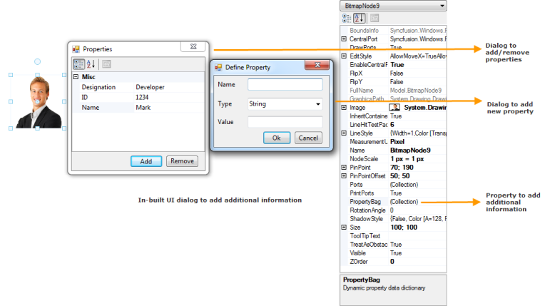

# Dynamic Properties

This feature lets the user add additional properties or data to the nodes and connectors. Any type of data can be added as additional data or properties.

The node’s PropertyBag property, which is a key value pair, is used to add, edit, and remove the additional properties or data and can be serialized when saving the diagram.

The diagram has built-in UI dialogs to add, edit, and remove the dynamic properties. 

Use Case Scenario:

It is used to store additional data to the nodes or connectors as needed.

Properties

<table>
<tr>
<th>
Property </th><th>
Description </th><th>
Data Type </th></tr>
<tr>
<td>
PropertyBag </td><td>
Gets or sets the dynamic property data dictionary.</td><td>
Dictionary<string, object></td></tr>
</table>

The following code shows how to add additional data to a node by using the PropertyBag property.




	node.PropertyBag.Add("Name", employee.EmployeeName);
	node.PropertyBag.Add("ID", employee.EmployeeID);
	node.PropertyBag.Add("Designation", employee.Designation);




	node.PropertyBag.Add("Name", employee.EmployeeName)
	node.PropertyBag.Add("ID", employee.EmployeeID)
	node.PropertyBag.Add("Designation", employee.Designation)




