# Layout Management

Different Layout Manager are discussed under the following section:

## Manual Layout

The various types of Layout Managers that are supported by the diagram control to align nodes are as follows.

Some common Layout Manager settings are discussed in the below topic.

* Layout Manager Settings

### Table Layout Manager

The TableLayoutManager class can be used to arrange various objects in columns and rows in a table format. The TableTreeLayoutManager arranges nodes in a Table layout, positioning the nodes in a rectangular grid of cells, with each node spanning over a single table cell. The TableTreeLayoutManager is used when tabular relationships need to be depicted. The various properties of the TableTreeLayoutManager are listed below.

The model and the number of rows and column values are passed as parameters to the TableLayoutManager class. The parameters and properties involved with the TableLayoutManager are listed in the below table.

<table>
<tr>
<th>
Property</th><th>
Description</th></tr>
<tr>
<td>
Model</td><td>
The Model to be attached to the Layout Manager.</td></tr>
<tr>
<td>
CellSizeMode </td><td>
Gets / sets the cell size mode with one of the following options:EqualToMaxNodeMinimalTableMinimal</td></tr>
<tr>
<td>
MaxSize</td><td>
Gets / sets the size of each table cell. It is an integer type value. </td></tr>
<tr>
<td>
MaxColumnCount</td><td>
Represents the maximum horizontal cell count in the table. It is an integer type value. </td></tr>
<tr>
<td>
MaxRowsCount</td><td>
Represents the maximum vertical cell count in the table. It is an integer type value. </td></tr>
<tr>
<td>
HorizontalSpacing</td><td>
Defines the horizontal offset between adjacent nodes.</td></tr>
<tr>
<td>
VerticalSpacing</td><td>
Defines the vertical offset between adjacent nodes.</td></tr>
</table>

Programmatically, the table layout manager instance should be created with the respective arguments, assigned to the Layout Manager and updated as follows.




    TableLayoutManager lLayout=new TableLayoutManager(this.diagram1.Model, 7, 7);
    tlLayout.VerticalSpacing = 20;
    tlLayout.HorizontalSpacing = 20;
    tlLayout.CellSizeMode = CellSizeMode.EqualToMaxNode;
    tlLayout.Orientation = Orientation.Horizontal;
    tlLayout.MaxSize = new SizeF(500, 600);
    
    this.diagram1.LayoutManager = tlLayout;
    this.diagram1.LayoutManager.UpdateLayout(null);.AttachModel(model1);
    
    documentExplorer1.Dock = DockStyle.Right;
    documentExplorer1.BackColor = System.Drawing.SystemColors.Window;
    documentExplorer1.Location = new System.Drawing.Point(0, 377);
    documentExplorer1.Size = new System.Drawing.Size(200, 100);
    documentExplorer1.BorderStyle = System.Windows.Forms.BorderStyle.Fixed3D;
    documentExplorer1.ShowNodeToolTips = true;




    Dim lLayout As TableLayoutManager = New TableLayoutManager(Me.diagram1.Model, 7, 7)
    tlLayout.VerticalSpacing = 20
    tlLayout.HorizontalSpacing = 20
    tlLayout.CellSizeMode = CellSizeMode.EqualToMaxNode
    tlLayout.Orientation = Orientation.Horizontal
    tlLayout.MaxSize = New SizeF(500, 600)
    
    Me.diagram1.LayoutManager = tlLayout
    Me.diagram1.LayoutManager.UpdateLayout(Nothing).AttachModel(model1)
    
    documentExplorer1.Dock = DockStyle.Right
    documentExplorer1.BackColor = System.Drawing.SystemColors.Window
    documentExplorer1.Location = New System.Drawing.Point(0, 377)
    documentExplorer1.Size = New System.Drawing.Size(200, 100)
    documentExplorer1.BorderStyle = System.Windows.Forms.BorderStyle.Fixed3D
    documentExplorer1.ShowNodeToolTips = True




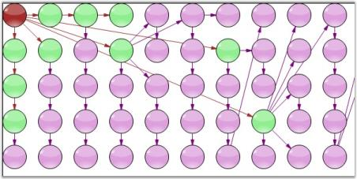

### Directed Tree Layout Manager

The Directed Tree Layout Manager implements a layout manager for arranging nodes in a tree-like structure. This Layout manager can be applied to any diagram that is composed of a directed tree graph with unique root and child nodes. The layout manager lets you orient the tree in any direction around the root and can be used for creating arrangements such as top-to-bottom vertical trees, bottom-to-top vertical trees, right-to-left horizontal trees, left-to-right horizontal trees, angular trees etc. 

The DirectedTreeLayoutManager class is a subclass of the GraphLayoutManager and implements a layout manager for arranging nodes in a tree-like structure. The tree layout can be applied to any diagram that is composed as a directed tree graph with a unique root and child nodes. The layout manager lets you orient the tree in just about any direction around the root and can be used for creating arrangements such as top-to-bottom vertical trees, bottom-to-top vertical trees, right-to-left horizontal trees, left-to-right horizontal trees, angular trees and so on.

Graph orientation is determined by the rotation degree parameter while initializing the layout manager. A rotation degree of 0° specifies a top-to-bottom vertical tree while a rotation degree of 270° will result in a left-to-right horizontal tree layout.

The parameters to be defined for the DirectedTreeLayoutManager class are listed in the below table.

<table>
<tr>
<th>
Property</th><th>
Description</th></tr>
<tr>
<td>
Model</td><td>
Represents the model of the diagram, which has to be displayed out as a directed tree.</td></tr>
<tr>
<td>
RotationAngle</td><td>
Gets or sets the rotation angle for the graph. It accepts only integer values between 0-360.</td></tr>
<tr>
<td>
HorizontalSpacing</td><td>
Holds the value for the horizontal offset between adjacent nodes (float value).</td></tr>
<tr>
<td>
VerticalSpacing</td><td>
Holds the value for the vertical offset between adjacent nodes (float value).</td></tr>
</table>

Programmatically, the directed tree layout manager instance is created with the respective arguments, assigned to the Layout Manager and updated as follows.




    DirectedTreeLayoutManager directedLayout = new  DirectedTreeLayoutManager(diagram1.Model,0, 20, 20);
    diagram1.LayoutManager = directedLayout;
    diagram1.LayoutManager.UpdateLayout(null);




    DirectedTreeLayoutManager directedLayout = new  DirectedTreeLayoutManager(diagram1.Model,0, 20, 20);
    diagram1.LayoutManager = directedLayout;
    diagram1.LayoutManager.UpdateLayout(null);




Sample Diagrams are as follows.

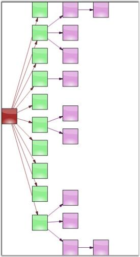

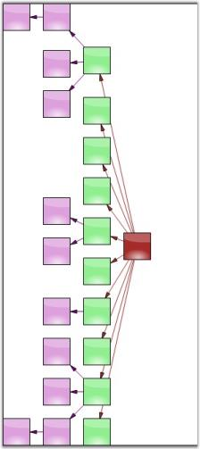

### Radial Tree Layout Manager

The Radial Tree Layout Manager is a specialization of the Directed Tree Layout Manager that employs a circular layout algorithm for locating the diagram nodes. The RadialTreeLayoutManager arranges nodes in a circular layout, positioning the root node at the center of the graph and the child nodes in a circular fashion around the root. Sub-trees formed by the branching of child nodes are located radially around the child nodes. This arrangement results in an ever-expanding concentric arrangement with radial proximity to the root node indicating the node level in the hierarchy. 

The following parameters need should be specified for the RadialTreeLayoutManager.

<table>
<tr>
<th>
Property</th><th>
Description</th></tr>
<tr>
<td>
Model</td><td>
Represents the model to be attached to the Layout Manager.</td></tr>
<tr>
<td>
RotationAngle</td><td>
Defines the Graph Rotation angle. It accepts only integer values between 0-360.</td></tr>
<tr>
<td>
HorizontalSpacing</td><td>
Defines the horizontal offset between adjacent nodes.</td></tr>
<tr>
<td>
VerticalSpacing</td><td>
Defines the vertical offset between adjacent nodes.</td></tr>
</table>

Programmatically, the radial tree layout manager instance is created with the respective arguments, assigned to the Layout Manager and updated as follows:




    RadialTreeLayoutManager radialLayout= new RadialTreeLayoutManager(model1, 0, 20, 20);
    this.diagram1.LayoutManager=radialLayout; 
    this.diagram1.LayoutManager.UpdateLayout(null);




    Dim radialLayout As New RadialTreeLayoutManager(model1, 0, 20, 20)
    Me.diagram1.LayoutManager = radialLayout
    Me.diagram1.LayoutManager.UpdateLayout(Nothing)




Sample Diagram is as follows.

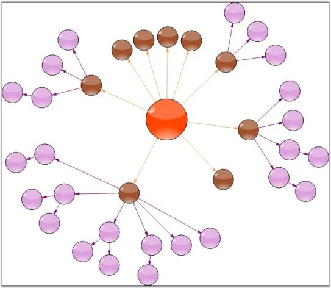

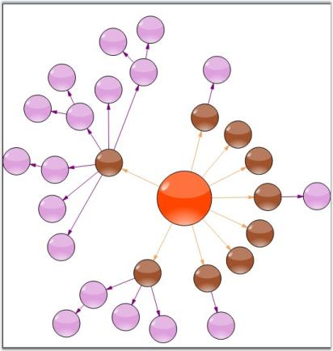

### Symmetric Layout Manager

The Symmetric layout manager arranges all the nodes in a symmetric fashion using the vertical input distance, which specifies the distance between the nodes.

The Model and Vertical Distance values are passed as parameters to the SymmetricLayoutManager class. The parameters and properties of Symmetric Layout Manager is listed below.

<table>
<tr>
<th>
Property</th><th>
Description</th></tr>
<tr>
<td>
Model</td><td>
Represents the model of the diagram, which has to be displayed out as a directed tree.</td></tr>
<tr>
<td>
VerticalDistance</td><td>
Defines the Graph Rotation angle. It accepts only integer values between 0 - 360.</td></tr>
<tr>
<td>
SpringFactor</td><td>
Gets or sets the spring factor.</td></tr>
<tr>
<td>
SpringLength</td><td>
Defines the spring length.</td></tr>
<tr>
<td>
MaxIteration</td><td>
Holds the maximum count of iteration.</td></tr>
</table>

Programmatically, the symmetric layout manager instance is created with the respective arguments, assigned to the LayoutManager and updated as follows.




    SymmetricLayoutManager symmetricLayout = new SymmetricLayoutManager(diagram1.Model,100);
    symmetricLayout.SpringFactor = 0.442;
    symmetricLayout.SpringLength = 100;
    symmetricLayout.MaxIteration = 500;
    this.diagram1.LayoutManager = symmetricLayout;
    this.diagram1.LayoutManager.UpdateLayout(null);




    Dim symmetricLayout As New SymmetricLayoutManager(diagram1.Model, 100)
    symmetricLayout.SpringFactor = 0.442
    symmetricLayout.SpringLength = 100
    symmetricLayout.MaxIteration = 500
    Me.diagram1.LayoutManager = symmetricLayout
    Me.diagram1.LayoutManager.UpdateLayout(Nothing)




Sample Diagrams are as follows.

### Hierarchical Layout Manager

Hierarchical layout manager arranges the nodes in a hierarchical fashion depending on the parent-child relationship. Unlike the directed layout, more than one parent item can be defined for a child.

The parameters to be passed for the HierarchicalLayoutManager class are as follows: 

<table>
<tr>
<th>
Property</th><th>
Description</th></tr>
<tr>
<td>
Model</td><td>
Represents the model of the diagram, which has to be displayed out as a directed tree.</td></tr>
<tr>
<td>
RotationAngle</td><td>
Defines the Graph Rotation angle. It accepts only integer values between 0-360.</td></tr>
<tr>
<td>
HorizontalSpacing</td><td>
Holds the value for the horizontal offset between adjacent nodes (float value).</td></tr>
<tr>
<td>
VerticalSpacing</td><td>
Holds the value for the vertical offset between adjacent nodes (float value).</td></tr>
</table>

Programmatically, the hierarchical layout manager instance should be created with the respective arguments, assigned to the Layout Manager and updated as follows.




HierarchicLayoutManager hierarchyLayout = new HierarchicLayoutManager (diagram1.Model, 0, 10, 20);
this.diagram1.LayoutManager = hierarchyLayout;
this.diagram1.LayoutManager.UpdateLayout(null);




Dim hierarchyLayout As New HierarchicLayoutManager(diagram1.Model, 0, 10, 20)
Me.diagram1.LayoutManager = hierarchyLayout
Me.diagram1.LayoutManager.UpdateLayout(Nothing)




Sample diagrams are as follows:

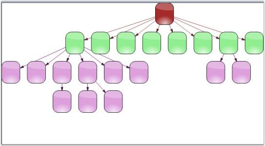

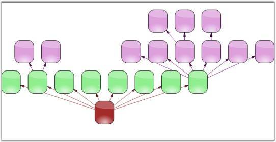

### Graph Layout Manager 

The GraphLayoutManager is an abstract base class that can be used for implementing layout managers for diagrams composed primarily of nodes forming connected graphs. The GraphLayoutManager implements the infrastructure for initializing, validating and creating the diagram graph by enumerating the diagram model's child nodes. It also enables positioning diagram nodes using the layout strategies provided by specialized directed tree layout managers that derive from it.

The event of the Graph Layout Manager class and its description is given below:

<table>
<tr>
<th>
Event</th><th>
Description</th></tr>
<tr>
<td>
PreferredLayout Event</td><td>
Event provides the application a chance to customize the layout of the diagram.</td></tr>
</table>

Programmatically, it is implemented as follows.




    RadialTreeLayoutManager dtlm = new RadialTreeLayoutManager(this.diagram1.Model, 0, 20, 20);
    dtlm.PreferredLayout += new PreferredLayoutEventHandler(dtlm_PreferredLayout);
    this.diagram1.LayoutManager = dtlm;
    this.diagram1.LayoutManager.UpdateLayout(null);
    this.diagram1.UpdateView();
    
    private void dtlm_PreferredLayout(object sender, PreferredLayoutEventArgs evtArgs)
    {
       if (evtArgs.IsGraphUnderLayout)
       {
            evtArgs.ResizeGraphNodes = false;
            evtArgs.Location = new PointF(150,150);
            evtArgs.Size = new SizeF(100, 100);
       }
    }




    Dim dtlm As New RadialTreeLayoutManager(Me.diagram1.Model, 0, 20, 20)
    AddHandler dtlm.PreferredLayout, AddressOf dtlm_PreferredLayout
    Me.diagram1.LayoutManager = dtlm
    Me.diagram1.LayoutManager.UpdateLayout(Nothing)
    Me.diagram1.UpdateView()
    
    Private Sub dtlm_PreferredLayout(ByVal sender As Object, ByVal evtArgs As PreferredLayoutEventArgs)
        If evtArgs.IsGraphUnderLayout Then
            evtArgs.ResizeGraphNodes = False
            evtArgs.Location = New PointF(150, 150)
            evtArgs.Size = New SizeF(100, 100)
        End If
    End Sub




The following is a sample Diagram showing GraphLayoutManager:

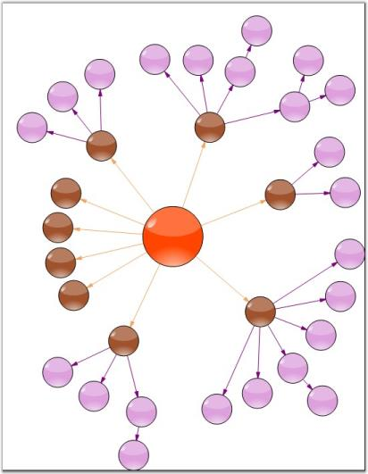

### Subgraph Layout Manager 

The SubgraphTreeLayoutManager enables the sub nodes of a diagram layout tree to have an orientation that is distinct from the parent node. The subgraph orientation is specified using a SubgraphPreferredLayout event that the layout manager raises before positioning each set of sub nodes in the graph.

The event of the SubgraphLayoutManager class is as follows:

<table>
<tr>
<th>
Event</th><th>
Description</th></tr>
<tr>
<td>
SubgraphPreferredLayout</td><td>
Event that the layout manager raises before positioning each set of sub nodes in the graph.</td></tr>
</table>

Programmatically, it is implemented as follows.




    SubgraphTreeLayoutManager st = new SubgraphTreeLayoutManager(this.diagram1.Model,0, 20, 20);
    st.SubgraphPreferredLayout += new SubgraphPreferredLayoutEventHandler(st_SubgraphPreferredLayout);
    this.diagram1.LayoutManager = st;
    this.diagram1.LayoutManager.UpdateLayout(null);
    this.diagram1.UpdateView();
    
    private void st_SubgraphPreferredLayout(object sender, SubgraphPreferredLayoutEventArgs evtArgs)
    {
          evtArgs.ResizeSubgraphNodes=false;
          evtArgs.RotationDegree=0;
    }




    Dim st As New SubgraphTreeLayoutManager(Me.diagram1.Model, 0, 20, 20)
    AddHandler st.SubgraphPreferredLayout, AddressOf st_SubgraphPreferredLayout
    Me.diagram1.LayoutManager = st
    Me.diagram1.LayoutManager.UpdateLayout(Nothing)
    Me.diagram1.UpdateView()
    
    Private Sub st_SubgraphPreferredLayout(ByVal sender As Object, ByVal evtArgs As SubgraphPreferredLayoutEventArgs)
        evtArgs.ResizeSubgraphNodes = False
        evtArgs.RotationDegree = 0
    End Sub




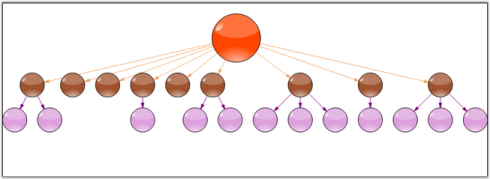

### OrgChart Layout Manager  

Event arranges all the nodes in parent-child relationship with the new OrgLineConnector that connects the nodes to get the OrgLayout appearance. The OrgLineConnector is specially designed for connecting the nodes in OrgChartLayoutManager.

<table>
<tr>
<th>
Property</th><th>
Description</th></tr>
<tr>
<td>
Model</td><td>
Represents the model of the diagram, which is displayed as an OrgLayout.</td></tr>
<tr>
<td>
RotationDirection</td><td>
Gets / sets the layout directions. There are four major directions, which are as follows:BottomToTopLeftToRightRightToLeftTopToBottom</td></tr>
<tr>
<td>
HorizontalSpacing</td><td>
Holds the value for the horizontal offset between adjacent nodes (float value).</td></tr>
<tr>
<td>
VerticalSpacing</td><td>
Holds the value for the vertical offset between adjacent nodes (float value).</td></tr>
</table>

Programmatically, the organization layout manager instance should be created with the respective arguments, assigned to the Layout Manager and updated as follows. 




    OrgChartLayoutManager manager = new OrgChartLayoutManager(this.diagram.Model,RotateDirection.TopToBottom, 20, 50);
    this.diagram1.LayoutManager = manager;
    this.diagram1.LayoutManager.UpdateLayout(null);




    Dim manager As New OrgChartLayoutManager(Me.diagram.Model, RotateDirection.TopToBottom, 20, 50)
    Me.diagram1.LayoutManager = manager
    Me.diagram1.LayoutManager.UpdateLayout(Nothing)




Sample diagram is as follows.

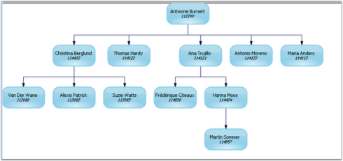

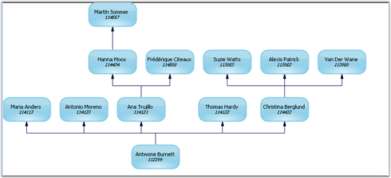

### OrgChart Alignment

As the OrgChartLayout follows a Waterfall model, whenever there is only one child node, the layout will be widened. To overcome this, Essential diagram enables you to align the single child node parallel to the parent node, which will reduce the layout structure.




    OrgChartLayoutManager manager = new OrgChartLayoutManager(this.diagram.Model, RotateDirection.TopToBottom, 20, 50, LayoutType.Waterfall, 1, true);




    Dim manager as New OrgChartLayoutManager(Me.diagram.Model,RotateDirection.TopToBottom, 20, 50,LayoutType.Waterfall, 1, True)




### Layout Manager Settings

Margin Properties for Layout Managers

For all the Layout Managers supported by Essential Diagram, except _Symmetric and Table Layout Manager_, it is now possible to set the left and right margins for the graph that can be laid out by the layout manager. The two new properties, i.e, TopMargin and LeftMargin of the Layout Manager will set the margin for the graph using the following code snippet.




    OrgChartLayoutManager manager = new OrgChartLayoutManager(this.diagram.Model, RotateDirection.TopToBottom, 20, 50);
    manager.LeftMargin = 50;
    manager.TopMargin = 50;




    Dim manager as New OrgChartLayoutManager(Me.diagram.Model,RotateDirection.TopToBottom, 20, 50)
    manager.LeftMargin = 50
    manager.TopMargin = 50




### Improving performance

The performance of most of the Essential Diagram Layout Managers is now improved to a great extent. The time taken for laying out a diagram, using a Layout Manager can now be reduced by setting the ImprovePerformance property to _true_.




OrgChartLayoutManager manager = new OrgChartLayoutManager(this.diagram.Model, RotateDirection.TopToBottom, 20, 50);
manager.ImprovePerformance = true;




Dim manager as New OrgChartLayoutManager(Me.diagram.Model,RotateDirection.TopToBottom, 20, 50)
manager.ImprovePerformance = True




