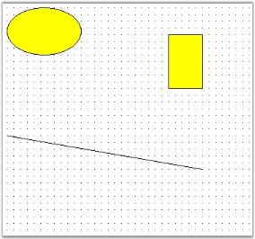

# Nodes or Shapes

The Diagram control supports different kinds of nodes. The following are the nodes that are supported by the Diagram control:

* TextNode
* Shape
* Symbol
* ControlNode
* PathNode
* BitmapNode
* RichTextNode
* MetafileNode
* Group
* PseudoGroup
* FilledPath
* FilledShape
* RoundRect
* PolygonA
* Rectangle
* ClosedCurveNode
* Ellipse
* SemiCircle
* CircularArc
* PolylineNode
* CurveNode
* Line
* SplineNode
* Arc
* BezierCurve
* MeasureLine
* Polyline
* OrthogonalConnector
* LineConnector
* OrthogonalLine
* Link
* PolyLineConnector

Creating a Node in the Diagram Control at Run Time

To create a node in the Diagram control:

1. Drag the Diagram control to the windows form.
2. Press the F7 key to open the *.cs file and enter the following code in the Page_Load function.

[C#]

private void Form1_Load(object sender, EventArgs e)

{

    Syncfusion.Windows.Forms.Diagram.Ellipse ellipse = new Syncfusion.Windows.Forms.Diagram.Ellipse(10, 10, 110, 70);

    diagram1.Model.AppendChild(ellipse);

}

[VB]

Private Sub Form1_Load(ByVal sender As Object, ByVal e As EventArgs)

    Dim ellipse As New Syncfusion.Windows.Forms.Diagram.Ellipse(10, 10, 110, 70)

    diagram1.Model.AppendChild(ellipse)

End Sub

{  | markdownify }
{:.image }

Node Property Settings

The following code example demonstrates how to apply node property settings.

[C#]

private void Form1_Load(object sender, EventArgs e)

{

    Syncfusion.Windows.Forms.Diagram.Ellipse ellipse = new Syncfusion.Windows.Forms.Diagram.Ellipse(10, 10, 110, 70);

    diagram1.Model.AppendChild(ellipse);

    ellipse.FillStyle.Color = System.Drawing.Color.AliceBlue;

    ellipse.FillStyle.ColorAlphaFactor = 100;

    ellipse.FillStyle.ForeColor = System.Drawing.Color.Aquamarine;

    ellipse.FillStyle.ForeColorAlphaFactor = 70;

    ellipse.FillStyle.Type = FillStyleType.PathGradient;

    ellipse.FillStyle.PathBrushStyle = PathGradientBrushStyle.RectangleCenter;

    ellipse.FillStyle.Type = FillStyleType.LinearGradient;

    ellipse.FillStyle.GradientAngle = 95;

    ellipse.FillStyle.GradientCenter = 0.5f;

    ellipse.EditStyle.AllowChangeHeight = true;

    ellipse.EditStyle.AllowChangeWidth = true;

    ellipse.EditStyle.AllowDelete = false;

    ellipse.EditStyle.AllowMoveX = true;

    ellipse.EditStyle.AllowMoveY = false;

    ellipse.EditStyle.AllowRotate = false;

    ellipse.EditStyle.AllowSelect = true;

}

[VB]

Private Sub Form1_Load(ByVal sender As Object, ByVal e As EventArgs)

    Dim ellipse As New Syncfusion.Windows.Forms.Diagram.Ellipse(10, 10, 110, 70)

    diagram1.Model.AppendChild(ellipse)

    ellipse.FillStyle.Color = System.Drawing.Color.AliceBlue

    ellipse.FillStyle.ColorAlphaFactor = 100

    ellipse.FillStyle.ForeColor = System.Drawing.Color.Aquamarine

    ellipse.FillStyle.ForeColorAlphaFactor = 70

    ellipse.FillStyle.Type = FillStyleType.PathGradient

    ellipse.FillStyle.PathBrushStyle = PathGradientBrushStyle.RectangleCenter

    ellipse.FillStyle.Type = FillStyleType.LinearGradient

    ellipse.FillStyle.GradientAngle = 95

    ellipse.FillStyle.GradientCenter = 0.5F

    ellipse.EditStyle.AllowChangeHeight = True

    ellipse.EditStyle.AllowChangeWidth = True

    ellipse.EditStyle.AllowDelete = False

    ellipse.EditStyle.AllowMoveX = True

    ellipse.EditStyle.AllowMoveY = False

    ellipse.EditStyle.AllowRotate = False

    ellipse.EditStyle.AllowSelect = True

End Sub

{  | markdownify }
{:.image }

Creating Nodes and Links

The following code example illustrates how to create nodes and links.

[C#]

protected void Page_Load(object sender, EventArgs e)

{

    Syncfusion.Windows.Forms.Diagram.Ellipse ellipse = new Syncfusion.Windows.Forms.Diagram.Ellipse(10, 10, 110, 70);

    Syncfusion.Windows.Forms.Diagram.Rectangle rectangle = new Syncfusion.Windows.Forms.Diagram.Rectangle(250, 50, 50, 80);

    Syncfusion.Windows.Forms.Diagram.LineConnector lineconnector = new Syncfusion.Windows.Forms.Diagram.LineConnector(new System.Drawing.PointF(10, 200), new System.Drawing.PointF(300, 250));

    this.diagram1.Model.AppendChild(ellipse);

    this.diagram1.Model.AppendChild(rectangle);

    this.diagram1.Model.AppendChild(lineconnector);

}

[VB]

Protected Sub Page_Load(ByVal sender As Object, ByVal e As EventArgs)

    Dim ellipse As New Syncfusion.Windows.Forms.Diagram.Ellipse(10, 10, 110, 70)

    Dim rectangle As New Syncfusion.Windows.Forms.Diagram.Rectangle(250, 50, 50, 80)

    Dim lineconnector As New Syncfusion.Windows.Forms.Diagram.LineConnector(New System.Drawing.PointF(10, 200), New System.Drawing.PointF(300, 250))

    Me.diagram1.Model.AppendChild(ellipse)

    Me.diagram1.Model.AppendChild(rectangle)

    Me.diagram1.Model.AppendChild(lineconnector)

End Sub

{  | markdownify }
{:.image }

