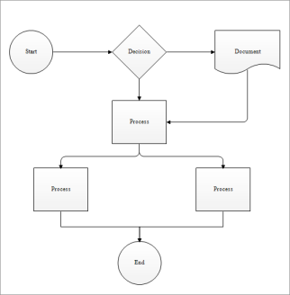

# Rounded Corner

You can now change the look of connectors (Orthogonal, Org line, Polyline) by providing rounded corners to connectors.

The EnableRoundedCorner is used to to enable rounded corner for a connector, and the CurveRadius connector property is used and set the radius for the rounded corner curve respectively.

### Use Case Scenario

This is used to change the visual style of connectors.

<table>
<tr>
<th>
Property</th><th>
Description </th><th>
Data Type </th></tr>
<tr>
<td>
EnableRoundedCorner</td><td>
Enables or disables rounded corner for a connector.</td><td>
bool</td></tr>
<tr>
<td>
CurveRadius</td><td>
Gets or sets the radius for the rounded corner curve of a connector.</td><td>
float</td></tr>
</table>

The following code illustrates how to change the look of a connector by using the EnableRoundedCorner and CurveRadius properties.




OrthogonalConnector orthogonal = new OrthogonalConnector(new PointF(100, 100), new PointF(300, 300));

// Enables rounded corner for the connector.
orthogonal.EnableRoundedCorner = true;

// Sets the radius of the rounded corner curve.
orthogonal.CurveRadius = 10;

diagram1.Model.AppendChild(orthogonal);




Dim orthogonal As New OrthogonalConnector(New PointF(100, 100), New PointF(300, 300))

'Enables rounded corner for the connector.
orthogonal.EnableRoundedCorner = True

'Sets the radius of the rounded corner curve.
orthogonal.CurveRadius = 10

diagram1.Model.AppendChild(orthogonal)




