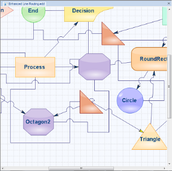
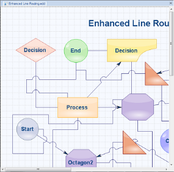
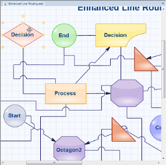
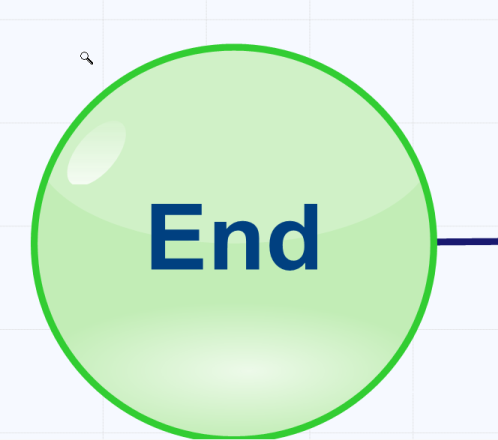

# Zoom and Pan

## Zooming Support

One of the interactive features of Essential Diagram is its zooming capabilities. This feature allows you to interactively zoom in and out of the diagram in the following ways:

* Zoom to the center of the diagram.
* Zoom to the top left of the diagram.
* Zoom to the pointer position using Ctrl and the mouse wheel.

#### Use Case Scenarios

Users can zoom in and out of diagram content based on their requirements.

Properties

<table>
<tr>
<th>
Property </th><th>
Description </th><th>
Data Type </th></tr>
<tr>
<td>
ZoomType </td><td>
Gets or sets the type of zooming to be performed. </td><td>
enum</td></tr>
<tr>
<td>
ZoomIncrement</td><td>
Specifies the amount to zoom each time the diagram is zoomed in or out.</td><td>
float</td></tr>
</table>

Methods

<table>
<tr>
<th>
Method </th><th>
Description </th><th>
Parameters </th><th>
Return Type </th></tr>
<tr>
<td>
ZoomIn</td><td>
Zoom in on the diagram document.</td><td>
NA</td><td>
void</td></tr>
<tr>
<td>
ZoomOut</td><td>
Zoom out of the diagram document. </td><td>
NA</td><td>
void</td></tr>
<tr>
<td>
ZoomToSelection</td><td>
Zoom the diagram document to the specified selection bounds.</td><td>
RectangleF  </td><td>
void</td></tr>
<tr>
<td>
ZoomToActual</td><td>
Zoom the document to its actual size.</td><td>
NA</td><td>
void</td></tr>
</table>

#### ZoomIn, ZoomOut, ZoomToActual, ZoomToSelection

The diagram document can be zoomed in, zoomed out, zoomed to its original size, and zoomed to a selected area based on the ZoomIncrement. You can use the following methods to zoom in the diagram document.

* ZoomIn()
* ZoomOut()
* ZoomToSelection(RectangleF)
* ZoomToActual()

The following code samples explain how to use the zoom methods to zoom in the diagram programmatically:




//Sets the zoom increment value.
this.diagram1.View.ZoomIncrement = 20;

// Zoom in on the document.
this.diagram1.View.ZoomIn();

// Zoom out of the document.
this.diagram1.View.ZoomOut();  

// Zoom the document to its actual size.
this.diagram1.View.ZoomToActual();  

// Zoom the document to the selection.
this.diagram1.View.ZoomToSelection(new RectangleF(100,100,100,100));   




‘Sets the zoom increment value.
Me.diagram1.View.ZoomIncrement = 20

‘Zoom in on the document.
Me.diagram1.View.ZoomIn() 

‘Zoom out of the document.
Me.diagram1.View.ZoomOut() 

‘Zoom the document to its actual size.
Me.diagram1.View.ZoomToActual()    

‘Zoom the document to the selection.
Me.diagram1.View.ZoomToSelection(New RectangleF(100,100,100,100))




#### Zooming to the Center of the Diagram

The diagram document can be zoomed to the center of the current viewport by setting the ZoomType as Center. The default value of ZoomType is Center. 

The following code sample demonstrates how to use the zoom to center feature in a diagram:




// Sets the ZoomType as ‘center’. 
this.diagram1.View.ZoomType = ZoomType.Center;  




'Sets the ZoomType as ‘center’. 
Me.diagram1.View.ZoomType = ZoomType.Center




#### Zooming to the Top-Left of the Diagram

The diagram document can be zoomed to the top-left corner of the viewport by setting the ZoomType as TopLeft. 

The following code shows how to use the zoom to top-left feature:




// Sets the ZoomType as TopLeft. 
this.diagram1.View.ZoomType = ZoomType.TopLeft;  




' Sets the ZoomType as TopLeft. 
Me.diagram1.View.ZoomType = ZoomType.TopLeft




#### Zooming to the Pointer Position

Essential Diagram supports zooming the diagram document to the pointer position using Ctrl and the mouse wheel. 

#### ZoomTool

Essential Diagram supports a UI tool called ZoomTool which is used to zoom and select the diagram document interactively. Users can use the ZoomTool’s MaximumMagnification and MinimumMagnification properties to restrict the document’s maximum or minimum zoom levels and use the ZoomIncrement property to specify the amount to zoom each time the diagram is zoomed in or out.

Zoom Tool Properties

<table>
<tr>
<th>
 Property </th><th>
Description </th><th>
Data Type </th></tr>
<tr>
<td>
MaximumMagnification</td><td>
Specifies the maximum magnification value for zooming. Default value is 1000.</td><td>
float</td></tr>
<tr>
<td>
MinimumMagnification</td><td>
Specifies the minimum magnification value for zooming. Default value is 10.</td><td>
float</td></tr>
<tr>
<td>
ZoomIncrement</td><td>
Specifies the amount to zoom each time the mouse is clicked.</td><td>
float</td></tr>
</table>

The following code demonstrates how to activate the zoom tool:




diagram1.Controller.ActivateTool("ZoomTool");
ZoomTool zoomTool = (ZoomTool)diagram1.Controller.ActiveTool;
zoomTool.MaximumMagnification = 100;
zoomTool.MinimumMagnification = 50;
zoomTool.ZoomIncrement = 10;




diagram1.Controller.ActivateTool("ZoomTool")
Dim zoomTool As ZoomTool = CType(diagram1.Controller.ActiveTool, ZoomTool)
zoomTool.MaximumMagnification = 100
zoomTool.MinimumMagnification = 50
zoomTool.ZoomIncrement = 10




## Panning Support

Pan tool allows the user to drag the diagram and hence scroll it in any direction. 

Programmatically, it is implemented as follows.




this.diagram1.Controller.ActivateTool("PanTool");




Me.diagram1.Controller.ActivateTool("PanTool")




Sample diagram is as follows.

