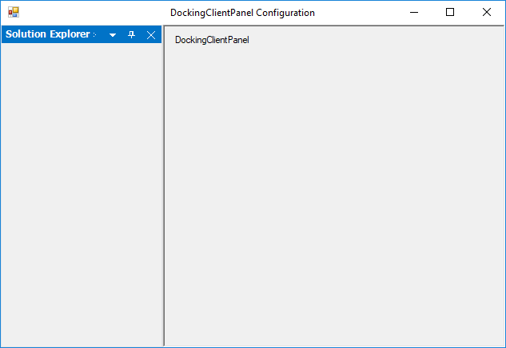
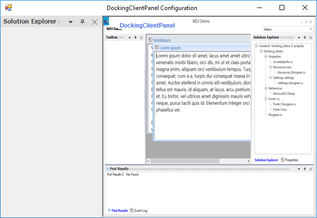

# Docking Client Panel in Windows Forms Docking Manager

A docking window is inherited from the client window but the layout of docking window is varied from client window at run-time, since the window is set in dock or float state. This paradigm is extremely well suited for MDI type forms where the MDIClient window gets resized/relocated in synchronization with changes in the docking windows layout.

Child controls located within the MDIClient window are always assured of a static spatial relationship with the parent container.

Non-MDI forms do not have any such client window and all non-dockable statically positioned controls risk being clipped by windows that are docked in their proximity.

The Essential Tools of docking client panel control help to overcome this limitation by providing an auto-resized client surface on which a form's non-dockable controls can be located.

N> The docking client panel control is intended only for use with forms that do not have the MDIContainer style set.

## Add control to Docking Manager as client control

The following are the steps involved in setting up a docking layout on a non-MDIContainer form using the docking client panel. The docking client panel is used here because in addition to docking windows, the host form contains several non-dockable controls that require a container with static relative bounds to implement positioning and layout management.

1. Add the docking manager to the form and apply the `EnableDocking` for those controls that need to be set as docking windows.
2. Select the docking client panel control from the designer tool box and drop it to the form hosting the docking manager. Size the control, so that its bounds can accommodate any non-dockable child controls that may already be present on the form.
3. If any non-dockable controls are present in the form, then drag-and-drop the controls to the docking client panel instance.
4. Set the DockingClientPanel.SizeToFit property to `true`. Turning on the SizeToFit property forces the DockingClientPanel to start interacting with the Essential Tools docking architecture. The control will automatically be resized/repositioned to occupy the form's client bounds or left unoccupied by the docking windows.
5. Set the `BorderStyle` property to get the 3D or fixed single effect to the docking client panel control.
6. Now, the docking client panel will function as a proxy for the form's client surface and all controls originally intended to be placed on the form should henceforth be located on the DockingClientPanel. Any anchoring/layout features for child controls should be set relative to the docking client panel.
7. To add controls directly to the form, the `SizeToFit` property can temporarily be turned off within the designer and the form resized to expose its surface. At run-time, the `SizeToFit` property is always enabled.

<table>
<tr>
<th>
Properties</th><th>
Description</th></tr>
<tr>
<td>
{{ '[SizeToFit](https://help.syncfusion.com/cr/windowsforms/Syncfusion.Windows.Forms.Tools.DockingClientPanel.html#Syncfusion_Windows_Forms_Tools_DockingClientPanel_SizeToFit)' | markdownify }}</td><td>
Gets or sets a value indicating whether the control is sized to fill the form's area.</td></tr>
<tr>
<td>
{{ '[BorderStyle](https://help.syncfusion.com/cr/windowsforms/Syncfusion.Windows.Forms.Tools.DockingClientPanel.html#Syncfusion_Windows_Forms_Tools_DockingClientPanel_BorderStyle)' | markdownify }}</td><td>
Indicates the border style of the control.</td></tr>
</table>

8. The docking client panel control can be added to the non-MDI forms using the following code snippet.





//Declaration and initialization

private Syncfusion.Windows.Forms.Tools.DockingClientPanel dockingClientPanel1;

private System.Windows.Forms.Label label1;

this.dockingClientPanel1 = new Syncfusion.Windows.Forms.Tools.DockingClientPanel();

this.label1 = new System.Windows.Forms.Label();

this.dockingClientPanel1.SuspendLayout();

this.label1.Text = "DockingClientPanel";

//Add a control to DockingClientPanel

this.dockingClientPanel1.Controls.Add(this.label1);

this.dockingManager1.DockControl(this.panel1, this, Syncfusion.Windows.Forms.Tools.DockingStyle.Left, 200);

//set the properties

this.dockingClientPanel1.Location = new System.Drawing.Point(0, 133);

this.dockingClientPanel1.Name = "dockingClientPanel1";

this.dockingClientPanel1.Size = new System.Drawing.Size(600, 369);

this.dockingClientPanel1.SizeToFit = true;

this.dockingClientPanel1.TabIndex = 0;

this.dockingClientPanel1.BorderStyle = System.Windows.Forms.BorderStyle.Fixed3D;

//Add the control to the form

this.Controls.Add(this.dockingClientPanel1);

this.dockingClientPanel1.ResumeLayout(false);

  

 

 

' Declaration and initialization

Private dockingClientPanel1 As Syncfusion.Windows.Forms.Tools.DockingClientPanel

Private  label1 As System.Windows.Forms.Label

Me.dockingClientPanel1 = New Syncfusion.Windows.Forms.Tools.DockingClientPanel()

Me.label1 = New System.Windows.Forms.Label()

Me.dockingClientPanel1.SuspendLayout()

Me.label1.Text = "DockingClientPanel"

' Add a control to DockingClientPanel 

Me.dockingClientPanel1.Controls.AddRange(New System.Windows.Forms.Control() {Me.label1})

Me.dockingManager1.DockControl(Me.panel1, Me, Syncfusion.Windows.Forms.Tools.DockingStyle.Left, 200)

'set the properties

Me.dockingClientPanel1.AutoScroll = True

Me.dockingClientPanel1.Location = New System.Drawing.Point(106, 0)

Me.dockingClientPanel1.Name = "dockingClientPanel1"

Me.dockingClientPanel1.Size = New System.Drawing.Size(452, 417)

Me.dockingClientPanel1.SizeToFit = True

Me.DockingClientPanel1.BorderStyle = System.Windows.Forms.BorderStyle.Fixed3D

' Add the control to the form

Me.Controls.AddRange(New System.Windows.Forms.Control() {Me.dockingClientPanel1})

Me.dockingClientPanel1.ResumeLayout(False)
		




 

## Customize client panel

The docking client panel gives an attractive look and feel using the appearance and size properties. These properties are discussed in detail below. This section also gives an idea about the scrolling feature available for the client panel.

### Change background and foreground

The background color of the control can be set using the `BackColor` property. The background image can be specified using the `BackgroundImage` property and image layout is set through the `BackgroundImageLayout` property. The following are the code snippets to set these properties programmatically.

<table>
<tr>
<th>
Properties</th><th>
Description</th></tr>
<tr>
<td>
BackColor</td><td>
Indicates the background color of the component.</td></tr>
<tr>
<td>
BackgroundImage</td><td>
Indicates the background image used for the control.</td></tr>
<tr>
<td>
BackgroundImageLayout</td><td>
Indicates the background image layout used for the control.</td></tr>
</table>





this.dockingClientPanel1.BackColor = System.Drawing.Color.AliceBlue;

this.dockingClientPanel1.BackgroundImage = CType((Resources.GetObject("dockingClientPanel1.BackgroundImage")), System.Drawing.Image);

this.dockingClientPanel1.BackgroundImageLayout = System.Windows.Forms.ImageLayout.Stretch;





Me.dockingClientPanel1.BackColor = System.Drawing.Color.AliceBlue

Me.dockingClientPanel1.BackgroundImage = CType((Resources.GetObject("dockingClientPanel1.BackgroundImage")), System.Drawing.Image)

Me.dockingClientPanel1.BackgroundImageLayout = System.Windows.Forms.ImageLayout.Stretch





The font used to display the text in the control is set through the Font property and the fore color through the ForeColor property. The following are the code snippets to set these two properties programmatically.

<table>
<tr>
<th>
Properties</th><th>
Description</th></tr>
<tr>
<td>
Font</td><td>
The font is used to display the text in the control.</td></tr>
<tr>
<td>
ForeColor</td><td>
The foreground color of this component is used to display the text.</td></tr>
</table>





this.dockingClientPanel1.Font = new System.Drawing.Font("Arial", 9F, System.Drawing.FontStyle.Bold, System.Drawing.GraphicsUnit.Point, ((byte)(0)));

this.dockingClientPanel1.ForeColor = System.Drawing.Color.RoyalBlue;





Me.dockingClientPanel1.Font = New System.Drawing.Font("Arial", 9.0F, System.Drawing.FontStyle.Bold, System.Drawing.GraphicsUnit.Point, CType((0), Byte))

Me.dockingClientPanel1.ForeColor = System.Drawing.Color.RoyalBlue





The following image illustrates a docking client panel in which the foreground and background properties has been set.

 

## Auto sizing

The autoSize property allows the control to automatically size itself to fit its contents. The resize mode can be specified using the `AutoSizeMode` property.

<table>
<tr>
<th>
Properties</th><th>
Description</th></tr>
<tr>
<td>
AutoSize</td><td>
Specifies whether a control automatically resizes itself to fit its contents.</td></tr>
<tr>
<td>
AutoSizeMode</td><td>
Specifies the mode by which the user interface element automatically resizes itself.</td></tr>
</table>





this.dockingClientPanel1.AutoSize = true;

this.dockingClientPanel1.AutoSizeMode = System.Windows.Forms.AutoSizeMode.GrowAndShrink;





Me.dockingClientPanel1.AutoSize = True

Me.dockingClientPanel1.AutoSizeMode = System.Windows.Forms.AutoSizeMode.GrowAndShrink





## Scroll client control

When the control contents are larger than its visible area, the scroll bars will automatically appear by enabling the `AutoScroll` property. The margin for the control during autoscroll is specified using the `AutoScrollMargin` property, and the minimum size for auto scroll area can be specified using the `AutoScrollMinSize` property.

<table>
<tr>
<th>
Properties</th><th>
Description</th></tr>
<tr>
<td>
AutoScroll</td><td>
Indicates whether scroll bars automatically appear when the control contents are larger than its visible area.</td></tr>
<tr>
<td>
AutoScrollMargin</td><td>
Indicates the margin around controls during auto scroll.</td></tr>
<tr>
<td>
AutoScrollMinSize</td><td>
Indicates the minimum logical size for auto scroll region.</td></tr>
</table>





this.dockingClientPanel1.AutoScroll = true;

this.dockingClientPanel1.AutoScrollMargin = new System.Drawing.Size(1, 1);

this.dockingClientPanel1.AutoScrollMinSize = new System.Drawing.Size(1, 1);





Me.dockingClientPanel1.AutoScroll = True

Me.dockingClientPanel1.AutoScrollMargin = New System.Drawing.Size(1, 1)

Me.dockingClientPanel1.AutoScrollMinSize = New System.Drawing.Size(1, 1)     




