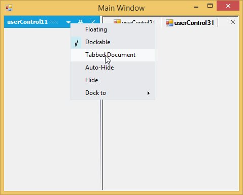

# How to use UserControls as TabbedMDIManager’s children?

 Normally TabbedMDI is used in MDI applications where the child forms are the children that get tabbed. But, we could also use TabbedMDI with UserControls as children and that are also dockable. The sample attached here shows how the UserControls can be used as TabbedMDI children in association with the DockingManager.

N> Set the `IsMdIContainer` property of the form to `true`. Otherwise this will not work.





this.tabbedMDIManager = new TabbedMDIManager();

this.tabbedMDIManager.AttachToMdiContainer(this);

// Dock the User Controls

this.dockingManager1.SetEnableDocking(this.userControl1, true);

this.dockingManager1.SetEnableDocking(this.userControl2, true);

this.dockingManager1.SetEnableDocking(this.userControl3, true);

// Set the user controls to MDI mode

this.dockingManager1.SetAsMDIChild(this.userControl11,true);

this.dockingManager1.SetAsMDIChild(this.userControl21,true);

this.dockingManager1.SetAsMDIChild(this.userControl31,true);





Me.tabbedMDIManager = New TabbedMDIManager()

Me.tabbedMDIManager.AttachToMdiContainer(Me)

' Dock the User Controls

Me.dockingManager1.SetEnableDocking(Me.userControl1, True);

Me.dockingManager1.SetEnableDocking(Me.userControl2, True);

Me.dockingManager1.SetEnableDocking(Me.userControl3, True);

' Set the user controls to MDI mode

Me.dockingManager1.SetAsMDIChild(Me.userControl11,True)

Me.dockingManager1.SetAsMDIChild(Me.userControl21,True)

Me.dockingManager1.SetAsMDIChild(Me.userControl31,True)





 

