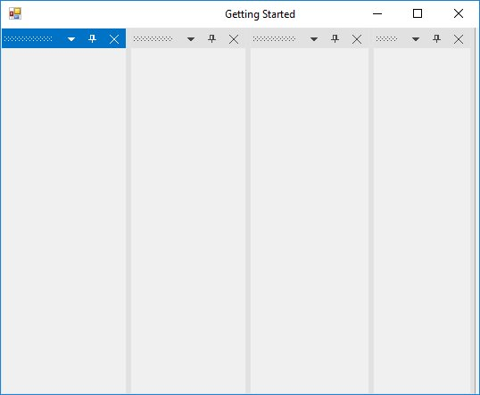
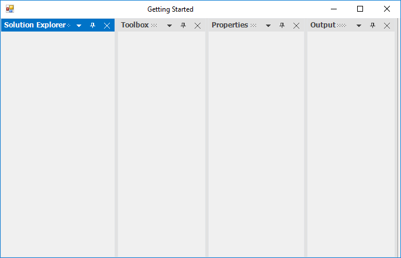
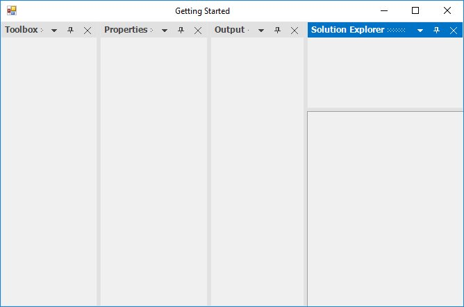
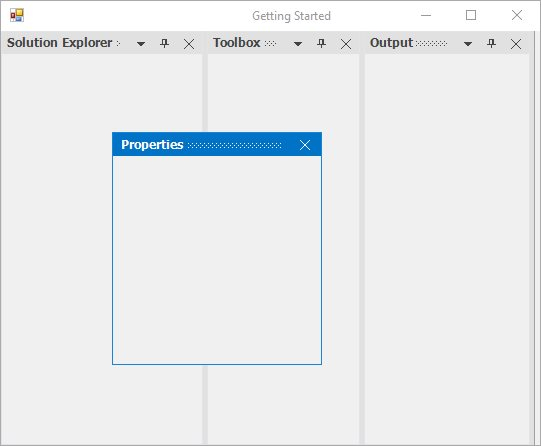
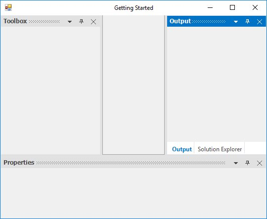
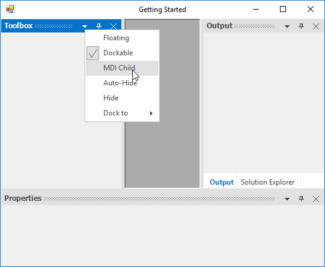
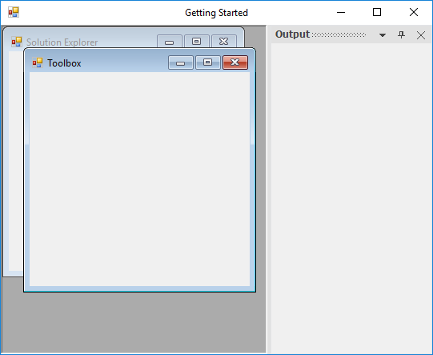

# Getting Started with Windows Forms Docking Manager

This section explains how to design a [Docking Manager in Windows Forms](https://www.syncfusion.com/winforms-ui-controls/docking-manager) application and overview of its basic functionalities.

## Assembly deployment

The following list of assemblies should be added as reference to use the docking manager in any application:

Refer [control dependencies](https://help.syncfusion.com/windowsforms/control-dependencies#dockingmanager) section to get the list of assemblies or NuGet package needs to be added as reference to use the control in any application. 

Find more details about how to install the nuget packages in Windows Forms application in the following link:

[How to install nuget packages](https://help.syncfusion.com/windowsforms/installation/install-nuget-packages)

**Creating simple application with docking manager**

You can create the Windows Forms application with docking manager control as follows:

1. [Creating the project](#creating-the-project)
2. [Adding control via Designer](#adding-control-via-designer)
3. [Adding control manually in code](#adding-control-manually-in-code)
4. [Add dock child window](#add-dock-child-window)
5. [Change Dock State of child](#change-dock-state-of-child)
6. [Change Dock Side](#change-dock-side)
7. [Make MDI child](#make-mdi-child)
8. [Serialize Dock windows](#serialize-dock-windows)

**Creating the project**

Create a new Windows Forms project in the Visual Studio to dock panels as like Visual Studio using the docking manager.

## Adding control via designer

To add the docking manager control to an application, drag it from the toolbox and drop in a designer view. The following required assembly references will be added automatically:

   * Syncfusion.Grid.Base.dll
   * Syncfusion.Grid.Windows.dll
   * Syncfusion.Shared.Base.dll
   * Syncfusion.Shared.Windows.dll
   * Syncfusion.Tools.Base.dll
   * Syncfusion.Tools.Windows.dll

   

## Adding control manually in code

To add control manually in C#, follow the given steps:

1. Add the following required assembly references to the project:
   * Syncfusion.Grid.Base.dll
   * Syncfusion.Grid.Windows.dll
   * Syncfusion.Shared.Base.dll
   * Syncfusion.Shared.Windows.dll
   * Syncfusion.Tools.Base.dll
   * Syncfusion.Tools.Windows.dll

2. Create [DockingManager](https://help.syncfusion.com/cr/windowsforms/Syncfusion.Windows.Forms.Tools.DockingManager.html) control instance and add it to the component list.





// Create the DockingManager instance and add it the component list. 

private Syncfusion.Windows.Forms.Tools.DockingManager dockingManager1; 

this.components = new System.ComponentModel.Container();

this.dockingManager1 = new Syncfusion.Windows.Forms.Tools.DockingManager(this.components); 

this.dockingManager1.HostControl = this;





'Create the DockingManager instance and add it the component list. 

Private dockingManager1 As Syncfusion.Windows.Forms.Tools.DockingManager

Me.components = New System.ComponentModel.Container()

Me.dockingManager1 = New Syncfusion.Windows.Forms.Tools.DockingManager(Me.components) 

Me.dockingManager1.HostControl = Me





## Add dock child window

Docking can be enabled to any controls by invoking [SetEnableDocking](https://help.syncfusion.com/cr/windowsforms/Syncfusion.Windows.Forms.Tools.DockingManager.html#Syncfusion_Windows_Forms_Tools_DockingManager_SetEnableDocking_System_Windows_Forms_Control_System_Boolean_) with the corresponding docking manager. Here, four panels are added to the form and transformed to a docking window.





private System.Windows.Forms.Panel panel1;
		
private System.Windows.Forms.Panel panel2;

private System.Windows.Forms.Panel panel3;
		
private System.Windows.Forms.Panel panel4;
		
this.panel1 = new System.Windows.Forms.Panel();
		
this.panel2 = new System.Windows.Forms.Panel();
		
this.panel3 = new System.Windows.Forms.Panel();
		
this.panel4 = new System.Windows.Forms.Panel();

//Enables the docking for the panels

this.dockingManager1.SetEnableDocking(panel1, true);

this.dockingManager1.SetEnableDocking(panel2, true);

this.dockingManager1.SetEnableDocking(panel3, true);

this.dockingManager1.SetEnableDocking(panel4, true);





Private panel1 As System.Windows.Forms.Panel

Private panel2 As System.Windows.Forms.Panel

Private panel3 As System.Windows.Forms.Panel

Private panel4 As System.Windows.Forms.Panel

Me.panel1 = New System.Windows.Forms.Panel()

Me.panel2 = New System.Windows.Forms.Panel()

Me.panel3 = New System.Windows.Forms.Panel()

Me.panel4 = New System.Windows.Forms.Panel()

'Enables the docking for the panels

Me.dockingManager1.SetEnableDocking(panel1, True)

Me.dockingManager1.SetEnableDocking(panel2, True)

Me.dockingManager1.SetEnableDocking(panel3, True)

Me.dockingManager1.SetEnableDocking(panel4, True)





### Identify whether the panel is docking or not

The [GetEnableDocking](https://help.syncfusion.com/cr/windowsforms/Syncfusion.Windows.Forms.Tools.DockingManager.html#Syncfusion_Windows_Forms_Tools_DockingManager_GetEnableDocking_System_Windows_Forms_Control_) function of docking manager helps to determine whether the child window is docking or not.





Console.Write("DockWindow Header:" + this.dockingManager1.GetEnableDocking(panel1));





Console.Write("DockWindow Header:" + Me.dockingManager1.GetEnableDocking(panel1))





### Change header of child window

The [SetDockLabel](https://help.syncfusion.com/cr/windowsforms/Syncfusion.Windows.Forms.Tools.DockingManager.html#Syncfusion_Windows_Forms_Tools_DockingManager_SetDockLabel_System_Windows_Forms_Control_System_String_) function helps to set the label for a child window.





// To set the label for the docked controls

this.dockingManager1.SetDockLabel(panel1, "Solution Explorer");

this.dockingManager1.SetDockLabel(panel2, "Toolbox");

this.dockingManager1.SetDockLabel(panel3, "Properties");

this.dockingManager1.SetDockLabel(panel4, "Output");





' To set the label for the docked controls

Me.dockingManager1.SetDockLabel(panel1, "Solution Explorer");

Me.dockingManager1.SetDockLabel(panel2, "Toolbox");

Me.dockingManager1.SetDockLabel(panel3, "Properties");

Me.dockingManager1.SetDockLabel(panel4, "Output");





#### Get label of the dock panel

The [GetDockLabel](https://help.syncfusion.com/cr/windowsforms/Syncfusion.Windows.Forms.Tools.DockingManager.html#Syncfusion_Windows_Forms_Tools_DockingManager_GetDockLabel_System_Windows_Forms_Control_) function helps to get the label of the child window.





// Get the label for the docked control

Console.Write("DockWindow Header:" + this.dockingManager1.GetDockLabel(panel1));





'Get the label for the docked control

Console.Write("DockWindow Header:" + Me.dockingManager1.GetDockLabel(panel1))





## Change dock state of child

The docking manager provides an option to dock, float, and auto hide the controls.

To dock the child window, use the following code snippet.





//To dock the panel1 on top side of the form.

this.dockingManager1.DockControl(this.panel1, this, Syncfusion.Windows.Forms.Tools.DockingStyle.Top, 100);





'To dock the panel1 on top side of the form.

Me.dockingManager1.DockControl(Me.panel1, Me, Syncfusion.Windows.Forms.Tools.DockingStyle.Top, 100)





To float the control, use the following code snippet.





//To set properties window state as floating at the desired location.

Rectangle rectangle = this.Bounds;

this.dockingManager1.FloatControl(this.panel3, new Rectangle(rectangle.Right - 300, rectangle.Bottom - 300, 200, 200));





'To set properties window state as floating at the desired location.

Dim rectangle As Rectangle = Me.Bounds 

Me.dockingManager1.FloatControl(Me.panel3, New Rectangle(rectangle.Right - 300, rectangle.Bottom - 300, 200, 200))





To auto hide the control, use the following code snippet.





// Sets panel1 as AutoHidden window

this.dockingManager1.SetAutoHideMode(panel1, true); //false to remove auto hide state.





'Sets panel1 as AutoHidden window

Me.dockingManager1.SetAutoHideMode(panel1, True) 'false to remove auto hide state.





## Change dock side

The [DockControl](https://help.syncfusion.com/cr/windowsforms/Syncfusion.Windows.Forms.Tools.DockingManager.html#Syncfusion_Windows_Forms_Tools_DockingManager_DockControl_System_Windows_Forms_Control_System_Windows_Forms_Control_Syncfusion_Windows_Forms_Tools_DockingStyle_System_Int32_) function helps to dock a panel at the required side using the [DockingStyle](https://help.syncfusion.com/cr/windowsforms/Syncfusion.Windows.Forms.Tools.DockingStyle.html) argument.

Set the `DockingStyle` value to right for docking the “Solution Explorer” panel on the right.

The DockingStyle tabbed option is used to tab a panel with another panel. The tabbing windows need to be aware of the parent control name. Set the “Output” window’s parent as “SolutionExplorer” to tab it on the “SolutionExplorer” window.





// To set the DockingStyle for the docked controls

this.dockingManager1.DockControl(this.panel3, this, Syncfusion.Windows.Forms.Tools.DockingStyle.Bottom, 100);

this.dockingManager1.DockControl(this.panel2, this, Syncfusion.Windows.Forms.Tools.DockingStyle.Left, 200);

this.dockingManager1.DockControl(this.panel1, this, Syncfusion.Windows.Forms.Tools.DockingStyle.Right, 200);
            
this.dockingManager1.DockControl(this.panel4, panel1, Syncfusion.Windows.Forms.Tools.DockingStyle.Tabbed, 200);





'To set the DockingStyle for the docked controls

Me.dockingManager1.DockControl(Me.panel3, Me, Syncfusion.Windows.Forms.Tools.DockingStyle.Bottom, 100)

Me.dockingManager1.DockControl(Me.panel2, Me, Syncfusion.Windows.Forms.Tools.DockingStyle.Left, 200)

Me.dockingManager1.DockControl(Me.panel1, Me, Syncfusion.Windows.Forms.Tools.DockingStyle.Right, 200)

Me.dockingManager1.DockControl(Me.panel4, panel1, Syncfusion.Windows.Forms.Tools.DockingStyle.Tabbed, 200)





## Make MDI child

The [SetAsMDIChild](https://help.syncfusion.com/cr/windowsforms/Syncfusion.Windows.Forms.Tools.DockingManager.html#Syncfusion_Windows_Forms_Tools_DockingManager_SetAsMDIChild_System_Windows_Forms_Control_System_Boolean_) function helps to set the docking window to the MDIChild window in the docking manager. Also, you can set the docked control as an MDI child in an easy method by using the `MDI Child` option in the context menu.

N> To enable MDI functionalities in the docking manager, the `IsMdIContainer` property of its parent form should be `true`.





//To set as MDI Child window

this.dockingManager1.SetAsMDIChild(panel1, true);

this.dockingManager1.SetAsMDIChild(panel2, true);





'To set as MDI Child window

Me.dockingManager1.SetAsMDIChild(panel1, True)

Me.dockingManager1.SetAsMDIChild(panel2, True)





 

## Serialize dock windows

The PersistState feature helps to save the current layout of the docking manager automatically to isolated storage while closing the form. The dock state can also be saved by calling the [SaveDockState](https://help.syncfusion.com/cr/windowsforms/Syncfusion.Windows.Forms.Tools.DockingManager.html#Syncfusion_Windows_Forms_Tools_DockingManager_SaveDockState) function.





//Saves the current dock state to Isolated Storage.

this.dockingManager.SaveDockState();

//Saves the current dock state information to the specified AppStateSerializer.

this.dockingManager.SaveDockState(serializer);

//Saves the dock state information for the specified dockable control.

this.dockingManager.SaveDockState(serializer, this.listBox1);





'Saves the current dock state to Isolated Storage.

Me.dockingManager.SaveDockState()

'Saves the current dock state information to the specified AppStateSerializer.

Me.dockingManager.SaveDockState(serializer)

'Saves the dock state information for the specified dockable control.

Me.dockingManager.SaveDockState(serializer, this.listBox1)





The saved state can be reloaded by calling the [LoadDockState](https://help.syncfusion.com/cr/windowsforms/Syncfusion.Windows.Forms.Tools.DockingManager.html#Syncfusion_Windows_Forms_Tools_DockingManager_LoadDockState) function, whenever it is required to load the states.





//Reads the persisted dock state from the Isolated Storage.

this.dockingManager.LoadDockState();

//Reads a previously serialized dock state using the AppStateSerializer object. 

this.dockingManager.LoadDockState(serializer);

//Reads a previously serialized dock state for the specified dockable control and applies the new state.

this.dockingManager.LoadDockState(serializer, this.listBox1);





'Reads the persisted dock state from the Isolated Storage.

Me.dockingManager.LoadDockState(serializer)

'Reads a previously serialized dock state using the AppStateSerializer object. 

Me.dockingManager.LoadDockState();

'Reads a previously serialized dock state for the specified dockable control and applies the new state.

Me.dockingManager.LoadDockState(serializer, this.listBox1)





N> You can explore our [WinForms Docking Manager example](https://github.com/syncfusion/winforms-demos/tree/master/edit) that shows how to render the Docking Manager in Windows Forms.