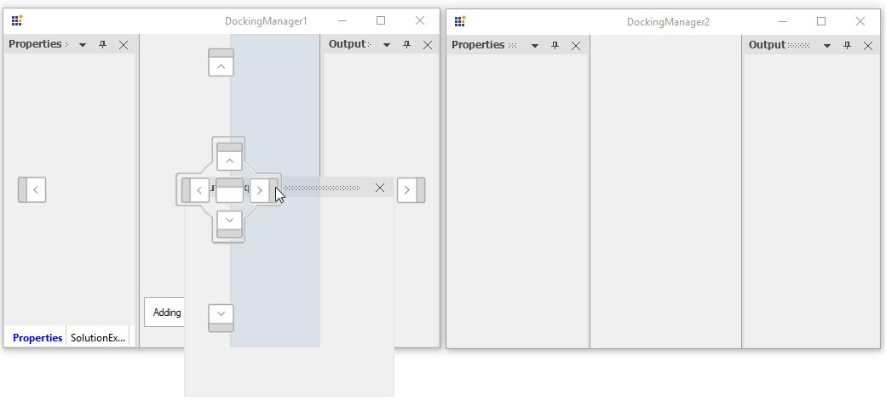
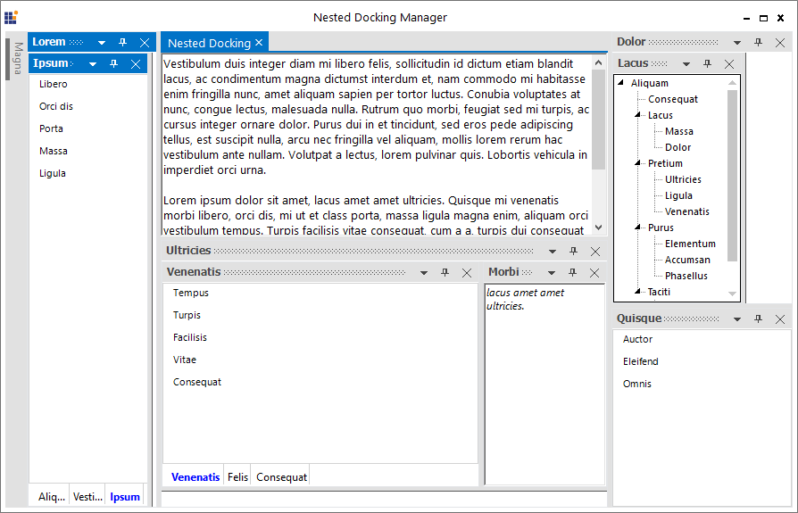

# Linked Docking Manager

The dock panels from a docking manager cannot be dragged and dropped to another docking manager by default. But, the linked manager support allows to drag and drop the windows from one docking manager to another by setting the `TargetDockingManager` list.

## Enable linked manager

To add TargetManager list in the docking manager, call the [AddToTargetManagersList](https://help.syncfusion.com/cr/windowsforms/Syncfusion.Windows.Forms.Tools.DockingManager.html#Syncfusion_Windows_Forms_Tools_DockingManager_AddToTargetManagersList_Syncfusion_Windows_Forms_Tools_DockingManager_) function with valid docking manager instance as argument. When only one docking manager has TargetManagerList, the window that is dropped to the TargetManager cannot be dragged back to its owner docking manager.

For example: `DockingManager1` and `DockingManager2` are the docking manager instance and the docking manager2 is added to TargetManagerList of docking manager1, but the docking manager2 is not aware of its TargetManager.

Here, the windows from docking manager1 are only allowed to be dragged and dropped in the docking manager2.





Form2 ChildWindow = new Form2();

ChildWindow.Show();

//To add ChildForm's DockingManager to the MainForm's TargetManagerList. 

this.dockingManager1.AddToTargetManagersList(ChildWindow.dockingManager2);





'To set the docked controls, that transformed to child controls.

Dim childWindow As New Form2()

ChildWindow.Show()

'To add ChildForm's DockingManager to the MainForm's TargetManagerList.

Me.dockingManager1.AddToTargetManagersList(ChildWindow.dockingManager1)





## Remove linked manager

To remove docking manager from the TargetManagerList, call the [RemoveFromTargetManagersList](https://help.syncfusion.com/cr/windowsforms/Syncfusion.Windows.Forms.Tools.DockingManager.html#Syncfusion_Windows_Forms_Tools_DockingManager_RemoveFromTargetManagersList_Syncfusion_Windows_Forms_Tools_DockingManager_) function of the docking manager with valid docking manager instance argument. For example, to remove the docking manager1 from the TargetManagersList of docking manager2, use the following code snippets:





//To remove ChildForm's DockingManager to the MainForm's TargetManagerList. 

this.dockingManager1.RemoveFromTargetManagersList(ChildWindow.dockingManager2);





'To remove ChildForm's DockingManager to the MainForm's TargetManagerList. 

Me.dockingManager1.RemoveFromTargetManagersList(ChildWindow.dockingManager2);





## Dock child control between two docking managers

The docking manager supports to dock its child control into another docking manager. It can be achieved by using [AddToTargetManagersList](https://help.syncfusion.com/cr/windowsforms/Syncfusion.Windows.Forms.Tools.DockingManager.html#Syncfusion_Windows_Forms_Tools_DockingManager_AddToTargetManagersList_Syncfusion_Windows_Forms_Tools_DockingManager_) and [RemoveFromTargetManagersList](https://help.syncfusion.com/cr/windowsforms/Syncfusion.Windows.Forms.Tools.DockingManager.html#Syncfusion_Windows_Forms_Tools_DockingManager_RemoveFromTargetManagersList_Syncfusion_Windows_Forms_Tools_DockingManager_) functions.

**AddToTargetManagerList**

This function helps to interconnect two docking managers, so that its child controls can be docked between two docking managers.

**RemoveFromTargetManagersList**

This function helps to remove interconnection between two docking managers.





//To set the docked controls that transformed to child controls.

Form2 ChildWindow = new Form2();

ChildWindow.Show();

this.dockingManager1.AddToTargetManagersList(ChildWindow.dockingManager1);

ChildWindow.dockingManager1.AddToTargetManagersList(this.dockingManager1);
  
//To remove DockingManager from MainForm's TargetManagerList. 

ChildWindow.dockingManager1.RemoveFromTargetManagersList(this.dockingManager1);

this.dockingManager1.RemoveFromTargetManagersList(ChildWindow.dockingManager1);





'To set the docked controls, that transformed to child controls.

Dim childWindow As New Form2()

ChildWindow.Show()

Me.dockingManager1.AddToTargetManagersList(ChildWindow.dockingManager1)

ChildWindow.dockingManager1.AddToTargetManagersList(Me.dockingManager1)
  
'To remove DockingManager from MainForm's TargetManagerList. 

ChildWindow.dockingManager1.RemoveFromTargetManagersList(Me.dockingManager1)

Me.dockingManager1.RemoveFromTargetManagersList(ChildWindow.dockingManager1)





N> A sample that demonstrates LinkedManager behavior is available in the following sample installation path:
C:\Users\&lt;User&gt;\AppData\Local\Syncfusion\EssentialStudio\Version Number\Windows\Tools.Windows\Samples\Docking Manager\LinkedManager

## Nested docking manager

The docking manager provides the NestedDockingManager support, which allows to add docking manager as a child window to another docking manager.

In nested docking manager, the whole docking manager can be dragged and dropped inside the parent docking manager and DockWindows inside the docking manager cannot be dragged and dropped on the owner docking manager.

N> A sample that demonstrates nested docking behavior is available in the following sample installation path:
C:\Users\&lt;User&gt;\AppData\Local\Syncfusion\EssentialStudio\Version Number\Windows\Tools.Windows\Samples\Docking Manager\NestedDocking
