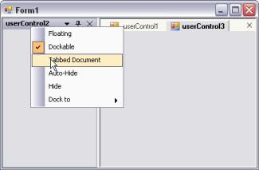

# How to use UserControls as TabbedMDIManager’s children?

 Normally tabbed-MDI is used in MDI applications where the child forms are the children that get tabbed. But, we could also use tabbed-MDI with UserControls as children and that are also dockable. The sample attached here shows how the UserControls can be used as tabbed-MDI children in association with the DockingManager.

N> Set the IsMdiContainer property of the form to true. Otherwise this will not work.



this.tabbedMDIManager = new TabbedMDIManager();

this.tabbedMDIManager.AttachToMdiContainer(this);

// Dock the User Controls

this.dockingManager1.SetEnableDocking(this.userControl1, true);

this.dockingManager1.SetEnableDocking(this.userControl2, true);

this.dockingManager1.SetEnableDocking(this.userControl3, true);

// Set the user controls to MDI mode

this.dockingManager1.SetAsMDIChild(this.userControl11,true);

this.dockingManager1.SetAsMDIChild(this.userControl21,true);

this.dockingManager1.SetAsMDIChild(this.userControl31,true);





Me.tabbedMDIManager = New TabbedMDIManager()

Me.tabbedMDIManager.AttachToMdiContainer(Me)

' Dock the User Controls

Me.dockingManager1.SetEnableDocking(Me.userControl1, True);

Me.dockingManager1.SetEnableDocking(Me.userControl2, True);

Me.dockingManager1.SetEnableDocking(Me.userControl3, True);

' Set the user controls to MDI mode

Me.dockingManager1.SetAsMDIChild(Me.userControl11,True)

Me.dockingManager1.SetAsMDIChild(Me.userControl21,True)

Me.dockingManager1.SetAsMDIChild(Me.userControl31,True)


 



[MDI Child Transition](/windowsforms/DockingPackage/Advanced-Features.html#mdi-child-transition)

