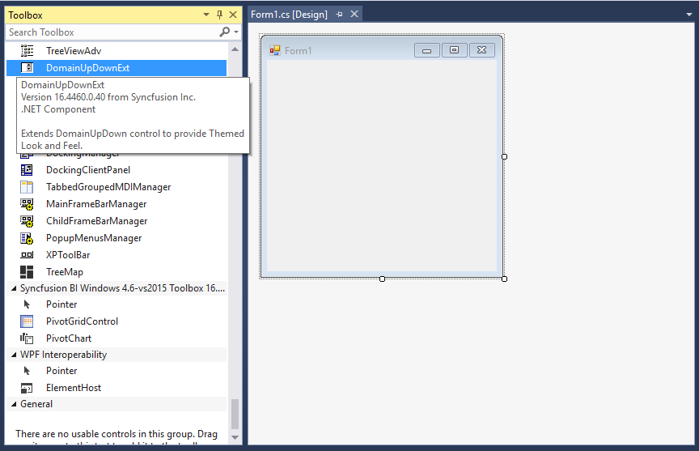
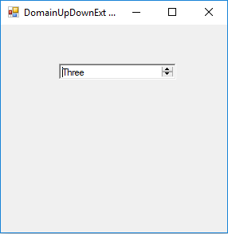

# Getting Started with Windows Forms Domain UpDown (DomainUpdownExt)

## Assembly deployment

Refer to the [control dependencies](https://help.syncfusion.com/windowsforms/control-dependencies#domainupdownext) section to get the list of assemblies or NuGet package that needs to be added as a reference to use the control in any application. 

You can find more details about installing the NuGet package in a Windows Forms application in the following link: 

[How to install nuget packages](https://help.syncfusion.com/windowsforms/visual-studio-integration/nuget-packages)

## Create a simple application with DomainUpDownExt

You can create a Windows Forms application with the DomainUpDownExt control using the following steps:

## Create a project

Create a new Windows Forms project in Visual Studio to display the DomainUpDownExt.

## Add control through designer

The DomainUpDownExt control can be added to an application by dragging it from the toolbox to a designer view. The following required assembly references will be added automatically to the project:

* Syncfusion.Grid.Base
* Syncfusion.Grid.Windows
* Syncfusion.Shared.Base
* Syncfusion.Shared.Windows
* Syncfusion.Tools.Base 
* Syncfusion.Tools.Windows

 

## Add control manually in code

To add the control manually in C#, follow the given steps:

**1.** Add the following required assembly references to the project:

  * Syncfusion.Grid.Base
  * Syncfusion.Grid.Windows
  * Syncfusion.Shared.Base
  * Syncfusion.Shared.Windows
  * Syncfusion.Tools.Base 
  * Syncfusion.Tools.Windows

**2.** Include the DomainUpDownExt control namespace **Syncfusion.Windows.Forms.Tools;**.

  
  
  using Syncfusion.Windows.Forms.Tools;
  
  
  Imports Syncfusion.Windows.Forms.Tools
  
   

**3.** Create a DomainUpDownExt control instance, and add it to the form.

 
 
 DomainUpDownExt domainUpDownExt1=new DomainUpDownExt();
 this.Controls.Add(domainUpDownExt1);
 
 
 Dim domainUpDownExt1 As New DomainUpDownExt()
 Me.Controls.Add(domainUpDownExt1)
 
 

## Adding items

You can add items in DomainUpDownExt control using Items.Add method. 



// Add items.
this.domainUpDownExt1.Items.Add("One");
this.domainUpDownExt1.Items.Add("Two");
this.domainUpDownExt1.Items.Add("Three");
this.domainUpDownExt1.Items.Add("Four");
this.domainUpDownExt1.Items.Add("Five");


' Add items.
Me.domainUpDownExt1.Items.Add("One")
Me.domainUpDownExt1.Items.Add("Two")
Me.domainUpDownExt1.Items.Add("Three")
Me.domainUpDownExt1.Items.Add("Four")
Me.domainUpDownExt1.Items.Add("Five")



 