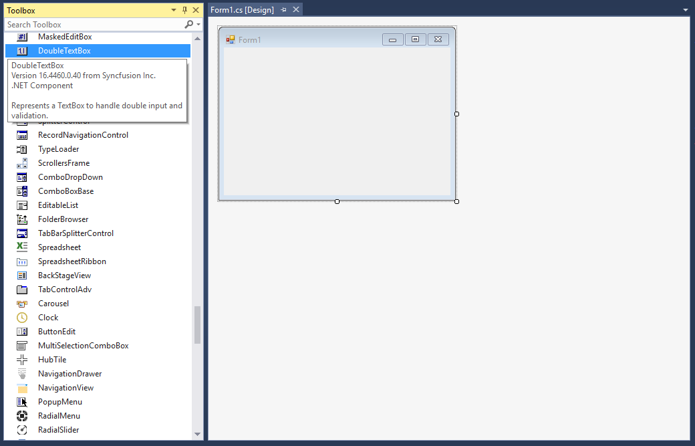

# Getting Started with Windows Forms Double TextBox

## Assembly deployment

Refer to the [control dependencies](https://help.syncfusion.com/windowsforms/control-dependencies#doubletextbox) section to get the list of assemblies or NuGet package that needs to be added as a reference to use the control in any application.

You can find more details about installing the NuGet packages in a Windows Forms application in the following link: 

[How to install nuget packages](https://help.syncfusion.com/windowsforms/installation/install-nuget-packages)

### Create a simple application with DoubleTextBox

You can create a Windows Forms application with DoubleTextBox using the following steps:

### Create a project

Create a new Windows Forms project in Visual Studio to display the DoubleTextBox control.

## Add control through designer

The DoubleTextBox control can be added to an application by dragging it from the toolbox to a designer view. The Syncfusion.Shared.Base assembly reference will be added automatically:

 

## Add control manually in code

To add the control manually in C#, follow the given steps:

**1.**	Add the **Syncfusion.Shared.Base** assembly reference to the project: 
 
**2.**	Include the **Syncfusion.Windows.Forms.Tools** namespace.



using Syncfusion.Windows.Forms.Tools;


Imports Syncfusion.Windows.Forms.Tools



**3.**	Create a DoubleTextBox instance, and add it to the window.



DoubleTextBox doubleTextBox1= new DoubleTextBox ();
this.Controls.Add(doubleTextBox1);


Dim doubleTextBox1As DoubleTextBox = New DoubleTextBox ()
Me.Controls.Add(doubleTextBox1)



 

## The maximum and minimum value constraints

You can set the maximum and minimum values using the [MaxValue](https://help.syncfusion.com/cr/windowsforms/Syncfusion.Windows.Forms.Tools.DoubleTextBox.html#Syncfusion_Windows_Forms_Tools_DoubleTextBox_MaxValue) and [MinValue](https://help.syncfusion.com/cr/windowsforms/Syncfusion.Windows.Forms.Tools.DoubleTextBox.html#Syncfusion_Windows_Forms_Tools_DoubleTextBox_MinValue) properties of DoubleTextBox.



this.doubleTextBox1.MaxValue = 25;
this.doubleTextBox1.MinValue = 4;


Me.doubleTextBox1.MaxValue = 25
Me.doubleTextBox1.MinValue = 4



## Change number format

You can customize the number format using the [NumberDecimalDigits](https://help.syncfusion.com/cr/windowsforms/Syncfusion.Windows.Forms.Tools.NumericTextBox.html#Syncfusion_Windows_Forms_Tools_NumericTextBox_NumberDecimalDigits), [NumberDecimalSeparator](https://help.syncfusion.com/cr/windowsforms/Syncfusion.Windows.Forms.Tools.NumericTextBox.html#Syncfusion_Windows_Forms_Tools_NumericTextBox_NumberDecimalSeparator), [NumberGroupSeparator](https://help.syncfusion.com/cr/windowsforms/Syncfusion.Windows.Forms.Tools.NumericTextBox.html#Syncfusion_Windows_Forms_Tools_NumericTextBox_NumberGroupSeparator), [NumberGroupSizes](https://help.syncfusion.com/cr/windowsforms/Syncfusion.Windows.Forms.Tools.NumericTextBox.html#Syncfusion_Windows_Forms_Tools_NumericTextBox_NumberGroupSizes), and [NumberNegativePattern](https://help.syncfusion.com/cr/windowsforms/Syncfusion.Windows.Forms.Tools.NumericTextBox.html#Syncfusion_Windows_Forms_Tools_NumericTextBox_NumberNegativePattern) properties of DoubleTextBox.

C#	this.doubleTextBox1.DoubleValue = 24851343548781;
this.doubleTextBox1.NumberDecimalDigits = 3;
this.doubleTextBox1.NumberDecimalSeparator = "-";
this.doubleTextBox1.NumberGroupSeparator = ";";
this.doubleTextBox1.NumberGroupSizes = new int[] { 4 };
this.doubleTextBox1.NumberNegativePattern = 2;
VB	Me.doubleTextBox1.DoubleValue = 24851343548781
Me.doubleTextBox1.NumberDecimalDigits = 3
Me.doubleTextBox1.NumberDecimalSeparator = "-"
Me.doubleTextBox1.NumberGroupSeparator = ";"
Me.doubleTextBox1.CurrencyGroupSizes = New Integer() {3}
Me.doubleTextBox1.NumberNegativePattern = 2

