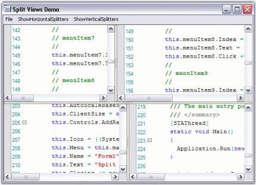
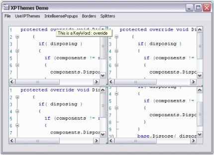
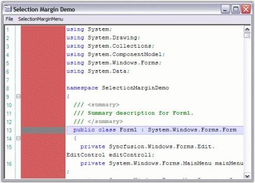
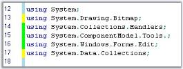
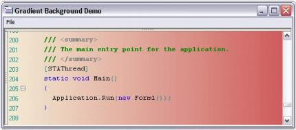
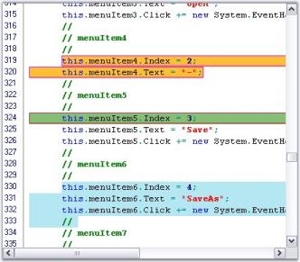

# Appearance

The appearance customization features of the Edit control are discussed under the following topics:

## Visual Settings

This section covers the below topics:

### Size

This section discusses the size settings of the Edit Control.

#### AutoSize

The Edit Control can be auto resized by setting the AutoSize property to True.



this.editControl1.AutoSize = true;





Me.editControl1.AutoSize = True



#### Minimum Size

The MinimumSize property gets / sets the minimum size of the control in auto size mode.



this.editControl1.MinimumSize = new System.Drawing.Size(10, 10);





Me.editControl1.MinimumSize = New System.Drawing.Size(10, 10)



### Split Views

Edit Control provides in-built support for horizontal and vertical splitters, which facilitates the splitting of a single document in the Edit Control into several split views so that you can work with multiple different areas of a document at the same time. A maximum of four split views are supported. However, you can also limit the user to perform either a horizontal or vertical split, only if you wish to support two views instead of four.

The vertical and horizontal splitters are always visible, by default. They can be disabled by setting the below given properties to False.

<table>
<tr>
<th>
Edit Control Property</th><th>
Description</th></tr>
<tr>
<td>
ShowHorizontalSplitters</td><td>
Gets / sets value that indicates whether horizontal splitters are visible.</td></tr>
<tr>
<td>
ShowVerticalSplitters</td><td>
Gets / sets value that indicates whether vertical splitters are visible.</td></tr>
</table>

The following methods can be used to split the Edit Control into two equal horizontal or vertical halves.

<table>
<tr>
<th>
Edit Control Method</th><th>
Description</th></tr>
<tr>
<td>
SplitHorizontally</td><td>
Splits the Edit Control into two equal horizontal halves.</td></tr>
<tr>
<td>
SplitVertically</td><td>
Splits the Edit Control into two equal vertical halves.</td></tr>
</table>



this.editControl1.ShowHorizontalSplitters = true;

this.editControl1.ShowVerticalSplitters = true;

this.editControl1.SplitHorizontally();

this.editControl1.SplitVertically();





Me.editControl1.ShowHorizontalSplitters = True

Me.editControl1.ShowVerticalSplitters = True

Me.editControl1.SplitHorizontally()

Me.editControl1.SplitVertically()



#### Positioning

The following properties can be used to position the horizontal and vertical splitters in the Edit Control.

<table>
<tr>
<th>
Edit Control Property</th><th>
Description</th></tr>
<tr>
<td>
HorizontalSplitterPosition</td><td>
Gets / sets position of the horizontal splitter.</td></tr>
<tr>
<td>
TopVerticalSplitterPosition</td><td>
Gets / sets position of the top vertical splitter.</td></tr>
<tr>
<td>
BottomVerticalSplitterPosition</td><td>
Gets / sets position of the bottom vertical splitter.</td></tr>
</table>



this.editControl1.HorizontalSplitterPosition = 220;

this.editControl1.TopVerticalSplitterPosition = 260;

this.editControl1.BottomVerticalSplitterPosition = 260;





Me.editControl1.HorizontalSplitterPosition = 220

Me.editControl1.TopVerticalSplitterPosition = 260

Me.editControl1.BottomVerticalSplitterPosition = 260



#### SplitFourQuadrants Method

The SplitFourQuadrants method is used to split the Edit Control into four equal parts.



this.editControl1.SplitFourQuadrants();





Me.editControl1.SplitFourQuadrants()



A sample which demonstrates Split Views is available in the below sample installation path.

_..\ My Documents\Syncfusion\EssentialStudio\Version Number\Windows\Edit.Windows\Samples\Advanced Editor Functions\ActionGroupingDemo_



[Scrolling Support](/windowsforms/edit/runtime-features#scrolling-support)



### Applying Themes

Edit Control has the ability to have Windows XP-like themed appearance. All its features like the scrollbars, splitters, control borders, outlining tooltip, intellisense popups - context tooltip, context choice, and context prompt appear themed. The XP themes support is independent of the underlying operating system, and hence the Edit Control appears themed even on Non-Windows XP systems.

The themed appearance can be provided for the Edit Control by setting the UseXPStyle property to True.



this.editControl1.UseXPStyle = true;





Me.editControl1.UseXPStyle = True



A sample based on XP Themes is available in the below sample installation path.

_..\_ _My Documents\Syncfusion\EssentialStudio\Version Number\Windows\Edit.Windows\Samples\Advanced Editor Functions\ActionGroupingDemo_

### Border Style

The border style for the Edit Control can be set by using the below given property.

<table>
<tr>
<th>
Edit Control Property</th><th>
Description</th></tr>
<tr>
<td>
BorderStyle</td><td>
Gets/sets the border style of the control. The options provided are as follows:* FixedSingle* Fixed3D* None</td></tr>
</table>



this.editControl1.BorderStyle = System.Windows.Forms.BorderStyle.FixedSingle;





Me.editControl1.BorderStyle = System.Windows.Forms.BorderStyle.FixedSingle



### Graphics Customization Settings

The following properties can be used to set the composition quality, interpolation mode and smoothing mode for images added to the Edit Control. The rendering hint can also be set for text added to the Edit Control.

<table>
<tr>
<th>
Edit Control Property</th><th>
Description</th></tr>
<tr>
<td>
GraphicsCompositingQuality</td><td>
Specifies image composition quality. The options provided are as follows:
<ul>
<li> Invalid</li>
<li>Default</li>
<li>HighSpeed</li>
<li>HighQuality</li>
<li>GammaCorrected</li>
<li>AssumeLinear</li>
</ul></td></tr>
<tr>
<td>
 GraphicsInterpolationMode</td><td>
Specifies the interpolation mode. The options provided are as follows:
<ul>
<li> Invalid</li>
<li> Default</li>
<li> Low</li>
<li> High</li>
<li> Bilinear</li>
<li> Bicubic</li>
<li> NearestNeighbor</li>
<li> HighQualityBilinear</li>
<li> HighQualityBicubic</li></ul></td></tr>
<tr>
<td>
 GraphicsSmoothingMode</td><td>
Specifies the smoothing mode. The options provided are as follows:
<ul>
<li> Invalid</li>
<li> Default</li>
<li> HighSpeed</li>
<li> HighQuality</li>
<li> None</li>
<li> AntiAlias</li></ul></td></tr>
<tr>
<td>
 GraphicsTextRenderingHint</td><td>
Specifies the text hinting mode. The options provided are as follows:
<ul>
<li> SystemDefault</li>
<li> SingleBitPerPixelGridFit</li>
<li> SingleBitPerPixel</li>
<li> AntiAliasGridFit</li>
<li> AntiAlias</li>
<li> ClearTypeGridFit</li></ul></td></tr>
</table>



this.editControl1.GraphicsCompositingQuality = System.Drawing.Drawing2D.CompositingQuality.HighQuality;

this.editControl1.GraphicsInterpolationMode = System.Drawing.Drawing2D.InterpolationMode.HighQualityBilinear;

this.editControl1.GraphicsSmoothingMode = System.Drawing.Drawing2D.SmoothingMode.HighSpeed;

this.editControl1.GraphicsTextRenderingHint = System.Drawing.Text.TextRenderingHint.SingleBitPerPixelGridFit;





Me.editControl1.GraphicsCompositingQuality = System.Drawing.Drawing2D.CompositingQuality.HighQuality

Me.editControl1.GraphicsInterpolationMode = System.Drawing.Drawing2D.InterpolationMode.HighQualityBilinear

Me.editControl1.GraphicsSmoothingMode = System.Drawing.Drawing2D.SmoothingMode.HighSpeed

Me.editControl1.GraphicsTextRenderingHint = System.Drawing.Text.TextRenderingHInteger.SingleBitPerPixelGridFit



## Margins

This section covers the below topics:

### Selection Margin

Selection Margin is a thin vertical strip along the left side of the Edit Control that enables you to select the contents of the entire line on the Edit Control, by simply clicking on the corresponding selection margin area of the line. 

The ShowSelectionMargin property allows you to show / hide this selection margin. The following are the properties used to  customize the margin.

<table>
<tr>
<th>
Edit Control Property</th><th>
Description</th></tr>
<tr>
<td>
SelectionMarginForegroundColor</td><td>
Gets / sets foreground color of the selection margin.</td></tr>
<tr>
<td>
SelectionMarginBackgroundColor</td><td>
Gets / sets background color of the selection margin.</td></tr>
<tr>
<td>
SelectionMarginWidth</td><td>
Sets the width of the selection margin.</td></tr>
</table>



this.editControl1.SelectionMarginForegroundColor = Color.Gray;

this.editControl1.SelectionMarginBackgroundColor = Color.IndianRed;

this.editControl1.SelectionMarginWidth = 100;





Me.editControl1.SelectionMarginForegroundColor = Color.Gray

Me.editControl1.SelectionMarginBackgroundColor = Color.IndianRed

Me.editControl1.SelectionMarginWidth = 100



#### Differentiating the Lines based on Actions

Edit Control supports marking the changed lines and the saved lines with different colors.

Lines that are modified after the file load or after the last file save operations are the changed lines. They are marked in yellow color, by default. Once they are saved, they will be changed to green, by default.

The changed lines marking feature can be enabled by setting the MarkChangedLines property to True. For this property to be visible in the Edit Control, the SelectionMargin property should also be enabled.



this.editControl1.MarkChangedLines = true;





Me.editControl1.MarkChangedLines = True



Refer to the Selection Margin Demo sample in the following sample installation location, for more information in this regard.

_..\_My Documents\Syncfusion\EssentialStudio\Version Number\Windows\Edit.Windows\Samples\Advanced Editor Functions\ActionGroupingDemo_

### User Margin

Edit Control supports the User Margin feature, which can be used to display additional information regarding the contents in the Edit Control. Information can also be displayed on a line-by-line basis.

The User Margin feature can be turned on by setting the ShowUserMargin property to True. The user margin can be customized using the following properties.

<table>
<tr>
<th>
Edit Control Property</th><th>
Description</th></tr>
<tr>
<td>
UserMarginWidth</td><td>
Get / sets the width of the user margin.</td></tr>
<tr>
<td>
UserMarginPlacement</td><td>
Specifies placement of user margin.</td></tr>
</table>



this.editControl1.UserMarginWidth = 100;

// Sets the User Margin to the Left.

this.editControl1.UserMarginPlacement = Syncfusion.Windows.Forms.Edit.Enums.MarginPlacement.Left;





Me.editControl1.UserMarginWidth = 100

// Sets the User Margin to the Left.

Me.editControl1.UserMarginPlacement = Syncfusion.Windows.Forms.Edit.Enums.MarginPlacement.Left



#### Color Settings

The following properties can be used to set the background color, text color and border color of the user margin in the Edit Control.

<table>
<tr>
<th>
Edit Control Property</th><th>
Description</th></tr>
<tr>
<td>
UserMarginBackgroundColor</td><td>
Specifies BrushInfo object that is used when the user margin is being drawn.</td></tr>
<tr>
<td>
UserMarginTextColor</td><td>
Specifies default color of user margin text.</td></tr>
<tr>
<td>
UserMarginBorderColor</td><td>
Specifies color of the user margin border.</td></tr>
</table>



this.editControl1.UserMarginBackgroundColor = new Syncfusion.Drawing.BrushInfo(Syncfusion.Drawing.GradientStyle.BackwardDiagonal, System.Drawing.Color.Brown, System.Drawing.Color.MistyRose);

this.editControl1.UserMarginBorderColor = Color.IndianRed;

this.editControl1.UserMarginTextColor = Color.Green;





Me.editControl1.UserMarginBackgroundColor = New Syncfusion.Drawing.BrushInfo(Syncfusion.Drawing.GradientStyle.BackwardDiagonal, System.Drawing.Color.Brown, System.Drawing.Color.MistyRose)

Me.editControl1.UserMarginBorderColor = Color.IndianRed

Me.editControl1.UserMarginTextColor = Color.Green



It is possible to set custom text in the User Margin on a line-by-line basis by handling the DrawUserMarginText event of the Edit Control. Moreover, it is also possible to customize the font settings for the text of the User Margin.



private void editControl1_DrawUserMarginText(object sender, Syncfusion.Windows.Forms.Edit.DrawUserMarginTextEventArgs e)

{

    // Set text to be rendered at the user margin area.

    e.Text = "Line " + e.Line.LineIndex.ToString() + " contains " + e.Line.LineLength.ToString() + " characters";

    // Set text font.

    e.Font = new Font("Garamond", 11);

    if(e.Line.LineIndex % 2 == 0)

    {

       // Set color of the text.

       e.Color = Color.Blue;

    }

}





Private Sub editControl1_DrawUserMarginText(ByVal sender As Object, ByVal e As Syncfusion.Windows.Forms.Edit.DrawUserMarginTextEventArgs) Handles EditControl1.DrawUserMarginText

' Set text to be rendered at the user margin area.

e.Text = "Line " + e.Line.LineIndex.ToString() + " contains " + e.Line.LineLength.ToString() + " characters"

' Set text font.

e.Font = New Font("Garamond", 11)

If e.Line.LineIndex Mod 2 = 0 Then

   ' Set color of the text.

   e.Color = Color.Blue

End If

End Sub



Refer to the User Margin Demo sample in the following sample installation location for more information in this regard.

_..\_My Documents\Syncfusion\EssentialStudio\Version Number\Windows\Edit.Windows\Samples\Advanced Editor Functions\ActionGroupingDemo_

## Background Settings

Edit Control can be displayed with a gradient background by setting the BackgroundColor property to the desired BrushInfo object. The following table lists some properties of the EditControl and their corresponding descriptions.

<table>
<tr>
<th>
Edit Control Property</th><th>
Description</th></tr>
<tr>
<td>
BackgroundColor</td><td>
Specifies background fill style and color.</td></tr>
<tr>
<td>
Style</td><td>
Specifies the brush style. The options provided are as follows:{{ '_Solid_' | markdownify }}{{ '_Pattern_' | markdownify }}{{ '_Gradient_' | markdownify }}</td></tr>
<tr>
<td>
BackColor</td><td>
Specifies the back color of the control.</td></tr>
<tr>
<td>
ForeColor</td><td>
Specifies the fore color of the control.</td></tr>
<tr>
<td>
PatternStyle</td><td>
Specifies the pattern style. The options provided are as follows:
<ul>
<li> Horizontal</li>
<li> Vertical</li>
<li> ForwardDiagonal</li>
<li> BackwardDiagonal</li>
<li> Cross</li>
<li> DiagonalCross</li>
<li> Percent05</li>
<li> Percent10</li>
<li> Percent20</li>
<li> Percent25</li>
<li> Percent30</li>
<li> Percent40</li>
<li> Percent50</li>
<li> Percent60</li>
<li> Percent70</li>
<li> Percent75</li>
<li> Percent80</li>
<li> Percent90</li>
<li> LightDownwardDiagonal</li>
<li> LightUpwardDiagonal</li>
<li> DarkDownwardDiagonal</li>
<li> DarkUpwardDiagonal</li>
<li> WideDownwardDiagonal</li>
<li> WideUpwardDiagonal</li>
<li> LightVertical</li>
<li> LightHorizontal</li>
<li> NarrowVertical</li>
<li> NarrowHorizontal</li>
<li> DarkVertical</li>
<li> DarkHorizontal</li>
<li> DashedDownwardDiagonal</li>
<li> DashedUpwardDiagonal</li>
<li> DashedHorizontal</li>
<li> DashedVertical</li>
<li> SmallConfetti</li>
<li> LargeConfetti</li>
<li> ZigZag</li>
<li> Wave</li>
<li> DiagonalBrick</li>
<li> HorizontalBrick</li>
<li> Weave</li>
<li> Plaid</li>
<li> Divot</li>
<li> DottedGrid</li>
<li> DottedDiamond</li>
<li> Shingle</li>
<li> Trellis</li>
<li> Sphere</li>
<li> SmallGrid</li>
<li> SmallCheckerBoard</li>
<li> LargeCheckerBoard</li>
<li> OutlinedDiamond</li>
<li> SolidDiamond</li>
<li> None</li></ul></td></tr>
<tr>
<td>
 GradientColors</td><td>
Specifies the gradient colors. The options provided are as follows:
<ul>
<li> ForwardDiagonal</li>
<li> BackwardDiagonal</li>
<li> Horizontal</li>
<li> Vertical</li>
<li> PathRectangle</li>
<li> PathEllipse</li></ul> The first entry in this list will be the same as the back color property, and the last entry will be the same as the fore color property.</td></tr>
</table>



this.editControl1.BackgroundColor = new Syncfusion.Drawing.BrushInfo(Syncfusion.Drawing.GradientStyle.ForwardDiagonal, new System.Drawing.Color[] {System.Drawing.Color.LavenderBlush, System.Drawing.Color.AliceBlue, System.Drawing.Color.BlanchedAlmond});





Me.editControl1.BackgroundColor = New Syncfusion.Drawing.BrushInfo(Syncfusion.Drawing.GradientStyle.ForwardDiagonal, New System.Drawing.Color() {System.Drawing.Color.LavenderBlush, System.Drawing.Color.AliceBlue, System.Drawing.Color.BlanchedAlmond})



A sample which demonstrates the Gradient Background feature is available in the below sample installation path.

_..\ My Documents\Syncfusion\EssentialStudio\Version Number\Windows\Edit.Windows\Samples\Advanced Editor Functions\ActionGroupingDemo_

### Setting BackgroundColor for Specified Range of Text

The SetBackgroundColor method is used to set the background color for a specified range of text.



this.editControl1.SetBackgroundColor(new Point(1, 1), new Point(9, 9), Color.AliceBlue);





Me.editControl1.SetBackgroundColor(New Point(1, 1), New Point(9, 9), Color.AliceBlue)



Setting Background Color for Individual Lines or Selected Blocks of Text

Edit Control allows setting custom background color for individual lines as well as for selected block of text.

You can set any desired background to a particular line or block of selection, as explained below.

* Register a back color format with the Edit Control by using its RegisterBackColorFormat method, with appropriate values for BackgroundColor, ForegroundColor and HatchStyle parameters.

* Set the background color to the entire line or just the selected text by using the SetLineBackColor and SetSelectionBackColor methods respectively.



// Register a backcolor format with EditControl.

this.editControl1.RegisterBackColorFormat(Color.Aquamarine, Color.Beige, System.Drawing.Drawing2D.HatchStyle.Cross, true);

// Set the background for the entire line of text.

this.editControl1.SetLineBackColor(editControl1.CurrentLine, true, format);

// Set the background for the selected block of text.        

this.editControl1.SetSelectionBackColor(format);





' Register a backcolor format with EditControl.

Me.editControl1.RegisterBackColorFormat(Color.Aquamarine, Color.Beige, System.Drawing.Drawing2D.HatchStyle.Cross, True)

' Set the background for the entire line of text. 

Me.editControl1.SetLineBackColor(editControl1.CurrentLine, true, format)

' Set the background for the selected block of text.        

Me.editControl1.SetSelectionBackColor(format)



N> Refer the _Text Border_ topic to know how to set the border for the text.

### Removing Background Color for Individual Lines or Selected Blocks of Text

The following methods can be used to set the background color for individual lines or selected blocks of text.

<table>
<tr>
<th>
Edit Control Method</th><th>
Description</th></tr>
<tr>
<td>
RemoveLineBackColor</td><td>
Removes line back color.</td></tr>
<tr>
<td>
RemoveSelectionBackColor</td><td>
Removes background coloring from the selected text.</td></tr>
</table>



// Removes line back color.

this.editControl1.RemoveLineBackColor(4);

// Removes background coloring from the selected text.

this.editControl1.RemoveSelectionBackColor();





' Removes line back color.

Me.editControl1.RemoveLineBackColor(4)

' Removes background coloring from the selected text.

Me.editControl1.RemoveSelectionBackColor()



A sample which demonstrates Text Highlighting is available in the following sample location.

_..\My Documents\Syncfusion\EssentialStudio\Version Number\Windows\Edit.Windows\Samples\2.0\Advanced Editor Functions\TextHighlightingDemo_



[Line Numbers and Current Line Highlighting](/windowsforms/edit/text-visualization#line-numbers-and-current-line-highlighting-1)



## Font Customization

The font customization in the Edit Control works slightly different from the regular text processing the control. The font customization is done only at the Formats level, and not at a word level or selected text level. Edit Control is more of a text parsing / syntax highlighting control, and less of a text editing control. Edit Control supports customization of fonts both through the configuration file and dynamically through a run-time Formats Editor dialog.

The Edit Control supports customization of fonts through the configuration file, as shown in the below code snippet.



<format name="Text" Font="Courier New, 10pt" FontColor="Black" />

<format name="SelectedText" Font="Courier New, 10pt" BackColor="Highlight" FontColor="HighlightText" />

<format name="String" Font="Courier New, 10pt, style=Bold" FontColor="Red" />

<format name="Whitespace" Font="Courier New, 10pt" FontColor="Black" />

<format name="Operator" Font="Courier New, 10pt" FontColor="DarkCyan" />

<format name="Number" Font="Courier New, 10pt, style=Bold" FontColor="Navy" /> 



The Edit Control supports font customization at run time through the use of the frmFormatsConfig dialog box which consists of three smaller controls like the ControlFormatSettings, ControlFormatsList, and the ControlLanguageSelector. The ControlFormatSettings dialog box contains the actual controls to customize all the rendering settings of the selected Format, including font settings. The ControlFormatsList dialog consists of the list of currently existing formats in the configuration file. Also, it provides support to create new formats or delete existing ones. The ControlLanguageSelector dialog has a Combo Box containing the list of configuration languages supported by the Edit Control. The list gets updated when a new configuration language is added or an existing one is removed. The following code illustrates how you can hook up these dialogs to the Edit Control.



this.controlLanguageSelector1.EditControl = this.editControl1;

this.controlFormatsList1.EditControl = this.editControl1;

this.controlFormatsList1.LanguageSelector = this.controlLanguageSelector1;

this.controlFormatsSettings1.FormatsSelector = this.controlFormatsList1;

// Shows the font customization dialog.

this.editControl1.ShowFormatsCustomizationDialog();





Me.controlLanguageSelector1.EditControl = Me.editControl1

Me.controlFormatsList1.EditControl = Me.editControl1

Me.controlFormatsList1.LanguageSelector = Me.controlLanguageSelector1

Me.controlFormatsSettings1.FormatsSelector = Me.controlFormatsList1

// Shows the font customization dialog.

this.editControl1.ShowFormatsCustomizationDialog();



Refer to the Font Customization Demo sample for more information in this regard.

_..\_My Documents\Syncfusion\EssentialStudio\Version Number\Windows\Edit.Windows\Samples\Advanced Editor Functions\ActionGroupingDemo_

## Single Line Mode

Edit Control can be operated in a single line mode much like a Windows Forms Text Box, by setting its Multiline property to False. This enables you to have a simple TextBox-like control, but with all the powerful features of Edit Control like syntax highlighting, selection, underlining, and so on.

You can turn on the single line mode of the Edit Control by setting the SingleLineMode property to True.

N> The SingleLineMode is intended for use, only when the Edit Control contains small amounts of text data in it. Using it in a scenario where the Edit Control has a huge file loaded into it, may lead to poor performance.

Refer to the Single Line Mode Demo sample in the following sample installation location, for more information in this regard.

_..\_My Documents\Syncfusion\EssentialStudio\Version Number\Windows\Edit.Windows\Samples\Advanced Editor Functions\ActionGroupingDemo_

## Customizable Find Dialog

Essential Edit now enables you to create a new find dialog by inheriting Essential Edit’s find dialog. You can customize the Find Dialog by changing the properties and triggers the events of the buttons such as Find, Mark All and Close. You can also easily localize the captions of the controls in the Find dialog.

### Creating a Class for Own Find Dialog

Create a class for own find dialog that inherits the frmFindDialog class.

The following code illustrates this.



//Inherits the frmFindDialog

public class FindDialogExt : Syncfusion.Windows.Forms.Edit.Dialogs.frmFindDialog





‘Inherits the frmFindDialog.

Public Class FindDialogExt

Inherits Syncfusion.Windows.Forms.Edit.Dialogs.frmFindDialog

End Class



#### FindComplete Event

This event occurs in FindNext() when search reaches the starting point of the search before the message box displays.

The event handler receives an argument of FindCompleteEventArgs . This argument class sets the text for message box. Users can localize this text.



// Handle the FindComplete event.

            this.FindComplete += new EventHandler<FindCompleteEventArgs>(FindDialogExt_FindComplete);

        //Set the value for message box for when search reaches the starting point of search

        void FindDialogExt_FindComplete(object sender, frmFindDialog.FindCompleteEventArgs e)

        {

            //Arabic text as message(localize)

            if (messageString != string.Empty)

                e.Message = "انتهى";

            else

                e.Message = "Find reached the starting point of the search.";

        }





' Handle the FindComplete event.

Private Me.editControl1.FindComplete += New EventHandler(Of FindCompleteEventArgs)(AddressOf FindDialogExt_FindComplete)

'Set the value for message box for when search reaches the starting point of search

Private Sub FindDialogExt_FindComplete(ByVal sender As Object, ByVal e As frmFindDialog.FindCompleteEventArgs)

'Arabic text as message (localize)

If messageString <> String.Empty Then

e.Message = "انتهى"

Else

e.Message = "Find reached the starting point of the search."

End If

End Sub



