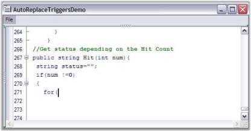

# Code Completion

The following topics are covered under this section:

## AutoComplete Support

Complete Word feature is a user-friendly functionality that can be used in conjunction with the Context Choice, and is analogous to the Complete Word feature in Visual Studio. This feature autocompletes the rest of the member name once you have entered enough characters to distinguish it. Type the first few letters of the member name, and then press ALT+RIGHT ARROW or CTRL+SPACEBAR keys to see this functionality.

### Example

When the following text is typed - "this.editControl1.", it displays a Context Choice list with members in the following order

* New
* Word
* WordLeft
* WordRight

### Case 1

If you type "w" after "this.editControl1.", such that it looks like - "this.editControl1.w", and press the ALT+RIGHT ARROW (or CTRL+SPACEBAR) keys, it will autocomplete it with the first matching member name. In this case, it will be autocompleted as "this.editControl1.Word".

### Case 2

If you type "wordr" after "this.editControl1.", such that it looks like - "this.editControl1.wordr", and press the ALT+RIGHT ARROW (or CTRL+SPACEBAR) keys, it will autocomplete it with the first matching member name. In this case, it will be autocompleted as "this.editControl1.WordRight".

### Case 3

If you type "move" after "this.editControl1.", such that it looks like - "this.editControl1.move", and press the ALT+RIGHT ARROW (or CTRL+SPACEBAR) keys, it will autocomplete it with the first matching member name. In this case, there is no matching member name to autocomplete, and hence nothing will happen.

### Case 4

If you type nothing after "this.editControl1.", and press the ALT+RIGHT ARROW (or CTRL+SPACEBAR) keys, it will autocomplete it with the first member name in the Context Choice list. In this case, it should be autocompleted as "this.editControl1.New".

Note that the searching process for the first matching member is not case sensitive. For example, "wordr" and "WordR" will be treated in the same way.

Set the UseAutocomplete property associated with the IContextChoiceController to True, to enable this functionality while using Context Choice.



private void editControl1_ContextChoiceOpen(Syncfusion.Windows.Forms.Edit.Interfaces.IContextChoiceController controller)

{

controller.UseAutocomplete = true;

}




Private Sub editControl1_ContextChoiceOpen(ByVal controller As Syncfusion.Windows.Forms.Edit.Interfaces.IContextChoiceController) Handles editControl1.ContextChoiceOpen

controller.UseAutocomplete = True

End Sub



### See Also

## AutoReplace Triggers

The Edit Control comes with the AutoReplace Triggers feature which allows the control to automatically correct some of the known predefined typing errors. AutoReplace Triggers are fired when certain keys are pressed. These keys are defined within the language definition. When the AutoReplace Trigger key is pressed, the editor checks the word before the AutoReplace Trigger, to see if it is in the AutoReplace table. If it is present, then the word is automatically replaced with its replacement word.

The AutoReplace Trigger keys are defined within the language definitions. This means that different keys can be defined as triggers for different languages.

_Figure_ _12: "for" has been incorrectly typed as "fro"

_Figure_ _13: After typing '(' the incorrect token "fro" is replaced with the correct token "for"

AutoReplace Triggers can be enabled by using the UseAutoreplaceTriggers property as shown below.



// Enables AutoReplace Triggers.
this.editControl1.UseAutoreplaceTriggers = true;





' Enables AutoReplace Triggers.
Me.editControl1.UseAutoreplaceTriggers = True



The keys used as AutoReplace Triggers are defined by using the TriggersActivators attribute of the language in the configuration file, as shown below.

<ConfigLanguage name ="C#" Known ="Csharp" StartComment ="//" TriggersActivators =" ;.=()">

Triggers can be flagged as valid only within the specific lexical states. For example, you can set a trigger not to fire, if it is in a comment within a language, by using the AllowTriggers attribute, as shown below.

<lexem BeginBlock="/* EndBlock="*/" Type="Comment" OnlyLocalSublexems="true" IsComplex="true" IsCollapsable="true" CollapseName="/*...*/" AllowTriggers="false">

The words to be replaced when the AutoReplace Triggers key is pressed can be defined by using the code given below.



this.editControl1.Language.AutoReplaceTriggers.AddRange(new AutoReplaceTrigger[]{new AutoReplaceTrigger("tis","this"),new AutoReplaceTrigger("fro","for")});





Me.editControl1.Language.AutoReplaceTriggers.AddRange(New AutoReplaceTrigger(){New AutoReplaceTrigger("tis","this"),New AutoReplaceTrigger("fro","for")})

The words to be replaced can also be defined within the language definition in the configuration file, as shown below.

<AutoReplaceTriggers>

        <AutoReplaceTrigger From ="tis" To ="this" />

 <AutoReplaceTrigger From ="itn" To ="int" />

</AutoReplaceTriggers>



See Also

AutoComplete Support

